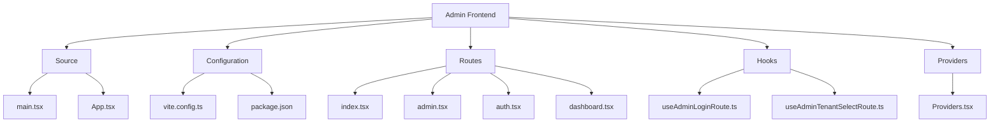
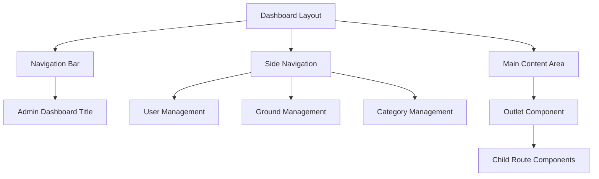
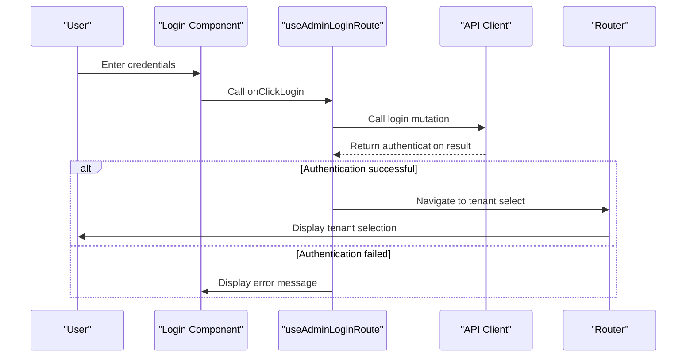
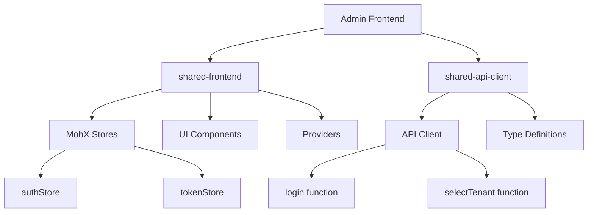
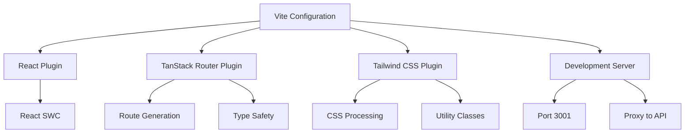
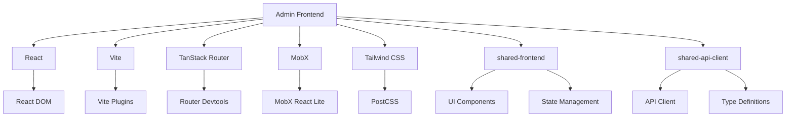

# Admin Frontend

<cite>
**Referenced Files in This Document**   
- [package.json](file://apps/admin/package.json)
- [vite.config.ts](file://apps/admin/vite.config.ts)
- [App.tsx](file://apps/admin/src/App.tsx)
- [main.tsx](file://apps/admin/src/main.tsx)
- [routeTree.gen.ts](file://apps/admin/src/routeTree.gen.ts)
- [index.tsx](file://apps/admin/src/routes/index.tsx)
- [admin.tsx](file://apps/admin/src/routes/admin.tsx)
- [auth.tsx](file://apps/admin/src/routes/admin/auth.tsx)
- [dashboard.tsx](file://apps/admin/src/routes/admin/dashboard.tsx)
- [useAdminLoginRoute.ts](file://apps/admin/src/hooks/useAdminLoginRoute.ts)
- [useAdminTenantSelectRoute.ts](file://apps/admin/src/hooks/useAdminTenantSelectRoute.ts)
- [Providers.tsx](file://apps/admin/src/providers/Providers.tsx)
</cite>

## Table of Contents
1. [Introduction](#introduction)
2. [Project Structure](#project-structure)
3. [Core Components](#core-components)
4. [Architecture Overview](#architecture-overview)
5. [Detailed Component Analysis](#detailed-component-analysis)
6. [Dependency Analysis](#dependency-analysis)
7. [Performance Considerations](#performance-considerations)
8. [Troubleshooting Guide](#troubleshooting-guide)
9. [Conclusion](#conclusion)

## Introduction
The Admin Frontend application is a React-based administration interface built with Vite, designed to manage administrative functions within the prj-core system. The application follows a modern component-based architecture with a focus on scalability, maintainability, and developer experience. It leverages several key technologies including React Router for routing, MobX for state management, Tailwind CSS for styling, and integrates with shared packages to ensure consistency across the application ecosystem.

## Project Structure



**Diagram sources**
- [vite.config.ts](file://apps/admin/vite.config.ts)
- [package.json](file://apps/admin/package.json)
- [main.tsx](file://apps/admin/src/main.tsx)

**Section sources**
- [package.json](file://apps/admin/package.json)
- [vite.config.ts](file://apps/admin/vite.config.ts)

## Core Components

The Admin Frontend application is structured around several core components that form the foundation of the user interface and application logic. These components include the main application entry point, routing configuration, authentication flow, and dashboard layout. The application uses a component-based architecture that promotes reusability and maintainability.

**Section sources**
- [App.tsx](file://apps/admin/src/App.tsx)
- [main.tsx](file://apps/admin/src/main.tsx)
- [Providers.tsx](file://apps/admin/src/providers/Providers.tsx)

## Architecture Overview

```mermaid
graph TD
A[React with Vite] --> B[Routing System]
A --> C[State Management]
A --> D[Styling System]
A --> E[API Integration]
B --> F[TanStack Router]
B --> G[routeTree.gen.ts]
B --> H[Nested Routes]
C --> I[MobX Stores]
C --> J[Shared Frontend]
C --> K[useStore Hook]
D --> L[Tailwind CSS]
D --> M[Responsive Design]
E --> N[shared-api-client]
E --> O[API Client]
E --> P[Authentication Flow]
F --> Q[/admin]
F --> R[/admin/auth]
F --> S[/admin/dashboard]
R --> T[/admin/auth/login]
R --> U[/admin/auth/login/tenant-select]
S --> V[/admin/dashboard/user-service]
S --> W[/admin/dashboard/space-service]
```

**Diagram sources**
- [routeTree.gen.ts](file://apps/admin/src/routeTree.gen.ts)
- [vite.config.ts](file://apps/admin/vite.config.ts)
- [App.tsx](file://apps/admin/src/App.tsx)

## Detailed Component Analysis

### Routing Structure and Navigation

The Admin Frontend application implements a sophisticated routing system using TanStack Router, which provides type-safe routing and code generation capabilities. The routing structure is defined through file-based routing conventions, with routes organized in a nested hierarchy that reflects the application's information architecture.

The route configuration is automatically generated into `routeTree.gen.ts`, which contains the complete route hierarchy and type definitions. This approach ensures type safety and reduces the potential for routing errors. The application follows a nested route pattern where parent routes render child routes through the `Outlet` component, enabling layout inheritance and shared UI elements.

```mermaid
graph TD
A[/] --> B[/admin]
B --> C[/admin/auth]
B --> D[/admin/dashboard]
C --> E[/admin/auth/login]
E --> F[/admin/auth/login/tenant-select]
D --> G[/admin/dashboard/user-service]
D --> H[/admin/dashboard/space-service]
G --> I[/admin/dashboard/user-service/users]
H --> J[/admin/dashboard/space-service/grounds]
H --> K[/admin/dashboard/space-service/categories]
J --> L[/admin/dashboard/space-service/grounds/$groundId]
L --> M[/admin/dashboard/space-service/grounds/$groundId/detail]
L --> N[/admin/dashboard/space-service/grounds/$groundId/modify]
L --> O[/admin/dashboard/space-service/grounds/$groundId/create]
M --> P[/admin/dashboard/space-service/grounds/$groundId/detail/info]
M --> Q[/admin/dashboard/space-service/grounds/$groundId/detail/members]
K --> R[/admin/dashboard/space-service/categories/$categoryId]
```

**Diagram sources**
- [routeTree.gen.ts](file://apps/admin/src/routeTree.gen.ts)
- [index.tsx](file://apps/admin/src/routes/index.tsx)
- [admin.tsx](file://apps/admin/src/routes/admin.tsx)

**Section sources**
- [routeTree.gen.ts](file://apps/admin/src/routeTree.gen.ts)
- [index.tsx](file://apps/admin/src/routes/index.tsx)
- [admin.tsx](file://apps/admin/src/routes/admin.tsx)

### Component-Based Architecture and Layout Patterns

The application follows a component-based architecture that promotes reusability and maintainability. The main layout components are organized hierarchically, with higher-level components providing structural frameworks for lower-level components.

The dashboard layout features a standard admin interface pattern with a top navigation bar and a sidebar for primary navigation. The sidebar contains links to key administrative functions such as user management, ground management, and category management. This layout is implemented in the `dashboard.tsx` route component, which serves as a parent route for all dashboard-related functionality.



**Diagram sources**
- [dashboard.tsx](file://apps/admin/src/routes/admin/dashboard.tsx)
- [auth.tsx](file://apps/admin/src/routes/admin/auth.tsx)

**Section sources**
- [dashboard.tsx](file://apps/admin/src/routes/admin/dashboard.tsx)
- [auth.tsx](file://apps/admin/src/routes/admin/auth.tsx)

### Authentication Flow Implementation

The authentication flow in the Admin Frontend application is implemented through a multi-step process that begins with credential entry and proceeds to tenant selection. The flow is managed through dedicated routes and hooks that handle the authentication logic and state management.

The authentication process starts at `/admin/auth/login`, where users enter their credentials. Upon successful authentication, the application redirects to the tenant selection screen at `/admin/auth/login/tenant-select`, allowing users to choose their active tenant. This flow is implemented using React hooks that encapsulate the authentication logic and provide a clean API for components to interact with the authentication system.



**Diagram sources**
- [useAdminLoginRoute.ts](file://apps/admin/src/hooks/useAdminLoginRoute.ts)
- [index.tsx](file://apps/admin/src/routes/index.tsx)

**Section sources**
- [useAdminLoginRoute.ts](file://apps/admin/src/hooks/useAdminLoginRoute.ts)
- [useAdminTenantSelectRoute.ts](file://apps/admin/src/hooks/useAdminTenantSelectRoute.ts)

### Integration with Shared Packages

The Admin Frontend application integrates with several shared packages to ensure consistency and code reuse across the application ecosystem. The primary shared packages include `shared-frontend` for UI components and state management, and `shared-api-client` for API communication.

The application uses MobX stores from `shared-frontend` for state management, providing a centralized store for application state that can be accessed from any component. The `useStore` hook provides access to these stores, enabling components to read and modify application state in a type-safe manner.

For API communication, the application uses the `shared-api-client` package, which provides a typed interface for interacting with the backend API. This ensures type safety and reduces the potential for API-related errors.



**Diagram sources**
- [useAdminLoginRoute.ts](file://apps/admin/src/hooks/useAdminLoginRoute.ts)
- [main.tsx](file://apps/admin/src/main.tsx)
- [Providers.tsx](file://apps/admin/src/providers/Providers.tsx)

**Section sources**
- [useAdminLoginRoute.ts](file://apps/admin/src/hooks/useAdminLoginRoute.ts)
- [main.tsx](file://apps/admin/src/main.tsx)

### State Management Approach

The application uses MobX for state management, leveraging the stores provided by the `shared-frontend` package. The state management approach follows a centralized pattern where application state is stored in MobX stores and accessed through the `useStore` hook.

The primary stores used in the application include `authStore` for authentication state and `tokenStore` for token management. These stores provide observables that can be used to track the authentication status and other application state.

The state management implementation follows the MobX best practices, using observables for state, actions for state modifications, and reactions for side effects. This approach ensures that the application state is predictable and easy to debug.

**Section sources**
- [main.tsx](file://apps/admin/src/main.tsx)
- [useAdminLoginRoute.ts](file://apps/admin/src/hooks/useAdminLoginRoute.ts)

### Theming Implementation and Responsive Design

The application uses Tailwind CSS for styling, providing a utility-first approach to CSS that enables rapid UI development. The styling approach is consistent with the design system, using predefined classes for layout, typography, and component styling.

The application implements responsive design principles to ensure usability across different device sizes. The layout adapts to different screen sizes, with the sidebar collapsing on smaller screens and the content reflowing to accommodate the available space.

The theming implementation is handled through Tailwind's configuration, with custom colors, spacing, and typography defined in the theme configuration. This ensures consistency across the application and makes it easy to update the visual design.

**Section sources**
- [dashboard.tsx](file://apps/admin/src/routes/admin/dashboard.tsx)
- [auth.tsx](file://apps/admin/src/routes/admin/auth.tsx)

### Build Configuration and Development Setup

The application's build configuration is defined in `vite.config.ts`, which configures Vite for development and production builds. The configuration includes plugins for React, TanStack Router, and Tailwind CSS, ensuring that the application is properly configured for development and production.

The Vite configuration also includes proxy settings for API requests, routing the `/api` endpoint to the local development server. This enables seamless development without CORS issues and allows the frontend to communicate with the backend during development.



**Diagram sources**
- [vite.config.ts](file://apps/admin/vite.config.ts)
- [package.json](file://apps/admin/package.json)

**Section sources**
- [vite.config.ts](file://apps/admin/vite.config.ts)
- [package.json](file://apps/admin/package.json)

### Tenant Selection and Role-Based Access Control

The application implements a tenant selection mechanism that allows users to switch between different tenants after authentication. This is implemented through the tenant selection route and associated hook, which manages the tenant selection state and provides actions for selecting a tenant.

Role-based access control is implemented through the authentication system, with user roles and permissions checked during the authentication process. The application uses the user's role information to determine which features and routes are accessible, ensuring that users can only access functionality appropriate to their role.

The tenant selection and role-based access control are integrated with the routing system, with route guards preventing access to unauthorized routes. This ensures that users cannot bypass the access control mechanisms by directly navigating to protected routes.

**Section sources**
- [useAdminTenantSelectRoute.ts](file://apps/admin/src/hooks/useAdminTenantSelectRoute.ts)
- [index.tsx](file://apps/admin/src/routes/index.tsx)

## Dependency Analysis



**Diagram sources**
- [package.json](file://apps/admin/package.json)
- [vite.config.ts](file://apps/admin/vite.config.ts)

**Section sources**
- [package.json](file://apps/admin/package.json)
- [vite.config.ts](file://apps/admin/vite.config.ts)

## Performance Considerations
The Admin Frontend application is designed with performance in mind, leveraging Vite's fast development server and optimized build process. The application uses code splitting through the routing system, ensuring that only the necessary code is loaded for each route.

The use of React Query for data fetching provides built-in caching and optimization features, reducing the number of API requests and improving perceived performance. The application also implements lazy loading for components and routes, further improving initial load times.

The build configuration includes source map generation for production, enabling effective debugging while maintaining optimized code delivery. The application follows best practices for bundle optimization, minimizing the size of the final build.

## Troubleshooting Guide
When encountering issues with the Admin Frontend application, consider the following common problems and solutions:

1. **Routing issues**: Ensure that the `routeTree.gen.ts` file is up to date by running the route generation command. Check that route paths match the file structure.

2. **Authentication failures**: Verify that the API endpoint is correctly configured in the Vite proxy settings. Check that the authentication credentials are correct and that the user has the appropriate permissions.

3. **State management problems**: Ensure that the MobX stores are properly initialized and that the `useStore` hook is correctly implemented. Check for any errors in the store definitions.

4. **Styling issues**: Verify that Tailwind CSS is properly configured and that the classes are correctly applied. Check for any conflicts with custom CSS.

5. **Build errors**: Ensure that all dependencies are properly installed and that the Vite configuration is correct. Check for any syntax errors in the configuration files.

**Section sources**
- [vite.config.ts](file://apps/admin/vite.config.ts)
- [App.tsx](file://apps/admin/src/App.tsx)
- [main.tsx](file://apps/admin/src/main.tsx)

## Conclusion
The Admin Frontend application in prj-core is a well-structured React application that follows modern development practices and architectural patterns. Built with Vite, it provides a fast and efficient development experience while maintaining high performance in production. The application's routing system, implemented through TanStack Router and the `routeTree.gen.ts` file, provides a robust and type-safe navigation structure with nested routes that support complex administrative workflows.

The component-based architecture, combined with the integration of shared packages like `shared-frontend` and `shared-api-client`, ensures consistency and code reuse across the application ecosystem. The use of MobX for state management provides a predictable and maintainable approach to handling application state, while Tailwind CSS enables rapid UI development with a consistent design language.

The authentication flow, tenant selection mechanism, and role-based access control are thoughtfully implemented to provide a secure and user-friendly administrative experience. The application's build configuration and development setup, managed through Vite, ensure a smooth development workflow with features like hot module replacement and optimized production builds.

Overall, the Admin Frontend application demonstrates a mature and well-considered architecture that balances developer experience with end-user functionality, making it a robust foundation for administrative operations within the prj-core system.