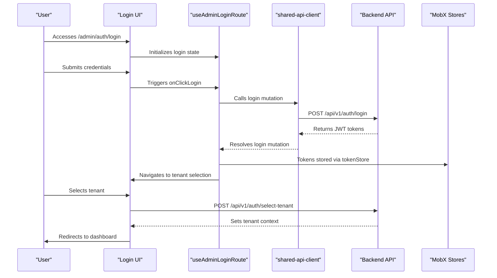
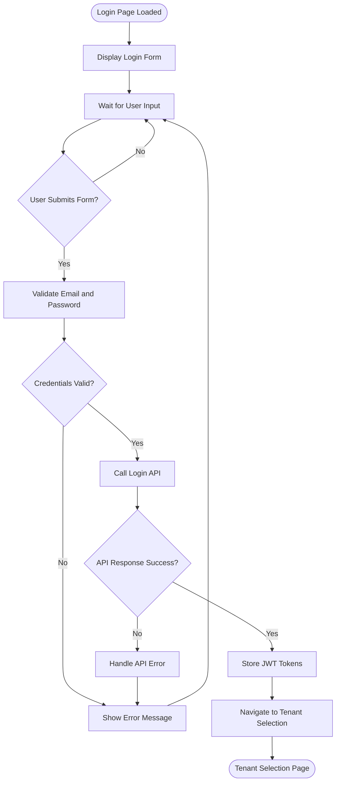
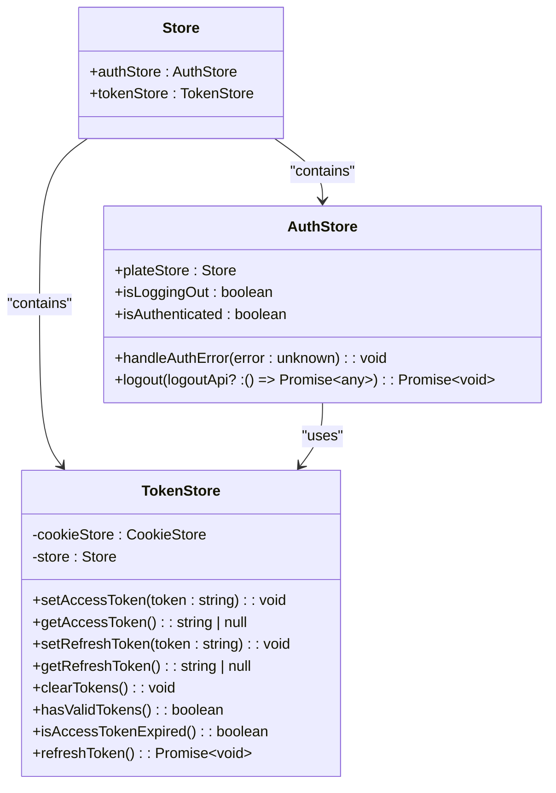
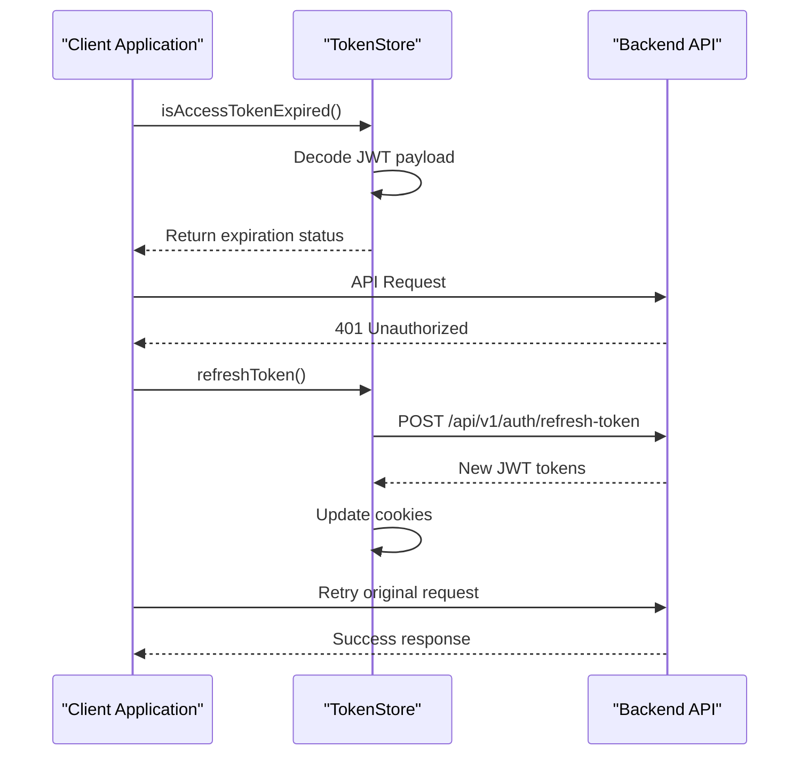
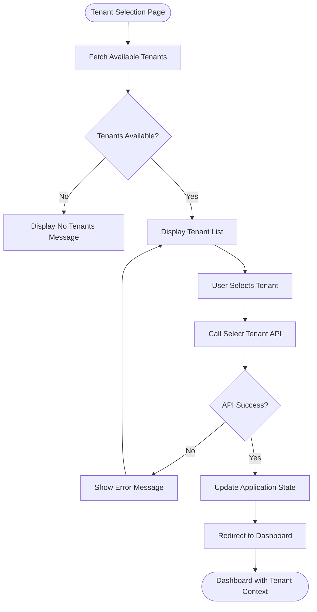
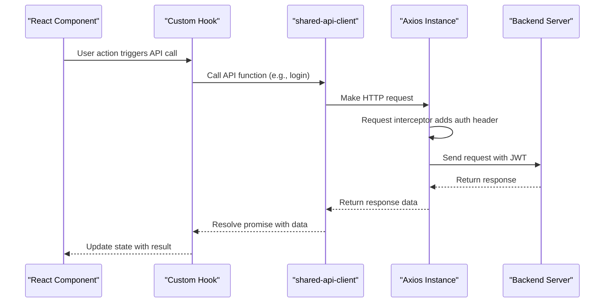
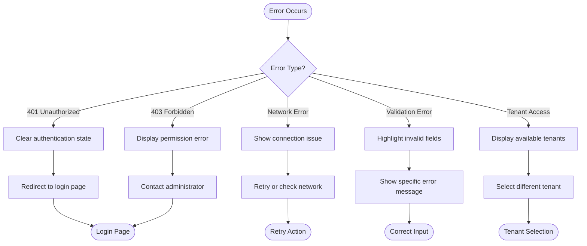
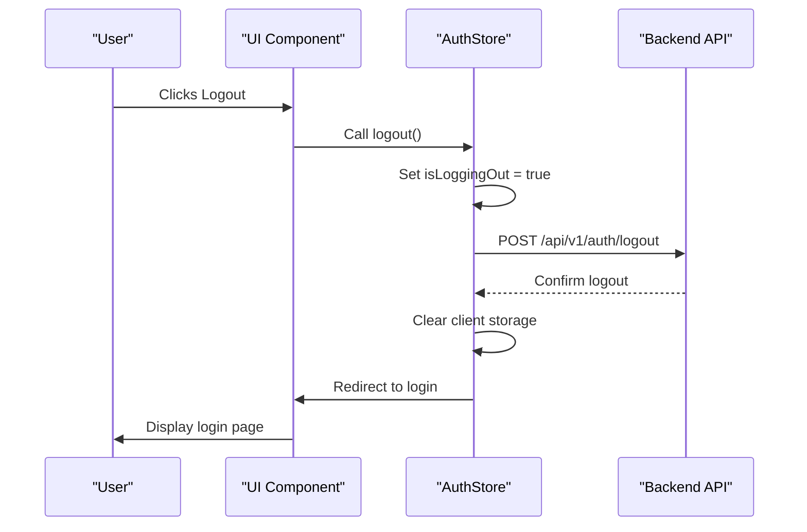

# Authentication Flow

<cite>
**Referenced Files in This Document**   
- [useAdminLoginRoute.ts](file://apps/admin/src/hooks/useAdminLoginRoute.ts)
- [authStore.ts](file://packages/store/src/stores/authStore.ts)
- [tokenStore.ts](file://packages/store/src/stores/tokenStore.ts)
- [apis.ts](file://packages/api-client/src/apis.ts)
- [auth.tsx](file://apps/admin/src/routes/admin/auth.tsx)
- [index.tsx](file://apps/admin/src/routes/index.tsx)
- [main.tsx](file://apps/admin/src/main.tsx)
- [useAdminTenantSelectRoute.ts](file://apps/admin/src/hooks/useAdminTenantSelectRoute.ts)
</cite>

## Table of Contents
1. [Introduction](#introduction)
2. [Authentication Architecture](#authentication-architecture)
3. [Login Process Implementation](#login-process-implementation)
4. [State Management with MobX](#state-management-with-mobx)
5. [Token Handling and Session Persistence](#token-handling-and-session-persistence)
6. [Tenant Selection Workflow](#tenant-selection-workflow)
7. [API Integration Details](#api-integration-details)
8. [Error Handling and Common Issues](#error-handling-and-common-issues)
9. [Logout Functionality](#logout-functionality)
10. [Security Considerations](#security-considerations)

## Introduction
The admin authentication flow in prj-core implements a secure, multi-step process for user authentication and authorization. This document details the complete authentication workflow, from initial login through tenant selection to establishing a secure session. The system leverages JWT tokens for authentication, with tokens stored in secure HttpOnly cookies to prevent XSS attacks. The authentication process is managed through a combination of React components, MobX state management, and backend API integration via the shared-api-client package.

**Section sources**
- [auth.tsx](file://apps/admin/src/routes/admin/auth.tsx)
- [index.tsx](file://apps/admin/src/routes/index.tsx)

## Authentication Architecture
The authentication system in prj-core follows a layered architecture with clear separation of concerns between presentation, state management, and API communication layers. The flow begins with the user accessing the login page, proceeds through credential validation, token acquisition, and concludes with tenant context establishment.

**Diagram sources**
- [useAdminLoginRoute.ts](file://apps/admin/src/hooks/useAdminLoginRoute.ts)
- [authStore.ts](file://packages/store/src/stores/authStore.ts)
- [tokenStore.ts](file://packages/store/src/stores/tokenStore.ts)

**Section sources**
- [useAdminLoginRoute.ts](file://apps/admin/src/hooks/useAdminLoginRoute.ts)
- [authStore.ts](file://packages/store/src/stores/authStore.ts)

## Login Process Implementation
The login process is implemented through a React component that handles form input and validation, with business logic encapsulated in custom hooks. The `useAdminLoginRoute` hook manages the login form state, API communication, and navigation flow. The login form includes email and password fields with initial test values pre-populated for development purposes.

When the user submits the login form, the `onClickLogin` handler invokes the login mutation from the shared-api-client. Upon successful authentication, the user is automatically redirected to the tenant selection page. The login process includes error handling for invalid credentials and network issues, with appropriate error messages displayed to the user.

**Diagram sources**
- [useAdminLoginRoute.ts](file://apps/admin/src/hooks/useAdminLoginRoute.ts)
- [auth.tsx](file://apps/admin/src/routes/admin/auth.tsx)

**Section sources**
- [useAdminLoginRoute.ts](file://apps/admin/src/hooks/useAdminLoginRoute.ts)
- [auth.tsx](file://apps/admin/src/routes/admin/auth.tsx)

## State Management with MobX
The authentication state is managed using MobX stores from the shared-frontend package. The `AuthStore` and `TokenStore` classes provide a centralized location for authentication-related state, including token storage, authentication status, and user session information. These stores are injected into the React component tree via the `StoreProvider` in the application's main entry point.

The `AuthStore` exposes an `isAuthenticated` computed property that determines authentication status by checking token validity through the `TokenStore`. This reactive approach ensures that UI components automatically update when authentication state changes. The stores follow the singleton pattern, ensuring consistent state across the application.

**Diagram sources**
- [authStore.ts](file://packages/store/src/stores/authStore.ts)
- [tokenStore.ts](file://packages/store/src/stores/tokenStore.ts)
- [main.tsx](file://apps/admin/src/main.tsx)

**Section sources**
- [authStore.ts](file://packages/store/src/stores/authStore.ts)
- [tokenStore.ts](file://packages/store/src/stores/tokenStore.ts)

## Token Handling and Session Persistence
JWT tokens are handled securely using HttpOnly cookies to prevent client-side JavaScript access and mitigate XSS attacks. The `TokenStore` class manages token storage and validation, with access and refresh tokens stored separately. The access token is used for authentication with API requests, while the refresh token enables silent token renewal when the access token expires.

Token expiration is checked by decoding the JWT payload and comparing the expiration timestamp with the current time. When an access token expires, the system can automatically refresh it using the refresh token without requiring the user to log in again. This provides a seamless user experience while maintaining security.

**Diagram sources**
- [tokenStore.ts](file://packages/store/src/stores/tokenStore.ts)
- [authStore.ts](file://packages/store/src/stores/authStore.ts)

**Section sources**
- [tokenStore.ts](file://packages/store/src/stores/tokenStore.ts)
- [authStore.ts](file://packages/store/src/stores/authStore.ts)

## Tenant Selection Workflow
After successful authentication, administrators must select a tenant to establish their context within the system. This multi-tenancy approach allows administrators to manage multiple organizations or business units from a single account. The tenant selection interface is implemented as a separate route that displays a list of available tenants for the authenticated user.

The `useAdminTenantSelectRoute` hook manages the tenant selection state, including the currently selected tenant ID. When a tenant is selected, the system makes a backend API call to establish the tenant context, which may involve setting additional cookies or session variables. This context determines the data and functionality available to the user throughout their session.

**Diagram sources**
- [useAdminTenantSelectRoute.ts](file://apps/admin/src/hooks/useAdminTenantSelectRoute.ts)
- [authStore.ts](file://packages/store/src/stores/authStore.ts)

**Section sources**
- [useAdminTenantSelectRoute.ts](file://apps/admin/src/hooks/useAdminTenantSelectRoute.ts)

## API Integration Details
The authentication flow integrates with backend endpoints through the shared-api-client package, which provides type-safe API wrappers generated from OpenAPI specifications. The login process uses the `login` mutation to authenticate credentials, while tenant selection uses a dedicated endpoint to establish context.

The API client handles request configuration, including proper headers and error handling. Authentication-related endpoints require JWT tokens for access, with tokens automatically included in requests through Axios interceptors configured in the MobX stores. This ensures that authenticated requests are properly authorized without requiring manual token management in individual API calls.

**Diagram sources**
- [apis.ts](file://packages/api-client/src/apis.ts)
- [authStore.ts](file://packages/store/src/stores/authStore.ts)
- [useAdminLoginRoute.ts](file://apps/admin/src/hooks/useAdminLoginRoute.ts)

**Section sources**
- [apis.ts](file://packages/api-client/src/apis.ts)
- [authStore.ts](file://packages/store/src/stores/authStore.ts)

## Error Handling and Common Issues
The authentication system includes comprehensive error handling for various failure scenarios. Common issues include expired sessions, invalid credentials, and tenant access errors. When a 401 Unauthorized response is received, the system automatically redirects to the login page to prompt re-authentication.

For invalid credentials, the login form displays specific error messages to guide the user. Network errors and server-side issues are handled gracefully, with appropriate user feedback and retry mechanisms where applicable. The system also handles edge cases such as token expiration during active sessions by implementing silent refresh where possible.

**Diagram sources**
- [authStore.ts](file://packages/store/src/stores/authStore.ts)
- [useAdminLoginRoute.ts](file://apps/admin/src/hooks/useAdminLoginRoute.ts)

**Section sources**
- [authStore.ts](file://packages/store/src/stores/authStore.ts)
- [useAdminLoginRoute.ts](file://apps/admin/src/hooks/useAdminLoginRoute.ts)

## Logout Functionality
The logout process clears all authentication state and terminates the user session. The `logout` method in the `AuthStore` class handles this process, first calling the backend logout API to invalidate server-side sessions and clear HttpOnly cookies, then clearing client-side storage. This two-step process ensures complete session termination.

During logout, the system sets an `isLoggingOut` flag to prevent multiple concurrent logout requests and provide visual feedback to the user. After clearing authentication state, the user is redirected to the login page. The logout process is designed to be resilient, ensuring the user is always redirected to the login page even if the backend API call fails.

**Diagram sources**
- [authStore.ts](file://packages/store/src/stores/authStore.ts)

**Section sources**
- [authStore.ts](file://packages/store/src/stores/authStore.ts)

## Security Considerations
The authentication system implements several security measures to protect user accounts and data. JWT tokens are stored in HttpOnly cookies to prevent XSS attacks, and the cookies are marked as secure to ensure they are only transmitted over HTTPS. The system uses strong password policies and secure transmission of credentials over encrypted channels.

Session management includes automatic token expiration and refresh mechanisms to balance security and user convenience. The multi-step authentication process with tenant selection provides an additional layer of access control, ensuring users can only access resources for which they have appropriate permissions. Regular security audits and penetration testing are recommended to identify and address potential vulnerabilities.

**Section sources**
- [tokenStore.ts](file://packages/store/src/stores/tokenStore.ts)
- [authStore.ts](file://packages/store/src/stores/authStore.ts)
- [apis.ts](file://packages/api-client/src/apis.ts)