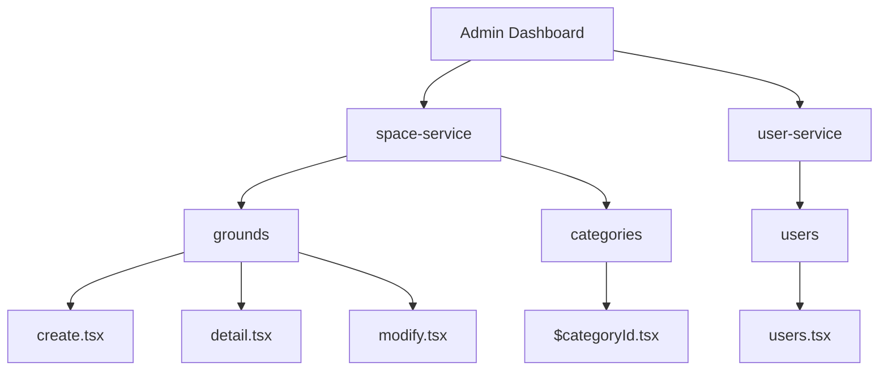
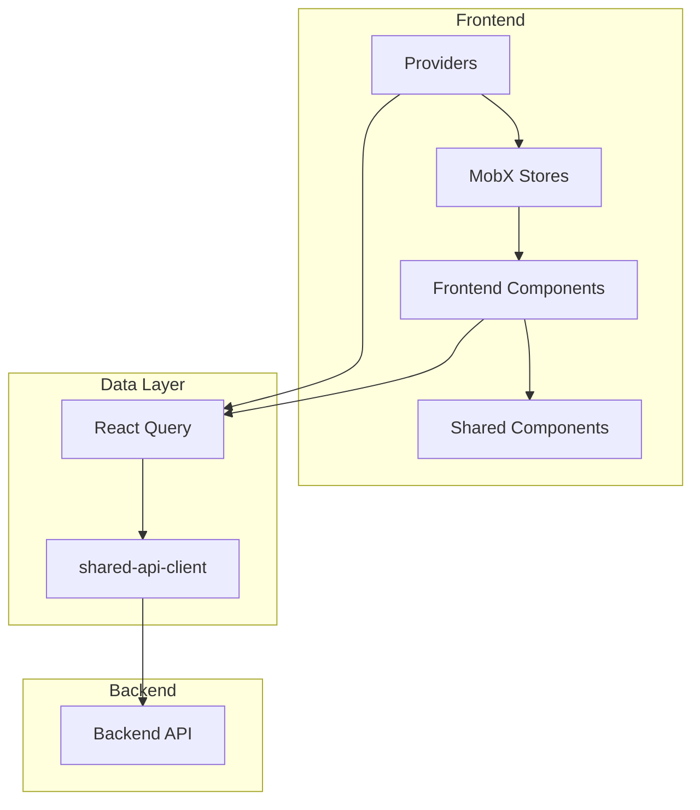
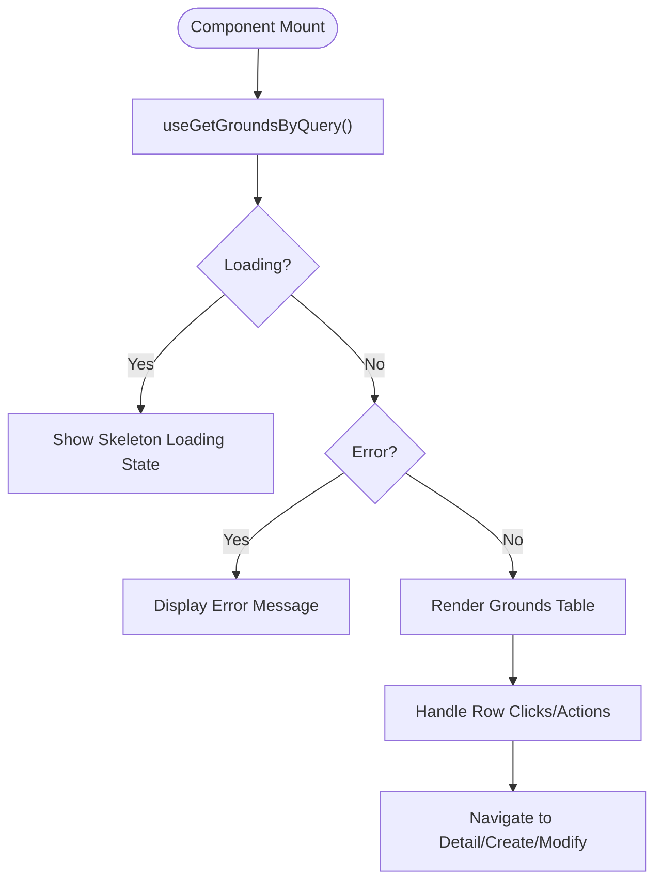
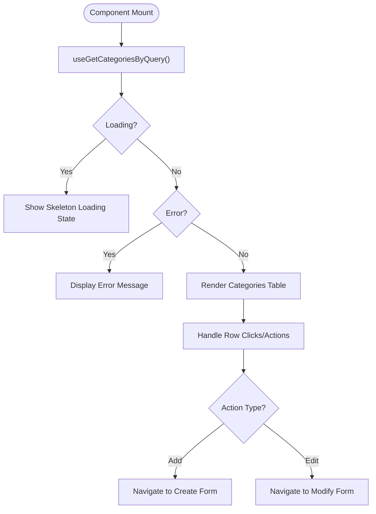
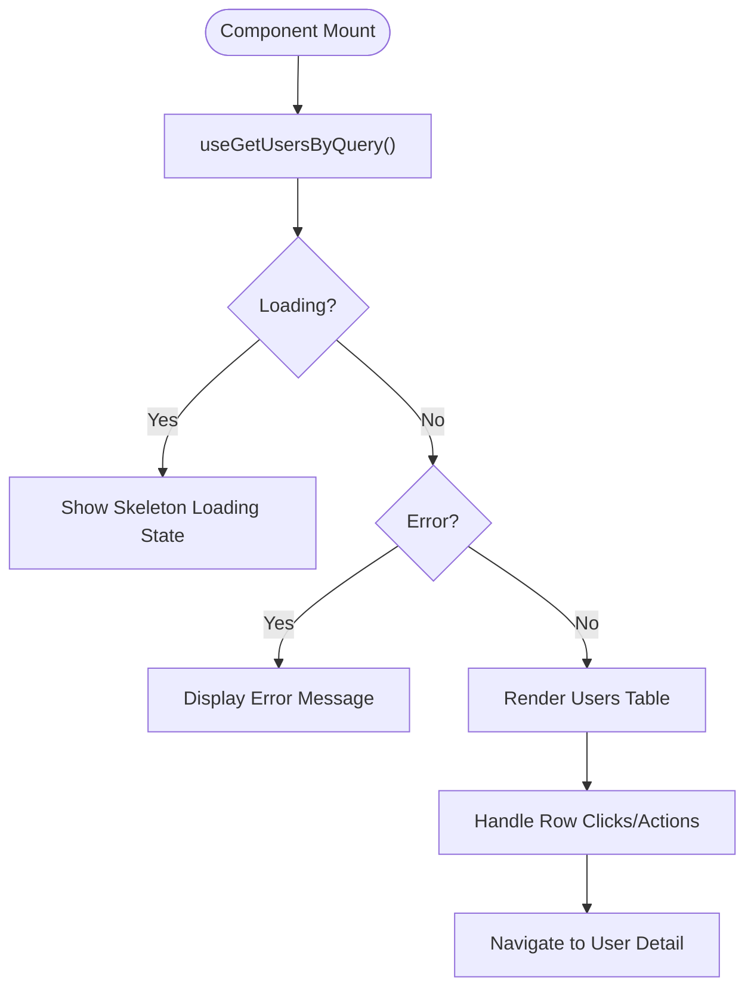
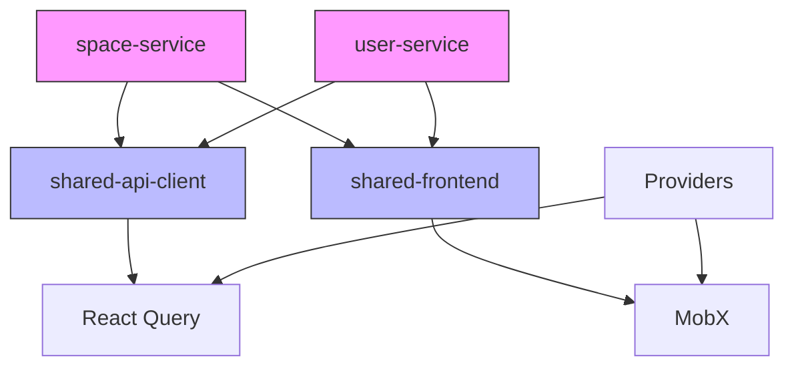

# Dashboard Modules

<cite>
**Referenced Files in This Document**   
- [dashboard.tsx](file://apps/admin/src/routes/admin/dashboard.tsx)
- [space-service.tsx](file://apps/admin/src/routes/admin/dashboard/space-service.tsx)
- [grounds.tsx](file://apps/admin/src/routes/admin/dashboard/space-service/grounds.tsx)
- [categories.tsx](file://apps/admin/src/routes/admin/dashboard/space-service/categories.tsx)
- [users.tsx](file://apps/admin/src/routes/admin/dashboard/user-service/users.tsx)
- [apis.ts](file://packages/shared-api-client/src/apis.ts)
- [Providers.tsx](file://apps/admin/src/providers/Providers.tsx)
</cite>

## Table of Contents
1. [Introduction](#introduction)
2. [Project Structure](#project-structure)
3. [Core Components](#core-components)
4. [Architecture Overview](#architecture-overview)
5. [Detailed Component Analysis](#detailed-component-analysis)
6. [Dependency Analysis](#dependency-analysis)
7. [Performance Considerations](#performance-considerations)
8. [Troubleshooting Guide](#troubleshooting-guide)
9. [Conclusion](#conclusion)

## Introduction
This document provides comprehensive documentation for the admin dashboard modules in prj-core, focusing on the implementation of the space-service and user-service modules. The documentation covers component structure, data fetching patterns using React Query via shared-api-client, and state management with MobX stores. It details the functionality of the space-service including categories and grounds management with CRUD operations, and the user-service module for user management with listing, filtering, and profile viewing capabilities.

## Project Structure

**Diagram sources**
- [dashboard.tsx](file://apps/admin/src/routes/admin/dashboard.tsx)
- [space-service.tsx](file://apps/admin/src/routes/admin/dashboard/space-service.tsx)
- [user-service.tsx](file://apps/admin/src/routes/admin/dashboard/user-service.tsx)

**Section sources**
- [dashboard.tsx](file://apps/admin/src/routes/admin/dashboard.tsx)

## Core Components

The admin dashboard modules are organized into two main service areas: space-service and user-service. The space-service manages physical locations (grounds) and their categorization, while the user-service handles user management functionality. Both services follow a consistent component structure with list views, detail views, and form components for CRUD operations.

**Section sources**
- [space-service.tsx](file://apps/admin/src/routes/admin/dashboard/space-service.tsx)
- [user-service.tsx](file://apps/admin/src/routes/admin/dashboard/user-service.tsx)

## Architecture Overview

**Diagram sources**
- [Providers.tsx](file://apps/admin/src/providers/Providers.tsx)
- [apis.ts](file://packages/shared-api-client/src/apis.ts)

## Detailed Component Analysis

### Space-Service Module

The space-service module provides management capabilities for physical spaces (grounds) and their categorization. It includes comprehensive CRUD operations for both grounds and categories, with dedicated routes for listing, creating, viewing details, and modifying records.

#### Grounds Management
The grounds management component displays a list of grounds with key information including name, location, and capacity. The implementation uses React Query for data fetching and caching, ensuring efficient data retrieval and automatic background updates.

**Diagram sources**
- [grounds.tsx](file://apps/admin/src/routes/admin/dashboard/space-service/grounds.tsx)
- [apis.ts](file://packages/shared-api-client/src/apis.ts)

#### Categories Management
The categories management component allows administrators to manage space categories with functionality for listing existing categories and adding new ones. The interface includes a table displaying category names, descriptions, and associated ground counts, along with an "Add Category" button for creating new categories.

**Diagram sources**
- [categories.tsx](file://apps/admin/src/routes/admin/dashboard/space-service/categories.tsx)
- [apis.ts](file://packages/shared-api-client/src/apis.ts)

### User-Service Module

The user-service module provides comprehensive user management capabilities, allowing administrators to view and manage user accounts within the system.

#### Users Management
The users management component displays a list of users with their basic information including name and phone number. The implementation follows the same data fetching pattern as other modules, using React Query to retrieve user data from the backend API.

**Diagram sources**
- [users.tsx](file://apps/admin/src/routes/admin/dashboard/user-service/users.tsx)
- [apis.ts](file://packages/shared-api-client/src/apis.ts)

## Dependency Analysis

**Diagram sources**
- [apis.ts](file://packages/shared-api-client/src/apis.ts)
- [Providers.tsx](file://apps/admin/src/providers/Providers.tsx)

**Section sources**
- [apis.ts](file://packages/shared-api-client/src/apis.ts)
- [Providers.tsx](file://apps/admin/src/providers/Providers.tsx)

## Performance Considerations

The dashboard modules implement several performance optimizations through the use of React Query for data fetching and caching. The automatic caching mechanism reduces redundant API calls by storing retrieved data and serving it from cache when possible. The infinite query and suspense query options provide additional performance benefits for large datasets and loading states. The component structure follows a modular approach, allowing for code splitting and lazy loading of specific modules as needed.

## Troubleshooting Guide

When encountering issues with the dashboard modules, consider the following common problems and solutions:

1. **Data not loading**: Verify the React Query client is properly configured in the Providers component and check network requests in the browser developer tools.
2. **Authentication errors**: Ensure the user has the appropriate permissions and the authentication token is valid.
3. **Component rendering issues**: Check for proper route configuration and parameter handling, especially for dynamic routes with IDs.
4. **State management problems**: Verify MobX store connections and observer patterns are correctly implemented.

**Section sources**
- [Providers.tsx](file://apps/admin/src/providers/Providers.tsx)
- [apis.ts](file://packages/shared-api-client/src/apis.ts)

## Conclusion

The admin dashboard modules in prj-core provide a comprehensive management interface for space and user resources. The implementation leverages React Query through the shared-api-client for efficient data fetching and caching, while utilizing MobX stores for state management. The component structure follows a consistent pattern across modules, making the codebase maintainable and extensible. The navigation system uses route parameters effectively to manage context between list and detail views, providing a seamless user experience for administrative tasks.