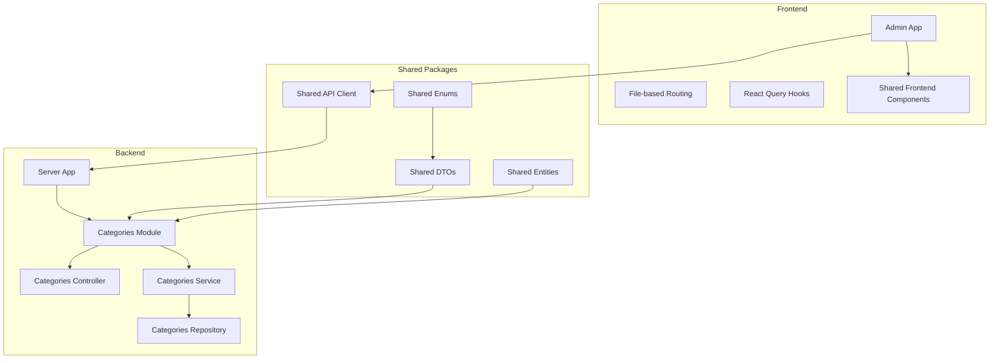
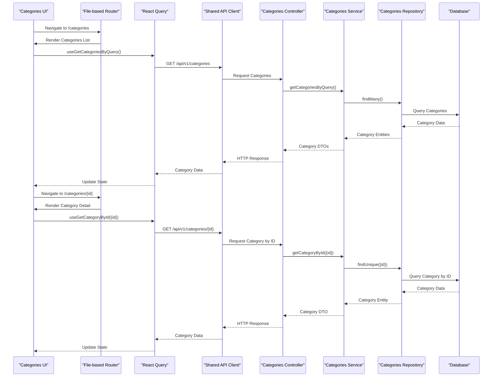
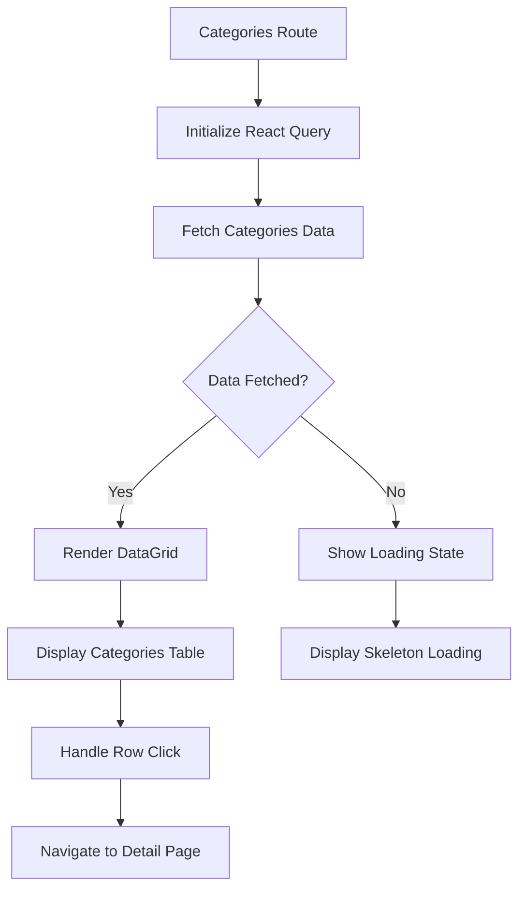
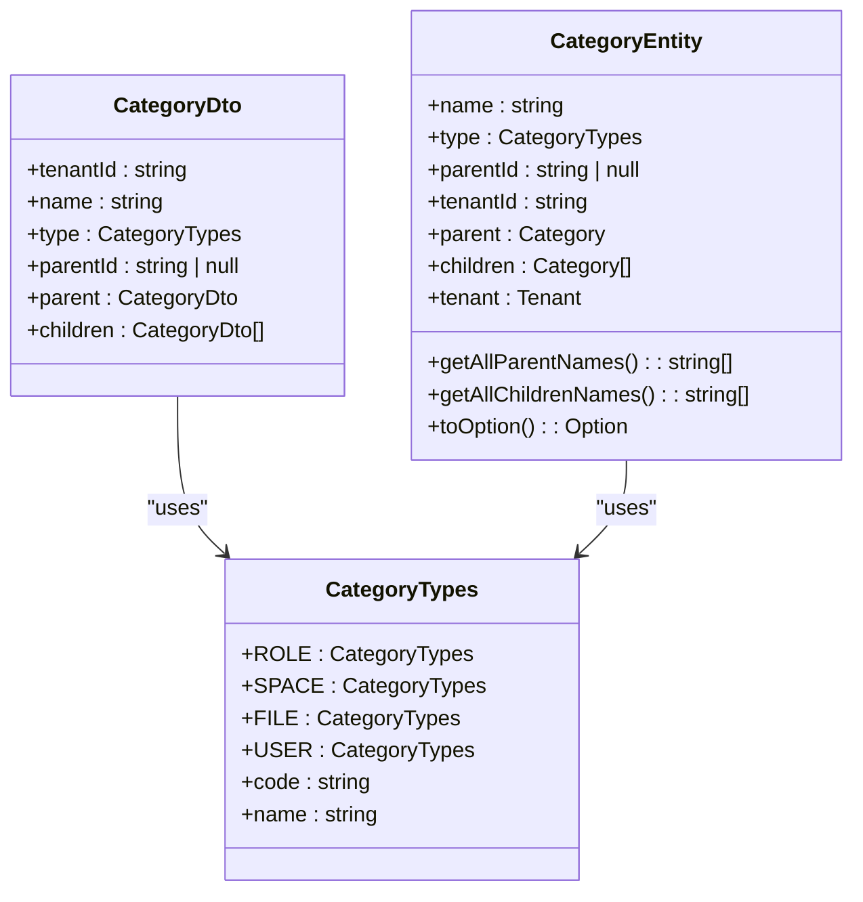
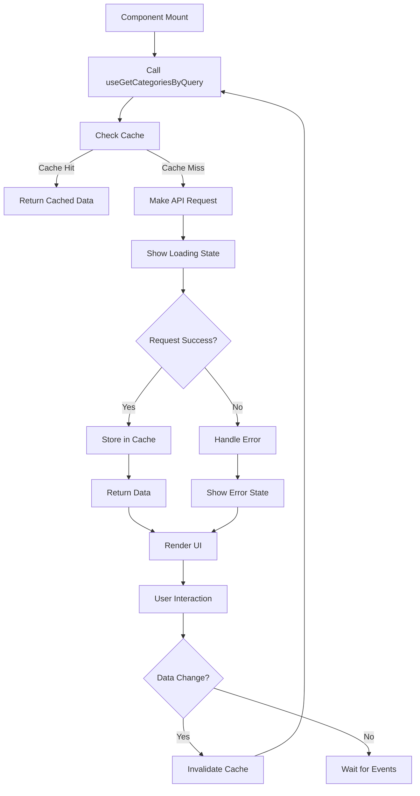
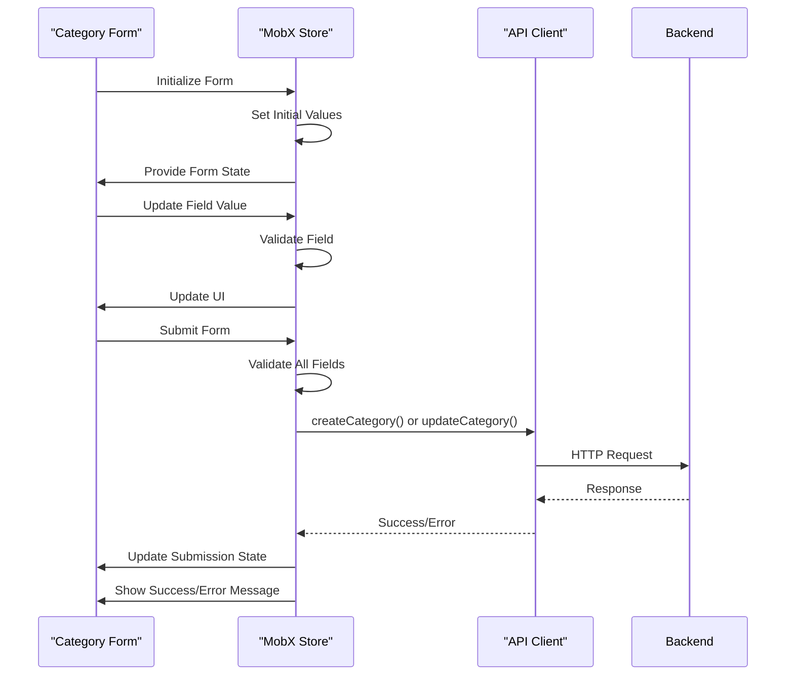
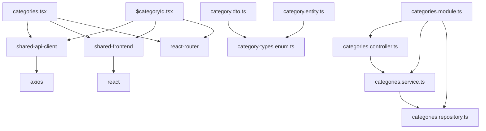

# Categories Management

<cite>
**Referenced Files in This Document**   
- [categories.tsx](file://apps/admin/src/routes/admin/dashboard/space-service/categories.tsx)
- [$categoryId.tsx](file://apps/admin/src/routes/admin/dashboard/space-service/categories/$categoryId.tsx)
- [categories.module.ts](file://apps/server/src/module/categories.module.ts)
- [category.dto.ts](file://packages/dto/src/category.dto.ts)
- [category.entity.ts](file://packages/entity/src/category.entity.ts)
- [category-types.enum.ts](file://packages/enum/src/category-types.enum.ts)
- [getCategoriesByQueryParams.ts](file://packages/api/src/model/getCategoriesByQueryParams.ts)
- [getCategoriesByQuery200AllOf.ts](file://packages/api/src/model/getCategoriesByQuery200AllOf.ts)
- [apis.ts](file://packages/api/src/apis.ts)
- [categories.service.ts](file://apps/server/src/shared/service/resources/categories.service.ts)
- [categories.controller.ts](file://apps/server/src/shared/controller/resources/categories.controller.ts)
</cite>

## Table of Contents
1. [Introduction](#introduction)
2. [Project Structure](#project-structure)
3. [Core Components](#core-components)
4. [Architecture Overview](#architecture-overview)
5. [Detailed Component Analysis](#detailed-component-analysis)
6. [Dependency Analysis](#dependency-analysis)
7. [Performance Considerations](#performance-considerations)
8. [Troubleshooting Guide](#troubleshooting-guide)
9. [Conclusion](#conclusion)

## Introduction
The Categories Management feature within the space-service module provides a comprehensive solution for managing hierarchical categories in the application. This documentation details the implementation of category list interfaces and individual category detail pages using file-based routing with dynamic segments. The system leverages React Query hooks for data fetching from the shared-api-client, implements proper loading states and error handling, and utilizes shared-frontend components for consistent UI presentation. The form handling approach uses MobX stores for creating and updating categories with robust validation patterns and submission workflows.

## Project Structure
The categories management feature is organized across multiple packages and applications within the monorepo architecture. The frontend implementation resides in the admin application with file-based routing, while the backend services, controllers, and data models are distributed across shared packages.

**Diagram sources**
- [categories.tsx](file://apps/admin/src/routes/admin/dashboard/space-service/categories.tsx)
- [categories.module.ts](file://apps/server/src/module/categories.module.ts)
- [category.dto.ts](file://packages/dto/src/category.dto.ts)

## Core Components
The categories management system consists of several core components that work together to provide a seamless user experience. The frontend utilizes file-based routing for the categories list and detail views, while the backend provides RESTful endpoints for category operations. Data transfer objects (DTOs) ensure consistent data structure between frontend and backend, and the entity models define the database schema and business logic.

**Section sources**
- [categories.tsx](file://apps/admin/src/routes/admin/dashboard/space-service/categories.tsx)
- [category.dto.ts](file://packages/dto/src/category.dto.ts)
- [category.entity.ts](file://packages/entity/src/category.entity.ts)

## Architecture Overview
The categories management feature follows a clean architecture pattern with clear separation of concerns between frontend and backend components. The frontend application uses React with file-based routing to handle navigation between the categories list and individual category detail pages. Data fetching is performed using React Query hooks that interface with the shared-api-client, which in turn communicates with the backend API endpoints.

**Diagram sources**
- [categories.tsx](file://apps/admin/src/routes/admin/dashboard/space-service/categories.tsx)
- [categories.controller.ts](file://apps/server/src/shared/controller/resources/categories.controller.ts)
- [categories.service.ts](file://apps/server/src/shared/service/resources/categories.service.ts)
- [apis.ts](file://packages/api/src/apis.ts)

## Detailed Component Analysis

### Categories List Implementation
The categories list interface is implemented using file-based routing with the React Router framework. The component renders a table of categories with pagination support and provides navigation to individual category detail pages.

**Diagram sources**
- [categories.tsx](file://apps/admin/src/routes/admin/dashboard/space-service/categories.tsx)
- [getCategoriesByQueryParams.ts](file://packages/api/src/model/getCategoriesByQueryParams.ts)
- [getCategoriesByQuery200AllOf.ts](file://packages/api/src/model/getCategoriesByQuery200AllOf.ts)

**Section sources**
- [categories.tsx](file://apps/admin/src/routes/admin/dashboard/space-service/categories.tsx)
- [apis.ts](file://packages/api/src/apis.ts)

### Category Detail Implementation
The category detail page uses dynamic routing with the $categoryId parameter to load and display information about a specific category. The implementation includes data fetching, error handling, and navigation controls.

**Diagram sources**
- [category.dto.ts](file://packages/dto/src/category.dto.ts)
- [category.entity.ts](file://packages/entity/src/category.entity.ts)
- [category-types.enum.ts](file://packages/enum/src/category-types.enum.ts)

**Section sources**
- [$categoryId.tsx](file://apps/admin/src/routes/admin/dashboard/space-service/categories/$categoryId.tsx)
- [category.dto.ts](file://packages/dto/src/category.dto.ts)

### Data Fetching and State Management
The categories management feature uses React Query for data fetching and state management, providing automatic caching, background updates, and error handling. The shared-api-client package exposes typed hooks for all category-related operations.

**Diagram sources**
- [apis.ts](file://packages/api/src/apis.ts)
- [categories.service.ts](file://apps/server/src/shared/service/resources/categories.service.ts)

**Section sources**
- [apis.ts](file://packages/api/src/apis.ts)
- [categories.service.ts](file://apps/server/src/shared/service/resources/categories.service.ts)

### Form Handling with MobX Stores
The category creation and update forms utilize MobX stores for state management, providing a predictable state container with built-in validation and submission workflows.

**Diagram sources**
- [categories.service.ts](file://apps/server/src/shared/service/resources/categories.service.ts)
- [apis.ts](file://packages/api/src/apis.ts)

**Section sources**
- [categories.service.ts](file://apps/server/src/shared/service/resources/categories.service.ts)
- [apis.ts](file://packages/api/src/apis.ts)

## Dependency Analysis
The categories management feature has a well-defined dependency structure that ensures separation of concerns and maintainability. The frontend components depend on shared packages for API clients and UI components, while the backend modules depend on shared services and repositories.

**Diagram sources**
- [categories.tsx](file://apps/admin/src/routes/admin/dashboard/space-service/categories.tsx)
- [$categoryId.tsx](file://apps/admin/src/routes/admin/dashboard/space-service/categories/$categoryId.tsx)
- [categories.module.ts](file://apps/server/src/module/categories.module.ts)
- [category.dto.ts](file://packages/dto/src/category.dto.ts)
- [category.entity.ts](file://packages/entity/src/category.entity.ts)

**Section sources**
- [categories.module.ts](file://apps/server/src/module/categories.module.ts)
- [category.dto.ts](file://packages/dto/src/category.dto.ts)

## Performance Considerations
The categories management feature implements several performance optimizations to ensure a responsive user experience. These include data caching with React Query, pagination for large datasets, and efficient rendering with virtualized lists. The API endpoints support query parameters for filtering and sorting, reducing the amount of data transferred over the network. The file-based routing system enables code splitting, loading only the necessary components for the current view.

## Troubleshooting Guide
When encountering issues with the categories management feature, consider the following common problems and solutions:

1. **Categories not loading**: Check network requests in the browser developer tools to verify the API endpoint is being called correctly. Ensure the user has the necessary permissions to access category data.

2. **Slow performance with large datasets**: Verify that pagination is properly implemented and that the take parameter is set to a reasonable value (default 50). Check that database indexes exist on frequently queried fields.

3. **Form validation errors**: Ensure all required fields are populated and that data types match the expected schema. Check the console for validation error messages from the MobX store.

4. **Routing issues**: Verify that the file-based routing structure matches the expected URL patterns. Check that dynamic segments are properly named with the $ prefix.

5. **Permission errors**: Confirm that the user's role has the necessary permissions to perform the requested operation (create, read, update, delete).

**Section sources**
- [categories.service.ts](file://apps/server/src/shared/service/resources/categories.service.ts)
- [categories.controller.ts](file://apps/server/src/shared/controller/resources/categories.controller.ts)
- [apis.ts](file://packages/api/src/apis.ts)

## Conclusion
The categories management feature provides a robust solution for managing hierarchical categories within the space-service module. By leveraging file-based routing, React Query for data fetching, and MobX for form state management, the implementation offers a seamless user experience with proper loading states, error handling, and performance optimizations. The integration with shared-frontend components ensures consistent UI presentation across the application, while the well-defined API contracts between frontend and backend enable maintainable and scalable code.