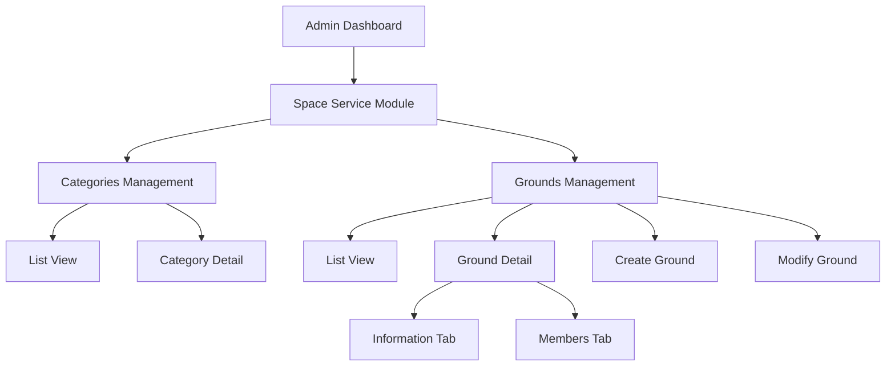
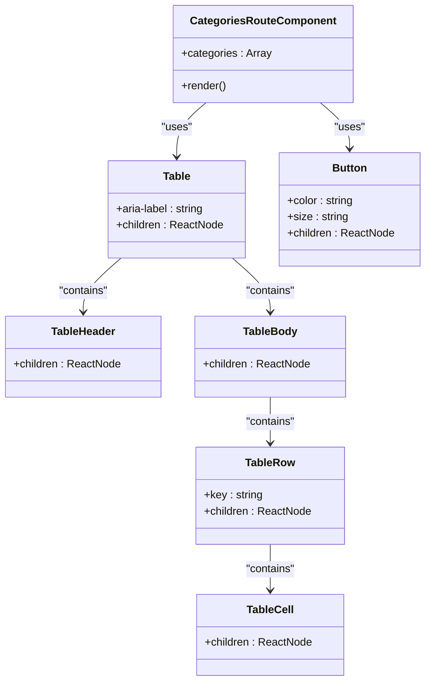
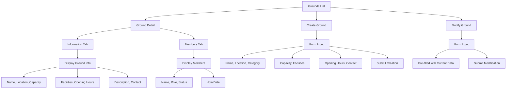
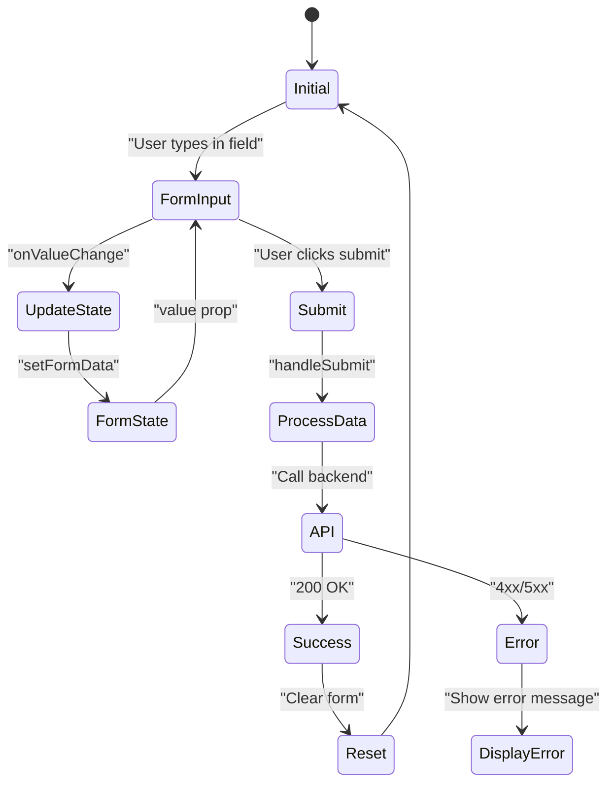

# Space Service Module

<cite>
**Referenced Files in This Document**   
- [space-service.tsx](file://apps/admin/src/routes/admin/dashboard/space-service.tsx)
- [categories.tsx](file://apps/admin/src/routes/admin/dashboard/space-service/categories.tsx)
- [grounds.tsx](file://apps/admin/src/routes/admin/dashboard/space-service/grounds.tsx)
- [$categoryId.tsx](file://apps/admin/src/routes/admin/dashboard/space-service/categories/$categoryId.tsx)
- [$groundId.tsx](file://apps/admin/src/routes/admin/dashboard/space-service/grounds/$groundId.tsx)
- [create.tsx](file://apps/admin/src/routes/admin/dashboard/space-service/grounds/$groundId/create.tsx)
- [modify.tsx](file://apps/admin/src/routes/admin/dashboard/space-service/grounds/$groundId/modify.tsx)
- [info.tsx](file://apps/admin/src/routes/admin/dashboard/space-service/grounds/$groundId/detail/info.tsx)
- [members.tsx](file://apps/admin/src/routes/admin/dashboard/space-service/grounds/$groundId/detail/members.tsx)
- [App.tsx](file://apps/admin/src/App.tsx)
- [main.tsx](file://apps/admin/src/main.tsx)
</cite>

## Table of Contents
1. [Introduction](#introduction)
2. [Project Structure](#project-structure)
3. [Core Components](#core-components)
4. [Architecture Overview](#architecture-overview)
5. [Detailed Component Analysis](#detailed-component-analysis)
6. [Dependency Analysis](#dependency-analysis)
7. [Performance Considerations](#performance-considerations)
8. [Troubleshooting Guide](#troubleshooting-guide)
9. [Conclusion](#conclusion)

## Introduction
The Space Service Module is a critical component of the admin dashboard that manages space-related entities such as categories and grounds. This module provides comprehensive interfaces for administrators to create, view, modify, and manage spatial resources within the system. Built with React and leveraging modern frontend patterns, the module follows a structured approach to data management, user interface design, and state handling.

## Project Structure



**Diagram sources**
- [space-service.tsx](file://apps/admin/src/routes/admin/dashboard/space-service.tsx)
- [categories.tsx](file://apps/admin/src/routes/admin/dashboard/space-service/categories.tsx)
- [grounds.tsx](file://apps/admin/src/routes/admin/dashboard/space-service/grounds.tsx)

**Section sources**
- [space-service.tsx](file://apps/admin/src/routes/admin/dashboard/space-service.tsx)
- [categories.tsx](file://apps/admin/src/routes/admin/dashboard/space-service/categories.tsx)
- [grounds.tsx](file://apps/admin/src/routes/admin/dashboard/space-service/grounds.tsx)

## Core Components

The Space Service Module consists of several core components that work together to provide a complete management interface for space-related entities. The module is organized around two primary entities: categories and grounds. Categories represent types of spaces (e.g., soccer fields, basketball courts), while grounds are specific instances of these categories.

The component structure follows a hierarchical pattern with parent routes rendering layout components and child routes handling specific views. The module uses React Router's file-based routing system to define the application structure, with each file in the routes directory corresponding to a specific URL path.

**Section sources**
- [space-service.tsx](file://apps/admin/src/routes/admin/dashboard/space-service.tsx)
- [categories.tsx](file://apps/admin/src/routes/admin/dashboard/space-service/categories.tsx)
- [grounds.tsx](file://apps/admin/src/routes/admin/dashboard/space-service/grounds.tsx)

## Architecture Overview

```mermaid
graph TB
subgraph "Frontend Layer"
A[Space Service Module]
B[Categories Management]
C[Grounds Management]
D[Shared Components]
E[React Query]
F[MobX Stores]
end
subgraph "Integration Layer"
G[shared-api-client]
H[Backend API]
end
subgraph "UI Library"
I[@heroui/react]
J[shared-frontend]
end
A --> B
A --> C
B --> E
C --> E
E --> G
G --> H
A --> D
D --> I
D --> J
A --> F
F --> C
```

**Diagram sources**
- [App.tsx](file://apps/admin/src/App.tsx)
- [main.tsx](file://apps/admin/src/main.tsx)
- [space-service.tsx](file://apps/admin/src/routes/admin/dashboard/space-service.tsx)

## Detailed Component Analysis

### Categories Management
The categories management interface provides administrators with the ability to view and manage different types of spaces available in the system. The main categories view displays a table listing all available categories with their names, descriptions, and the number of grounds associated with each category.

The interface includes a "Add Category" button that would initiate the creation of a new category in a complete implementation. The component uses shared UI components from the @heroui/react library for consistent styling and behavior across the application.

#### Categories Component Structure


**Diagram sources**
- [categories.tsx](file://apps/admin/src/routes/admin/dashboard/space-service/categories.tsx)

**Section sources**
- [categories.tsx](file://apps/admin/src/routes/admin/dashboard/space-service/categories.tsx)

### Grounds Management
The grounds management interface provides comprehensive functionality for managing specific space instances. The module supports viewing a list of grounds, creating new grounds, modifying existing grounds, and viewing detailed information about individual grounds.

The grounds list view displays essential information about each ground including its name, location, and capacity. Each ground has a detailed view with multiple tabs for different types of information, including general information and member management.

#### Grounds Component Structure


**Diagram sources**
- [grounds.tsx](file://apps/admin/src/routes/admin/dashboard/space-service/grounds.tsx)
- [create.tsx](file://apps/admin/src/routes/admin/dashboard/space-service/grounds/$groundId/create.tsx)
- [modify.tsx](file://apps/admin/src/routes/admin/dashboard/space-service/grounds/$groundId/modify.tsx)
- [info.tsx](file://apps/admin/src/routes/admin/dashboard/space-service/grounds/$groundId/detail/info.tsx)
- [members.tsx](file://apps/admin/src/routes/admin/dashboard/space-service/grounds/$groundId/detail/members.tsx)

**Section sources**
- [grounds.tsx](file://apps/admin/src/routes/admin/dashboard/space-service/grounds.tsx)
- [create.tsx](file://apps/admin/src/routes/admin/dashboard/space-service/grounds/$groundId/create.tsx)
- [modify.tsx](file://apps/admin/src/routes/admin/dashboard/space-service/grounds/$groundId/modify.tsx)

### Form Handling and State Management
The module implements a form handling system using React's useState hook for managing form data during ground creation and modification. The form state is maintained in a local state object that tracks all input fields, with event handlers updating the state as users interact with the form.

For more complex state management needs, the application leverages MobX stores, which are provided through the StoreProvider in the main application component. This allows for shared state across different components and routes within the application.

#### Form State Management


**Diagram sources**
- [create.tsx](file://apps/admin/src/routes/admin/dashboard/space-service/grounds/$groundId/create.tsx)
- [modify.tsx](file://apps/admin/src/routes/admin/dashboard/space-service/grounds/$groundId/modify.tsx)
- [main.tsx](file://apps/admin/src/main.tsx)

## Dependency Analysis

```mermaid
graph TD
A[Space Service Module] --> B[React Router]
A --> C[@heroui/react]
A --> D[shared-api-client]
A --> E[shared-frontend]
A --> F[MobX]
B --> G[File-based Routing]
C --> H[UI Components]
D --> I[Backend API]
E --> J[Shared UI Patterns]
F --> K[State Management]
style A fill:#f9f,stroke:#333
style B fill:#bbf,stroke:#333
style C fill:#bbf,stroke:#333
style D fill:#bbf,stroke:#333
style E fill:#bbf,stroke:#333
style F fill:#bbf,stroke:#333
```

**Diagram sources**
- [App.tsx](file://apps/admin/src/App.tsx)
- [main.tsx](file://apps/admin/src/main.tsx)
- [space-service.tsx](file://apps/admin/src/routes/admin/dashboard/space-service.tsx)

**Section sources**
- [App.tsx](file://apps/admin/src/App.tsx)
- [main.tsx](file://apps/admin/src/main.tsx)

## Performance Considerations
The Space Service Module is designed with performance in mind, leveraging React's component-based architecture to ensure efficient rendering. The use of file-based routing with TanStack Router enables code splitting and lazy loading of route components, reducing the initial bundle size and improving load times.

The module currently uses mock data in the provided code examples, but in a production environment, it would integrate with the shared-api-client to fetch data from the backend API. This integration would benefit from React Query's caching and data fetching optimizations, reducing unnecessary network requests and improving perceived performance.

For large datasets, the table components should implement virtualization or pagination to maintain smooth scrolling and interaction. The current implementation maps over all data items, which could lead to performance issues with large datasets.

## Troubleshooting Guide

When encountering issues with the Space Service Module, consider the following common problems and solutions:

1. **Routing Issues**: Ensure that the file structure in the routes directory matches the desired URL structure. The TanStack Router automatically generates routes based on the file system hierarchy.

2. **State Persistence**: If form data is not persisting correctly, verify that the useState hook is properly initialized and that event handlers are correctly updating the state.

3. **Component Rendering**: If components are not rendering as expected, check that all required props are being passed correctly and that there are no JavaScript errors in the console.

4. **API Integration**: When integrating with the shared-api-client, ensure that the API endpoints are correctly configured and that authentication tokens are properly included in requests.

5. **Styling Issues**: If UI components appear incorrectly styled, verify that the @heroui/react components are being used correctly and that there are no CSS conflicts.

**Section sources**
- [create.tsx](file://apps/admin/src/routes/admin/dashboard/space-service/grounds/$groundId/create.tsx)
- [modify.tsx](file://apps/admin/src/routes/admin/dashboard/space-service/grounds/$groundId/modify.tsx)
- [App.tsx](file://apps/admin/src/App.tsx)

## Conclusion
The Space Service Module provides a comprehensive interface for managing space-related entities within the admin dashboard. By leveraging modern React patterns, file-based routing, and a well-structured component hierarchy, the module offers an intuitive and efficient experience for administrators.

The architecture effectively separates concerns between different types of spaces (categories) and specific instances (grounds), while providing consistent UI patterns through shared components. The integration with React Query and the shared-api-client enables efficient data fetching and synchronization with the backend system.

Future enhancements could include more sophisticated form validation, improved error handling, and additional filtering and sorting capabilities for the list views. The current implementation provides a solid foundation that can be extended to meet evolving requirements.