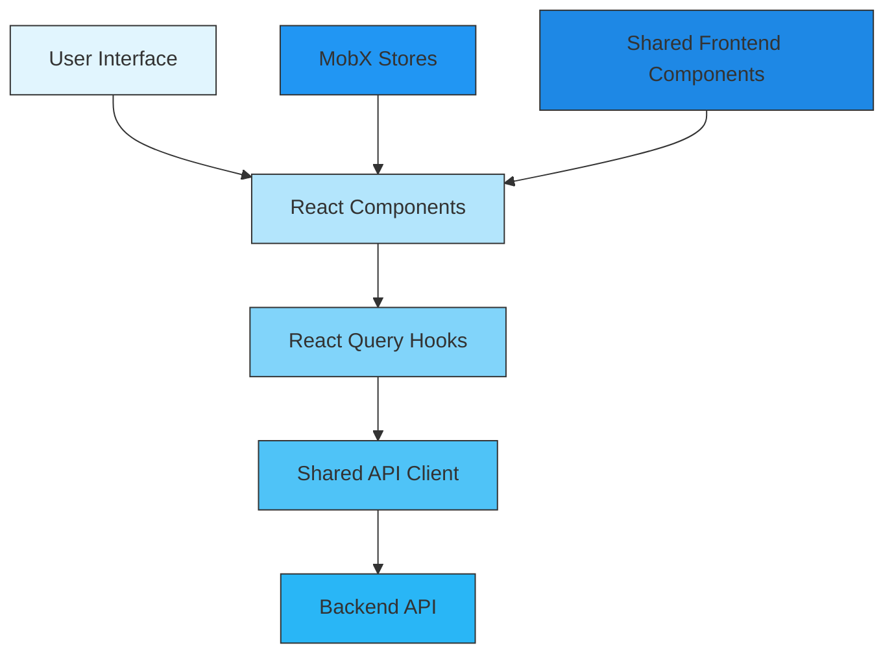
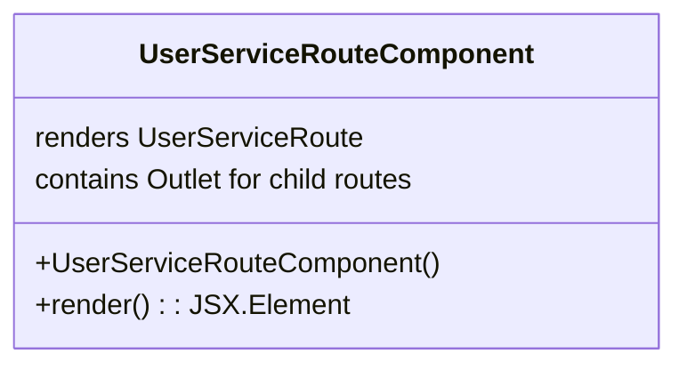
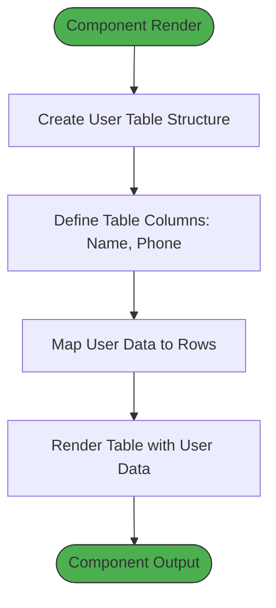
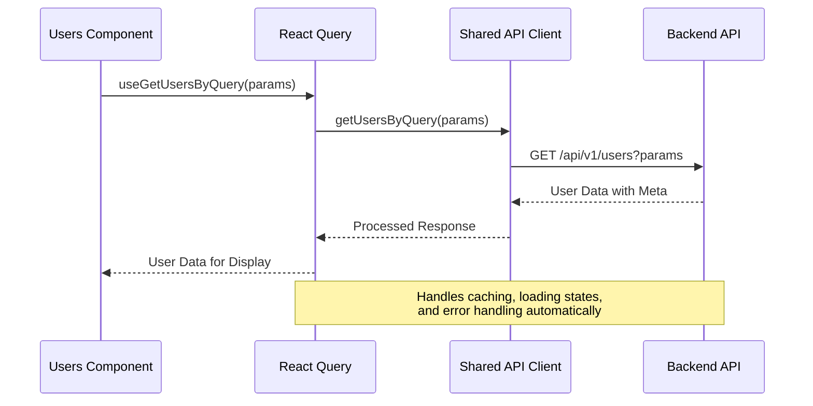
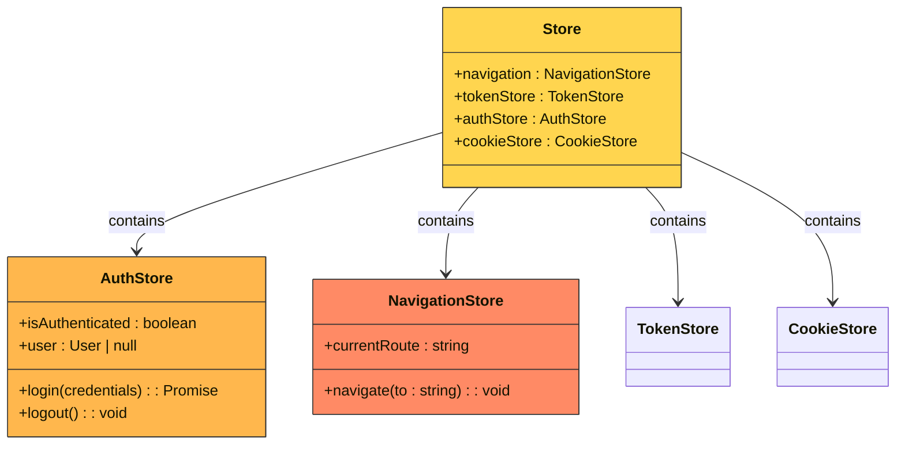
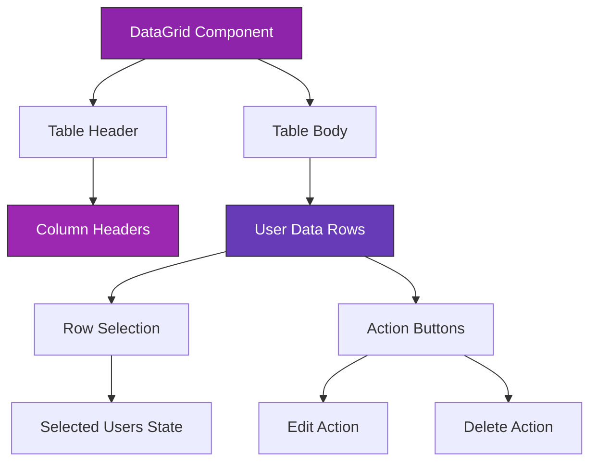
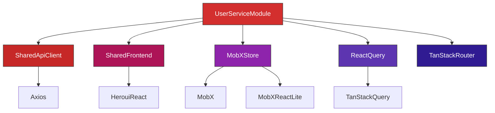

# User Service Module

<cite>
**Referenced Files in This Document**   
- [users.tsx](file://apps/admin/src/routes/admin/dashboard/user-service/users.tsx)
- [user-service.tsx](file://apps/admin/src/routes/admin/dashboard/user-service.tsx)
- [apis.ts](file://packages/api-client/src/apis.ts)
- [DataGrid.tsx](file://packages/ui/src/components/ui/DataGrid/index.tsx)
- [Store.ts](file://packages/store/src/stores/Store.ts)
- [query-user.dto.ts](file://packages/schema/src/dto/query/query-user.dto.ts)
- [role-type.constant.ts](file://packages/schema/src/constant/role-type.constant.ts)
- [routeTree.gen.ts](file://apps/admin/src/routeTree.gen.ts)
</cite>

## Table of Contents
1. [Introduction](#introduction)
2. [Project Structure](#project-structure)
3. [Core Components](#core-components)
4. [Architecture Overview](#architecture-overview)
5. [Detailed Component Analysis](#detailed-component-analysis)
6. [Dependency Analysis](#dependency-analysis)
7. [Performance Considerations](#performance-considerations)
8. [Troubleshooting Guide](#troubleshooting-guide)
9. [Conclusion](#conclusion)

## Introduction
The User Service Module in the admin dashboard provides comprehensive user management functionality, enabling administrators to view, filter, and manage user accounts within the system. This module leverages React Query for efficient data fetching from the backend API through the shared-api-client, implements MobX for state management, and utilizes shared-frontend components for consistent UI presentation. The implementation supports pagination, sorting, filtering, and role-based access control to ensure secure and efficient user management.

## Project Structure
The user-service module is organized within the admin application's route structure, with dedicated components for user management. The module follows a clear hierarchy with parent and child routes that enable modular organization of user-related functionality.

```mermaid
graph TB
AdminRoute[/admin] --> AdminDashboardRoute[/dashboard]
AdminDashboardRoute --> UserServiceRoute[/user-service]
UserServiceRoute --> UsersRoute[/users]
style UserServiceRoute fill:#4A90E2,stroke:#333
style UsersRoute fill:#50C878,stroke:#333
```

**Diagram sources**
- [routeTree.gen.ts](file://apps/admin/src/routeTree.gen.ts)
- [user-service.tsx](file://apps/admin/src/routes/admin/dashboard/user-service.tsx)
- [users.tsx](file://apps/admin/src/routes/admin/dashboard/user-service/users.tsx)

**Section sources**
- [routeTree.gen.ts](file://apps/admin/src/routeTree.gen.ts)
- [user-service.tsx](file://apps/admin/src/routes/admin/dashboard/user-service.tsx)

## Core Components
The user-service module consists of two primary components: the user-service route component that serves as the container for user management functionality, and the users component that implements the user listing interface with filtering and display capabilities. These components work together to provide a complete user management experience, leveraging React Query for data fetching and MobX stores for state management.

**Section sources**
- [user-service.tsx](file://apps/admin/src/routes/admin/dashboard/user-service.tsx)
- [users.tsx](file://apps/admin/src/routes/admin/dashboard/user-service/users.tsx)

## Architecture Overview
The user-service module follows a clean architectural pattern that separates concerns between routing, data fetching, state management, and UI presentation. The architecture leverages React Query for API communication, MobX for global state management, and reusable UI components from the shared-frontend library.



**Diagram sources**
- [users.tsx](file://apps/admin/src/routes/admin/dashboard/user-service/users.tsx)
- [apis.ts](file://packages/api-client/src/apis.ts)
- [Store.ts](file://packages/store/src/stores/Store.ts)
- [DataGrid.tsx](file://packages/ui/src/components/ui/DataGrid/index.tsx)

## Detailed Component Analysis

### User Service Route Component
The user-service route component serves as the parent route for all user management functionality within the admin dashboard. It provides the container structure and heading for the user management section, while delegating the specific user listing functionality to its child route.



**Diagram sources**
- [user-service.tsx](file://apps/admin/src/routes/admin/dashboard/user-service.tsx)

**Section sources**
- [user-service.tsx](file://apps/admin/src/routes/admin/dashboard/user-service.tsx)

### Users Component
The users component implements the core user listing functionality, displaying user data in a tabular format with support for various interactions. This component is responsible for rendering the user table and managing the display of user information.



**Diagram sources**
- [users.tsx](file://apps/admin/src/routes/admin/dashboard/user-service/users.tsx)

**Section sources**
- [users.tsx](file://apps/admin/src/routes/admin/dashboard/user-service/users.tsx)

### Data Fetching Implementation
The user-service module utilizes React Query through the shared-api-client to fetch user data from the backend API. The implementation includes support for pagination, sorting, and filtering parameters that are passed to the backend service.



**Diagram sources**
- [users.tsx](file://apps/admin/src/routes/admin/dashboard/user-service/users.tsx)
- [apis.ts](file://packages/api-client/src/apis.ts)

### State Management with MobX
The user-service module leverages MobX stores for managing application state, particularly for user selection and filter states. The global store architecture provides a centralized location for state that can be accessed across components.



**Diagram sources**
- [Store.ts](file://packages/store/src/stores/Store.ts)
- [users.tsx](file://apps/admin/src/routes/admin/dashboard/user-service/users.tsx)

### User Table Implementation
The user table implementation uses the DataGrid component from the shared-frontend library to display user data with support for selection, sorting, and actions. The table is designed to be responsive and accessible.



**Diagram sources**
- [DataGrid.tsx](file://packages/ui/src/components/ui/DataGrid/index.tsx)
- [users.tsx](file://apps/admin/src/routes/admin/dashboard/user-service/users.tsx)

## Dependency Analysis
The user-service module has well-defined dependencies on various shared packages and services within the monorepo architecture. These dependencies enable code reuse, consistent UI patterns, and efficient data management.



**Diagram sources**
- [package.json](file://packages/api-client/package.json)
- [package.json](file://packages/ui/package.json)
- [package.json](file://packages/store/package.json)
- [package.json](file://apps/admin/package.json)

**Section sources**
- [package.json](file://apps/admin/package.json)
- [package.json](file://packages/api-client/package.json)
- [package.json](file://packages/ui/package.json)
- [package.json](file://packages/store/package.json)

## Performance Considerations
The user-service module implements several performance optimizations to ensure efficient rendering and data handling. React Query provides automatic caching and background refetching, reducing unnecessary API calls. The use of MobX for state management ensures that components only re-render when relevant state changes occur. The DataGrid component from shared-frontend implements virtualization for large datasets, improving scroll performance and memory usage.

## Troubleshooting Guide
When encountering issues with the user-service module, consider the following common problems and solutions:

1. **User data not loading**: Verify that the user has proper authentication tokens and that the API endpoint is accessible. Check the network tab for failed requests.

2. **Filtering/sorting not working**: Ensure that the query parameters are correctly formatted and that the backend service supports the requested filtering and sorting options.

3. **State not persisting**: Confirm that the MobX store is properly initialized and that the StoreProvider is wrapping the application components.

4. **UI rendering issues**: Check for version compatibility between the shared-frontend components and the admin application.

**Section sources**
- [users.tsx](file://apps/admin/src/routes/admin/dashboard/user-service/users.tsx)
- [Store.ts](file://packages/store/src/stores/Store.ts)
- [apis.ts](file://packages/api-client/src/apis.ts)

## Conclusion
The user-service module in the admin dashboard provides a robust and scalable solution for user management. By leveraging React Query for data fetching, MobX for state management, and shared-frontend components for UI consistency, the module delivers a high-quality user experience while maintaining code reusability and maintainability. The architecture supports essential features like pagination, sorting, and filtering, along with role-based access control to ensure security. This implementation serves as a solid foundation for user management functionality that can be extended with additional features as needed.