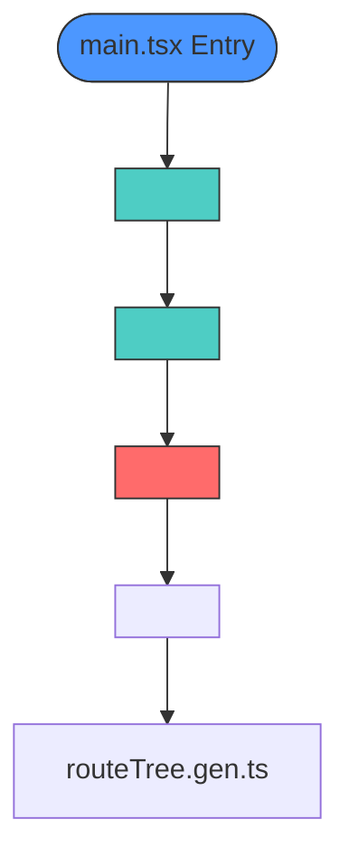
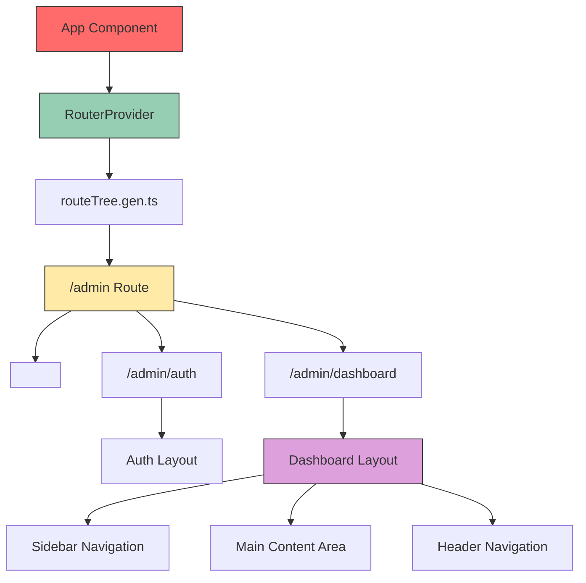
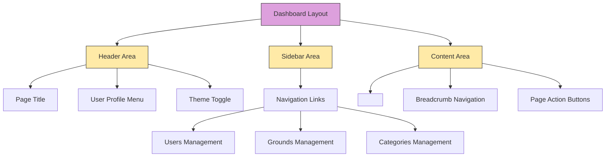
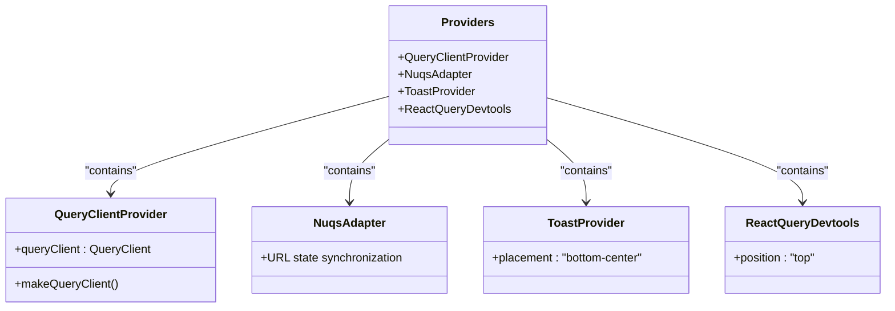
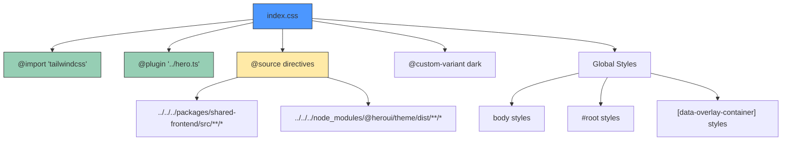
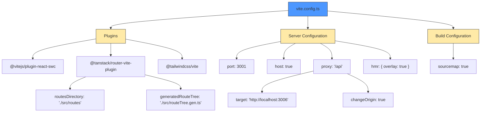
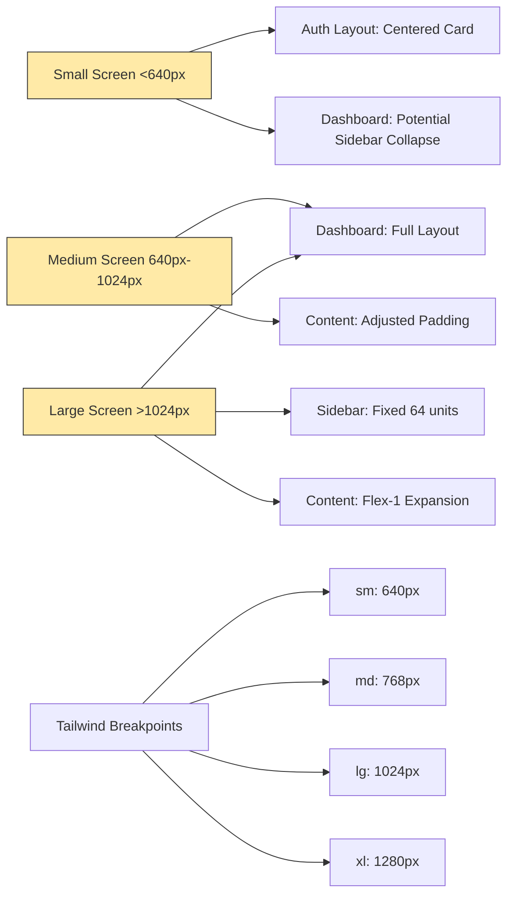
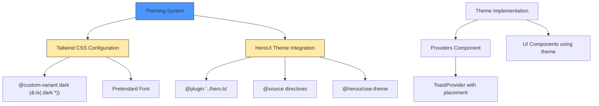
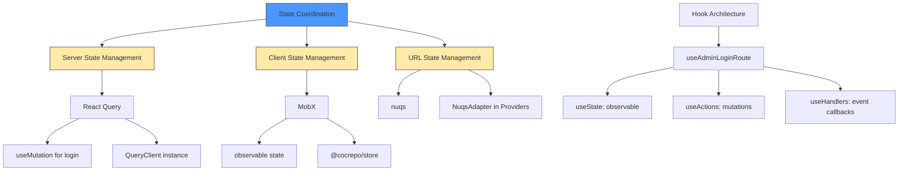

# Layout and Component Architecture

<cite>
**Referenced Files in This Document**   
- [main.tsx](file://apps/admin/src/main.tsx)
- [App.tsx](file://apps/admin/src/App.tsx)
- [Providers.tsx](file://apps/admin/src/providers/Providers.tsx)
- [index.css](file://apps/admin/src/index.css)
- [vite.config.ts](file://apps/admin/vite.config.ts)
- [admin.tsx](file://apps/admin/src/routes/admin.tsx)
- [dashboard.tsx](file://apps/admin/src/routes/admin/dashboard.tsx)
- [auth.tsx](file://apps/admin/src/routes/admin/auth.tsx)
- [useAdminLoginRoute.ts](file://apps/admin/src/hooks/useAdminLoginRoute.ts)
</cite>

## Table of Contents
1. [Introduction](#introduction)
2. [Application Bootstrap Process](#application-bootstrap-process)
3. [Component Hierarchy and Routing Structure](#component-hierarchy-and-routing-structure)
4. [Layout Patterns and UI Organization](#layout-patterns-and-ui-organization)
5. [Global Providers and State Management](#global-providers-and-state-management)
6. [Styling Architecture with Tailwind CSS](#styling-architecture-with-tailwind-css)
7. [Build Configuration with Vite](#build-configuration-with-vite)
8. [Responsive Design and Screen Adaptation](#responsive-design-and-screen-adaptation)
9. [Theming and Dark Mode Implementation](#theming-and-dark-mode-implementation)
10. [State Coordination Across Top-Level Components](#state-coordination-across-top-level-components)

## Introduction
This document provides comprehensive architectural documentation for the admin frontend application in prj-core, focusing on the layout and component architecture. The documentation covers the application's bootstrap process, component hierarchy, layout patterns, global provider setup, styling approach, build configuration, responsive design considerations, theming implementation, and state coordination mechanisms. The admin interface follows a modern React architecture with TanStack Router for routing, MobX for state management, and Tailwind CSS for styling, integrated through a well-structured component hierarchy.

## Application Bootstrap Process

The admin application bootstraps through a well-defined initialization process that starts with the main.tsx entry point and establishes the foundational provider structure for the entire application. The bootstrap process ensures proper initialization of global state, routing, and dependency injection before rendering the main application component.

**Diagram sources**
- [main.tsx](file://apps/admin/src/main.tsx#L1-L17)
- [App.tsx](file://apps/admin/src/App.tsx#L1-L22)

**Section sources**
- [main.tsx](file://apps/admin/src/main.tsx#L1-L17)
- [App.tsx](file://apps/admin/src/App.tsx#L1-L22)

## Component Hierarchy and Routing Structure

The application follows a hierarchical component structure with a clear separation between routing, layout, and content components. The routing system is implemented using TanStack Router, which generates a type-safe route tree from the file-based routing structure. The component hierarchy establishes a clear parent-child relationship between layout containers and their content.

**Diagram sources**
- [App.tsx](file://apps/admin/src/App.tsx#L1-L22)
- [admin.tsx](file://apps/admin/src/routes/admin.tsx#L1-L6)
- [dashboard.tsx](file://apps/admin/src/routes/admin/dashboard.tsx#L1-L50)
- [auth.tsx](file://apps/admin/src/routes/admin/auth.tsx#L1-L16)

**Section sources**
- [App.tsx](file://apps/admin/src/App.tsx#L1-L22)
- [admin.tsx](file://apps/admin/src/routes/admin.tsx#L1-L6)
- [dashboard.tsx](file://apps/admin/src/routes/admin/dashboard.tsx#L1-L50)
- [auth.tsx](file://apps/admin/src/routes/admin/auth.tsx#L1-L16)

## Layout Patterns and UI Organization

The admin interface implements distinct layout patterns for different application contexts, with specialized layouts for authentication and dashboard views. The dashboard layout follows a standard admin pattern with a fixed header, collapsible sidebar navigation, and flexible content area. The authentication layout provides a centered, focused form experience optimized for login and tenant selection workflows.

**Diagram sources**
- [dashboard.tsx](file://apps/admin/src/routes/admin/dashboard.tsx#L1-L50)
- [auth.tsx](file://apps/admin/src/routes/admin/auth.tsx#L1-L16)

**Section sources**
- [dashboard.tsx](file://apps/admin/src/routes/admin/dashboard.tsx#L1-L50)
- [auth.tsx](file://apps/admin/src/routes/admin/auth.tsx#L1-L16)

## Global Providers and State Management

The application utilizes a comprehensive provider pattern to manage global state and services across the component tree. The Providers component composes multiple third-party and custom providers to establish a unified context for data fetching, URL state management, notifications, and development tools. This centralized provider approach ensures consistent access to shared functionality throughout the application.

**Diagram sources**
- [Providers.tsx](file://apps/admin/src/providers/Providers.tsx#L1-L38)

**Section sources**
- [Providers.tsx](file://apps/admin/src/providers/Providers.tsx#L1-L38)
- [main.tsx](file://apps/admin/src/main.tsx#L1-L17)

## Styling Architecture with Tailwind CSS

The styling architecture is built on Tailwind CSS with a customized configuration that extends the default theme and integrates with the HeroUI component library. The index.css file serves as the central styling entry point, importing Tailwind directives and establishing global styles for the application. The configuration includes custom variants for dark mode and source directives that scan component files for class usage.

**Diagram sources**
- [index.css](file://apps/admin/src/index.css#L1-L25)

**Section sources**
- [index.css](file://apps/admin/src/index.css#L1-L25)

## Build Configuration with Vite

The build process is configured using Vite with a specialized configuration that integrates essential plugins for routing, React development, and Tailwind CSS processing. The configuration establishes development server settings including port assignment, proxy configuration for API requests, and hot module replacement. The build settings include source map generation for debugging and production optimization.

**Diagram sources**
- [vite.config.ts](file://apps/admin/vite.config.ts#L1-L36)

**Section sources**
- [vite.config.ts](file://apps/admin/vite.config.ts#L1-L36)

## Responsive Design and Screen Adaptation

The admin interface implements responsive design principles to ensure optimal user experience across different screen sizes. The layout adapts to various viewport dimensions through strategic use of Tailwind CSS utility classes that control flexbox behavior, width constraints, and spacing. The authentication layout uses a centered card pattern that maintains readability on smaller screens, while the dashboard layout employs a responsive sidebar that could be adapted for mobile views.

**Section sources**
- [dashboard.tsx](file://apps/admin/src/routes/admin/dashboard.tsx#L1-L50)
- [auth.tsx](file://apps/admin/src/routes/admin/auth.tsx#L1-L16)
- [index.css](file://apps/admin/src/index.css#L1-L25)

## Theming and Dark Mode Implementation

The theming system is implemented through a combination of Tailwind CSS configuration and UI library integration. The dark mode functionality is enabled through a custom variant definition in the index.css file that targets elements within a dark class context. The HeroUI theme system is integrated via the hero.ts plugin and source directives that ensure proper theme application across components.

**Section sources**
- [index.css](file://apps/admin/src/index.css#L1-L25)
- [Providers.tsx](file://apps/admin/src/providers/Providers.tsx#L1-L38)
- [package.json](file://apps/admin/package.json#L1-L69)

## State Coordination Across Top-Level Components

State coordination across top-level components is achieved through a combination of React Query for server state, MobX for client state, and URL-based state management via nuqs. The useAdminLoginRoute hook demonstrates a sophisticated state management pattern that separates state, actions, and handlers into distinct concerns while maintaining type safety through TypeScript interfaces.

**Diagram sources**
- [useAdminLoginRoute.ts](file://apps/admin/src/hooks/useAdminLoginRoute.ts#L1-L77)
- [Providers.tsx](file://apps/admin/src/providers/Providers.tsx#L1-L38)

**Section sources**
- [useAdminLoginRoute.ts](file://apps/admin/src/hooks/useAdminLoginRoute.ts#L1-L77)
- [Providers.tsx](file://apps/admin/src/providers/Providers.tsx#L1-L38)
- [main.tsx](file://apps/admin/src/main.tsx#L1-L17)