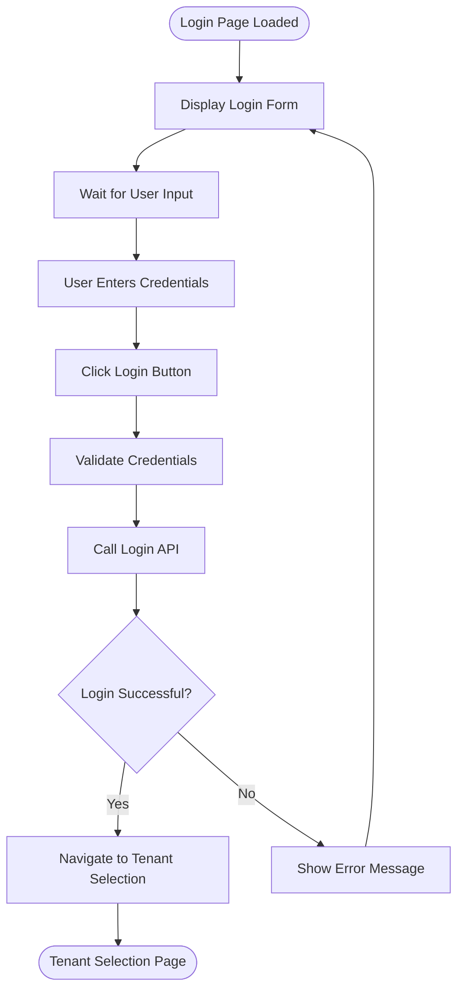
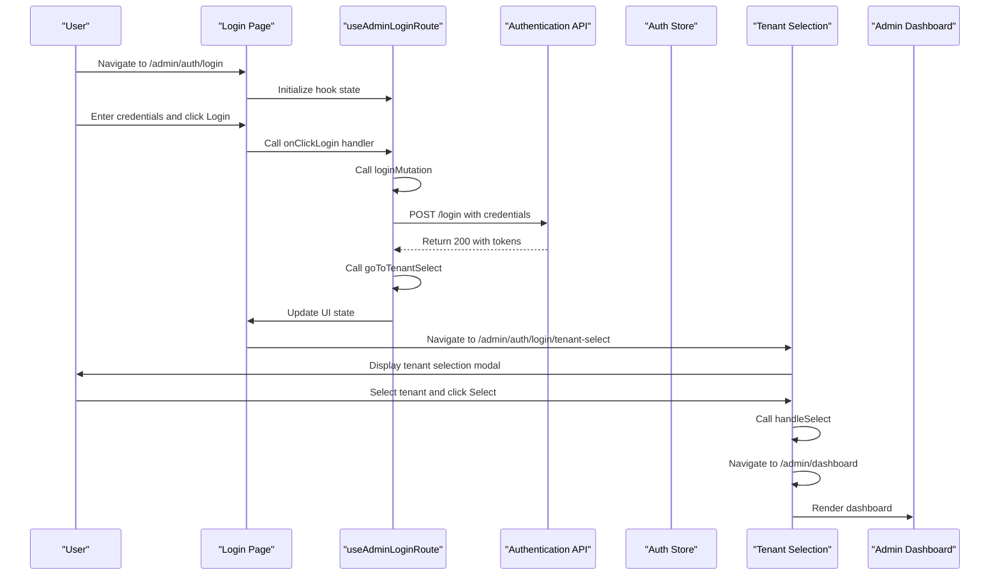

# Authentication Routes

<cite>
**Referenced Files in This Document**   
- [auth.tsx](file://apps/admin/src/routes/admin/auth.tsx)
- [login.tsx](file://apps/admin/src/routes/admin/auth/login.tsx)
- [tenant-select.tsx](file://apps/admin/src/routes/admin/auth/login/tenant-select.tsx)
- [useAdminLoginRoute.ts](file://apps/admin/src/hooks/useAdminLoginRoute.ts)
- [useAdminTenantSelectRoute.ts](file://apps/admin/src/hooks/useAdminTenantSelectRoute.ts)
- [authStore.ts](file://packages/store/src/stores/authStore.ts)
- [AdminAuthLoginPage.tsx](file://packages/ui/src/components/page/AdminAuthLoginPage.tsx)
- [AdminAuthTenantSelectPage.tsx](file://packages/ui/src/components/page/AdminAuthTenantSelectPage.tsx)
- [routeTree.gen.ts](file://apps/admin/src/routeTree.gen.ts)
</cite>

## Table of Contents
1. [Introduction](#introduction)
2. [Route Hierarchy and Structure](#route-hierarchy-and-structure)
3. [Login Workflow](#login-workflow)
4. [Tenant Selection Workflow](#tenant-selection-workflow)
5. [State Management and Session Handling](#state-management-and-session-handling)
6. [Route Guards and Access Control](#route-guards-and-access-control)
7. [Programmatic Navigation with Hooks](#programmatic-navigation-with-hooks)
8. [Error Handling in Authentication Flow](#error-handling-in-authentication-flow)
9. [Multi-tenancy Support](#multi-tenancy-support)
10. [Authentication Flow Sequence Diagram](#authentication-flow-sequence-diagram)

## Introduction

The admin authentication system implements a two-step authentication process for administrators, consisting of login and tenant selection workflows. This document details the routing structure under `/admin/auth`, the implementation of authentication pages, state management during the authentication flow, and how the system supports multi-tenancy through tenant selection. The system uses TanStack Router for routing, MobX for state management, and React Query for API interactions.

**Section sources**
- [auth.tsx](file://apps/admin/src/routes/admin/auth.tsx)
- [routeTree.gen.ts](file://apps/admin/src/routeTree.gen.ts)

## Route Hierarchy and Structure

The authentication routes are organized under the `/admin/auth` path with a hierarchical structure that supports the multi-step authentication process. The route tree shows a clear parent-child relationship between authentication components:

```mermaid
graph TD
A[/admin] --> B[/admin/auth]
B --> C[/admin/auth/login]
C --> D[/admin/auth/login/tenant-select]
```

The `/admin/auth` route serves as a layout route that provides a consistent container for authentication pages, centering content and applying a gray background. The login route (`/admin/auth/login`) is the entry point for authentication, and the tenant selection route (`/admin/auth/login/tenant-select`) is nested as a child of the login route, indicating it's part of the same authentication sequence.

The route configuration uses TanStack Router's file-based routing system, where each route file defines its component and path. The route tree is automatically generated in `routeTree.gen.ts`, which maps the file structure to route configurations.

**Diagram sources**
- [auth.tsx](file://apps/admin/src/routes/admin/auth.tsx)
- [login.tsx](file://apps/admin/src/routes/admin/auth/login.tsx)
- [tenant-select.tsx](file://apps/admin/src/routes/admin/auth/login/tenant-select.tsx)

**Section sources**
- [auth.tsx](file://apps/admin/src/routes/admin/auth.tsx)
- [routeTree.gen.ts](file://apps/admin/src/routeTree.gen.ts)

## Login Workflow

The login workflow begins at the `/admin/auth/login` route, which renders the login page component. The login process is managed through the `useAdminAuthLoginRoute` hook, which encapsulates the state, actions, and handlers for the login functionality.

The login page displays a form with email and password fields, pre-filled with default values for testing purposes. When the user clicks the login button, the `onClickLogin` handler is triggered, which calls the `loginMutation` to authenticate with the backend API. Upon successful authentication, the user is automatically redirected to the tenant selection page.

The login component is implemented as a MobX observer component, allowing it to reactively update when the underlying state changes. The UI is composed using shared components from the UI package, including the `LoginForm` and `Button` components.



**Diagram sources**
- [login.tsx](file://apps/admin/src/routes/admin/auth/login.tsx)
- [useAdminLoginRoute.ts](file://apps/admin/src/hooks/useAdminLoginRoute.ts)
- [AdminAuthLoginPage.tsx](file://packages/ui/src/components/page/AdminAuthLoginPage.tsx)

**Section sources**
- [login.tsx](file://apps/admin/src/routes/admin/auth/login.tsx)
- [useAdminLoginRoute.ts](file://apps/admin/src/hooks/useAdminLoginRoute.ts)
- [AdminAuthLoginPage.tsx](file://packages/ui/src/components/page/AdminAuthLoginPage.tsx)

## Tenant Selection Workflow

After successful authentication, users are directed to the tenant selection page at `/admin/auth/login/tenant-select`. This page presents a modal interface that allows administrators to select which tenant (organization or client) they want to access.

The tenant selection component uses a listbox UI element to display available tenants. In the current implementation, tenant data is mocked with three sample tenants: "서울 그라운드", "부산 그라운드", and "대구 그라운드". In a production environment, this data would be retrieved from the backend API based on the authenticated user's permissions.

When a user selects a tenant and clicks the "선택" (Select) button, the `handleSelect` function is called, which navigates to the admin dashboard. The selected tenant ID is not yet being sent to the backend in this implementation, but would typically be used to set the context for subsequent API requests.

The tenant selection page is implemented as a modal dialog that covers the entire screen, ensuring the user must make a selection before accessing the application. This design prevents users from bypassing the tenant selection step.

**Section sources**
- [tenant-select.tsx](file://apps/admin/src/routes/admin/auth/login/tenant-select.tsx)
- [AdminAuthTenantSelectPage.tsx](file://packages/ui/src/components/page/AdminAuthTenantSelectPage.tsx)

## State Management and Session Handling

The authentication flow uses MobX for state management, with observable state objects that track form inputs and UI state. The `useAdminLoginRoute` hook creates an observable state object that contains the login form data, including email and password fields.

For session management, the application uses the `authStore` from the shared store package, which tracks authentication status through the `isAuthenticated` computed property. This property checks whether the access token has expired by consulting the `tokenStore`. The authentication state is used by the root route to determine whether to redirect users to the dashboard or the login page.

When a user logs in successfully, the backend sets HTTP-only cookies containing the access and refresh tokens. These tokens are automatically included in subsequent API requests by the browser. The `authStore` monitors token expiration and can trigger token refresh operations when needed.

The state management approach separates concerns between UI state (managed by component hooks) and application state (managed by the global store). This allows the authentication UI to be decoupled from the underlying authentication mechanism while still responding to authentication state changes.

**Section sources**
- [useAdminLoginRoute.ts](file://apps/admin/src/hooks/useAdminLoginRoute.ts)
- [useAdminTenantSelectRoute.ts](file://apps/admin/src/hooks/useAdminTenantSelectRoute.ts)
- [authStore.ts](file://packages/store/src/stores/authStore.ts)

## Route Guards and Access Control

The authentication system implements route guards to prevent unauthorized access to protected routes. The primary mechanism is the `authStore`'s `isAuthenticated` property, which is checked by the root route to determine navigation.

When an unauthenticated user attempts to access the root path, they are redirected to `/admin/auth/login`. Similarly, when an authenticated user accesses the root path, they are redirected to `/admin/dashboard`. This ensures that users cannot bypass the authentication process.

On the server side, the application uses NestJS guards including `JwtAuthGuard` and `PublicGuard` to protect API endpoints. The `JwtAuthGuard` verifies JWT tokens for protected routes, while the `PublicGuard` allows access to public routes like the login endpoint. These guards are implemented using NestJS's decorator-based approach, with the `@Public()` decorator marking routes that don't require authentication.

The client-side route guards work in conjunction with server-side guards to provide a comprehensive security model. Even if a user attempts to navigate directly to a protected route, the server will reject unauthorized API requests, providing defense in depth.

**Section sources**
- [authStore.ts](file://packages/store/src/stores/authStore.ts)
- [index.tsx](file://apps/admin/src/routes/index.tsx)
- [jwt.auth-guard.ts](file://apps/server/src/shared/guard/jwt.auth-guard.ts)
- [public.guard.ts](file://apps/server/src/shared/guard/public.guard.ts)

## Programmatic Navigation with Hooks

The authentication system uses custom hooks to enable programmatic navigation between authentication states. Two key hooks are provided: `useAdminLoginRoute` and `useAdminTenantSelectRoute`.

The `useAdminLoginRoute` hook provides a structured interface for the login functionality, exposing state, actions, and handlers through a single object. The `actions` object contains the `goToTenantSelect` function, which uses `useNavigate` from TanStack Router to programmatically navigate to the tenant selection page after successful login.

These hooks follow a pattern of separating concerns into state, actions, and handlers:
- **State**: Observable data that represents the current UI state
- **Actions**: Functions that perform operations like API calls and navigation
- **Handlers**: Event handlers that respond to user interactions

This pattern makes the code more maintainable and testable, as each concern is isolated. The hooks can be easily mocked in tests, and their dependencies are clearly defined.

The `useAdminTenantSelectRoute` hook follows a similar pattern, though it is currently simpler as it only manages the selection state and navigation to the dashboard.

**Section sources**
- [useAdminLoginRoute.ts](file://apps/admin/src/hooks/useAdminLoginRoute.ts)
- [useAdminTenantSelectRoute.ts](file://apps/admin/src/hooks/useAdminTenantSelectRoute.ts)

## Error Handling in Authentication Flow

The authentication flow includes error handling for various failure scenarios. When the login API call fails, the `onClickLogin` handler catches the error and extracts the error message from the response. The error handling specifically checks if the error is an Axios error using `isAxiosError`, which helps distinguish between different types of errors.

Currently, the error message is thrown, which would typically be caught by an error boundary or displayed to the user. In a complete implementation, this would trigger a user-visible error message indicating why the login failed (e.g., invalid credentials).

The system also handles authentication errors at the store level through the `handleAuthError` method in `authStore`. When an API response has a 401 status code (unauthorized), the user is redirected to the login page. This handles cases where the user's session has expired or been invalidated.

The logout process includes error handling to ensure that users are always redirected to the login page, even if the logout API call fails. This prevents users from being stuck in an inconsistent state.

**Section sources**
- [useAdminLoginRoute.ts](file://apps/admin/src/hooks/useAdminLoginRoute.ts)
- [authStore.ts](file://packages/store/src/stores/authStore.ts)

## Multi-tenancy Support

The authentication system supports multi-tenancy through the tenant selection mechanism. After successful login, administrators must select which tenant they want to access, allowing a single user account to manage multiple organizations or clients.

The tenant selection process is implemented as a dedicated step in the authentication flow, ensuring that users explicitly choose their context before accessing the application. This design prevents accidental access to the wrong tenant's data.

In the backend, the `AuthController` retrieves the user's associated tenants during login and identifies the main tenant. This information could be used to pre-select a default tenant or to filter the available tenants in the selection interface.

The multi-tenancy model is reflected in the UI through the use of tenant-specific terminology like "그라운드" (Ground), which suggests a physical location or organizational unit. The system is designed to scale to multiple tenants, with the selection interface capable of displaying a list of available options.

Future enhancements could include features like tenant search, filtering, or recently accessed tenants to improve the user experience when managing many tenants.

**Section sources**
- [tenant-select.tsx](file://apps/admin/src/routes/admin/auth/login/tenant-select.tsx)
- [auth.controller.ts](file://apps/server/src/shared/controller/domains/auth.controller.ts)
- [AdminAuthTenantSelectPage.tsx](file://packages/ui/src/components/page/AdminAuthTenantSelectPage.tsx)

## Authentication Flow Sequence Diagram

The following sequence diagram illustrates the complete authentication flow from login to dashboard access:



**Diagram sources**
- [login.tsx](file://apps/admin/src/routes/admin/auth/login.tsx)
- [useAdminLoginRoute.ts](file://apps/admin/src/hooks/useAdminLoginRoute.ts)
- [tenant-select.tsx](file://apps/admin/src/routes/admin/auth/login/tenant-select.tsx)
- [auth.controller.ts](file://apps/server/src/shared/controller/domains/auth.controller.ts)

**Section sources**
- [login.tsx](file://apps/admin/src/routes/admin/auth/login.tsx)
- [useAdminLoginRoute.ts](file://apps/admin/src/hooks/useAdminLoginRoute.ts)
- [tenant-select.tsx](file://apps/admin/src/routes/admin/auth/login/tenant-select.tsx)