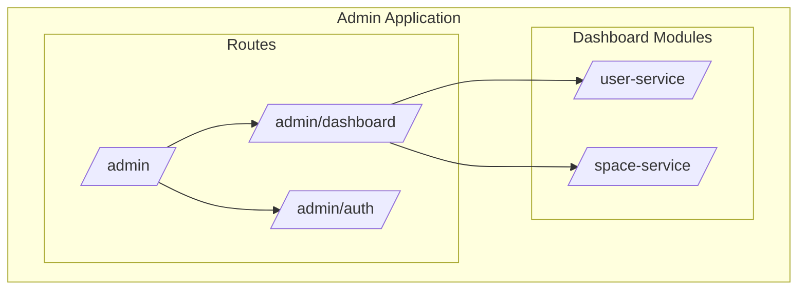
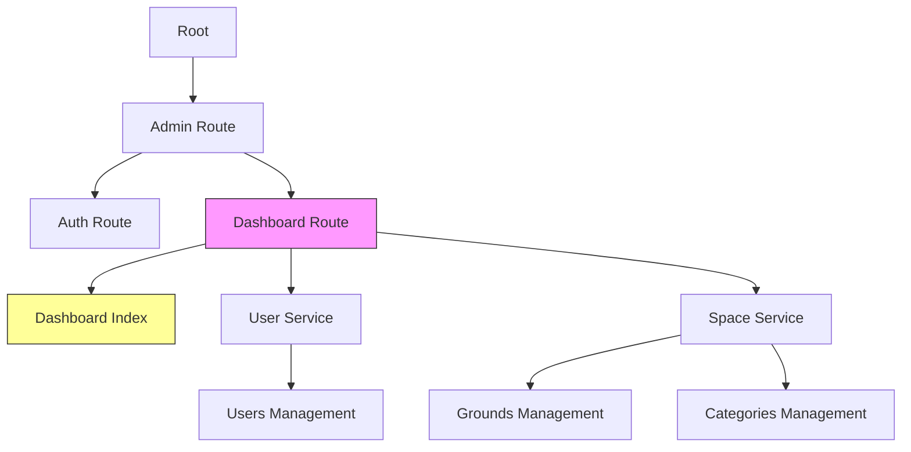
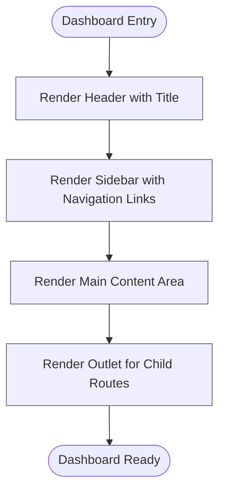
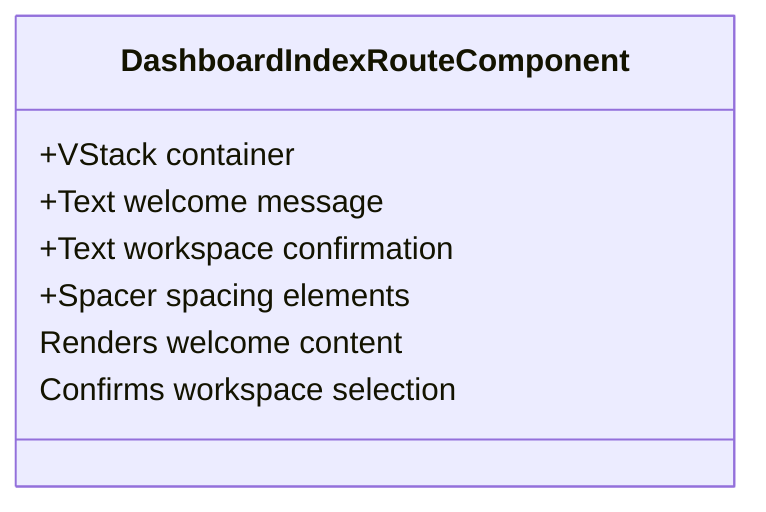
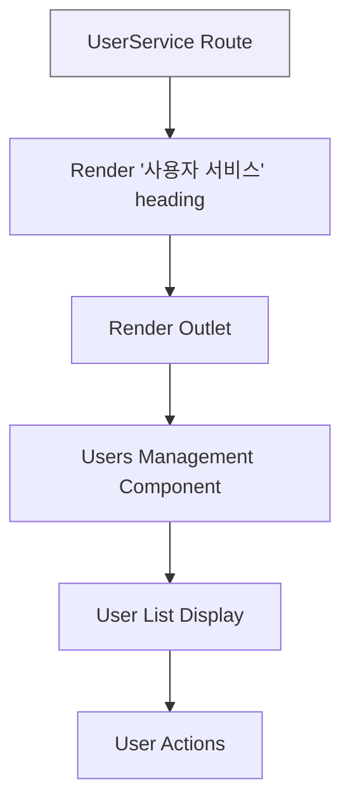
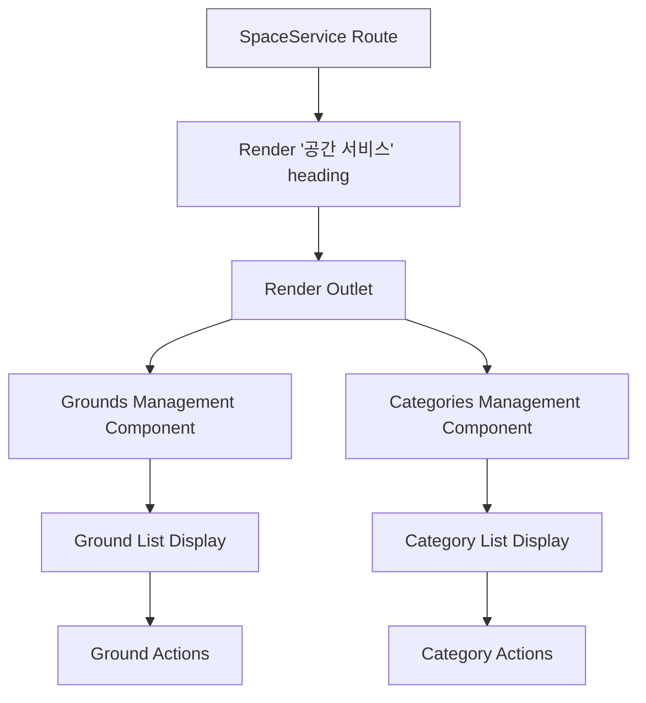
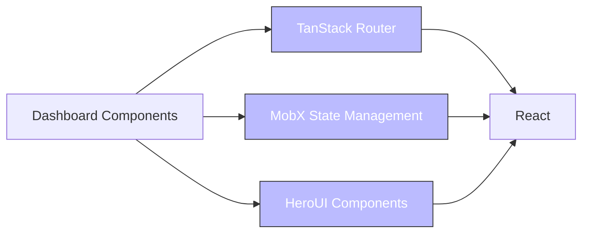

# Dashboard Overview

<cite>
**Referenced Files in This Document**   
- [dashboard.tsx](file://apps/admin/src/routes/admin/dashboard.tsx)
- [index.tsx](file://apps/admin/src/routes/admin/dashboard/index.tsx)
- [routeTree.gen.ts](file://apps/admin/src/routeTree.gen.ts)
- [App.tsx](file://apps/admin/src/App.tsx)
- [main.tsx](file://apps/admin/src/main.tsx)
- [Providers.tsx](file://apps/admin/src/providers/Providers.tsx)
- [index.tsx](file://apps/admin/src/routes/index.tsx)
- [auth.tsx](file://apps/admin/src/routes/admin/auth.tsx)
- [login.tsx](file://apps/admin/src/routes/admin/auth/login.tsx)
- [useAdminLoginRoute.ts](file://apps/admin/src/hooks/useAdminLoginRoute.ts)
- [useAdminTenantSelectRoute.ts](file://apps/admin/src/hooks/useAdminTenantSelectRoute.ts)
- [userService.tsx](file://apps/admin/src/routes/admin/dashboard/user-service.tsx)
- [space-service.tsx](file://apps/admin/src/routes/admin/dashboard/space-service.tsx)
</cite>

## Table of Contents
1. [Introduction](#introduction)
2. [Project Structure](#project-structure)
3. [Core Components](#core-components)
4. [Architecture Overview](#architecture-overview)
5. [Detailed Component Analysis](#detailed-component-analysis)
6. [Dependency Analysis](#dependency-analysis)
7. [Performance Considerations](#performance-considerations)
8. [Troubleshooting Guide](#troubleshooting-guide)
9. [Conclusion](#conclusion)

## Introduction
The Dashboard Overview documentation provides a comprehensive analysis of the main dashboard landing page in the admin application. This dashboard serves as the central hub after user authentication, providing navigation to various service modules within the protected admin area. The documentation covers the layout structure, key UI components, navigation elements, routing configuration, and integration with the overall application shell. It also details the component composition and state management patterns used in rendering the dashboard overview.

## Project Structure
The admin application follows a structured routing pattern using TanStack Router, with the dashboard located within the admin routes. The dashboard is organized into service modules (user-service and space-service) that provide access to different administrative functions.

**Diagram sources**
- [routeTree.gen.ts](file://apps/admin/src/routeTree.gen.ts)
- [admin.tsx](file://apps/admin/src/routes/admin.tsx)

**Section sources**
- [routeTree.gen.ts](file://apps/admin/src/routeTree.gen.ts#L1-L572)
- [admin.tsx](file://apps/admin/src/routes/admin.tsx#L1-L6)

## Core Components
The dashboard overview consists of several core components that work together to provide a cohesive user experience. These include the main dashboard layout, service module containers, and the index route that displays the welcome content. The components are built using React with TanStack Router for routing and MobX for state management.

**Section sources**
- [dashboard.tsx](file://apps/admin/src/routes/admin/dashboard.tsx#L1-L50)
- [index.tsx](file://apps/admin/src/routes/admin/dashboard/index.tsx#L1-L26)
- [userService.tsx](file://apps/admin/src/routes/admin/dashboard/user-service.tsx#L1-L17)

## Architecture Overview
The dashboard architecture follows a hierarchical routing pattern where the main dashboard route serves as a container for service modules. The application uses a provider pattern to manage global state and services, with the dashboard acting as the default entry point for authenticated users.

**Diagram sources**
- [App.tsx](file://apps/admin/src/App.tsx#L1-L22)
- [routeTree.gen.ts](file://apps/admin/src/routeTree.gen.ts#L1-L572)

## Detailed Component Analysis

### Dashboard Layout Analysis
The dashboard layout provides a consistent interface with a top navigation bar and a sidebar for service module navigation. The layout uses a flex-based design to create a responsive interface that adapts to different screen sizes.

**Diagram sources**
- [dashboard.tsx](file://apps/admin/src/routes/admin/dashboard.tsx#L1-L50)

**Section sources**
- [dashboard.tsx](file://apps/admin/src/routes/admin/dashboard.tsx#L1-L50)

### Dashboard Index Analysis
The dashboard index component displays a welcome message and confirmation that the workspace has been successfully selected. This serves as the default view when users navigate to the dashboard root path.

**Diagram sources**
- [index.tsx](file://apps/admin/src/routes/admin/dashboard/index.tsx#L1-L26)

**Section sources**
- [index.tsx](file://apps/admin/src/routes/admin/dashboard/index.tsx#L1-L26)

### Service Module Analysis
The dashboard organizes functionality into service modules, each with its own routing context and UI container. This modular approach allows for scalable growth of administrative features.

#### User Service Module

**Diagram sources**
- [userService.tsx](file://apps/admin/src/routes/admin/dashboard/user-service.tsx#L1-L17)

#### Space Service Module

**Diagram sources**
- [space-service.tsx](file://apps/admin/src/routes/admin/dashboard/space-service.tsx#L1-L15)

**Section sources**
- [userService.tsx](file://apps/admin/src/routes/admin/dashboard/user-service.tsx#L1-L17)
- [space-service.tsx](file://apps/admin/src/routes/admin/dashboard/space-service.tsx#L1-L15)

## Dependency Analysis
The dashboard components have clear dependencies on routing, state management, and UI libraries. The architecture follows a clean separation of concerns with well-defined interfaces between components.

**Diagram sources**
- [App.tsx](file://apps/admin/src/App.tsx#L1-L22)
- [Providers.tsx](file://apps/admin/src/providers/Providers.tsx#L1-L36)

**Section sources**
- [App.tsx](file://apps/admin/src/App.tsx#L1-L22)
- [Providers.tsx](file://apps/admin/src/providers/Providers.tsx#L1-L36)

## Performance Considerations
The dashboard implementation follows performance best practices by using React's component-based architecture and TanStack Router's code splitting capabilities. The use of MobX for state management ensures efficient re-renders only when necessary. The modular service structure allows for lazy loading of components, improving initial load times.

## Troubleshooting Guide
When troubleshooting dashboard issues, consider the following common scenarios:
- Authentication state not properly reflected in routing
- Service module routes not rendering correctly
- Navigation links not working as expected
- State management issues with MobX observables

**Section sources**
- [useAdminLoginRoute.ts](file://apps/admin/src/hooks/useAdminLoginRoute.ts#L1-L77)
- [useAdminTenantSelectRoute.ts](file://apps/admin/src/hooks/useAdminTenantSelectRoute.ts#L1-L27)
- [login.tsx](file://apps/admin/src/routes/admin/auth/login.tsx#L1-L89)

## Conclusion
The dashboard overview provides a comprehensive analysis of the main dashboard landing page in the admin application. The dashboard serves as the central hub after user authentication, offering a well-structured interface for accessing various administrative functions. The implementation follows modern React patterns with TanStack Router for routing and MobX for state management, creating a scalable and maintainable architecture. The modular service structure allows for easy expansion of functionality while maintaining a consistent user experience.