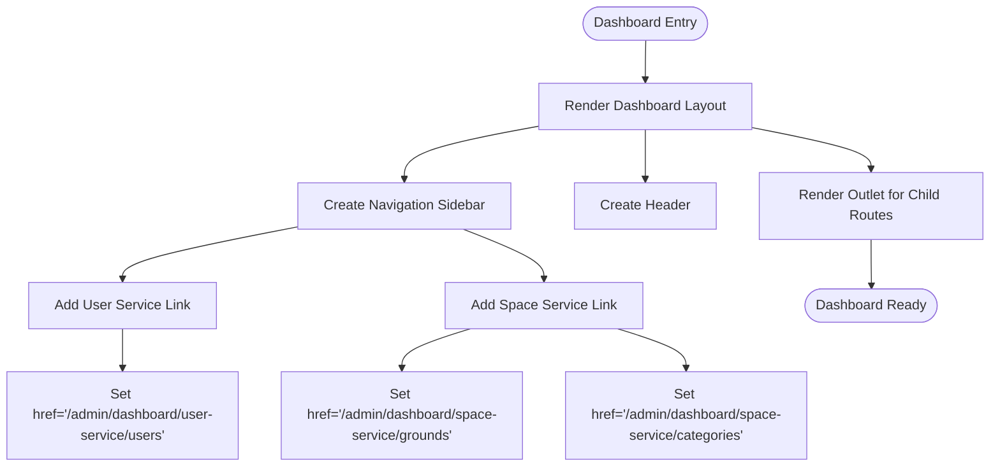
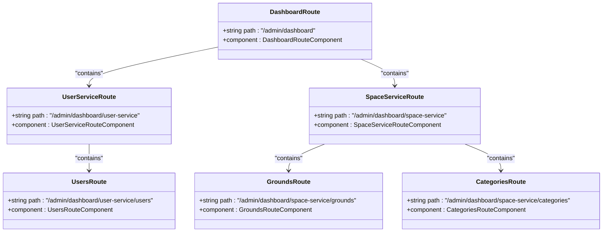
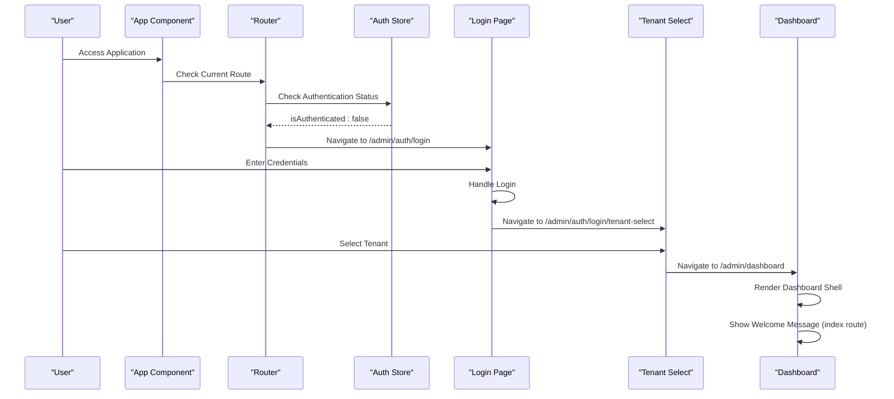
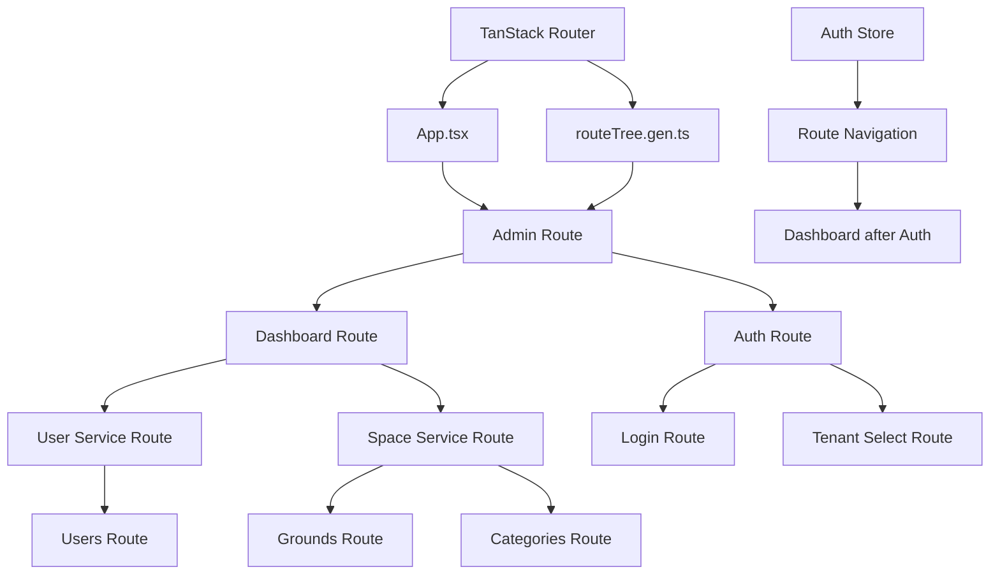

# Dashboard Routes

<cite>
**Referenced Files in This Document**   
- [dashboard.tsx](file://apps/admin/src/routes/admin/dashboard.tsx)
- [index.tsx](file://apps/admin/src/routes/admin/dashboard/index.tsx)
- [users.tsx](file://apps/admin/src/routes/admin/dashboard/user-service/users.tsx)
- [grounds.tsx](file://apps/admin/src/routes/admin/dashboard/space-service/grounds.tsx)
- [categories.tsx](file://apps/admin/src/routes/admin/dashboard/space-service/categories.tsx)
- [routeTree.gen.ts](file://apps/admin/src/routeTree.gen.ts)
- [App.tsx](file://apps/admin/src/App.tsx)
- [admin.tsx](file://apps/admin/src/routes/admin.tsx)
- [index.tsx](file://apps/admin/src/routes/index.tsx)
- [auth.tsx](file://apps/admin/src/routes/admin/auth.tsx)
- [login.tsx](file://apps/admin/src/routes/admin/auth/login.tsx)
- [tenant-select.tsx](file://apps/admin/src/routes/admin/auth/login/tenant-select.tsx)
</cite>

## Table of Contents
1. [Introduction](#introduction)
2. [Project Structure](#project-structure)
3. [Core Components](#core-components)
4. [Architecture Overview](#architecture-overview)
5. [Detailed Component Analysis](#detailed-component-analysis)
6. [Dependency Analysis](#dependency-analysis)
7. [Performance Considerations](#performance-considerations)
8. [Troubleshooting Guide](#troubleshooting-guide)
9. [Conclusion](#conclusion)

## Introduction
The admin dashboard routing system provides the main application shell for authenticated users, organizing functionality into service modules under the `/admin/dashboard` path. This document details the structure, navigation patterns, and integration between route definitions and UI components that render the dashboard content.

## Project Structure
The admin dashboard routes are organized within the `apps/admin/src/routes/admin/dashboard` directory, with primary modules for `space-service` and `user-service`. The routing system uses TanStack Router for route configuration and navigation.

```mermaid
graph TD
A[/admin] --> B[/admin/dashboard]
A --> C[/admin/auth]
B --> D[/admin/dashboard/user-service]
B --> E[/admin/dashboard/space-service]
D --> F[/admin/dashboard/user-service/users]
E --> G[/admin/dashboard/space-service/grounds]
E --> H[/admin/dashboard/space-service/categories]
C --> I[/admin/auth/login]
C --> J[/admin/auth/login/tenant-select]
B --> K[/admin/dashboard/]
```

**Diagram sources**
- [routeTree.gen.ts](file://apps/admin/src/routeTree.gen.ts)

**Section sources**
- [routeTree.gen.ts](file://apps/admin/src/routeTree.gen.ts)

## Core Components
The dashboard routing system consists of several core components that work together to provide a structured navigation experience. The main dashboard component serves as the application shell, while service modules organize functionality into logical groupings.

**Section sources**
- [dashboard.tsx](file://apps/admin/src/routes/admin/dashboard.tsx)
- [App.tsx](file://apps/admin/src/App.tsx)

## Architecture Overview
The routing architecture follows a hierarchical structure with the `/admin` route as the root, containing both authentication and dashboard routes. After authentication, users are directed to the dashboard which serves as the main application shell.

```mermaid
graph TD
Root[/] --> Admin[/admin]
Admin --> Auth[/admin/auth]
Admin --> Dashboard[/admin/dashboard]
Dashboard --> UserService[/admin/dashboard/user-service]
Dashboard --> SpaceService[/admin/dashboard/space-service]
UserService --> Users[/admin/dashboard/user-service/users]
SpaceService --> Grounds[/admin/dashboard/space-service/grounds]
SpaceService --> Categories[/admin/dashboard/space-service/categories]
Auth --> Login[/admin/auth/login]
Auth --> TenantSelect[/admin/auth/login/tenant-select]
style Dashboard fill:#f9f,stroke:#333
style UserService fill:#bbf,stroke:#333
style SpaceService fill:#bbf,stroke:#333
```

**Diagram sources**
- [routeTree.gen.ts](file://apps/admin/src/routeTree.gen.ts)
- [admin.tsx](file://apps/admin/src/routes/admin.tsx)

## Detailed Component Analysis

### Dashboard Shell Analysis
The dashboard component provides the main application shell with a consistent layout including navigation sidebar and content area. It uses the `Outlet` component to render child routes.



**Diagram sources**
- [dashboard.tsx](file://apps/admin/src/routes/admin/dashboard.tsx)

**Section sources**
- [dashboard.tsx](file://apps/admin/src/routes/admin/dashboard.tsx)

### Route Composition and Service Modules
The dashboard routes are composed of service modules that organize functionality into logical groupings. The `user-service` and `space-service` modules provide dedicated areas for managing users and spaces respectively.



**Diagram sources**
- [routeTree.gen.ts](file://apps/admin/src/routeTree.gen.ts)
- [dashboard.tsx](file://apps/admin/src/routes/admin/dashboard.tsx)

**Section sources**
- [routeTree.gen.ts](file://apps/admin/src/routeTree.gen.ts)
- [dashboard.tsx](file://apps/admin/src/routes/admin/dashboard.tsx)

### Navigation Flow Analysis
The navigation flow from authentication to the dashboard landing page follows a specific sequence, with tenant selection as an intermediate step.



**Diagram sources**
- [App.tsx](file://apps/admin/src/App.tsx)
- [index.tsx](file://apps/admin/src/routes/index.tsx)
- [tenant-select.tsx](file://apps/admin/src/routes/admin/auth/login/tenant-select.tsx)
- [dashboard.tsx](file://apps/admin/src/routes/admin/dashboard.tsx)

**Section sources**
- [App.tsx](file://apps/admin/src/App.tsx)
- [index.tsx](file://apps/admin/src/routes/index.tsx)
- [tenant-select.tsx](file://apps/admin/src/routes/admin/auth/login/tenant-select.tsx)

## Dependency Analysis
The dashboard routing system has dependencies on several key components and libraries, forming a cohesive navigation structure.



**Diagram sources**
- [App.tsx](file://apps/admin/src/App.tsx)
- [routeTree.gen.ts](file://apps/admin/src/routeTree.gen.ts)
- [index.tsx](file://apps/admin/src/routes/index.tsx)

**Section sources**
- [App.tsx](file://apps/admin/src/App.tsx)
- [routeTree.gen.ts](file://apps/admin/src/routeTree.gen.ts)
- [index.tsx](file://apps/admin/src/routes/index.tsx)

## Performance Considerations
The routing system is designed with performance in mind, using code splitting and lazy loading patterns to optimize initial load times. Route configurations are generated automatically, reducing the potential for configuration errors.

## Troubleshooting Guide
When troubleshooting dashboard routing issues, check the following:
- Ensure the user is properly authenticated
- Verify the tenant has been selected
- Check that route configurations in `routeTree.gen.ts` are correctly generated
- Confirm that the `Outlet` component is present in parent routes to render child routes

**Section sources**
- [App.tsx](file://apps/admin/src/App.tsx)
- [dashboard.tsx](file://apps/admin/src/routes/admin/dashboard.tsx)
- [routeTree.gen.ts](file://apps/admin/src/routeTree.gen.ts)

## Conclusion
The admin dashboard routing system provides a well-structured navigation experience with clear separation of concerns between service modules. The use of TanStack Router enables type-safe routing with automatic code generation, while the hierarchical structure makes it easy to extend with additional service modules as needed. The dashboard serves as the main application shell after authentication, with a consistent layout and navigation pattern across all service areas.