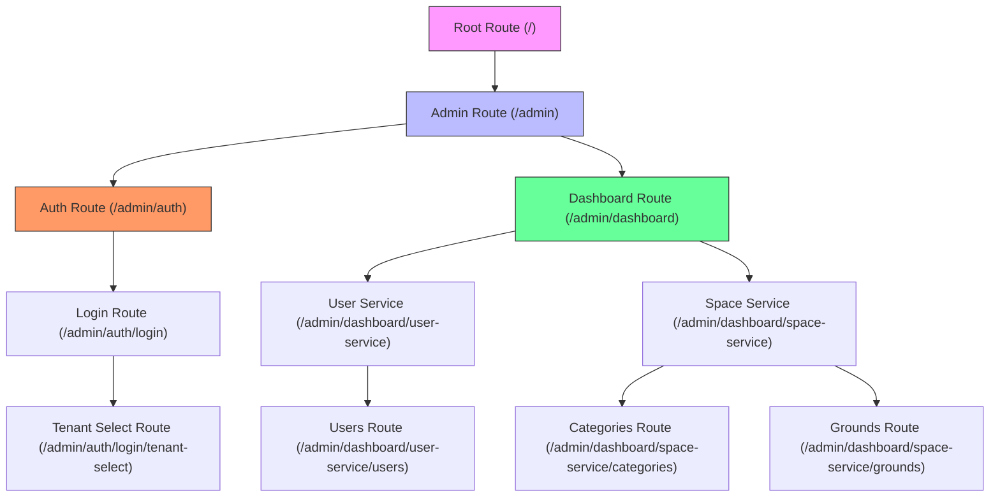
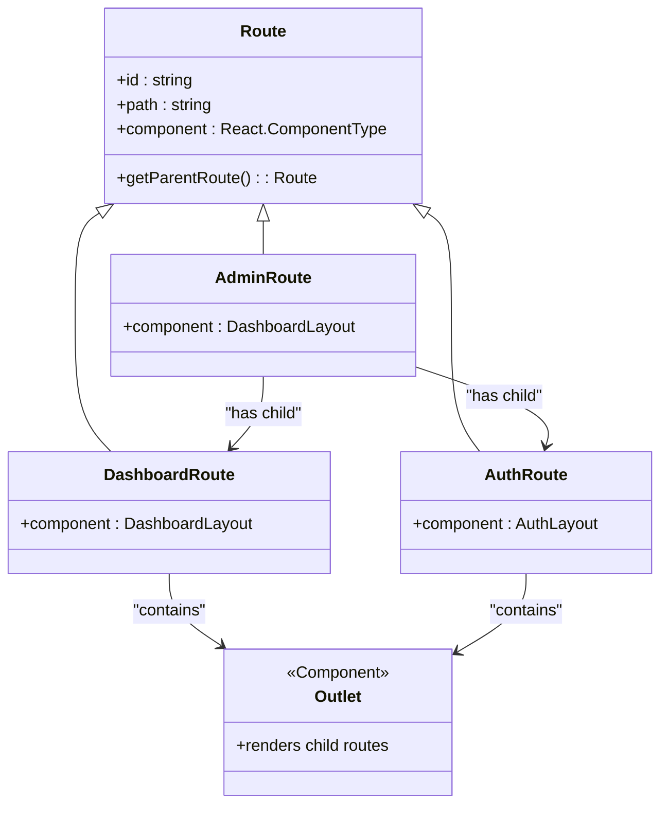
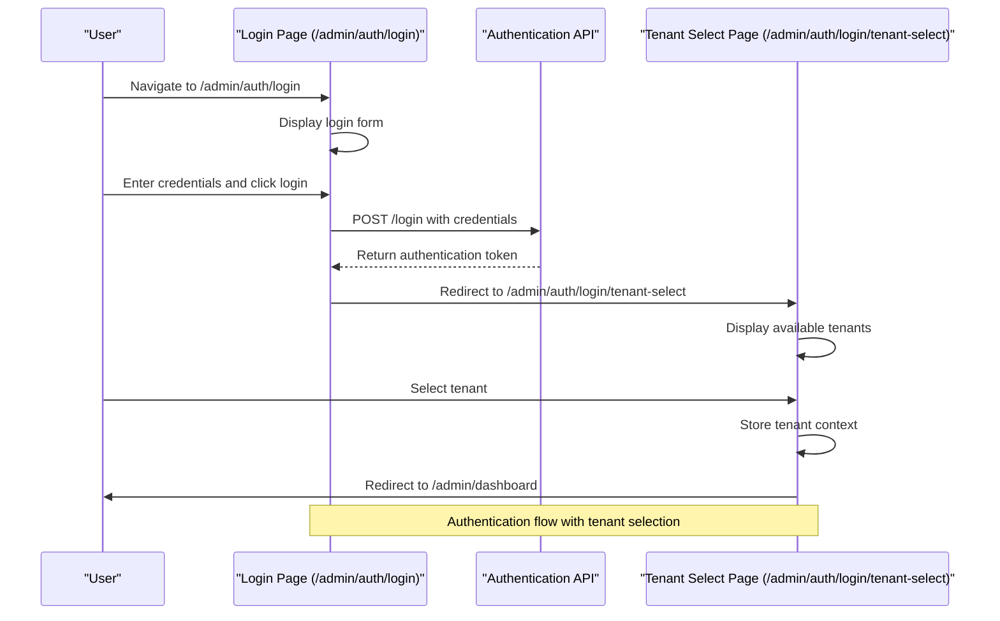
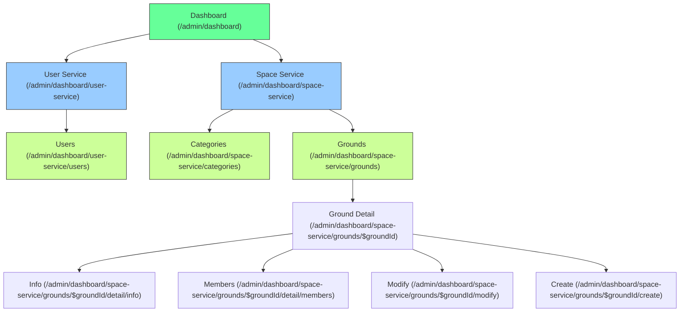
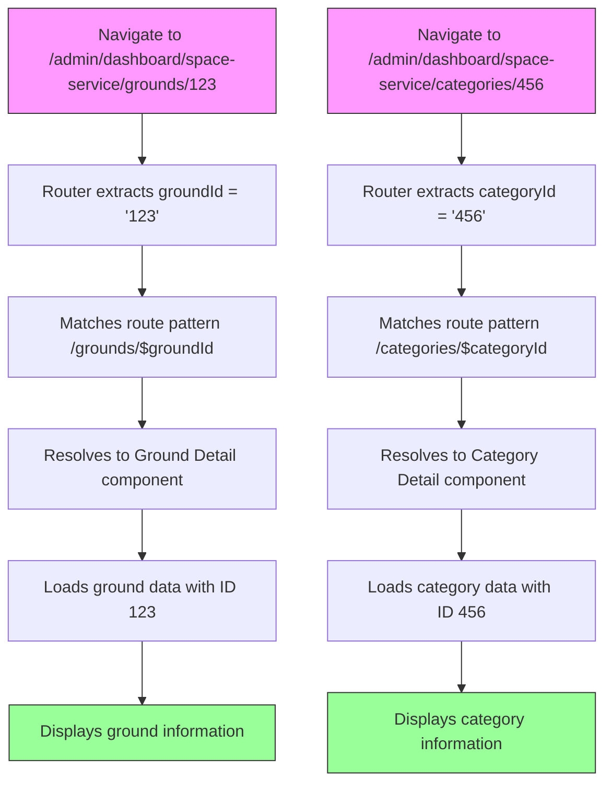
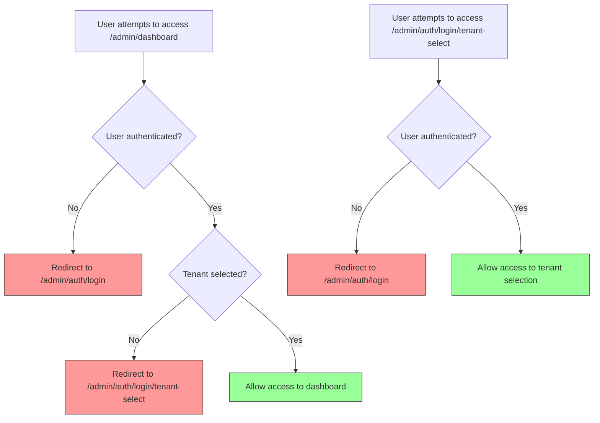

# Routing Structure

<cite>
**Referenced Files in This Document**   
- [routeTree.gen.ts](file://apps/admin/src/routeTree.gen.ts)
- [admin.tsx](file://apps/admin/src/routes/admin.tsx)
- [dashboard.tsx](file://apps/admin/src/routes/admin/dashboard.tsx)
- [auth.tsx](file://apps/admin/src/routes/admin/auth.tsx)
- [login.tsx](file://apps/admin/src/routes/admin/auth/login.tsx)
- [tenant-select.tsx](file://apps/admin/src/routes/admin/auth/login/tenant-select.tsx)
- [users.tsx](file://apps/admin/src/routes/admin/dashboard/user-service/users.tsx)
- [categories.tsx](file://apps/admin/src/routes/admin/dashboard/space-service/categories.tsx)
- [grounds.tsx](file://apps/admin/src/routes/admin/dashboard/space-service/grounds.tsx)
- [useAdminLoginRoute.ts](file://apps/admin/src/hooks/useAdminLoginRoute.ts)
- [useAdminTenantSelectRoute.ts](file://apps/admin/src/hooks/useAdminTenantSelectRoute.ts)
- [App.tsx](file://apps/admin/src/App.tsx)
- [index.tsx](file://apps/admin/src/routes/admin/dashboard/index.tsx)
- [$categoryId.tsx](file://apps/admin/src/routes/admin/dashboard/space-service/categories/$categoryId.tsx)
- [$groundId.tsx](file://apps/admin/src/routes/admin/dashboard/space-service/grounds/$groundId.tsx)
</cite>

## Table of Contents
1. [Introduction](#introduction)
2. [Routing Architecture](#routing-architecture)
3. [Route Tree Structure](#route-tree-structure)
4. [Authentication Flow](#authentication-flow)
5. [Dashboard Route Structure](#dashboard-route-structure)
6. [Dynamic Route Parameters](#dynamic-route-parameters)
7. [Route Guards and Access Control](#route-guards-and-access-control)
8. [Custom Navigation Hooks](#custom-navigation-hooks)
9. [Conclusion](#conclusion)

## Introduction
The admin frontend routing system in prj-core is built on TanStack Router, providing a type-safe and hierarchical routing structure for the admin application. The system organizes routes under the `/admin` path with two primary sections: authentication (`/admin/auth`) and dashboard (`/admin/dashboard`). This document explains the routing architecture, authentication flow, dashboard structure, dynamic routing, and programmatic navigation mechanisms.

**Section sources**
- [App.tsx](file://apps/admin/src/App.tsx#L1-L22)
- [routeTree.gen.ts](file://apps/admin/src/routeTree.gen.ts#L1-L572)

## Routing Architecture
The routing system is based on TanStack Router, which generates a type-safe route tree from the file structure. The main entry point is defined in `App.tsx`, where the generated `routeTree` is used to create a router instance that is provided to the application via `RouterProvider`.

The route hierarchy begins with the root route, which contains two main children: the index route (`/`) and the admin route (`/admin`). The admin route serves as the parent for all admin-specific functionality, with two primary branches: authentication and dashboard.



**Diagram sources**
- [App.tsx](file://apps/admin/src/App.tsx#L1-L22)
- [routeTree.gen.ts](file://apps/admin/src/routeTree.gen.ts#L1-L572)

**Section sources**
- [admin.tsx](file://apps/admin/src/routes/admin.tsx#L1-L6)
- [auth.tsx](file://apps/admin/src/routes/admin/auth.tsx#L1-L16)
- [dashboard.tsx](file://apps/admin/src/routes/admin/dashboard.tsx#L1-L50)

## Route Tree Structure
The route tree is automatically generated by TanStack Router based on the file structure in the `routes` directory. The `routeTree.gen.ts` file contains the complete route configuration, defining parent-child relationships, paths, and IDs for all routes.

The system uses a nested route structure where parent routes render an `Outlet` component to display their children. This allows for shared layouts and consistent UI elements across related routes. For example, the admin route provides a common structure for all admin pages, while the dashboard route includes a sidebar navigation menu that persists across dashboard sub-routes.



**Diagram sources**
- [routeTree.gen.ts](file://apps/admin/src/routeTree.gen.ts#L1-L572)
- [admin.tsx](file://apps/admin/src/routes/admin.tsx#L1-L6)
- [dashboard.tsx](file://apps/admin/src/routes/admin/dashboard.tsx#L1-L50)

**Section sources**
- [routeTree.gen.ts](file://apps/admin/src/routeTree.gen.ts#L1-L572)
- [admin.tsx](file://apps/admin/src/routes/admin.tsx#L1-L6)

## Authentication Flow
The authentication flow consists of two sequential steps: login and tenant selection. Users first access the login page at `/admin/auth/login`, where they enter their credentials. Upon successful authentication, they are redirected to the tenant selection page at `/admin/auth/login/tenant-select`, where they choose which tenant (workspace) to access.

The login process is handled by the `useAdminAuthLoginRoute` hook, which manages form state and API communication with the authentication service. After successful login, the user is automatically redirected to the tenant selection page, ensuring a seamless authentication experience.



**Diagram sources**
- [login.tsx](file://apps/admin/src/routes/admin/auth/login.tsx#L1-L89)
- [tenant-select.tsx](file://apps/admin/src/routes/admin/auth/login/tenant-select.tsx#L1-L53)
- [useAdminLoginRoute.ts](file://apps/admin/src/hooks/useAdminLoginRoute.ts#L1-L77)

**Section sources**
- [login.tsx](file://apps/admin/src/routes/admin/auth/login.tsx#L1-L89)
- [tenant-select.tsx](file://apps/admin/src/routes/admin/auth/login/tenant-select.tsx#L1-L53)

## Dashboard Route Structure
The dashboard section provides administrative functionality organized into two main service areas: user-service and space-service. The dashboard layout includes a persistent sidebar navigation that allows users to switch between these services.

The user-service focuses on user management, with the primary route at `/admin/dashboard/user-service/users` displaying a list of users. The space-service manages organizational spaces (grounds) and categories, with routes for viewing, creating, and modifying these entities.



**Diagram sources**
- [dashboard.tsx](file://apps/admin/src/routes/admin/dashboard.tsx#L1-L50)
- [users.tsx](file://apps/admin/src/routes/admin/dashboard/user-service/users.tsx#L1-L44)
- [categories.tsx](file://apps/admin/src/routes/admin/dashboard/space-service/categories.tsx)
- [grounds.tsx](file://apps/admin/src/routes/admin/dashboard/space-service/grounds.tsx)

**Section sources**
- [dashboard.tsx](file://apps/admin/src/routes/admin/dashboard.tsx#L1-L50)
- [users.tsx](file://apps/admin/src/routes/admin/dashboard/user-service/users.tsx#L1-L44)

## Dynamic Route Parameters
The routing system supports dynamic route parameters using the `$parameterName` syntax. Two primary dynamic parameters are used in the application: `$categoryId` for category-specific routes and `$groundId` for ground-specific routes.

These dynamic parameters allow the application to create reusable route templates that can display different content based on the parameter value. For example, the route `/admin/dashboard/space-service/grounds/$groundId` can display information about any ground by substituting the actual ground ID in the URL.



**Diagram sources**
- [routeTree.gen.ts](file://apps/admin/src/routeTree.gen.ts#L98-L109)
- [$categoryId.tsx](file://apps/admin/src/routes/admin/dashboard/space-service/categories/$categoryId.tsx)
- [$groundId.tsx](file://apps/admin/src/routes/admin/dashboard/space-service/grounds/$groundId.tsx)

**Section sources**
- [routeTree.gen.ts](file://apps/admin/src/routeTree.gen.ts#L98-L109)
- [$categoryId.tsx](file://apps/admin/src/routes/admin/dashboard/space-service/categories/$categoryId.tsx)
- [$groundId.tsx](file://apps/admin/src/routes/admin/dashboard/space-service/grounds/$groundId.tsx)

## Route Guards and Access Control
The routing system implements role-based access control through programmatic navigation and conditional rendering. While explicit route guards are not implemented in the route definitions, access control is enforced through the application logic in custom hooks and components.

The authentication flow ensures that users cannot access the dashboard without first logging in and selecting a tenant. The `useNavigate` hook is used to redirect users to appropriate routes based on their authentication state and permissions.



**Diagram sources**
- [useAdminLoginRoute.ts](file://apps/admin/src/hooks/useAdminLoginRoute.ts#L1-L77)
- [login.tsx](file://apps/admin/src/routes/admin/auth/login.tsx#L1-L89)
- [tenant-select.tsx](file://apps/admin/src/routes/admin/auth/login/tenant-select.tsx#L1-L53)

**Section sources**
- [useAdminLoginRoute.ts](file://apps/admin/src/hooks/useAdminLoginRoute.ts#L1-L77)
- [login.tsx](file://apps/admin/src/routes/admin/auth/login.tsx#L1-L89)

## Custom Navigation Hooks
The application provides custom hooks for programmatic navigation within the admin context. These hooks encapsulate navigation logic and state management, making it easier to handle complex navigation patterns.

The `useAdminLoginRoute` hook manages the login process, including form state, API communication, and navigation to the tenant selection page after successful authentication. Similarly, the `useAdminTenantSelectRoute` hook handles tenant selection state and navigation to the dashboard upon tenant selection.

```mermaid
classDiagram
class useAdminLoginRoute {
+state : { loginForm : { email, password } }
+actions : { loginMutation, goToTenantSelect }
+handlers : { onClickLogin }
+returns : { state, actions, handlers }
}
class useAdminTenantSelectRoute {
+state : { listbox : { selectedTenantId } }
+handlers : { onClickSelect }
+returns : { state, handlers }
}
class useNavigate {
+navigate(to : string) : void
}
useAdminLoginRoute --> useNavigate : "uses"
useAdminTenantSelectRoute --> useNavigate : "uses"
useAdminLoginRoute --> "login" : "API call"
note right of useAdminLoginRoute
Manages login form state and
navigation to tenant selection
end note
note right of useAdminTenantSelectRoute
Manages tenant selection state
and navigation to dashboard
end note
```

**Diagram sources**
- [useAdminLoginRoute.ts](file://apps/admin/src/hooks/useAdminLoginRoute.ts#L1-L77)
- [useAdminTenantSelectRoute.ts](file://apps/admin/src/hooks/useAdminTenantSelectRoute.ts#L1-L27)

**Section sources**
- [useAdminLoginRoute.ts](file://apps/admin/src/hooks/useAdminLoginRoute.ts#L1-L77)
- [useAdminTenantSelectRoute.ts](file://apps/admin/src/hooks/useAdminTenantSelectRoute.ts#L1-L27)

## Conclusion
The admin frontend routing system in prj-core provides a well-structured, type-safe navigation framework using TanStack Router. The system organizes functionality into logical sections under the `/admin` path, with clear separation between authentication and dashboard features. The nested route structure enables shared layouts and consistent user experience, while dynamic parameters support reusable components for entity-specific views. Access control is implemented through programmatic navigation in custom hooks, ensuring users follow the proper authentication flow before accessing protected resources. The use of custom navigation hooks simplifies complex navigation patterns and centralizes state management for key user journeys.