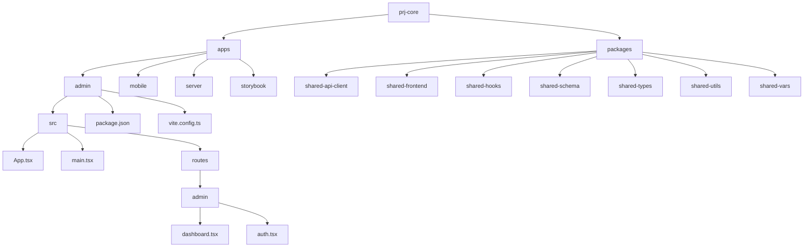
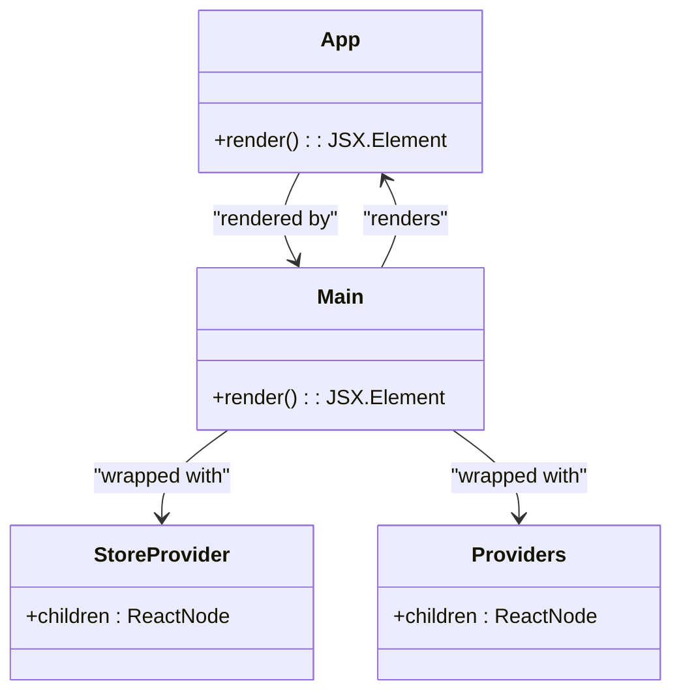
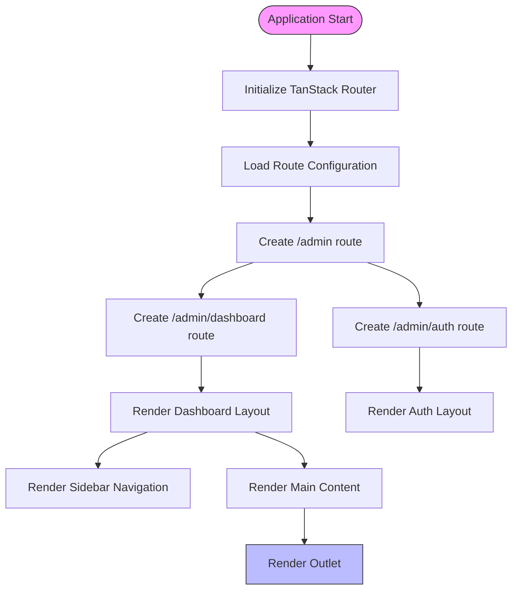
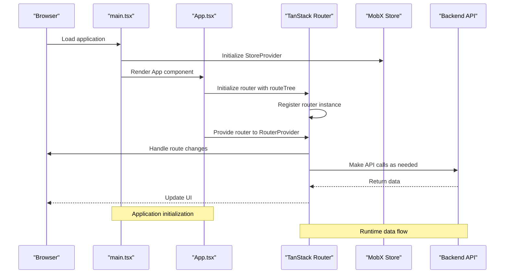

# Frontend Architecture

<cite>
**Referenced Files in This Document**   
- [App.tsx](file://apps/admin/src/App.tsx)
- [main.tsx](file://apps/admin/src/main.tsx)
- [admin.tsx](file://apps/admin/src/routes/admin.tsx)
- [dashboard.tsx](file://apps/admin/src/routes/admin/dashboard.tsx)
- [auth.tsx](file://apps/admin/src/routes/admin/auth.tsx)
- [vite.config.ts](file://apps/admin/vite.config.ts)
- [package.json](file://apps/admin/package.json)
</cite>

## Table of Contents
1. [Introduction](#introduction)
2. [Project Structure](#project-structure)
3. [Core Components](#core-components)
4. [Architecture Overview](#architecture-overview)
5. [Detailed Component Analysis](#detailed-component-analysis)
6. [Dependency Analysis](#dependency-analysis)
7. [Performance Considerations](#performance-considerations)
8. [Troubleshooting Guide](#troubleshooting-guide)
9. [Conclusion](#conclusion)

## Introduction
The prj-core frontend architecture consists of two primary applications: an admin interface built with React and a mobile application built with React Native. This document provides comprehensive documentation of the frontend architecture, focusing on the React-based admin interface. The architecture employs component-based design patterns with React, utilizes the provider pattern for state management, and establishes clear system boundaries between UI components, state management, and API clients.

## Project Structure



**Diagram sources**
- [apps/admin/src/App.tsx](file://apps/admin/src/App.tsx)
- [apps/admin/package.json](file://apps/admin/package.json)

**Section sources**
- [apps/admin/package.json](file://apps/admin/package.json)
- [apps/admin/vite.config.ts](file://apps/admin/vite.config.ts)

## Core Components

The admin application is built using React with TypeScript, leveraging modern frontend technologies and patterns. The core components include the main application entry point, routing system, and layout components. The architecture follows a component-based approach with clear separation of concerns between different parts of the application.

Key architectural decisions include the use of TanStack Router for routing, MobX for state management, and Tailwind CSS for styling. The application is structured around a provider pattern that wraps the entire application with necessary context providers for state management and other services.

**Section sources**
- [apps/admin/src/App.tsx](file://apps/admin/src/App.tsx)
- [apps/admin/src/main.tsx](file://apps/admin/src/main.tsx)

## Architecture Overview

```mermaid
graph TD
A[Admin Frontend] --> B[TanStack Router]
A --> C[MobX State Management]
A --> D[Tailwind CSS]
A --> E[API Client]
B --> F[Route Configuration]
C --> G[Store Provider]
E --> H[Backend API]
F --> I[/admin]
F --> J[/admin/dashboard]
F --> K[/admin/auth]
I --> L[Layout Component]
J --> M[Dashboard Layout]
K --> N[Auth Layout]
style A fill:#f9f,stroke:#333
style H fill:#bbf,stroke:#333
```

**Diagram sources**
- [apps/admin/src/App.tsx](file://apps/admin/src/App.tsx)
- [apps/admin/src/routes/admin.tsx](file://apps/admin/src/routes/admin.tsx)
- [apps/admin/src/routes/admin/dashboard.tsx](file://apps/admin/src/routes/admin/dashboard.tsx)
- [apps/admin/src/routes/admin/auth.tsx](file://apps/admin/src/routes/admin/auth.tsx)

## Detailed Component Analysis

### Admin Application Analysis

The admin application follows a modern React architecture with several key components working together to provide a robust user interface for administrative functions.

#### Application Entry Point


**Diagram sources**
- [apps/admin/src/main.tsx](file://apps/admin/src/main.tsx)
- [apps/admin/src/App.tsx](file://apps/admin/src/App.tsx)

#### Routing Architecture


**Diagram sources**
- [apps/admin/src/App.tsx](file://apps/admin/src/App.tsx)
- [apps/admin/src/routes/admin.tsx](file://apps/admin/src/routes/admin.tsx)
- [apps/admin/src/routes/admin/dashboard.tsx](file://apps/admin/src/routes/admin/dashboard.tsx)
- [apps/admin/src/routes/admin/auth.tsx](file://apps/admin/src/routes/admin/auth.tsx)

### Component Interactions and Data Flows



**Diagram sources**
- [apps/admin/src/main.tsx](file://apps/admin/src/main.tsx)
- [apps/admin/src/App.tsx](file://apps/admin/src/App.tsx)
- [apps/admin/src/routes/admin.tsx](file://apps/admin/src/routes/admin.tsx)

**Section sources**
- [apps/admin/src/App.tsx](file://apps/admin/src/App.tsx)
- [apps/admin/src/main.tsx](file://apps/admin/src/main.tsx)
- [apps/admin/src/routes/admin.tsx](file://apps/admin/src/routes/admin.tsx)
- [apps/admin/src/routes/admin/dashboard.tsx](file://apps/admin/src/routes/admin/dashboard.tsx)
- [apps/admin/src/routes/admin/auth.tsx](file://apps/admin/src/routes/admin/auth.tsx)

## Dependency Analysis

```mermaid
graph LR
A[Admin App] --> B[@tanstack/react-router]
A --> C[mobx-react-lite]
A --> D[@cocrepo/store]
A --> E[tailwindcss]
A --> F[react]
A --> G[axios]
B --> H[Routing System]
C --> I[State Management]
D --> J[Shared Store]
E --> K[Styling]
F --> L[UI Framework]
G --> M[API Client]
style A fill:#f9f,stroke:#333
```

**Diagram sources**
- [apps/admin/package.json](file://apps/admin/package.json)

**Section sources**
- [apps/admin/package.json](file://apps/admin/package.json)
- [apps/admin/vite.config.ts](file://apps/admin/vite.config.ts)

## Performance Considerations

The frontend architecture incorporates several performance optimizations:

1. **Code Splitting**: The routing system enables code splitting by route, reducing initial bundle size
2. **Development Server Proxy**: Vite configuration includes proxy settings to streamline development
3. **Build Optimization**: Production builds include sourcemaps for debugging while maintaining optimized output
4. **Component-Based Architecture**: Enables efficient rendering and reusability of UI components

The Vite build tool provides fast development server startup and hot module replacement, while the production build is optimized for performance. The use of modern React patterns and libraries ensures efficient rendering and state management.

**Section sources**
- [apps/admin/vite.config.ts](file://apps/admin/vite.config.ts)

## Troubleshooting Guide

Common issues and solutions for the frontend architecture:

1. **Routing Issues**: Ensure routeTree.gen.ts is properly generated and imported in App.tsx
2. **State Management Problems**: Verify StoreProvider is properly wrapped around the application
3. **Styling Issues**: Check that Tailwind CSS plugin is properly configured in vite.config.ts
4. **API Connection Problems**: Verify proxy settings in vite.config.ts point to the correct backend server

Development scripts are provided in package.json for common tasks including development server startup, building for production, type checking, linting, and formatting.

**Section sources**
- [apps/admin/package.json](file://apps/admin/package.json)
- [apps/admin/vite.config.ts](file://apps/admin/vite.config.ts)

## Conclusion

The prj-core frontend architecture demonstrates a well-structured approach to building modern React applications. The admin interface leverages component-based architecture with React, implements the provider pattern for state management through MobX, and establishes clear system boundaries between UI components, state management, and API clients.

Key technical decisions include the use of TanStack Router for routing, which provides type-safe routing with file-based route configuration, and the integration of Tailwind CSS for utility-first styling. The architecture is designed for scalability, with a clear separation of concerns and reusable components.

The mobile application, built with React Native, follows similar architectural patterns, ensuring consistency across platforms. The shared components and utilities across the monorepo structure promote code reuse and maintainability.

Future considerations include further optimization of bundle sizes, implementation of more advanced state management patterns, and enhanced testing strategies to ensure application reliability.