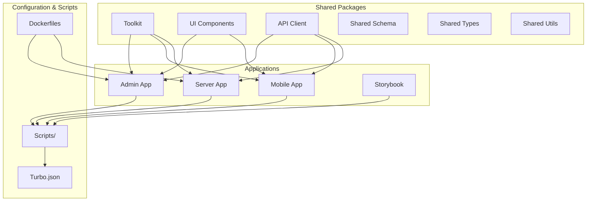
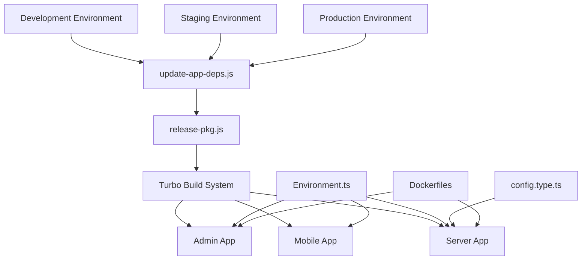
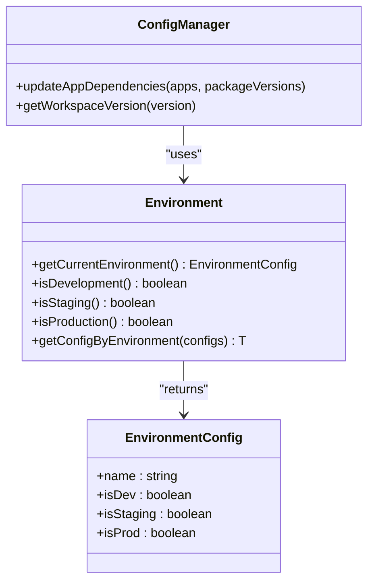
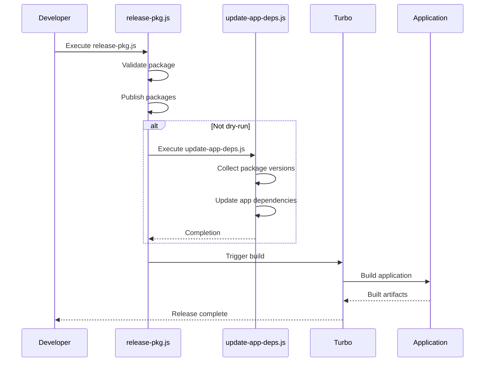
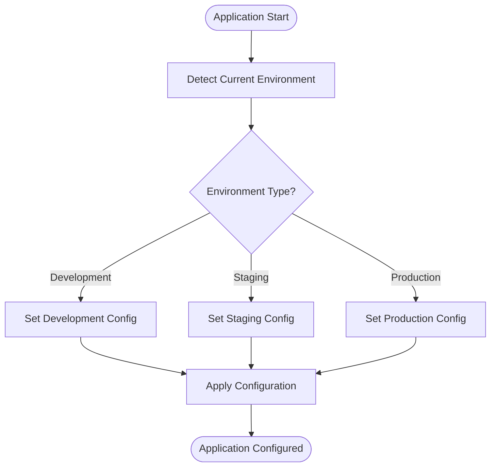
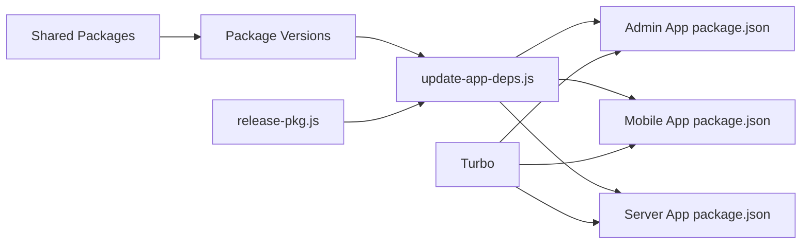

# Application Configuration

<cite>
**Referenced Files in This Document**   
- [package.json](file://package.json)
- [scripts/update-app-deps.js](file://scripts/update-app-deps.js)
- [scripts/release-pkg.js](file://scripts/release-pkg.js)
- [apps/server/src/shared/config/config.type.ts](file://apps/server/src/shared/config/config.type.ts)
- [packages/toolkit/src/Environment.ts](file://packages/toolkit/src/Environment.ts)
- [devops/Dockerfile.admin](file://devops/Dockerfile.admin)
</cite>

## Table of Contents
1. [Introduction](#introduction)
2. [Project Structure](#project-structure)
3. [Core Components](#core-components)
4. [Architecture Overview](#architecture-overview)
5. [Detailed Component Analysis](#detailed-component-analysis)
6. [Dependency Analysis](#dependency-analysis)
7. [Performance Considerations](#performance-considerations)
8. [Troubleshooting Guide](#troubleshooting-guide)
9. [Conclusion](#conclusion)

## Introduction
The mobile application configuration system within this repository appears to be managed through a monorepo architecture with shared tooling and configuration patterns. While direct mobile configuration files such as app.json, babel.config.js, metro.config.js, and Podfile.properties.json are not present in the expected locations, the configuration system is implemented through shared utilities, build scripts, and environment management patterns across the workspace. The configuration approach leverages Turbo for task orchestration, shared packages for environment detection, and centralized scripts for dependency and release management.

## Project Structure
The repository follows a monorepo structure with multiple applications and shared packages. The mobile application is expected to be located in the apps/mobile directory, but the configuration files typically associated with Expo or React Native projects are not present. Instead, configuration is managed through shared scripts and packages that coordinate across the entire workspace.

**Diagram sources**
- [package.json](file://package.json)
- [turbo.json](file://turbo.json)
- [scripts/update-app-deps.js](file://scripts/update-app-deps.js)

**Section sources**
- [package.json](file://package.json)
- [turbo.json](file://turbo.json)

## Core Components
The core configuration components in this repository are implemented through shared scripts and utility packages rather than traditional mobile configuration files. The system relies on Turbo for task orchestration, custom scripts for dependency management, and shared environment utilities for configuration across different deployment stages.

**Section sources**
- [scripts/update-app-deps.js](file://scripts/update-app-deps.js)
- [scripts/release-pkg.js](file://scripts/release-pkg.js)
- [packages/toolkit/src/Environment.ts](file://packages/toolkit/src/Environment.ts)

## Architecture Overview
The configuration architecture follows a centralized pattern where shared scripts and packages provide consistent configuration across all applications in the monorepo. Environment-specific configuration is handled through shared utilities, while build and release processes are orchestrated through Turbo and custom Node.js scripts.

**Diagram sources**
- [scripts/update-app-deps.js](file://scripts/update-app-deps.js)
- [scripts/release-pkg.js](file://scripts/release-pkg.js)
- [packages/toolkit/src/Environment.ts](file://packages/toolkit/src/Environment.ts)
- [apps/server/src/shared/config/config.type.ts](file://apps/server/src/shared/config/config.type.ts)
- [devops/Dockerfile.admin](file://devops/Dockerfile.admin)

## Detailed Component Analysis

### Configuration Management System
The configuration system in this repository is implemented through a combination of shared scripts and utility functions rather than traditional configuration files. The approach centralizes configuration logic in reusable components that can be shared across all applications in the monorepo.

#### Environment Configuration

**Diagram sources**
- [packages/toolkit/src/Environment.ts](file://packages/toolkit/src/Environment.ts)
- [scripts/update-app-deps.js](file://scripts/update-app-deps.js)

#### Build and Release Orchestration

**Diagram sources**
- [scripts/release-pkg.js](file://scripts/release-pkg.js)
- [scripts/update-app-deps.js](file://scripts/update-app-deps.js)
- [package.json](file://package.json)

### Environment Management
The environment management system provides utilities for detecting the current environment and retrieving environment-specific configuration values. This approach allows for consistent environment handling across all applications in the monorepo.

**Diagram sources**
- [packages/toolkit/src/Environment.ts](file://packages/toolkit/src/Environment.ts)

**Section sources**
- [packages/toolkit/src/Environment.ts](file://packages/toolkit/src/Environment.ts)

## Dependency Analysis
The dependency management system in this repository is centralized through shared scripts that update dependencies across all applications. This ensures consistency in package versions and simplifies the release process.

**Diagram sources**
- [scripts/update-app-deps.js](file://scripts/update-app-deps.js)
- [scripts/release-pkg.js](file://scripts/release-pkg.js)
- [package.json](file://package.json)

**Section sources**
- [scripts/update-app-deps.js](file://scripts/update-app-deps.js)
- [scripts/release-pkg.js](file://scripts/release-pkg.js)
- [package.json](file://package.json)

## Performance Considerations
The configuration system is designed for maintainability and consistency across the monorepo rather than optimized for mobile-specific performance. The use of shared scripts and utilities reduces duplication but may introduce overhead in the build process. The Turbo build system helps mitigate this by providing efficient task orchestration and caching.

## Troubleshooting Guide
Common configuration issues in this system typically relate to dependency synchronization and environment detection. The centralized configuration approach reduces the likelihood of configuration drift but requires careful management of the shared scripts and utilities.

**Section sources**
- [scripts/update-app-deps.js](file://scripts/update-app-deps.js)
- [scripts/release-pkg.js](file://scripts/release-pkg.js)
- [packages/toolkit/src/Environment.ts](file://packages/toolkit/src/Environment.ts)

## Conclusion
The mobile application configuration system in this repository takes an unconventional approach by centralizing configuration logic in shared scripts and utilities rather than relying on traditional mobile configuration files. This approach provides consistency across the monorepo and simplifies dependency management, but may require additional documentation and training for developers accustomed to standard Expo or React Native configuration patterns. The system leverages Turbo for build orchestration, custom Node.js scripts for dependency and release management, and shared TypeScript utilities for environment detection and configuration.