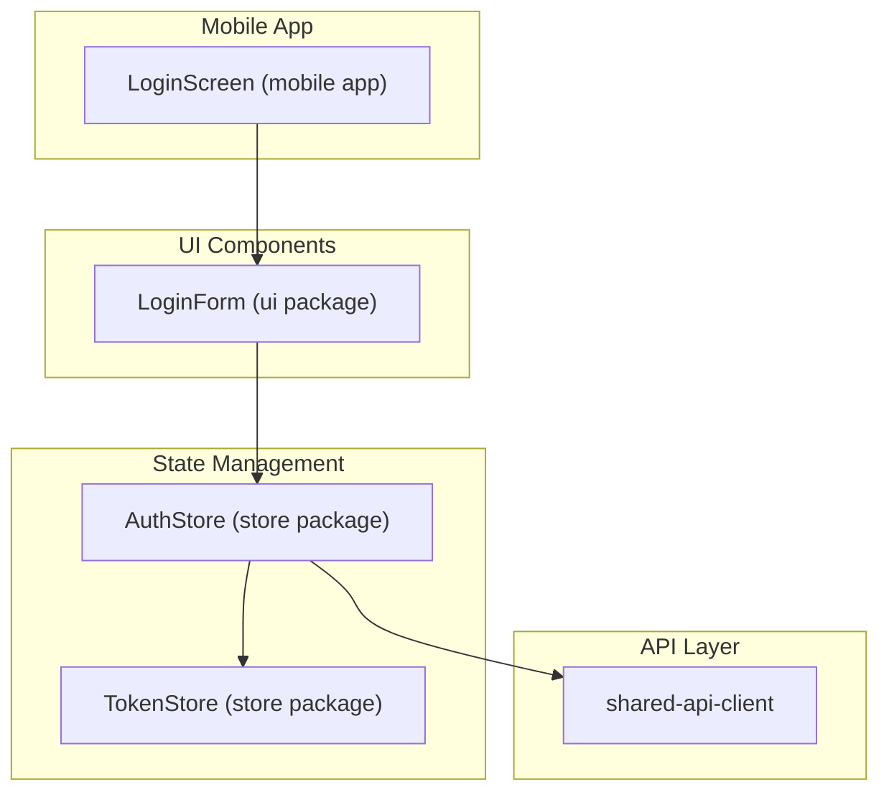
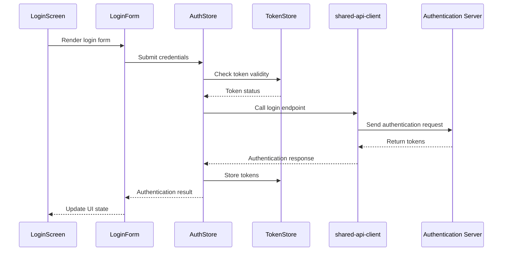
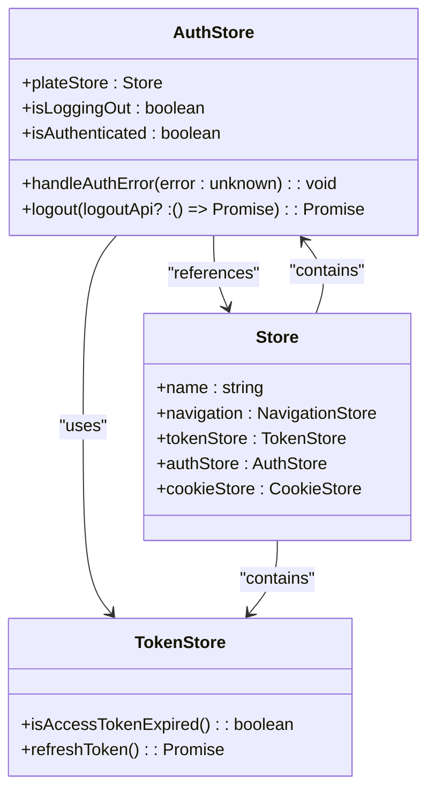
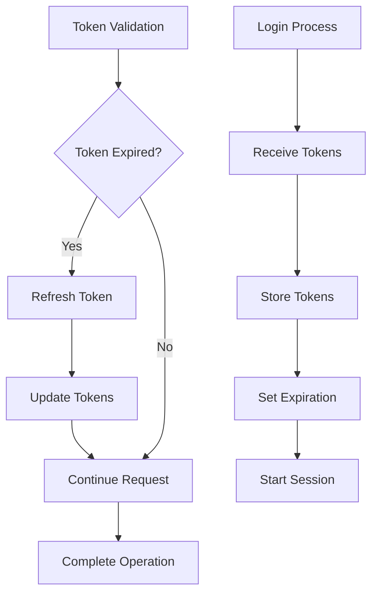
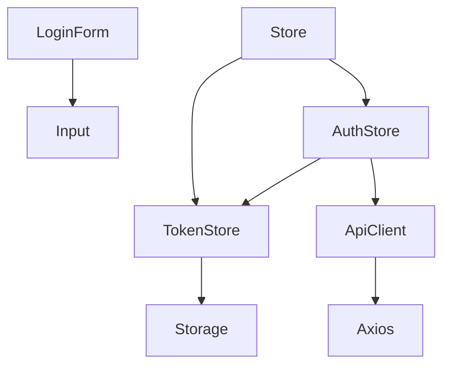

# Authentication Flow

<cite>
**Referenced Files in This Document**   
- [LoginForm.tsx](file://packages/ui/src/components/form/LoginForm/LoginForm.tsx)
- [authStore.ts](file://packages/store/src/stores/authStore.ts)
- [tokenStore.ts](file://packages/store/src/stores/tokenStore.ts)
- [Store.ts](file://packages/store/src/stores/Store.ts)
- [shared-api-client/apis.ts](file://packages/shared-api-client/src/apis.ts)
- [login.tsx](file://apps/admin/src/routes/admin/auth/login.tsx)
</cite>

## Table of Contents
1. [Introduction](#introduction)
2. [Project Structure](#project-structure)
3. [Core Components](#core-components)
4. [Architecture Overview](#architecture-overview)
5. [Detailed Component Analysis](#detailed-component-analysis)
6. [Dependency Analysis](#dependency-analysis)
7. [Performance Considerations](#performance-considerations)
8. [Troubleshooting Guide](#troubleshooting-guide)
9. [Conclusion](#conclusion)

## Introduction
This document provides a comprehensive analysis of the authentication flow within the mobile application. It details the implementation of the login process from the LoginScreen through the LoginForm to API communication with the shared-api-client. The integration with MobX authStore for managing authentication state, including token storage and user session management, is thoroughly explained. The document covers the sequence of operations during login, success handling, error states, authentication persistence, and token refresh mechanisms. It also addresses various authentication scenarios and common issues.

## Project Structure
The authentication functionality is distributed across multiple packages in the monorepo architecture. The core components are organized as follows:
- **apps/mobile**: Contains the mobile application entry points and screens
- **packages/ui**: Houses reusable UI components including LoginForm
- **packages/store**: Implements MobX-based state management with authStore and tokenStore
- **packages/shared-api-client**: Provides API client services for authentication endpoints
- **apps/admin**: Contains admin-specific authentication routes and components



**Diagram sources**
- [LoginForm.tsx](file://packages/ui/src/components/form/LoginForm/LoginForm.tsx)
- [authStore.ts](file://packages/store/src/stores/authStore.ts)
- [tokenStore.ts](file://packages/store/src/stores/tokenStore.ts)

**Section sources**
- [LoginForm.tsx](file://packages/ui/src/components/form/LoginForm/LoginForm.tsx)
- [authStore.ts](file://packages/store/src/stores/authStore.ts)

## Core Components
The authentication flow consists of several key components that work together to provide a seamless user experience. The LoginForm component captures user credentials and initiates the authentication process. The authStore manages the application's authentication state and coordinates with the tokenStore for token management. The shared-api-client handles communication with the backend authentication endpoints. These components are integrated through the MobX state management system, ensuring consistent state across the application.

**Section sources**
- [LoginForm.tsx](file://packages/ui/src/components/form/LoginForm/LoginForm.tsx)
- [authStore.ts](file://packages/store/src/stores/authStore.ts)
- [tokenStore.ts](file://packages/store/src/stores/tokenStore.ts)

## Architecture Overview
The authentication architecture follows a layered approach with clear separation of concerns. The presentation layer (LoginForm) captures user input and triggers authentication actions. The state management layer (authStore and tokenStore) maintains authentication state and handles token lifecycle. The service layer (shared-api-client) communicates with the backend API to authenticate users and manage sessions. This architecture ensures that authentication logic is centralized and reusable across different parts of the application.



**Diagram sources**
- [LoginForm.tsx](file://packages/ui/src/components/form/LoginForm/LoginForm.tsx)
- [authStore.ts](file://packages/store/src/stores/authStore.ts)
- [tokenStore.ts](file://packages/store/src/stores/tokenStore.ts)
- [shared-api-client/apis.ts](file://packages/shared-api-client/src/apis.ts)

## Detailed Component Analysis

### LoginForm Analysis
The LoginForm component is a reusable UI element that captures user credentials for authentication. It accepts a state object containing email and password fields and renders input components for these fields. The component is designed to be integrated with form state management systems and can be easily customized for different authentication scenarios.

```mermaid
classDiagram
class LoginForm {
+state : { email : string, password : string }
+render() : JSX.Element
}
class Input {
+path : string
+state : object
+variant : string
+type : string
+placeholder : string
+label : string
}
LoginForm --> Input : "uses"
```

**Diagram sources**
- [LoginForm.tsx](file://packages/ui/src/components/form/LoginForm/LoginForm.tsx)

**Section sources**
- [LoginForm.tsx](file://packages/ui/src/components/form/LoginForm/LoginForm.tsx)

### AuthStore Analysis
The AuthStore is the central component for managing authentication state in the application. It provides methods for handling authentication errors, checking authentication status, and managing the logout process. The store integrates with the tokenStore to validate token expiration and handle token refresh operations.



**Diagram sources**
- [authStore.ts](file://packages/store/src/stores/authStore.ts)
- [Store.ts](file://packages/store/src/stores/Store.ts)
- [tokenStore.ts](file://packages/store/src/stores/tokenStore.ts)

**Section sources**
- [authStore.ts](file://packages/store/src/stores/authStore.ts)
- [Store.ts](file://packages/store/src/stores/Store.ts)

### Token Management Analysis
The token management system handles JWT token storage, validation, and refresh operations. The tokenStore component provides methods to check token expiration and refresh expired tokens automatically. This ensures that users remain authenticated during their session without requiring frequent re-logins.



**Diagram sources**
- [tokenStore.ts](file://packages/store/src/stores/tokenStore.ts)
- [authStore.ts](file://packages/store/src/stores/authStore.ts)

**Section sources**
- [tokenStore.ts](file://packages/store/src/stores/tokenStore.ts)

## Dependency Analysis
The authentication components have well-defined dependencies that ensure proper functionality and separation of concerns. The LoginForm depends on UI components for rendering input fields. The authStore depends on the tokenStore for token management and the shared-api-client for API communication. The overall dependency structure ensures that authentication logic is centralized and reusable.



**Diagram sources**
- [LoginForm.tsx](file://packages/ui/src/components/form/LoginForm/LoginForm.tsx)
- [authStore.ts](file://packages/store/src/stores/authStore.ts)
- [tokenStore.ts](file://packages/store/src/stores/tokenStore.ts)
- [shared-api-client/apis.ts](file://packages/shared-api-client/src/apis.ts)

**Section sources**
- [authStore.ts](file://packages/store/src/stores/authStore.ts)
- [tokenStore.ts](file://packages/store/src/stores/tokenStore.ts)
- [shared-api-client/apis.ts](file://packages/shared-api-client/src/apis.ts)

## Performance Considerations
The authentication flow is designed with performance in mind. Token validation is performed client-side to minimize API calls. The token refresh mechanism operates transparently to the user, preventing interruptions during active sessions. The use of MobX for state management ensures efficient re-renders and optimal performance. Caching strategies are implemented to reduce redundant API calls and improve response times.

## Troubleshooting Guide
Common authentication issues and their solutions include:
- **Expired tokens**: The system automatically attempts to refresh expired tokens using refresh tokens
- **Concurrent authentication requests**: The authStore manages request queuing to prevent race conditions
- **Network errors**: Retry mechanisms are implemented for transient network issues
- **Invalid credentials**: Clear error messages are provided to guide users in correcting their input
- **Session persistence**: Authentication state is maintained across app restarts using secure storage

**Section sources**
- [authStore.ts](file://packages/store/src/stores/authStore.ts)
- [tokenStore.ts](file://packages/store/src/stores/tokenStore.ts)

## Conclusion
The authentication flow in the mobile application is a well-structured system that provides secure and seamless user authentication. By leveraging MobX for state management and a modular component architecture, the system ensures consistent authentication behavior across the application. The integration of token management, error handling, and session persistence creates a robust authentication experience that handles various scenarios and edge cases effectively.