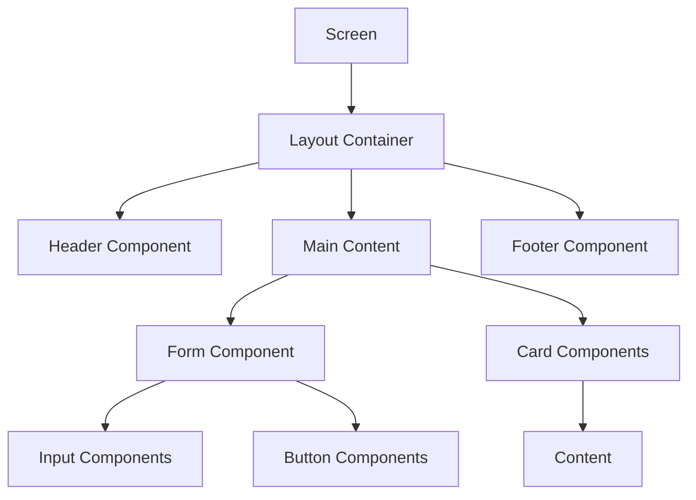
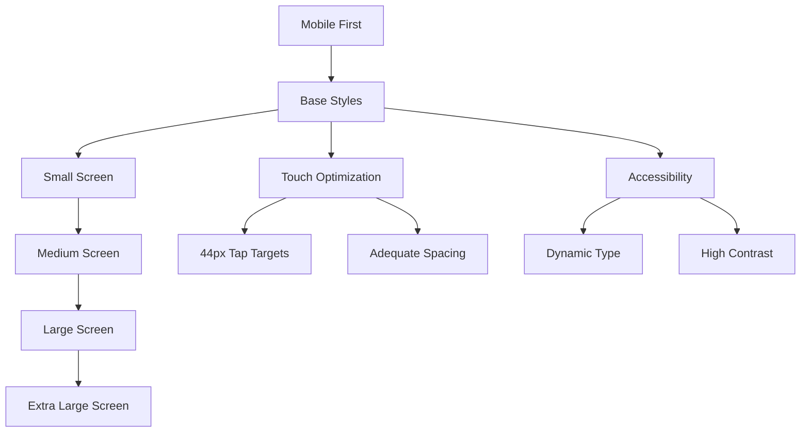
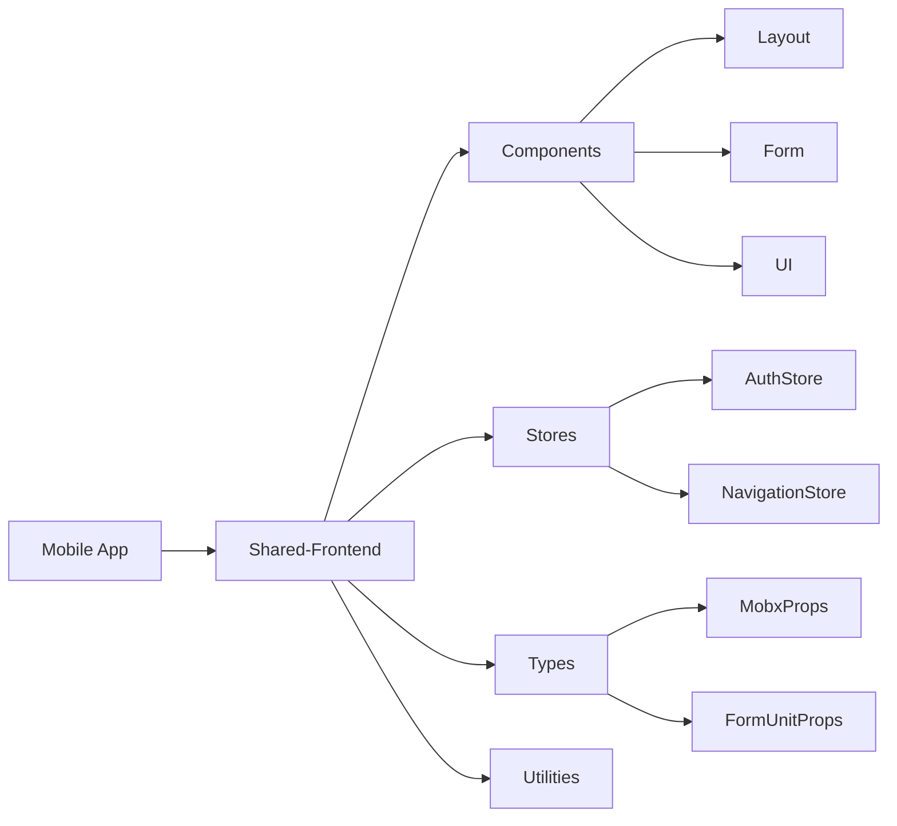

# Component Architecture

<cite>
**Referenced Files in This Document**   
- [AuthLayout.tsx](file://packages/ui/src/components/layout/Auth/AuthLayout.tsx)
- [AuthLayout.stories.tsx](file://packages/ui/src/components/layout/Auth/AuthLayout.stories.tsx)
- [Dashboard/README.md](file://packages/ui/src/components/layout/Dashboard/README.md)
- [Container.stories.tsx](file://packages/ui/src/components/ui/Container/Container.stories.tsx)
- [Main.tsx](file://packages/ui/src/components/layout/Main/Main.tsx)
- [index.ts](file://packages/ui/src/components/index.ts)
- [types.ts](file://packages/types/src/index.ts)
</cite>

## Table of Contents
1. [Introduction](#introduction)
2. [Component Organization Structure](#component-organization-structure)
3. [Core UI Components](#core-ui-components)
4. [Component Composition Patterns](#component-composition-patterns)
5. [Styling Approach and Responsive Design](#styling-approach-and-responsive-design)
6. [Integration with Shared-Frontend Package](#integration-with-shared-frontend-package)
7. [Accessibility Implementation](#accessibility-implementation)
8. [Common Component Issues and Solutions](#common-component-issues-and-solutions)
9. [Conclusion](#conclusion)

## Introduction
This document provides a comprehensive overview of the mobile application's component architecture, focusing on the organization structure, key component implementations, and integration patterns. The architecture leverages a modular design approach with clear separation of concerns between UI components, forms, containers, and screens. The system is built on a foundation of reusable components from the shared-frontend package, ensuring consistency across applications while allowing for mobile-specific customizations.

## Component Organization Structure

The component architecture follows a well-defined directory structure that separates concerns and promotes reusability. The primary organizational directories include ui, forms, container, and screens, each serving a specific purpose in the application architecture.

The ui directory contains primitive and compound components that serve as building blocks for the application's user interface. These components are designed to be highly reusable and composable. The forms directory houses form-specific components and utilities that handle user input and validation. The container directory contains layout components that manage the structural organization of content on the screen. Finally, the screens directory contains page-level components that represent complete views or routes within the application.

This organization enables a clear separation between presentation (ui), data collection (forms), layout (container), and page composition (screens), making the codebase more maintainable and easier to navigate.

**Section sources**
- [index.ts](file://packages/ui/src/components/index.ts)
- [AuthLayout.tsx](file://packages/ui/src/components/layout/Auth/AuthLayout.tsx)

## Core UI Components

The application's core UI components include Button, Card, Input, and ScreenContainer, each designed with a consistent API and styling approach. These components are implemented using TypeScript to ensure type safety and provide clear interfaces for developers.

The Button component provides a versatile interface for user actions with support for various styles, sizes, and states. It accepts props that control its appearance and behavior, including variants (primary, secondary, bordered), sizes (small, medium, large), and loading states. The component is designed to be accessible with proper ARIA attributes and keyboard navigation support.

The Card component serves as a container for related content, providing visual grouping and elevation through shadows. It supports header, body, and footer sections, and can be customized with different border styles and padding options. The component is optimized for touch interactions on mobile devices.

The Input component handles text entry with support for various input types (text, email, password, etc.), validation states, and helper text. It integrates with the form system to provide real-time feedback and error messaging. The component is designed with mobile usability in mind, automatically adjusting the keyboard type based on the input type.

The ScreenContainer component provides a consistent layout structure for screens, handling safe areas on mobile devices and providing appropriate padding. It manages the overall screen composition and can adapt to different orientation and screen size scenarios.

**Section sources**
- [AuthLayout.tsx](file://packages/ui/src/components/layout/Auth/AuthLayout.tsx)
- [Container.stories.tsx](file://packages/ui/src/components/ui/Container/Container.stories.tsx)
- [Main.tsx](file://packages/ui/src/components/layout/Main/Main.tsx)

## Component Composition Patterns

The application employs several component composition patterns to create flexible and reusable UI elements. These patterns leverage React's compositional nature to build complex interfaces from simpler components.

One key pattern is the compound component pattern, where a parent component provides context to its children through React's context API or props drilling. This allows child components to inherit styling and behavior from their parent while maintaining their individual functionality. For example, the AuthLayout component accepts formComponent and adComponent as props, allowing different form and advertisement combinations to be used with the same layout structure.

Another pattern is the render props pattern, where components accept a function as a child that receives data and returns JSX. This provides maximum flexibility in how data is rendered while maintaining the component's core logic. The layout components use this pattern to allow complete customization of their content while preserving the responsive behavior and structural constraints.

The application also uses the higher-order component pattern for cross-cutting concerns like authentication state management and theming. These higher-order components wrap UI components and provide additional props or modify their behavior based on application state.

**Diagram sources**
- [AuthLayout.tsx](file://packages/ui/src/components/layout/Auth/AuthLayout.tsx)
- [Main.tsx](file://packages/ui/src/components/layout/Main/Main.tsx)

**Section sources**
- [AuthLayout.tsx](file://packages/ui/src/components/layout/Auth/AuthLayout.tsx)
- [AuthLayout.stories.tsx](file://packages/ui/src/components/layout/Auth/AuthLayout.stories.tsx)

## Styling Approach and Responsive Design

The styling approach combines utility-first CSS with component-specific styles using TypeScript interfaces. The system uses a combination of Tailwind CSS classes for basic styling and layout, with component-specific styles defined in TypeScript interfaces for complex visual states.

The responsive design patterns adapt the UI to different screen sizes and device characteristics. The layout system uses a mobile-first approach, with base styles optimized for small screens and progressive enhancement for larger viewports. Media queries are implemented through Tailwind's responsive prefixes (sm:, md:, lg:, xl:) to apply different styles at different breakpoints.

The application follows a consistent spacing system based on a 4px scale, ensuring visual harmony across components. Typography uses a limited set of font sizes and weights that scale appropriately across devices. Color usage follows the design system's palette, with semantic color names that can be themed.

For touch interfaces, the design accounts for finger-friendly tap targets with minimum 44px touch areas and appropriate spacing between interactive elements. The system also considers viewport units and dynamic type scaling to accommodate user preferences.

**Diagram sources**
- [AuthLayout.tsx](file://packages/ui/src/components/layout/Auth/AuthLayout.tsx)
- [Dashboard/README.md](file://packages/ui/src/components/layout/Dashboard/README.md)

**Section sources**
- [AuthLayout.tsx](file://packages/ui/src/components/layout/Auth/AuthLayout.tsx)
- [Dashboard/README.md](file://packages/ui/src/components/layout/Dashboard/README.md)

## Integration with Shared-Frontend Package

The mobile application integrates with the shared-frontend package to leverage common components and utilities across multiple applications. This integration follows a modular import pattern, where specific components are imported from the shared package rather than importing the entire library.

The shared-frontend package provides foundational components like layout containers, form elements, and UI primitives that are used as building blocks in the mobile application. These components are designed with extensibility in mind, allowing the mobile application to customize their appearance and behavior through props and composition.

The integration also includes shared state management patterns through MobX stores, which are imported from the shared-frontend package. These stores provide a consistent approach to application state management across different applications, reducing duplication and ensuring a unified user experience.

Type definitions from the shared-frontend package are used to ensure type safety across the application boundary. The types package provides utility types and interfaces that are used throughout both the shared components and the mobile-specific components, ensuring consistency in data structures and API contracts.

**Diagram sources**
- [index.ts](file://packages/ui/src/components/index.ts)
- [types.ts](file://packages/types/src/index.ts)

**Section sources**
- [index.ts](file://packages/ui/src/components/index.ts)
- [types.ts](file://packages/types/src/index.ts)

## Accessibility Implementation

Accessibility is a core consideration in the component architecture, with implementations following WCAG 2.1 guidelines and ARIA best practices. Each interactive component includes appropriate ARIA attributes to ensure screen reader compatibility and keyboard navigation support.

The Button component implements proper focus management and includes aria-label and aria-labelledby attributes when appropriate. It supports keyboard interaction with Enter and Space keys, and maintains visible focus indicators for keyboard users.

Form components include proper labeling through htmlFor and id attributes, ensuring that screen readers can associate labels with their corresponding inputs. Error messages are programmatically linked to inputs using aria-describedby, and validation states are communicated through aria-invalid attributes.

The layout components consider focus order and ensure that the tab sequence follows the visual flow of the interface. They also implement proper landmark roles (banner, main, navigation, etc.) to help screen reader users understand the page structure.

For touch interfaces, the design considers users with motor impairments by providing adequate touch target sizes and spacing between interactive elements. The system also respects user preferences for reduced motion and increased contrast.

**Section sources**
- [AuthLayout.tsx](file://packages/ui/src/components/layout/Auth/AuthLayout.tsx)
- [Container.stories.tsx](file://packages/ui/src/components/ui/Container/Container.stories.tsx)

## Common Component Issues and Solutions

The component architecture addresses several common mobile development challenges through deliberate design decisions and implementation patterns.

For performance optimization of lists, the architecture recommends using virtualization techniques for long lists to minimize the number of rendered components. The FlatList component from React Native or similar virtualized list implementations are used to render only the items currently visible on screen, significantly improving scroll performance and memory usage.

Handling touch events on different screen sizes is addressed through responsive design patterns and device-specific optimizations. The system uses percentage-based or viewport-relative units for sizing rather than fixed pixels, ensuring consistent appearance across devices with different densities. Touch targets are maintained at a minimum of 44px to accommodate various finger sizes and input precision.

State management challenges are mitigated through the use of the MobX state tree pattern documented in the shared-frontend package. This provides a predictable state container with clear separation between state, actions, and views, making it easier to debug and maintain complex component interactions.

For internationalization, the components are designed to support text expansion and different writing directions. The layout system accommodates longer text strings in different languages without breaking the UI, and supports right-to-left languages through appropriate CSS properties.

**Section sources**
- [AuthLayout.tsx](file://packages/ui/src/components/layout/Auth/AuthLayout.tsx)
- [Main.tsx](file://packages/ui/src/components/layout/Main/Main.tsx)

## Conclusion

The mobile application's component architecture demonstrates a well-structured approach to building reusable, accessible, and performant UI components. By organizing components into logical directories (ui, forms, container, and screens) and leveraging the shared-frontend package, the architecture promotes consistency across applications while allowing for mobile-specific optimizations.

The implementation of key components like Button, Card, Input, and ScreenContainer follows consistent patterns for props API, styling, and responsive design, making them predictable and easy to use. The composition patterns enable flexible UI construction while maintaining a cohesive design language.

The integration with the shared-frontend package reduces duplication and ensures a unified user experience across platforms. Accessibility is prioritized throughout the component system, with proper ARIA attributes and keyboard navigation support built into each interactive element.

By addressing common mobile development challenges like list performance and touch event handling, the architecture provides a solid foundation for building high-quality mobile applications that work well across different devices and user needs.