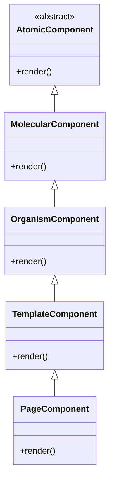
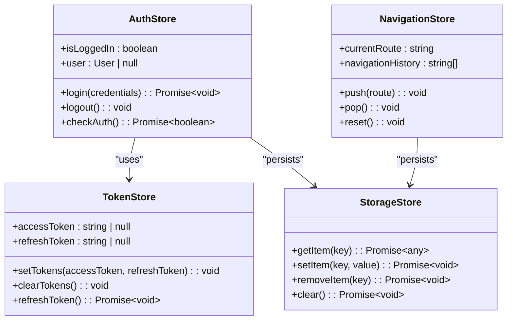
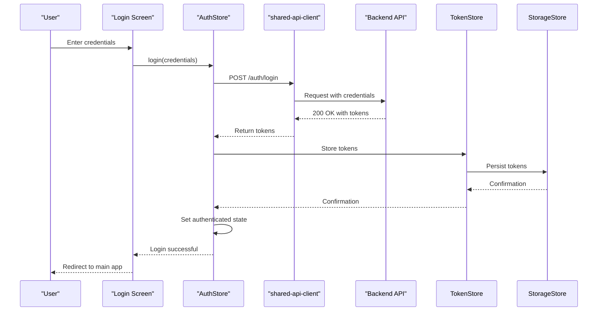
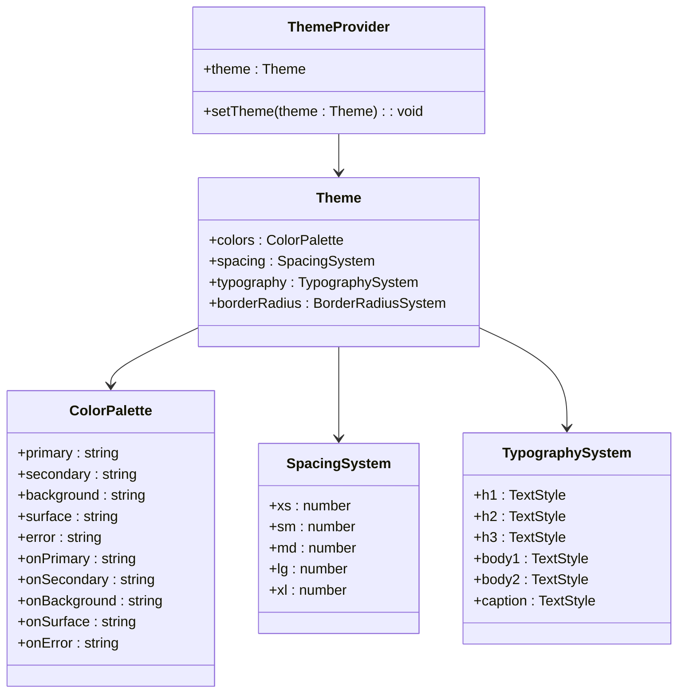
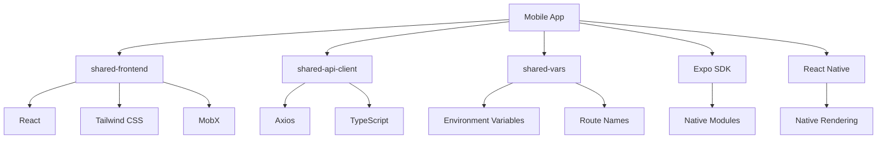

# Mobile Frontend

<cite>
**Referenced Files in This Document**   
- [package.json](file://apps/mobile/package.json)
- [app.json](file://apps/mobile/app.json)
- [babel.config.js](file://apps/mobile/babel.config.js)
- [metro.config.js](file://apps/mobile/metro.config.js)
- [tsconfig.json](file://apps/mobile/tsconfig.json)
- [Podfile.properties.json](file://apps/mobile/ios/Podfile.properties.json)
- [App.tsx](file://apps/mobile/src/app/_layout.tsx)
- [authStore.ts](file://packages/shared-frontend/src/store/authStore.ts)
- [tokenStore.ts](file://packages/shared-frontend/src/store/tokenStore.ts)
- [api-client](file://packages/shared-api-client)
- [shared-frontend](file://packages/shared-frontend)
- [shared-vars](file://packages/shared-vars)
</cite>

## Table of Contents
1. [Introduction](#introduction)
2. [Project Structure](#project-structure)
3. [Core Components](#core-components)
4. [Architecture Overview](#architecture-overview)
5. [Detailed Component Analysis](#detailed-component-analysis)
6. [Dependency Analysis](#dependency-analysis)
7. [Performance Considerations](#performance-considerations)
8. [Troubleshooting Guide](#troubleshooting-guide)
9. [Conclusion](#conclusion)

## Introduction
The mobile frontend application in prj-core is built using React Native with Expo, providing a cross-platform solution for iOS and Android devices. The application leverages Expo's managed workflow to simplify development and deployment while maintaining native performance characteristics. This documentation provides a comprehensive overview of the mobile application's architecture, component structure, state management, and integration with shared packages.

## Project Structure

The mobile application follows a modular structure with clear separation of concerns. The application is organized into several key directories:

- `src/app`: Contains the main application structure with file-based routing
- `src/components`: Houses reusable UI components and layout structures
- `.expo`: Contains Expo-specific configuration and cached data
- `android` and `ios`: Platform-specific native code and configurations

The file-based routing system uses Expo Router, which enables dynamic route generation based on the file system structure. Special directories like `(tabs)` are used to organize tab-based navigation.

```mermaid
graph TD
A[Mobile App Root] --> B[src/]
A --> C[.expo/]
A --> D[android/]
A --> E[ios/]
A --> F[app.json]
A --> G[package.json]
B --> H[app/]
B --> I[components/]
H --> J[(tabs)/]
H --> K[login.tsx]
H --> L[_layout.tsx]
I --> M[container/]
I --> N[forms/]
I --> O[providers/]
I --> P[screens/]
I --> Q[ui/]
```

**Diagram sources**
- [app.json](file://apps/mobile/app.json)
- [package.json](file://apps/mobile/package.json)

**Section sources**
- [app.json](file://apps/mobile/app.json)
- [package.json](file://apps/mobile/package.json)

## Core Components

The mobile application's core components are built around React Native with Expo, utilizing the file-based routing system for navigation. The application structure is centered on the `_layout.tsx` file which serves as the root layout component, wrapping all screens with necessary providers and context.

Key architectural decisions include:
- Implementation of tab navigation through the `(tabs)` directory structure
- Use of Expo's prebuild system for native module integration
- Integration with shared packages for consistent UI and business logic
- Implementation of responsive design principles for both iOS and Android platforms

The authentication flow is managed through dedicated stores from shared-frontend, with token management and user session persistence handled automatically.

**Section sources**
- [src/app/_layout.tsx](file://apps/mobile/src/app/_layout.tsx)
- [src/app/login.tsx](file://apps/mobile/src/app/login.tsx)

## Architecture Overview

The mobile application follows a layered architecture with clear separation between presentation, state management, and data access layers. The application leverages Expo Router for file-based routing, automatically generating routes based on the file system structure within the `src/app` directory.

```mermaid
graph TD
A[User Interface] --> B[React Components]
B --> C[State Management]
C --> D[Data Access]
D --> E[Backend Services]
C --> F[MobX Stores]
F --> G[shared-frontend]
D --> H[shared-api-client]
H --> I[API Endpoints]
J[Expo Router] --> K[File-based Routing]
K --> L[Tab Navigation]
L --> M[(tabs) Directory]
N[Theming] --> O[shared-frontend UI]
P[Authentication] --> Q[Auth Flow]
Q --> R[Token Management]
R --> S[Storage]
```

**Diagram sources**
- [src/app/_layout.tsx](file://apps/mobile/src/app/_layout.tsx)
- [packages/shared-frontend/src/store/authStore.ts](file://packages/shared-frontend/src/store/authStore.ts)
- [packages/shared-api-client](file://packages/shared-api-client)

## Detailed Component Analysis

### Component Architecture
The component architecture follows a hierarchical structure with atomic design principles. Components are organized into categories based on their complexity and reusability.

#### Component Categories:
- **Atomic Components**: Basic UI elements like buttons, inputs, and text
- **Molecular Components**: Combinations of atomic components forming functional units
- **Organism Components**: Complex UI sections composed of multiple molecules
- **Template Components**: Page-level layouts with defined content regions
- **Page Components**: Complete screens with specific functionality

The component structure leverages the shared-frontend package for consistent UI implementation across platforms.



**Diagram sources**
- [packages/shared-frontend/src/components/ui](file://packages/shared-frontend/src/components/ui)
- [packages/shared-frontend/src/components/layout](file://packages/shared-frontend/src/components/layout)

### State Management with MobX
The application uses MobX stores from shared-frontend for state management, providing a reactive and predictable state container. The store architecture follows the Flux pattern with unidirectional data flow.

Key stores include:
- `authStore`: Manages authentication state and user session
- `tokenStore`: Handles JWT token storage and refresh
- `navigationStore`: Tracks navigation state and history
- `storageStore`: Provides persistent storage capabilities



**Diagram sources**
- [packages/shared-frontend/src/store/authStore.ts](file://packages/shared-frontend/src/store/authStore.ts)
- [packages/shared-frontend/src/store/tokenStore.ts](file://packages/shared-frontend/src/store/tokenStore.ts)
- [packages/shared-frontend/src/store/navigationStore.ts](file://packages/shared-frontend/src/store/navigationStore.ts)
- [packages/shared-frontend/src/store/storageStore.ts](file://packages/shared-frontend/src/store/storageStore.ts)

### Authentication Flow
The authentication flow follows a secure pattern with token-based authentication and refresh mechanisms.



**Diagram sources**
- [src/app/login.tsx](file://apps/mobile/src/app/login.tsx)
- [packages/shared-frontend/src/store/authStore.ts](file://packages/shared-frontend/src/store/authStore.ts)
- [packages/shared-api-client/src/apis.ts](file://packages/shared-api-client/src/apis.ts)

### Theming Implementation
The theming system is implemented through shared-frontend, providing a consistent design language across the application.



**Diagram sources**
- [packages/shared-frontend/src/provider/UIProviders.tsx](file://packages/shared-frontend/src/provider/UIProviders.tsx)
- [packages/shared-frontend/src/components/ui](file://packages/shared-frontend/src/components/ui)

## Dependency Analysis

The mobile application has a well-defined dependency structure, leveraging shared packages to maintain consistency across the codebase.



**Diagram sources**
- [apps/mobile/package.json](file://apps/mobile/package.json)
- [packages/shared-frontend/package.json](file://packages/shared-frontend/package.json)
- [packages/shared-api-client/package.json](file://packages/shared-api-client/package.json)

**Section sources**
- [apps/mobile/package.json](file://apps/mobile/package.json)
- [packages/shared-frontend/package.json](file://packages/shared-frontend/package.json)
- [packages/shared-api-client/package.json](file://packages/shared-api-client/package.json)

## Performance Considerations

The mobile application implements several performance optimizations:

1. **Code Splitting**: Expo Router automatically code-splits by route, reducing initial bundle size
2. **Image Optimization**: Images are optimized and cached using Expo's asset system
3. **State Management**: MobX provides efficient reactivity with minimal re-renders
4. **Network Optimization**: The shared-api-client implements request batching and caching
5. **Offline Support**: Data is cached locally to support offline scenarios

The application also implements data synchronization strategies to handle connectivity changes, ensuring data consistency between the client and server.

## Troubleshooting Guide

Common issues and their solutions:

1. **Authentication failures**: Check token expiration and refresh logic in tokenStore
2. **Navigation issues**: Verify route structure in the `src/app` directory
3. **API connectivity problems**: Check network configuration and endpoint URLs in shared-vars
4. **Performance bottlenecks**: Use React DevTools to identify unnecessary re-renders
5. **Platform-specific issues**: Check native module configurations in Podfile.properties.json and android/build.gradle

For debugging, the application provides development tools through Expo DevTools, including network inspection, state monitoring, and performance profiling.

**Section sources**
- [apps/mobile/ios/Podfile.properties.json](file://apps/mobile/ios/Podfile.properties.json)
- [apps/mobile/android/build.gradle](file://apps/mobile/android/build.gradle)
- [packages/shared-vars/src/endpoints.ts](file://packages/shared-vars/src/endpoints.ts)

## Conclusion

The mobile frontend application in prj-core demonstrates a well-architected React Native implementation with Expo, leveraging shared packages for consistency and maintainability. The file-based routing system simplifies navigation management, while the MobX-based state management provides a predictable and reactive state container. The integration with shared-frontend and shared-api-client ensures consistency across platforms and simplifies API communication. The application is well-positioned to handle both online and offline scenarios with robust data synchronization capabilities.