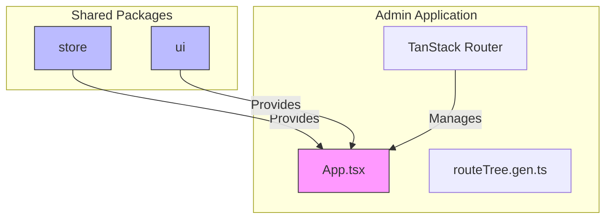
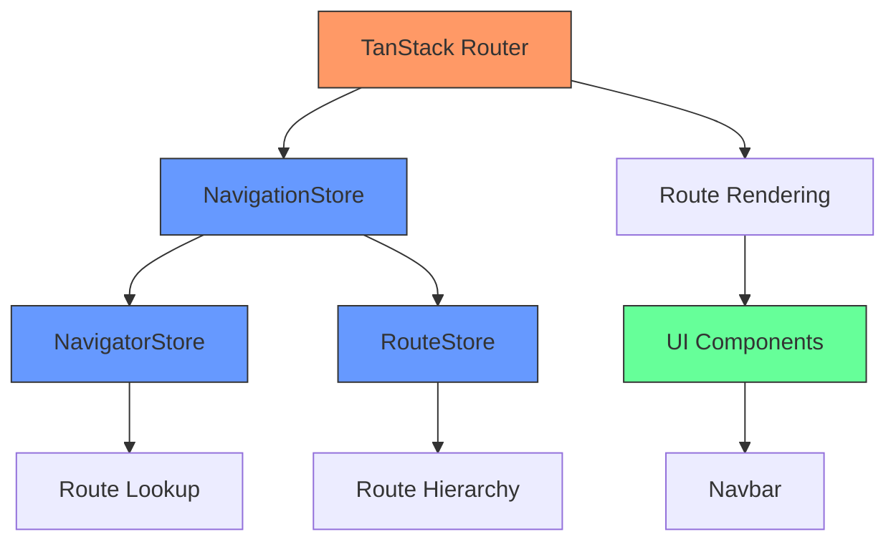
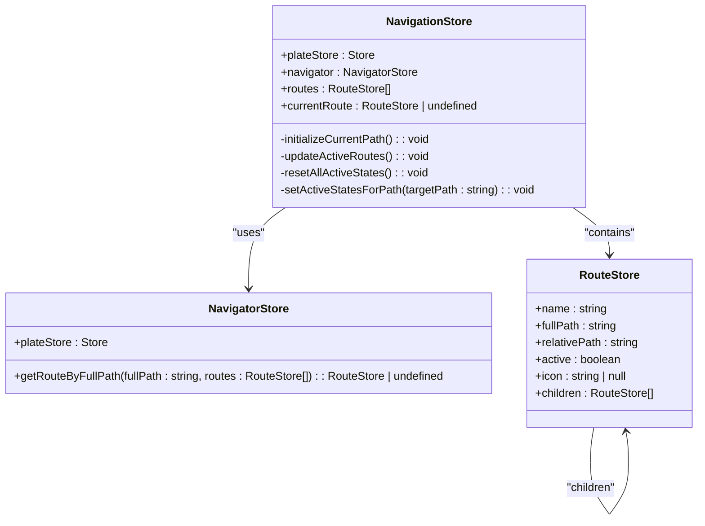
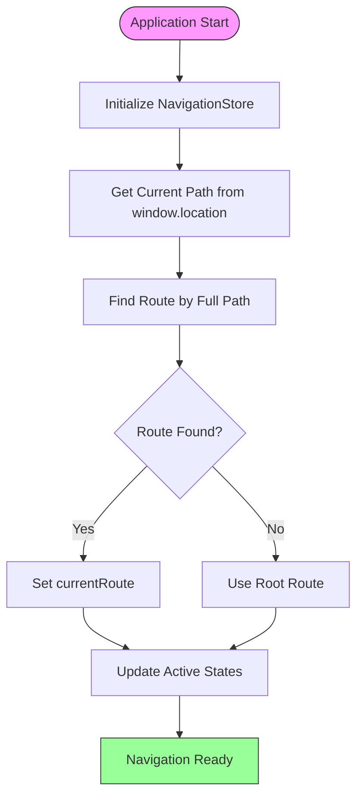
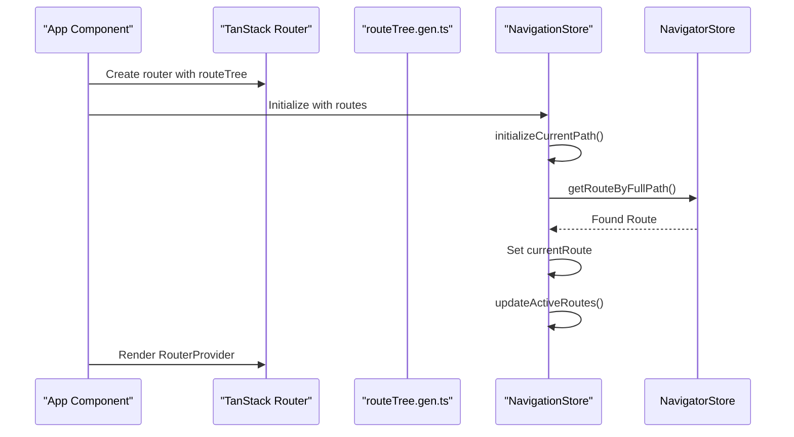
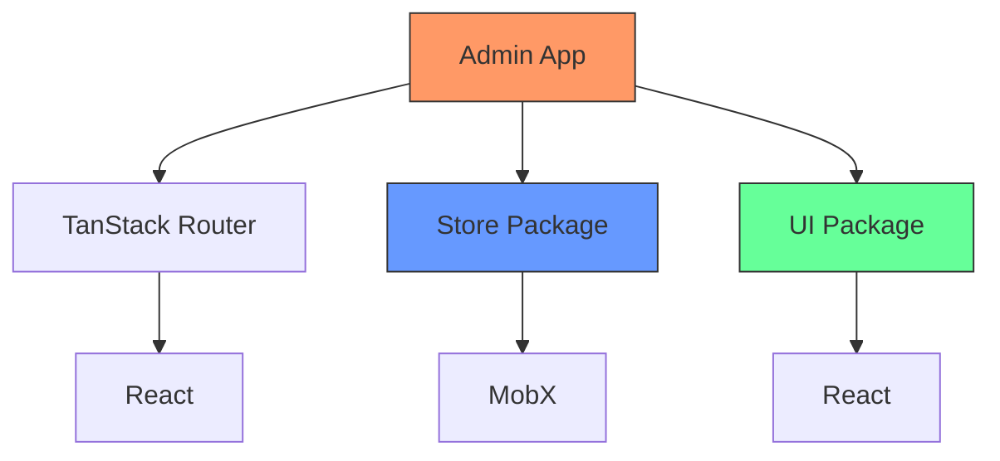

# Routing and Navigation

<cite>
**Referenced Files in This Document**   
- [App.tsx](file://apps/admin/src/App.tsx)
- [navigationStore.ts](file://packages/store/src/stores/navigationStore.ts)
- [navigatorStore.ts](file://packages/store/src/stores/navigatorStore.ts)
- [routeStore.ts](file://packages/store/src/stores/routeStore.ts)
- [routes.ts](file://apps/server/src/shared/vars/routes.ts)
- [types.ts](file://packages/ui/src/components/ui/Navbar/types.ts)
- [utils.ts](file://packages/ui/src/components/ui/Navbar/utils.ts)
</cite>

## Table of Contents
1. [Introduction](#introduction)
2. [Project Structure](#project-structure)
3. [Core Components](#core-components)
4. [Architecture Overview](#architecture-overview)
5. [Detailed Component Analysis](#detailed-component-analysis)
6. [Dependency Analysis](#dependency-analysis)
7. [Performance Considerations](#performance-considerations)
8. [Troubleshooting Guide](#troubleshooting-guide)
9. [Conclusion](#conclusion)

## Introduction
The routing and navigation system in the application is implemented using a combination of TanStack Router for the admin application and a custom routing solution based on MobX stores for shared navigation state management. The system provides a structured approach to route handling, navigation state persistence, and route-based UI updates. This document details the architecture, implementation, and key components of the routing system across the application ecosystem.

## Project Structure
The routing system is distributed across multiple applications and shared packages. The admin application uses TanStack Router with a generated route tree, while shared navigation logic is implemented in the packages/store module using MobX for state management. The navigation components are available in the packages/ui module for consistent UI implementation.

**Diagram sources**
- [App.tsx](file://apps/admin/src/App.tsx)
- [navigationStore.ts](file://packages/store/src/stores/navigationStore.ts)

**Section sources**
- [App.tsx](file://apps/admin/src/App.tsx)
- [navigationStore.ts](file://packages/store/src/stores/navigationStore.ts)

## Core Components
The routing system consists of several core components that work together to manage navigation state and route handling. The NavigationStore serves as the central state manager for navigation, coordinating with RouteStore instances that represent individual routes and their hierarchical relationships. The NavigatorStore provides utility methods for route lookup and navigation operations.

**Section sources**
- [navigationStore.ts](file://packages/store/src/stores/navigationStore.ts)
- [navigatorStore.ts](file://packages/store/src/stores/navigatorStore.ts)
- [routeStore.ts](file://packages/store/src/stores/routeStore.ts)

## Architecture Overview
The routing architecture follows a layered approach with clear separation of concerns. At the top level, the admin application uses TanStack Router for declarative route configuration and rendering. Underneath, the shared store package provides a reactive state management layer for navigation state that can be accessed across components. The UI components in the shared package provide consistent navigation interfaces that consume the navigation state.

**Diagram sources**
- [App.tsx](file://apps/admin/src/App.tsx)
- [navigationStore.ts](file://packages/store/src/stores/navigationStore.ts)
- [types.ts](file://packages/ui/src/components/ui/Navbar/types.ts)

## Detailed Component Analysis

### NavigationStore Analysis
The NavigationStore is the central component responsible for managing the application's navigation state. It maintains a collection of RouteStore instances representing the application's route hierarchy and tracks the current active route. The store uses MobX for reactivity, automatically updating dependent components when the navigation state changes.

**Diagram sources**
- [navigationStore.ts](file://packages/store/src/stores/navigationStore.ts)
- [navigatorStore.ts](file://packages/store/src/stores/navigatorStore.ts)
- [routeStore.ts](file://packages/store/src/stores/routeStore.ts)

**Section sources**
- [navigationStore.ts](file://packages/store/src/stores/navigationStore.ts)
- [navigatorStore.ts](file://packages/store/src/stores/navigatorStore.ts)
- [routeStore.ts](file://packages/store/src/stores/routeStore.ts)

### Route Management System
The route management system is designed to handle complex navigation hierarchies with support for nested routes and active state propagation. The system initializes with the current URL path and updates the active state of routes based on the current location. When the current route changes, the system automatically updates the active states of all affected routes in the hierarchy.

**Diagram sources**
- [navigationStore.ts](file://packages/store/src/stores/navigationStore.ts)
- [navigatorStore.ts](file://packages/store/src/stores/navigatorStore.ts)

### Admin Application Routing
The admin application implements routing using TanStack Router, which provides type-safe routing with automatic code splitting and route prefetching. The route configuration is generated and imported as routeTree.gen.ts, which is used to create the router instance. This approach ensures type safety and automatic route discovery based on the file structure.

**Diagram sources**
- [App.tsx](file://apps/admin/src/App.tsx)
- [navigationStore.ts](file://packages/store/src/stores/navigationStore.ts)

**Section sources**
- [App.tsx](file://apps/admin/src/App.tsx)
- [navigationStore.ts](file://packages/store/src/stores/navigationStore.ts)

## Dependency Analysis
The routing system has dependencies across multiple packages and applications. The admin application depends on the shared store package for navigation state management and the shared UI package for navigation components. The store package provides the core navigation logic that can be used across different applications.

**Diagram sources**
- [App.tsx](file://apps/admin/src/App.tsx)
- [package.json](file://package.json)

**Section sources**
- [App.tsx](file://apps/admin/src/App.tsx)
- [navigationStore.ts](file://packages/store/src/stores/navigationStore.ts)

## Performance Considerations
The routing system is designed with performance in mind, using efficient algorithms for route lookup and state updates. The route lookup operation has O(n) complexity in the worst case, where n is the total number of routes. The active state update operation also has O(n) complexity but is optimized to minimize unnecessary re-renders through MobX's reactivity system.

## Troubleshooting Guide
Common issues with the routing system typically involve incorrect route configuration or state initialization problems. When routes are not being found correctly, verify that the route hierarchy is properly configured and that the full paths match the expected URL structure. For issues with active state not updating correctly, check that the MobX observables are properly set up and that the route change events are being processed correctly.

**Section sources**
- [navigationStore.ts](file://packages/store/src/stores/navigationStore.ts)
- [navigatorStore.ts](file://packages/store/src/stores/navigatorStore.ts)

## Conclusion
The routing and navigation system provides a robust foundation for managing application navigation across multiple components and applications. By combining TanStack Router's declarative approach with MobX's reactive state management, the system offers both type safety and flexible state handling. The shared store package enables consistent navigation behavior across different parts of the application while allowing for application-specific routing needs to be addressed through the TanStack Router implementation in the admin application.