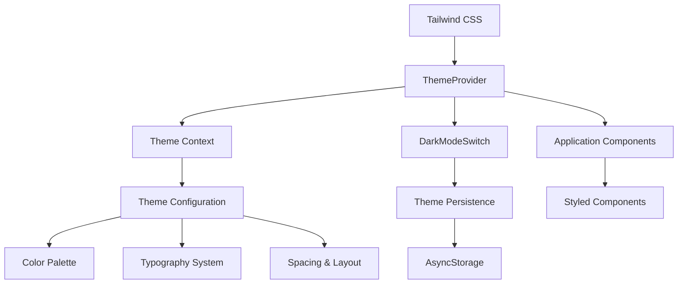
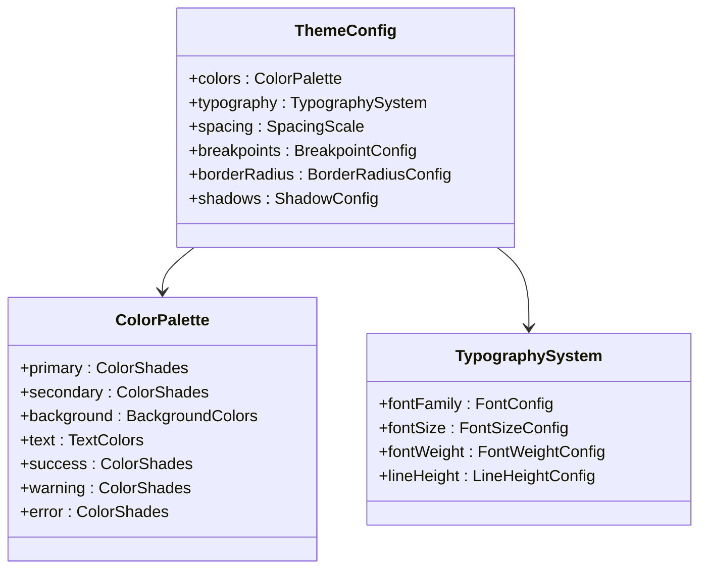
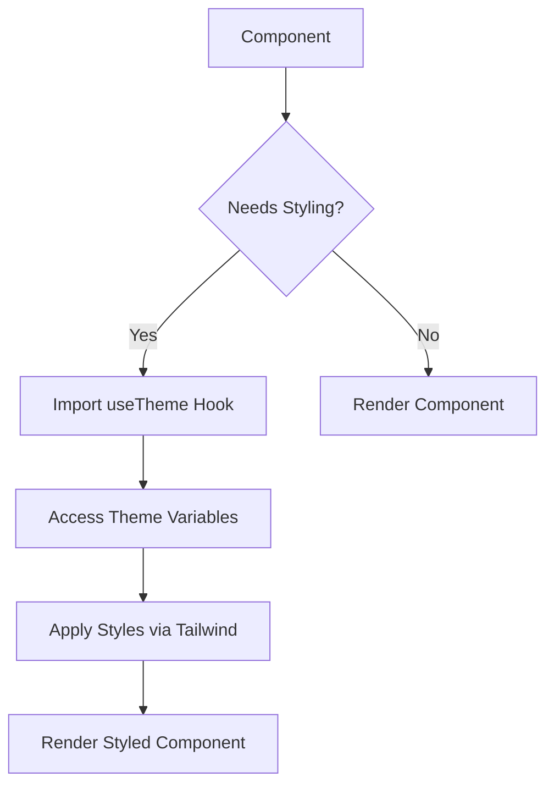

# Theming System

<cite>
**Referenced Files in This Document**   
- [theme.tsx](file://packages/ui/src/theme/theme.tsx)
- [ThemeProvider.tsx](file://packages/ui/src/components/providers/ThemeProvider.tsx)
- [DarkModeSwitch.tsx](file://packages/ui/src/components/ui/DarkModeSwitch/DarkModeSwitch.tsx)
- [constants.ts](file://packages/constants/src/theme/constants.ts)
- [tailwind.config.ts](file://apps/mobile/tailwind.config.ts)
- [App.tsx](file://apps/mobile/src/App.tsx)
</cite>

## Table of Contents
1. [Introduction](#introduction)
2. [Theme Architecture Overview](#theme-architecture-overview)
3. [ThemeProvider Implementation](#themeprovider-implementation)
4. [Theme Configuration Structure](#theme-configuration-structure)
5. [Dark Mode Toggle Functionality](#dark-mode-toggle-functionality)
6. [Styling Approach with TypeScript](#styling-approach-with-typescript)
7. [Theme Variables and Component Access](#theme-variables-and-component-access)
8. [Color Palette Organization](#color-palette-organization)
9. [Typography System](#typography-system)
10. [Theme Customization and Extension](#theme-customization-and-extension)
11. [Theme Persistence Across Sessions](#theme-persistence-across-sessions)
12. [Platform-Specific Design Considerations](#platform-specific-design-considerations)
13. [Common Theming Issues and Solutions](#common-theming-issues-and-solutions)

## Introduction
The mobile application's theming system provides a comprehensive solution for managing visual appearance across the entire application. Built on React Context and integrated with Tailwind CSS, the system enables dynamic theme switching, dark mode support, and consistent styling across components. This documentation details the implementation, configuration, and usage patterns for the theming system.

## Theme Architecture Overview

**Diagram sources**
- [ThemeProvider.tsx](file://packages/ui/src/components/providers/ThemeProvider.tsx)
- [theme.tsx](file://packages/ui/src/theme/theme.tsx)

## ThemeProvider Implementation

The ThemeProvider component serves as the central mechanism for theme state management and distribution throughout the application. It uses React Context to make the current theme and theme manipulation functions available to all child components without prop drilling.

The provider initializes with a default theme state that includes the current theme mode (light/dark), color scheme, and theme manipulation functions. It wraps the entire application in the component hierarchy, ensuring all components have access to the theme context.

**Section sources**
- [ThemeProvider.tsx](file://packages/ui/src/components/providers/ThemeProvider.tsx)
- [App.tsx](file://apps/mobile/src/App.tsx)

## Theme Configuration Structure

The theme configuration in theme.tsx defines the complete visual design system for the application. It includes structured definitions for colors, typography, spacing, breakpoints, and other design tokens that maintain consistency across the UI.

The configuration follows a hierarchical structure with base tokens and semantic tokens. Base tokens define raw values (specific color hex codes, pixel values), while semantic tokens provide meaningful names based on their purpose (primary button color, error text color).

**Diagram sources**
- [theme.tsx](file://packages/ui/src/theme/theme.tsx)
- [constants.ts](file://packages/constants/src/theme/constants.ts)

## Dark Mode Toggle Functionality

The DarkModeSwitch component provides a user interface element for toggling between light and dark themes. It integrates with the ThemeProvider to update the application's theme state and persists the user's preference across sessions.

The component uses React state to manage its visual appearance and responds to user interactions by calling the theme toggle function from the context. It also listens for system-level dark mode preferences and can automatically adapt to the user's operating system settings.

**Section sources**
- [DarkModeSwitch.tsx](file://packages/ui/src/components/ui/DarkModeSwitch/DarkModeSwitch.tsx)
- [ThemeProvider.tsx](file://packages/ui/src/components/providers/ThemeProvider.tsx)

## Styling Approach with TypeScript

The styling approach combines Tailwind CSS utility classes with TypeScript type safety to ensure consistent and maintainable styling. The system uses typed style objects and theme-aware components that automatically adapt to the current theme.

Components access theme variables through the useTheme hook, which provides type-safe access to all theme properties. This approach eliminates magic strings and provides autocomplete support in development environments.

**Diagram sources**
- [theme.tsx](file://packages/ui/src/theme/theme.tsx)
- [useTheme.ts](file://packages/ui/src/hooks/useTheme.ts)

## Theme Variables and Component Access

Components access theme variables through the React Context API, which provides a centralized store for theme state. The useTheme hook serves as the primary interface for components to consume theme values in a type-safe manner.

Theme variables are organized into logical categories including colors, typography, spacing, and component-specific styles. Each variable has a semantic name that describes its purpose rather than its visual appearance, allowing for easier theme customization and maintenance.

**Section sources**
- [theme.tsx](file://packages/ui/src/theme/theme.tsx)
- [useTheme.ts](file://packages/ui/src/hooks/useTheme.ts)

## Color Palette Organization

The color palette is systematically organized into semantic categories that reflect their usage in the interface. Each color category contains multiple shades that provide flexibility for different visual treatments while maintaining harmony.

The primary organization includes:
- Primary and secondary brand colors
- Background colors for different UI elements
- Text colors for various text hierarchies
- Status colors for success, warning, error, and informational states
- Neutral colors for borders, dividers, and subtle elements

This structured approach ensures color consistency and makes it easy to update the color scheme across the entire application.

**Section sources**
- [theme.tsx](file://packages/ui/src/theme/theme.tsx)
- [constants.ts](file://packages/constants/src/theme/constants.ts)

## Typography System

The typography system establishes a comprehensive set of font styles that create visual hierarchy and ensure readability across different screen sizes and devices. It defines font families, sizes, weights, line heights, and letter spacing for various text elements.

The system follows a modular scale approach, where font sizes are calculated using a consistent ratio, creating harmonious relationships between different text levels. This ensures that text elements feel related and create a cohesive reading experience.

Typography styles are defined for:
- Headings (h1-h6)
- Body text
- Captions and helper text
- Button text
- Form labels and inputs
- Display text

**Section sources**
- [theme.tsx](file://packages/ui/src/theme/theme.tsx)
- [constants.ts](file://packages/constants/src/theme/constants.ts)

## Theme Customization and Extension

The theming system supports customization and extension through a well-defined API. Developers can create new theme variants by extending the base theme configuration or override specific theme properties to match brand requirements.

Custom themes can be registered with the ThemeProvider, allowing for multiple theme options within the same application. The system also supports runtime theme switching, enabling features like seasonal themes or user-selectable themes.

To add a new theme variant, developers create a theme configuration object that follows the same structure as the base theme and register it with the theme system. Components automatically adapt to the new theme without requiring code changes.

**Section sources**
- [theme.tsx](file://packages/ui/src/theme/theme.tsx)
- [ThemeProvider.tsx](file://packages/ui/src/components/providers/ThemeProvider.tsx)

## Theme Persistence Across Sessions

The theming system implements persistence to maintain the user's theme preference across application restarts and device reboots. When the user selects a theme or toggles dark mode, this preference is stored in AsyncStorage.

On application startup, the system checks for a stored theme preference and applies it before rendering the UI. If no preference is found, it falls back to the system default or a configured default theme.

The persistence mechanism also listens for system-level theme changes (when the user changes their device's dark mode setting) and can automatically update the application theme to match, providing a seamless experience.

**Section sources**
- [ThemeProvider.tsx](file://packages/ui/src/components/providers/ThemeProvider.tsx)
- [storageUtils.ts](file://packages/ui/src/utils/storageUtils.ts)

## Platform-Specific Design Considerations

The theming system accounts for platform-specific design guidelines and conventions for both iOS and Android. It adapts certain visual elements and interactions to match the native platform's design language while maintaining overall brand consistency.

For iOS, the system follows Human Interface Guidelines with appropriate spacing, typography, and component styling. For Android, it adheres to Material Design principles with proper elevation, color usage, and motion patterns.

The system detects the current platform at runtime and applies platform-specific theme variations automatically. This ensures that the application feels native on each platform while preserving the core brand identity.

**Section sources**
- [theme.tsx](file://packages/ui/src/theme/theme.tsx)
- [platformUtils.ts](file://packages/ui/src/utils/platformUtils.ts)

## Common Theming Issues and Solutions

Several common theming issues may arise during development and usage. The following solutions address the most frequent challenges:

1. **Theme flicker on startup**: Implement theme persistence and apply the stored theme synchronously before rendering to prevent flash of unstyled content.

2. **Inconsistent theme application**: Ensure all components use the theme context or theme-aware styling utilities rather than hardcoded values.

3. **Performance issues with theme switching**: Optimize theme updates by batching state changes and minimizing re-renders through proper React optimization techniques.

4. **Accessibility concerns**: Verify sufficient color contrast ratios in both light and dark modes, and provide appropriate text sizes and spacing for readability.

5. **Platform inconsistencies**: Test thoroughly on both iOS and Android devices to ensure consistent appearance and behavior across platforms.

6. **Third-party component integration**: Wrap third-party components with theme-aware containers or use CSS variables to ensure they adapt to the current theme.

**Section sources**
- [ThemeProvider.tsx](file://packages/ui/src/components/providers/ThemeProvider.tsx)
- [theme.tsx](file://packages/ui/src/theme/theme.tsx)
- [accessibilityUtils.ts](file://packages/ui/src/utils/accessibilityUtils.ts)