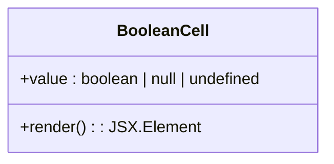
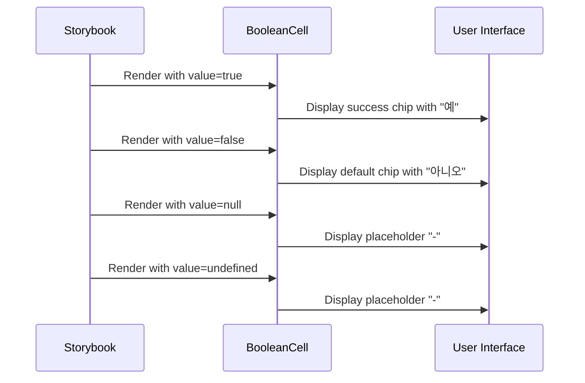

# BooleanCell

<cite>
**Referenced Files in This Document**   
- [BooleanCell.tsx](file://packages/ui/src/components/ui/data-display/cells/BooleanCell/BooleanCell.tsx)
- [BooleanCell.stories.tsx](file://packages/ui/src/components/ui/data-display/cells/BooleanCell/BooleanCell.stories.tsx)
</cite>

## Table of Contents
1. [Introduction](#introduction)
2. [Core Components](#core-components)
3. [Visual Representation Options](#visual-representation-options)
4. [Props Interface](#props-interface)
5. [Usage Patterns](#usage-patterns)
6. [Integration with Data Systems](#integration-with-data-systems)
7. [Null and Undefined Value Handling](#null-and-undefined-value-handling)
8. [Theming and Styling](#theming-and-styling)
9. [Internationalization Considerations](#internationalization-considerations)
10. [Performance Optimization](#performance-optimization)
11. [Responsive Behavior in Tables](#responsive-behavior-in-tables)

## Introduction
The BooleanCell component is a specialized UI element designed for displaying boolean values in tabular and data display contexts. It provides a consistent, accessible way to render true/false values with visual differentiation through color coding and text labels. The component is part of the shared UI library and is optimized for use in data grids, tables, and other information-dense interfaces where boolean state visualization is required.

## Core Components

The BooleanCell component is implemented as a functional React component that accepts a boolean value and renders it with appropriate visual treatment. The component handles various states including true, false, null, and undefined values, ensuring consistent presentation across different data scenarios.



**Diagram sources**
- [BooleanCell.tsx](file://packages/ui/src/components/ui/data-display/cells/BooleanCell/BooleanCell.tsx#L3-L19)

**Section sources**
- [BooleanCell.tsx](file://packages/ui/src/components/ui/data-display/cells/BooleanCell/BooleanCell.tsx#L1-L19)

## Visual Representation Options

The BooleanCell component provides distinct visual treatments for different boolean states. True values are displayed with a success-colored chip, while false values appear with a default-colored chip. This color-coding system provides immediate visual feedback about the state of the data. For null or undefined values, the component displays a neutral placeholder.

```mermaid
flowchart TD
A[Input Value] --> B{Value Check}
B --> |null or undefined| C[Render Placeholder "-"]
B --> |boolean value| D[Convert to boolean]
D --> E{Value is true?}
E --> |Yes| F[Render success-colored chip with "예"]
E --> |No| G[Render default-colored chip with "아니오"]
```

**Diagram sources**
- [BooleanCell.tsx](file://packages/ui/src/components/ui/data-display/cells/BooleanCell/BooleanCell.tsx#L8-L18)

## Props Interface

The BooleanCell component accepts a single prop that represents the boolean value to be displayed. The interface is designed to be simple and focused on its primary purpose of boolean value visualization.

```typescript
interface BooleanCellProps {
    value: boolean | null | undefined;
}
```

The component is designed to be type-safe and handles all possible states of boolean data, including the absence of data (null/undefined).

**Section sources**
- [BooleanCell.tsx](file://packages/ui/src/components/ui/data-display/cells/BooleanCell/BooleanCell.tsx#L3-L5)

## Usage Patterns

The BooleanCell component is typically used in data table contexts where boolean flags need to be displayed. It can be used directly with various boolean states as demonstrated in the Storybook examples.



**Diagram sources**
- [BooleanCell.stories.tsx](file://packages/ui/src/components/ui/data-display/cells/BooleanCell/BooleanCell.stories.tsx#L24-L52)

## Integration with Data Systems

The BooleanCell component integrates seamlessly with data fetching libraries and form systems. When used with data fetching libraries, it can directly consume boolean values from API responses. In form systems, it can display the current state of boolean fields without requiring additional transformation.

The component's simple props interface makes it compatible with various data architectures and state management approaches, including React Query, Redux, and form libraries like React Hook Form.

**Section sources**
- [BooleanCell.tsx](file://packages/ui/src/components/ui/data-display/cells/BooleanCell/BooleanCell.tsx#L7-L19)

## Null and Undefined Value Handling

The BooleanCell component includes robust handling for null and undefined values, which are common in real-world data scenarios. When the value prop is null or undefined, the component renders a neutral placeholder ("-"") instead of attempting to display a boolean state.

This approach prevents UI errors and provides a consistent user experience when dealing with incomplete or missing data. The placeholder indicates to users that a value exists in the data structure but is currently unset.

**Section sources**
- [BooleanCell.tsx](file://packages/ui/src/components/ui/data-display/cells/BooleanCell/BooleanCell.tsx#L8-L10)

## Theming and Styling

The BooleanCell component leverages the underlying UI library's theming system through the Chip component. It uses the "success" color variant for true values and the "default" variant for false values, with a small size ("sm") and flat appearance.

The styling is consistent with the overall design system and automatically adapts to theme changes. The component does not expose direct styling props but inherits its appearance from the global theme configuration.

**Section sources**
- [BooleanCell.tsx](file://packages/ui/src/components/ui/data-display/cells/BooleanCell/BooleanCell.tsx#L15-L17)

## Internationalization Considerations

The BooleanCell component currently displays boolean values using Korean text labels ("예" for true and "아니오" for false). This presents a limitation for international applications.

For proper internationalization support, the component would need to be enhanced to accept customizable labels or integrate with a translation system. This would allow the display text to be adapted to different languages based on user preferences or application settings.

**Section sources**
- [BooleanCell.tsx](file://packages/ui/src/components/ui/data-display/cells/BooleanCell/BooleanCell.tsx#L16)

## Performance Optimization

The BooleanCell component is optimized for performance in data-intensive contexts such as tables with many rows. As a simple functional component with minimal rendering logic, it has a low computational overhead.

The component does not include unnecessary re-renders or complex state management, making it suitable for use in virtualized lists and large datasets. Its pure functional nature allows React to optimize rendering efficiently.

**Section sources**
- [BooleanCell.tsx](file://packages/ui/src/components/ui/data-display/cells/BooleanCell/BooleanCell.tsx#L7-L19)

## Responsive Behavior in Tables

The BooleanCell component is designed to work effectively in table contexts with responsive layouts. The small chip size ensures that boolean values don't consume excessive horizontal space, which is important in dense data displays.

The component adapts well to different screen sizes and table configurations, maintaining readability and visual consistency across devices. In narrow columns, the compact chip format prevents text wrapping issues that could affect table layout.

**Section sources**
- [BooleanCell.tsx](file://packages/ui/src/components/ui/data-display/cells/BooleanCell/BooleanCell.tsx#L15-L17)