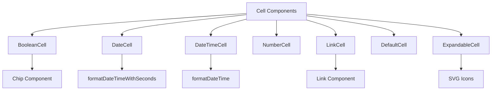
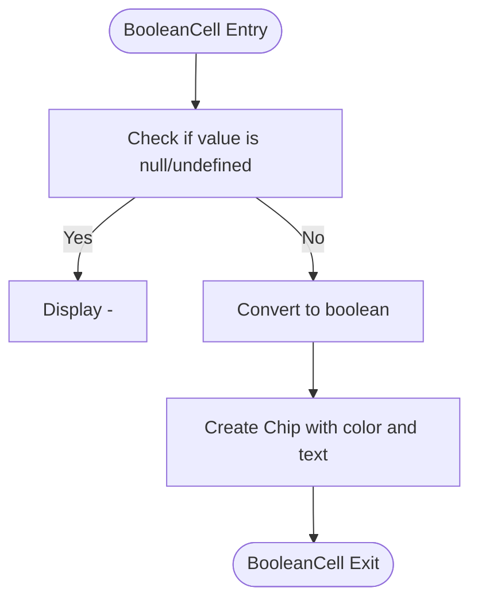
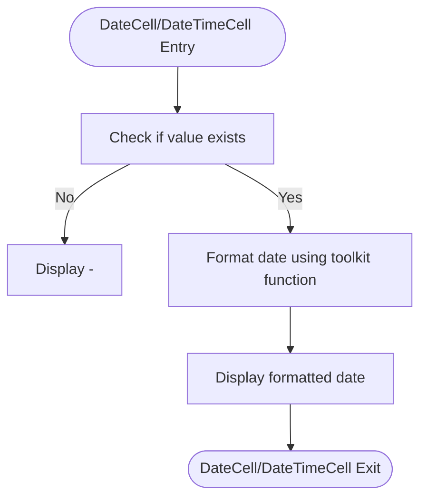
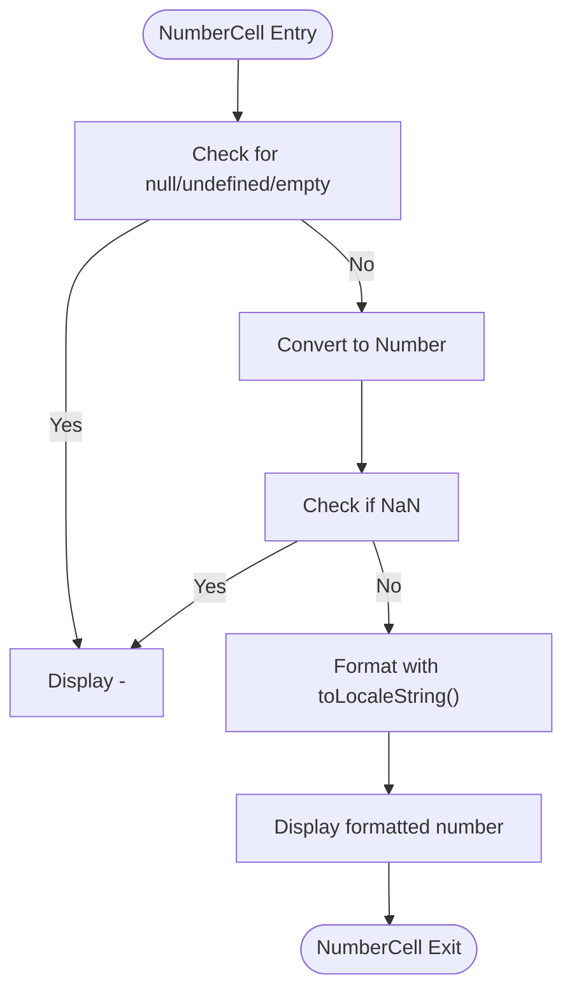
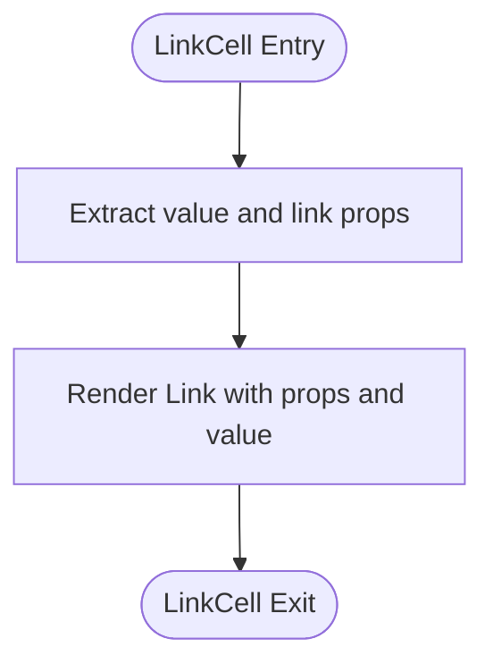
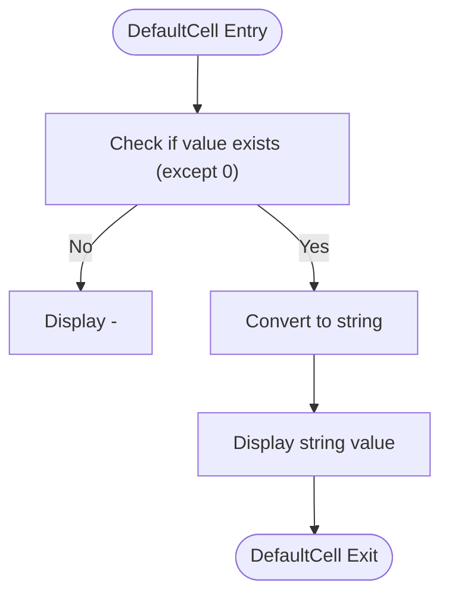
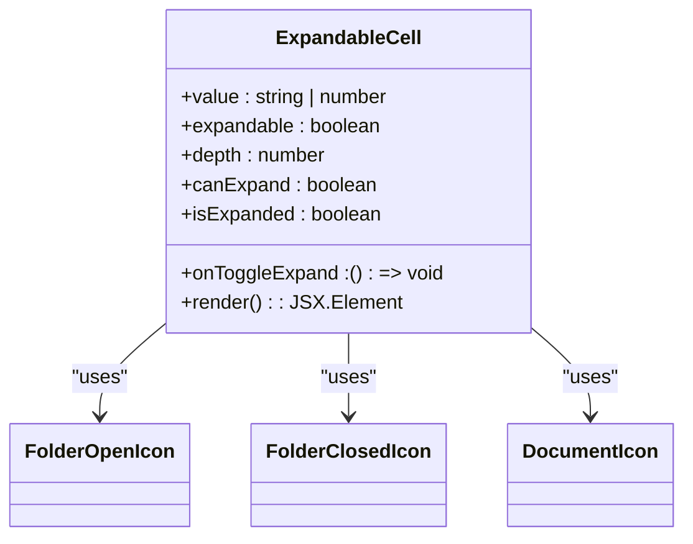
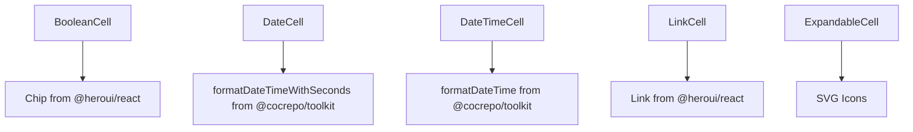

# Cell Components

<cite>
**Referenced Files in This Document**   
- [BooleanCell.tsx](file://node_modules/@cocrepo/ui/src/components/cell/BooleanCell/BooleanCell.tsx)
- [DateCell.tsx](file://node_modules/@cocrepo/ui/src/components/cell/DateCell/DateCell.tsx)
- [DateTimeCell.tsx](file://node_modules/@cocrepo/ui/src/components/cell/DateTimeCell/DateTimeCell.tsx)
- [NumberCell.tsx](file://node_modules/@cocrepo/ui/src/components/cell/NumberCell/NumberCell.tsx)
- [LinkCell.tsx](file://node_modules/@cocrepo/ui/src/components/cell/LinkCell/LinkCell.tsx)
- [DefaultCell.tsx](file://node_modules/@cocrepo/ui/src/components/cell/DefaultCell/DefaultCell.tsx)
- [ExpandableCell.tsx](file://node_modules/@cocrepo/ui/src/components/cell/ExpandableCell/ExpandableCell.tsx)
</cite>

## Table of Contents
1. [Introduction](#introduction)
2. [Core Components](#core-components)
3. [Architecture Overview](#architecture-overview)
4. [Detailed Component Analysis](#detailed-component-analysis)
5. [Dependency Analysis](#dependency-analysis)
6. [Performance Considerations](#performance-considerations)
7. [Troubleshooting Guide](#troubleshooting-guide)
8. [Conclusion](#conclusion)

## Introduction
The cell components in the shared-frontend library provide a standardized way to display data in tabular or list views. These components handle various data types including boolean, date, datetime, number, and string values, with specialized formatting and presentation logic for each type. The components are designed to be reusable across different applications and integrate seamlessly with data fetching libraries and backend data models.

## Core Components

The cell components library consists of several specialized components designed to handle different data types and display requirements. Each component follows a consistent pattern of handling null/undefined values, formatting data appropriately, and providing accessibility features.

**Section sources**
- [BooleanCell.tsx](file://node_modules/@cocrepo/ui/src/components/cell/BooleanCell/BooleanCell.tsx)
- [DateCell.tsx](file://node_modules/@cocrepo/ui/src/components/cell/DateCell/DateCell.tsx)
- [DateTimeCell.tsx](file://node_modules/@cocrepo/ui/src/components/cell/DateTimeCell/DateTimeCell.tsx)
- [NumberCell.tsx](file://node_modules/@cocrepo/ui/src/components/cell/NumberCell/NumberCell.tsx)
- [LinkCell.tsx](file://node_modules/@cocrepo/ui/src/components/cell/LinkCell/LinkCell.tsx)
- [DefaultCell.tsx](file://node_modules/@cocrepo/ui/src/components/cell/DefaultCell/DefaultCell.tsx)
- [ExpandableCell.tsx](file://node_modules/@cocrepo/ui/src/components/cell/ExpandableCell/ExpandableCell.tsx)

## Architecture Overview

The cell components follow a modular architecture where each component is responsible for handling a specific data type or display pattern. The components are designed to be used in data tables and lists, providing consistent formatting and presentation across the application.

**Diagram sources**
- [BooleanCell.tsx](file://node_modules/@cocrepo/ui/src/components/cell/BooleanCell/BooleanCell.tsx)
- [DateCell.tsx](file://node_modules/@cocrepo/ui/src/components/cell/DateCell/DateCell.tsx)
- [DateTimeCell.tsx](file://node_modules/@cocrepo/ui/src/components/cell/DateTimeCell/DateTimeCell.tsx)
- [NumberCell.tsx](file://node_modules/@cocrepo/ui/src/components/cell/NumberCell/NumberCell.tsx)
- [LinkCell.tsx](file://node_modules/@cocrepo/ui/src/components/cell/LinkCell/LinkCell.tsx)
- [DefaultCell.tsx](file://node_modules/@cocrepo/ui/src/components/cell/DefaultCell/DefaultCell.tsx)
- [ExpandableCell.tsx](file://node_modules/@cocrepo/ui/src/components/cell/ExpandableCell/ExpandableCell.tsx)

## Detailed Component Analysis

### BooleanCell Analysis
The BooleanCell component displays boolean values with visual indicators using the Chip component. It handles null and undefined values by displaying a dash (-) and converts the boolean value to a Korean text representation ("예" for true, "아니오" for false).

**Diagram sources**
- [BooleanCell.tsx](file://node_modules/@cocrepo/ui/src/components/cell/BooleanCell/BooleanCell.tsx)

**Section sources**
- [BooleanCell.tsx](file://node_modules/@cocrepo/ui/src/components/cell/BooleanCell/BooleanCell.tsx)

### DateCell and DateTimeCell Analysis
The DateCell and DateTimeCell components handle date and datetime values respectively. Both components use formatting functions from the @cocrepo/toolkit to display dates in a consistent format. They handle null/undefined values by displaying a dash (-) and accept both string and Date objects as input.

**Diagram sources**
- [DateCell.tsx](file://node_modules/@cocrepo/ui/src/components/cell/DateCell/DateCell.tsx)
- [DateTimeCell.tsx](file://node_modules/@cocrepo/ui/src/components/cell/DateTimeCell/DateTimeCell.tsx)

**Section sources**
- [DateCell.tsx](file://node_modules/@cocrepo/ui/src/components/cell/DateCell/DateCell.tsx)
- [DateTimeCell.tsx](file://node_modules/@cocrepo/ui/src/components/cell/DateTimeCell/DateTimeCell.tsx)

### NumberCell Analysis
The NumberCell component formats numeric values with locale-specific number formatting. It handles various edge cases including null, undefined, empty string, and non-numeric values by displaying a dash (-). Valid numbers are displayed with thousand separators using toLocaleString().

**Diagram sources**
- [NumberCell.tsx](file://node_modules/@cocrepo/ui/src/components/cell/NumberCell/NumberCell.tsx)

**Section sources**
- [NumberCell.tsx](file://node_modules/@cocrepo/ui/src/components/cell/NumberCell/NumberCell.tsx)

### LinkCell Analysis
The LinkCell component displays text as a clickable link, extending the Link component's props to include a value prop. It separates the value from other link props and renders the link with the value as its content.

**Diagram sources**
- [LinkCell.tsx](file://node_modules/@cocrepo/ui/src/components/cell/LinkCell/LinkCell.tsx)

**Section sources**
- [LinkCell.tsx](file://node_modules/@cocrepo/ui/src/components/cell/LinkCell/LinkCell.tsx)

### DefaultCell Analysis
The DefaultCell component serves as a fallback for displaying string or number values. It handles falsy values (except 0) by displaying a dash (-) and converts the value to a string for display.

**Diagram sources**
- [DefaultCell.tsx](file://node_modules/@cocrepo/ui/src/components/cell/DefaultCell/DefaultCell.tsx)

**Section sources**
- [DefaultCell.tsx](file://node_modules/@cocrepo/ui/src/components/cell/DefaultCell/DefaultCell.tsx)

### ExpandableCell Analysis
The ExpandableCell component provides a hierarchical display with expandable/collapsible functionality, commonly used in tree views. It supports indentation based on depth, visual indicators for expandable items, and connection lines between parent and child items.

**Diagram sources**
- [ExpandableCell.tsx](file://node_modules/@cocrepo/ui/src/components/cell/ExpandableCell/ExpandableCell.tsx)

**Section sources**
- [ExpandableCell.tsx](file://node_modules/@cocrepo/ui/src/components/cell/ExpandableCell/ExpandableCell.tsx)

## Dependency Analysis

The cell components have dependencies on external libraries for specific functionality:

**Diagram sources**
- [BooleanCell.tsx](file://node_modules/@cocrepo/ui/src/components/cell/BooleanCell/BooleanCell.tsx)
- [DateCell.tsx](file://node_modules/@cocrepo/ui/src/components/cell/DateCell/DateCell.tsx)
- [DateTimeCell.tsx](file://node_modules/@cocrepo/ui/src/components/cell/DateTimeCell/DateTimeCell.tsx)
- [LinkCell.tsx](file://node_modules/@cocrepo/ui/src/components/cell/LinkCell/LinkCell.tsx)
- [ExpandableCell.tsx](file://node_modules/@cocrepo/ui/src/components/cell/ExpandableCell/ExpandableCell.tsx)

**Section sources**
- [BooleanCell.tsx](file://node_modules/@cocrepo/ui/src/components/cell/BooleanCell/BooleanCell.tsx)
- [DateCell.tsx](file://node_modules/@cocrepo/ui/src/components/cell/DateCell/DateCell.tsx)
- [DateTimeCell.tsx](file://node_modules/@cocrepo/ui/src/components/cell/DateTimeCell/DateTimeCell.tsx)
- [NumberCell.tsx](file://node_modules/@cocrepo/ui/src/components/cell/NumberCell/NumberCell.tsx)
- [LinkCell.tsx](file://node_modules/@cocrepo/ui/src/components/cell/LinkCell/LinkCell.tsx)
- [DefaultCell.tsx](file://node_modules/@cocrepo/ui/src/components/cell/DefaultCell/DefaultCell.tsx)
- [ExpandableCell.tsx](file://node_modules/@cocrepo/ui/src/components/cell/ExpandableCell/ExpandableCell.tsx)

## Performance Considerations

The cell components are designed with performance in mind:

1. **Minimal Re-renders**: Components use simple props and avoid unnecessary state
2. **Efficient Formatting**: Date formatting functions are optimized for performance
3. **Lightweight SVGs**: Icons are implemented as lightweight SVG components
4. **Conditional Rendering**: Connection lines and icons are only rendered when needed

The ExpandableCell component in particular uses inline styles for dynamic indentation, which can be optimized by using CSS classes with predefined indentation levels for better performance in large lists.

## Troubleshooting Guide

Common issues and solutions for cell components:

1. **Date values not formatting correctly**: Ensure date strings are in ISO format or valid Date objects
2. **Boolean values displaying as true/false instead of 예/아니오**: Verify the value is a boolean type, not a string
3. **Number formatting not using locale separators**: Check that the value is a valid number
4. **ExpandableCell hierarchy lines not aligning properly**: Verify the depth prop is correctly set for each level
5. **LinkCell not responding to clicks**: Ensure the href prop is provided in the link props

**Section sources**
- [BooleanCell.tsx](file://node_modules/@cocrepo/ui/src/components/cell/BooleanCell/BooleanCell.tsx)
- [DateCell.tsx](file://node_modules/@cocrepo/ui/src/components/cell/DateCell/DateCell.tsx)
- [DateTimeCell.tsx](file://node_modules/@cocrepo/ui/src/components/cell/DateTimeCell/DateTimeCell.tsx)
- [NumberCell.tsx](file://node_modules/@cocrepo/ui/src/components/cell/NumberCell/NumberCell.tsx)
- [LinkCell.tsx](file://node_modules/@cocrepo/ui/src/components/cell/LinkCell/LinkCell.tsx)
- [DefaultCell.tsx](file://node_modules/@cocrepo/ui/src/components/cell/DefaultCell/DefaultCell.tsx)
- [ExpandableCell.tsx](file://node_modules/@cocrepo/ui/src/components/cell/ExpandableCell/ExpandableCell.tsx)

## Conclusion

The cell components in the shared-frontend library provide a comprehensive set of tools for displaying data in various formats. Each component handles its specific data type with appropriate formatting and presentation, while maintaining consistency in handling null/undefined values and providing accessibility features. The components are designed to be reusable, performant, and easily integrated into various UI contexts, particularly data tables and hierarchical views.