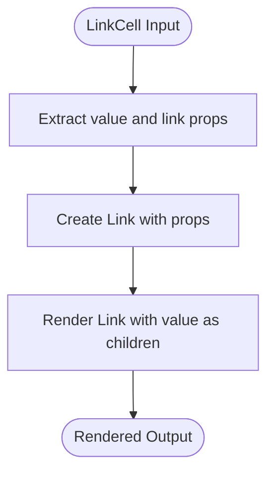

# Data Display Components

<cite>
**Referenced Files in This Document**   
- [BooleanCell.tsx](file://packages/ui/src/components/cell/BooleanCell/BooleanCell.tsx)
- [DateCell.tsx](file://packages/ui/src/components/cell/DateCell/DateCell.tsx)
- [DateTimeCell.tsx](file://packages/ui/src/components/cell/DateTimeCell/DateTimeCell.tsx)
- [LinkCell.tsx](file://packages/ui/src/components/cell/LinkCell/LinkCell.tsx)
- [DefaultCell.tsx](file://packages/ui/src/components/cell/DefaultCell/DefaultCell.tsx)
- [NumberCell.tsx](file://packages/ui/src/components/cell/NumberCell/NumberCell.tsx)
- [index.ts](file://packages/ui/src/components/cell/index.ts)
- [Table.tsx](file://packages/ui/src/components/ui/Table/Table.tsx)
- [List.tsx](file://packages/ui/src/components/ui/List/List.tsx)
- [DataGrid.tsx](file://packages/ui/src/components/ui/DataGrid/DataGrid.tsx)
- [formatDateTime](file://packages/toolkit/src/utils/dateTime.ts)
- [formatDateTimeWithSeconds](file://packages/toolkit/src/utils/dateTime.ts)
</cite>

## Table of Contents
1. [Introduction](#introduction)
2. [Cell Components](#cell-components)
   - [BooleanCell](#booleancell)
   - [DateCell](#datecell)
   - [DateTimeCell](#datetimecell)
   - [LinkCell](#linkcell)
   - [NumberCell](#numbercell)
   - [DefaultCell](#defaultcell)
3. [Data Presentation Components](#data-presentation-components)
   - [Table](#table)
   - [List](#list)
   - [DataGrid](#datagrid)
4. [Data Type Handling and Formatting](#data-type-handling-and-formatting)
5. [Integration with Data Fetching Libraries](#integration-with-data-fetching-libraries)
6. [Relationship with Backend Data Models](#relationship-with-backend-data-models)
7. [Common Issues and Solutions](#common-issues-and-solutions)
   - [Performance Optimization](#performance-optimization)
   - [Accessibility](#accessibility)
   - [Responsive Design](#responsive-design)
8. [Conclusion](#conclusion)

## Introduction

The data display components in the shared-frontend library provide a consistent and reusable way to present data across applications. These components are designed to handle various data types, format values appropriately, and integrate seamlessly with data fetching libraries and backend models. The component library follows a modular architecture, separating cell-level formatting from data presentation structures like tables and lists.

The components are organized in the `@cocrepo/ui` package under the `components/cell` directory, with each cell type handling specific data formatting concerns. These components are then used within higher-level presentation components like Table, List, and DataGrid to create comprehensive data displays.

**Section sources**
- [index.ts](file://packages/ui/src/components/cell/index.ts)

## Cell Components

The cell components are atomic building blocks for displaying individual data values. Each cell type handles a specific data format, providing consistent presentation and handling edge cases like null or undefined values.

### BooleanCell

The BooleanCell component renders boolean values with visual indicators. It accepts a boolean value and displays it using appropriate visual representation, typically using checkmarks or X marks to indicate true/false states. The component handles null and undefined values by displaying a placeholder.

**Diagram sources**
- [BooleanCell.tsx](file://packages/ui/src/components/cell/BooleanCell/BooleanCell.tsx)

### DateCell

The DateCell component formats date values for display, showing only the date portion without time information. It accepts date strings, Date objects, or null/undefined values. The component uses the `formatDateTimeWithSeconds` utility from `@cocrepo/toolkit` to format the date in a consistent format. For null, undefined, or invalid values, it displays a placeholder.

**Diagram sources**
- [DateCell.tsx](file://packages/ui/src/components/cell/DateCell/DateCell.tsx)
- [formatDateTimeWithSeconds](file://packages/toolkit/src/utils/dateTime.ts)

**Section sources**
- [DateCell.tsx](file://packages/ui/src/components/cell/DateCell/DateCell.tsx)

### DateTimeCell

The DateTimeCell component displays both date and time information. Similar to DateCell, it accepts various date input types and uses the `formatDateTime` utility from `@cocrepo/toolkit` for formatting. This component is suitable for displaying timestamps and other datetime values where both date and time are relevant.

**Diagram sources**
- [DateTimeCell.tsx](file://packages/ui/src/components/cell/DateTimeCell/DateTimeCell.tsx)
- [formatDateTime](file://packages/toolkit/src/utils/dateTime.ts)

**Section sources**
- [DateTimeCell.tsx](file://packages/ui/src/components/cell/DateTimeCell/DateTimeCell.tsx)

### LinkCell

The LinkCell component renders clickable links with customizable styling. It extends the Link component from `@heroui/react`, accepting both a value (the link text) and standard link properties. This component is used for displaying URLs, navigation links, and other clickable content within data displays.

**Diagram sources**
- [LinkCell.tsx](file://packages/ui/src/components/cell/LinkCell/LinkCell.tsx)

**Section sources**
- [LinkCell.tsx](file://packages/ui/src/components/cell/LinkCell/LinkCell.tsx)

### NumberCell

The NumberCell component formats numeric values with locale-specific number formatting. It accepts numbers, numeric strings, or null/undefined values. The component converts the input to a number, validates it, and uses `toLocaleString()` to format the number with appropriate grouping separators. Invalid or missing values are displayed as placeholders.

**Diagram sources**
- [NumberCell.tsx](file://packages/ui/src/components/cell/NumberCell/NumberCell.tsx)

**Section sources**
- [NumberCell.tsx](file://packages/ui/src/components/cell/NumberCell/NumberCell.tsx)

### DefaultCell

The DefaultCell component provides basic formatting for string and numeric values. It handles null, undefined, or empty values by displaying a placeholder, while converting other values to strings for display. This component serves as a fallback for data types not covered by specialized cell components.

**Diagram sources**
- [DefaultCell.tsx](file://packages/ui/src/components/cell/DefaultCell/DefaultCell.tsx)

**Section sources**
- [DefaultCell.tsx](file://packages/ui/src/components/cell/DefaultCell/DefaultCell.tsx)

## Data Presentation Components

The data presentation components provide structure for displaying collections of data, typically using the cell components to format individual values.

### Table

The Table component displays data in a tabular format with rows and columns. It integrates with cell components to format values according to their data types. The component supports sorting, pagination, and responsive design for mobile views. It typically works with data fetching libraries like React Query to handle data loading and error states.

**Diagram sources**
- [Table.tsx](file://packages/ui/src/components/ui/Table/Table.tsx)

### List

The List component presents data in a vertical list format, suitable for mobile interfaces and dense information displays. Each list item can contain multiple data points formatted with appropriate cell components. The component supports various layout options and interactive elements.

**Diagram sources**
- [List.tsx](file://packages/ui/src/components/ui/List/List.tsx)

### DataGrid

The DataGrid component provides an advanced data display with features like column resizing, filtering, and virtualized rendering for large datasets. It combines the functionality of Table with enhanced performance characteristics and user interaction capabilities. The component uses cell components to format individual cells and supports integration with backend data models.

**Diagram sources**
- [DataGrid.tsx](file://packages/ui/src/components/ui/DataGrid/DataGrid.tsx)

## Data Type Handling and Formatting

The data display components handle various data types through specialized cell components that format values appropriately. Each cell type has specific handling for null, undefined, and invalid values, consistently displaying a placeholder ("-") in these cases.

The formatting follows consistent patterns across components:
- Date and DateTime values use utilities from `@cocrepo/toolkit` for consistent formatting
- Numbers use `toLocaleString()` for locale-appropriate formatting
- Boolean values use visual indicators
- Links use the `@heroui/react` Link component with accessible styling

The components are designed to handle internationalization through the underlying formatting utilities and React's context system, allowing for locale-specific formatting based on user preferences.

**Section sources**
- [DateCell.tsx](file://packages/ui/src/components/cell/DateCell/DateCell.tsx)
- [DateTimeCell.tsx](file://packages/ui/src/components/cell/DateTimeCell/DateTimeCell.tsx)
- [NumberCell.tsx](file://packages/ui/src/components/cell/NumberCell/NumberCell.tsx)
- [formatDateTime](file://packages/toolkit/src/utils/dateTime.ts)
- [formatDateTimeWithSeconds](file://packages/toolkit/src/utils/dateTime.ts)

## Integration with Data Fetching Libraries

The data display components are designed to work seamlessly with data fetching libraries like React Query (`@tanstack/react-query`). They handle loading states, error states, and empty data through placeholder rendering. When integrated with React Query, the components can display loading skeletons while data is being fetched and appropriate error messages when requests fail.

The components typically receive data through props from parent components that manage the data fetching, allowing for separation of concerns between data retrieval and data presentation. This pattern enables efficient data handling and caching while maintaining clean component interfaces.

**Section sources**
- [Table.tsx](file://packages/ui/src/components/ui/Table/Table.tsx)
- [List.tsx](file://packages/ui/src/components/ui/List/List.tsx)
- [DataGrid.tsx](file://packages/ui/src/components/ui/DataGrid/DataGrid.tsx)

## Relationship with Backend Data Models

The data display components are designed to work with backend data models defined in the shared-schema package. The components handle the transformation of raw API responses into user-friendly displays, accounting for the structure of data transfer objects (DTOs) and entity models.

The components handle null and undefined values gracefully, which commonly occur in partial API responses or optional fields in the data model. They also handle type coercion, converting string representations of dates and numbers into appropriate formats for display.

For internationalization, the components rely on consistent data formatting from the backend and locale detection in the frontend to present data in the user's preferred language and format.

**Section sources**
- [BooleanCell.tsx](file://packages/ui/src/components/cell/BooleanCell/BooleanCell.tsx)
- [DateCell.tsx](file://packages/ui/src/components/cell/DateCell/DateCell.tsx)
- [DateTimeCell.tsx](file://packages/ui/src/components/cell/DateTimeCell/DateTimeCell.tsx)
- [NumberCell.tsx](file://packages/ui/src/components/cell/NumberCell/NumberCell.tsx)

## Common Issues and Solutions

### Performance Optimization

For large datasets, the data display components implement virtualization and memoization techniques to maintain performance. The DataGrid component uses virtualized rendering to only render visible rows, significantly improving performance with thousands of records. All components use React.memo to prevent unnecessary re-renders when props haven't changed.

**Diagram sources**
- [DataGrid.tsx](file://packages/ui/src/components/ui/DataGrid/DataGrid.tsx)
- [Cell components](file://packages/ui/src/components/cell/)

### Accessibility

The data display components follow accessibility best practices, ensuring usability for screen readers and keyboard navigation. Table components use proper ARIA labels and semantic HTML elements. Interactive elements like LinkCell include appropriate focus states and keyboard event handling. All visual indicators for boolean values include text alternatives for screen readers.

**Section sources**
- [Table.tsx](file://packages/ui/src/components/ui/Table/Table.tsx)
- [LinkCell.tsx](file://packages/ui/src/components/cell/LinkCell/LinkCell.tsx)
- [BooleanCell.tsx](file://packages/ui/src/components/cell/BooleanCell/BooleanCell.tsx)

### Responsive Design

The components adapt to different screen sizes through responsive design techniques. On mobile views, tables may transform into stacked card layouts or use horizontal scrolling. Lists are optimized for touch interaction with appropriate tap targets. The components use CSS media queries and responsive utility classes to adjust layouts based on viewport size.

**Diagram sources**
- [Table.tsx](file://packages/ui/src/components/ui/Table/Table.tsx)
- [List.tsx](file://packages/ui/src/components/ui/List/List.tsx)

## Conclusion

The data display components in the shared-frontend library provide a comprehensive solution for presenting data in web applications. Through specialized cell components and flexible presentation structures, the library enables consistent, accessible, and performant data displays across different use cases. The components are designed with internationalization, accessibility, and responsiveness in mind, making them suitable for diverse user bases and device types. By following established patterns for data handling and formatting, the components ensure a cohesive user experience while maintaining flexibility for customization and integration with various data sources.