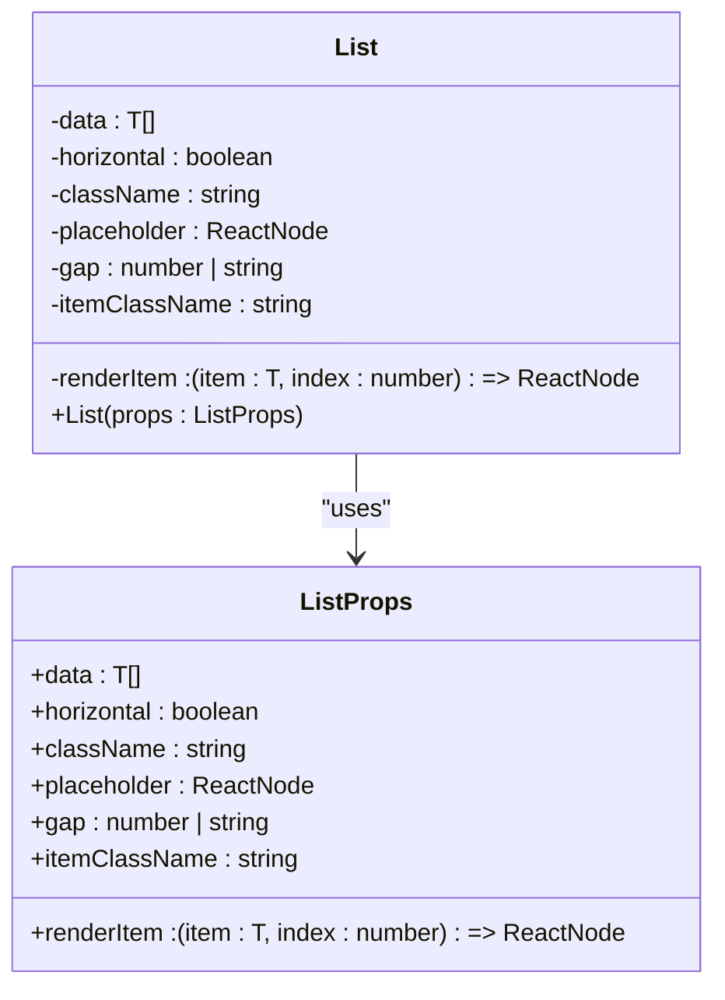
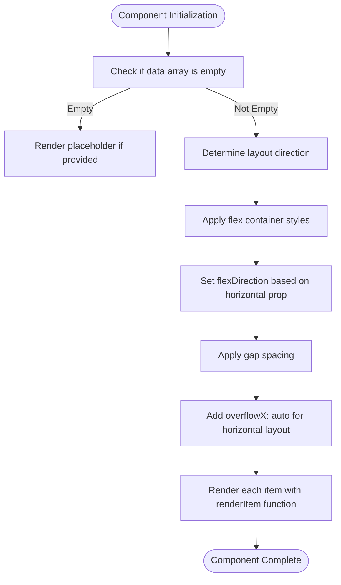
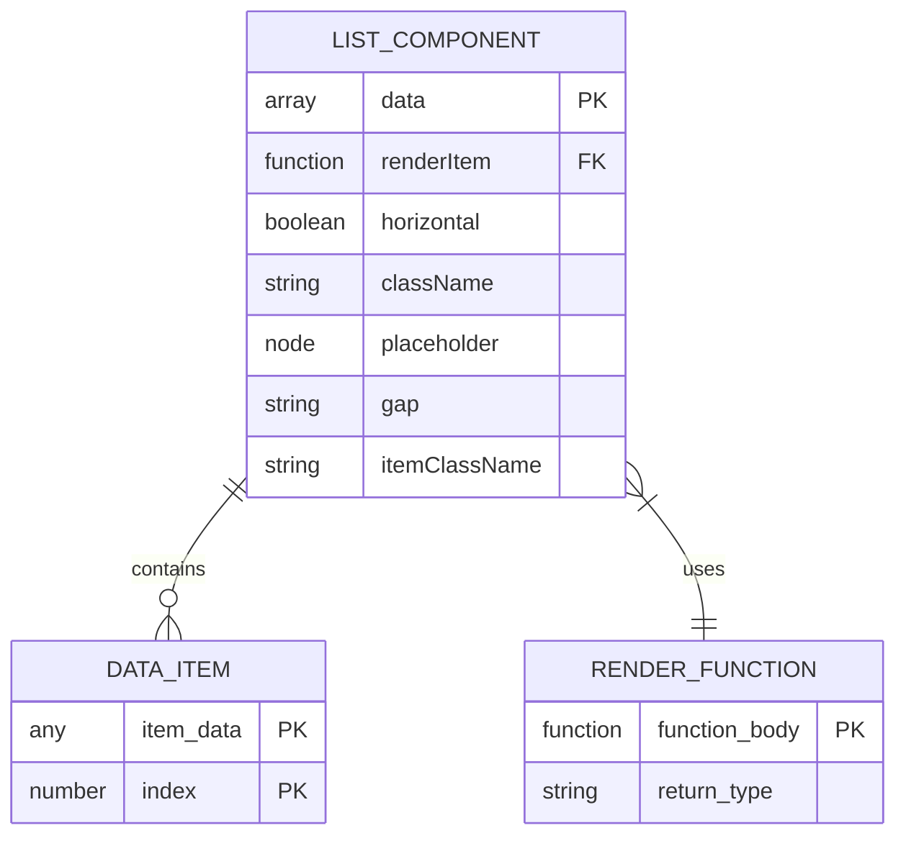

# List Components

<cite>
**Referenced Files in This Document**   
- [List.tsx](file://packages/ui/src/components/ui/List/List.tsx)
- [List.stories.tsx](file://packages/ui/src/components/ui/List/List.stories.tsx)
</cite>

## Table of Contents
1. [Introduction](#introduction)
2. [Core Implementation](#core-implementation)
3. [Item Rendering Patterns](#item-rendering-patterns)
4. [Layout Configurations](#layout-configurations)
5. [Usage Scenarios](#usage-scenarios)
6. [Customization Options](#customization-options)
7. [Accessibility Features](#accessibility-features)
8. [Performance Considerations](#performance-considerations)
9. [Integration Patterns](#integration-patterns)
10. [Common Issues and Solutions](#common-issues-and-solutions)

## Introduction
The List component in the @cocrepo/ui library provides a flexible and reusable solution for rendering collections of data items in both vertical and horizontal layouts. Designed with accessibility and responsiveness in mind, this component supports various rendering patterns, spacing configurations, and interaction models. It serves as a foundational building block for displaying data collections across different applications within the ecosystem.

**Section sources**
- [List.tsx](file://packages/ui/src/components/ui/List/List.tsx#L1-L51)

## Core Implementation
The List component is implemented as a generic React component that accepts an array of data items and a render function to display each item. The component handles empty states through optional placeholder content and supports both vertical and horizontal layout orientations. It uses CSS Flexbox for layout management and applies configurable spacing between items.

**Diagram sources**
- [List.tsx](file://packages/ui/src/components/ui/List/List.tsx#L4-L12)

**Section sources**
- [List.tsx](file://packages/ui/src/components/ui/List/List.tsx#L1-L51)

## Item Rendering Patterns
The List component employs a render prop pattern, allowing consumers to define custom rendering logic for each item in the collection. The renderItem function receives both the item data and its index, enabling contextual rendering based on position. Each item is wrapped in a div element with a unique key generated using UUID v4 to ensure stable rendering during updates.

**Section sources**
- [List.tsx](file://packages/ui/src/components/ui/List/List.tsx#L43-L47)

## Layout Configurations
The component supports both vertical and horizontal layouts through the horizontal prop. When horizontal layout is enabled, the component automatically applies overflow scrolling behavior. The gap between items can be customized using the gap prop, which accepts any valid CSS gap value. The component's container styling is fully configurable through the className prop, while individual item containers can be styled using the itemClassName prop.

**Diagram sources**
- [List.tsx](file://packages/ui/src/components/ui/List/List.tsx#L29-L37)

**Section sources**
- [List.tsx](file://packages/ui/src/components/ui/List/List.tsx#L29-L37)

## Usage Scenarios
The List component can be used in various scenarios including data displays, navigation menus, card collections, and form options. It supports rendering simple text lists, complex card layouts, and interactive elements. The component handles empty states gracefully by displaying optional placeholder content when the data array is empty.

**Section sources**
- [List.stories.tsx](file://packages/ui/src/components/ui/List/List.stories.tsx#L63-L389)

## Customization Options
Consumers can customize the List component through several props:
- **data**: The array of items to render
- **renderItem**: Function to render each item
- **horizontal**: Boolean to enable horizontal layout
- **className**: CSS classes for the container
- **placeholder**: Content to display when data is empty
- **gap**: Spacing between items
- **itemClassName**: CSS classes for individual item containers

**Diagram sources**
- [List.tsx](file://packages/ui/src/components/ui/List/List.tsx#L4-L12)

**Section sources**
- [List.tsx](file://packages/ui/src/components/ui/List/List.tsx#L4-L12)

## Accessibility Features
The List component follows accessibility best practices by using semantic HTML structure with div elements appropriately organized. While the component itself doesn't provide built-in keyboard navigation, it enables accessible implementations through proper rendering patterns. Consumers should ensure that interactive elements within list items are keyboard accessible and properly labeled.

**Section sources**
- [List.tsx](file://packages/ui/src/components/ui/List/List.tsx#L42-L48)

## Performance Considerations
The component uses efficient rendering patterns with React's built-in optimization mechanisms. However, for large datasets, consumers should consider implementing virtualization or pagination to maintain performance. The use of UUID generation for keys, while ensuring uniqueness, may impact performance with very large lists and could be optimized by using stable item identifiers when available.

**Section sources**
- [List.tsx](file://packages/ui/src/components/ui/List/List.tsx#L44)

## Integration Patterns
The List component integrates well with various data models and state management patterns. It can be used with static data, API responses, or store-connected data. The render prop pattern allows seamless integration with navigation systems by enabling the creation of link-wrapped list items. The component works effectively with theme providers and styling systems through its className prop.

**Section sources**
- [List.stories.tsx](file://packages/ui/src/components/ui/List/List.stories.tsx#L73-L378)

## Common Issues and Solutions
Common issues with the List component include performance degradation with large datasets, improper key generation, and styling conflicts. Solutions include implementing virtual scrolling for long lists, using stable keys instead of UUIDs when possible, and carefully managing CSS class conflicts through proper scoping. For horizontal lists, ensuring adequate container width and handling touch scrolling on mobile devices are important considerations.

**Section sources**
- [List.tsx](file://packages/ui/src/components/ui/List/List.tsx#L25-L27)
- [List.stories.tsx](file://packages/ui/src/components/ui/List/List.stories.tsx#L182-L213)