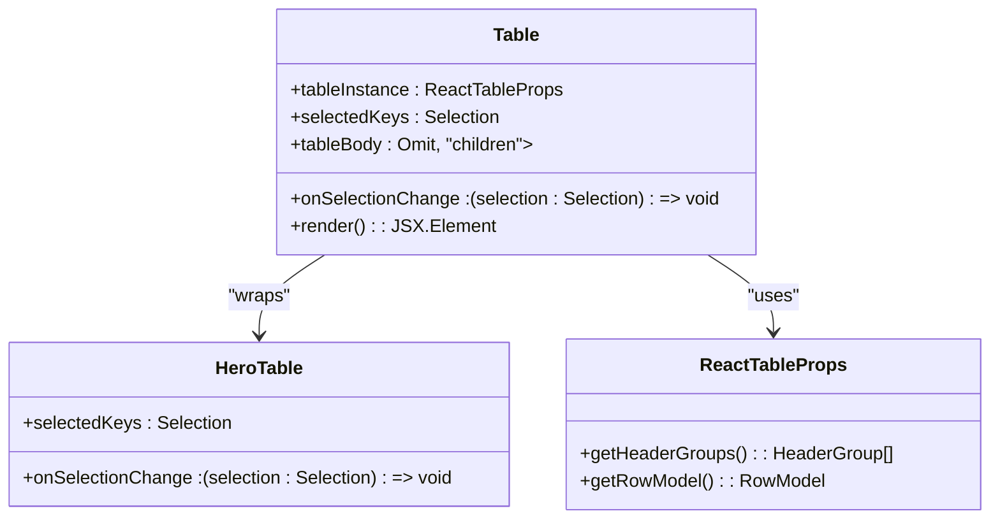
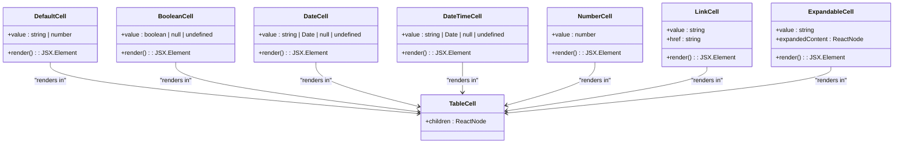
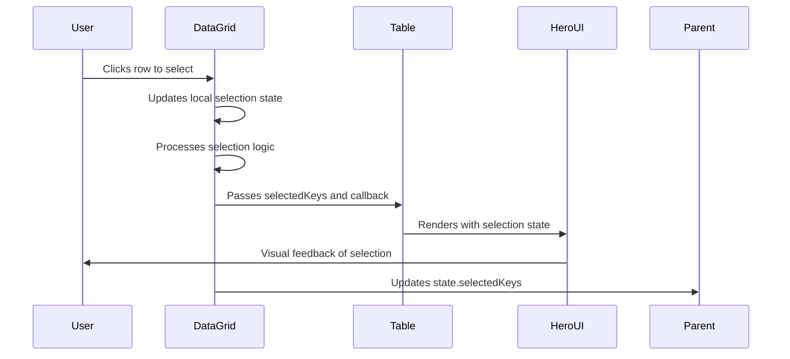
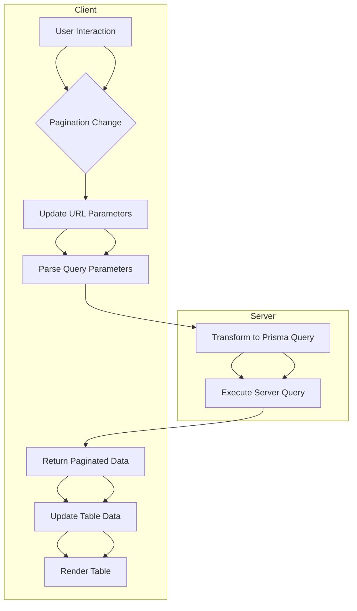
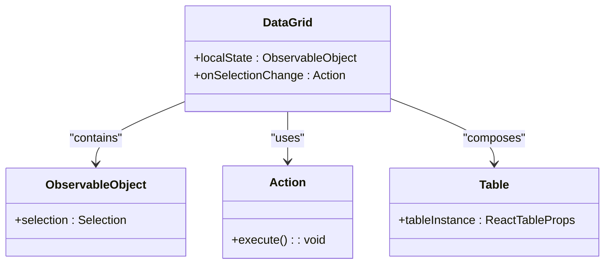

# Table Components

<cite>
**Referenced Files in This Document**   
- [Table.tsx](file://packages/ui/src/components/ui/Table/Table.tsx)
- [DataGrid.tsx](file://packages/ui/src/components/ui/DataGrid/DataGrid.tsx)
- [index.tsx](file://packages/ui/src/components/ui/DataGrid/index.tsx)
- [DefaultCell.tsx](file://packages/ui/src/components/cell/DefaultCell/DefaultCell.tsx)
- [BooleanCell.tsx](file://packages/ui/src/components/cell/BooleanCell/BooleanCell.tsx)
- [DateCell.tsx](file://packages/ui/src/components/cell/DateCell/DateCell.tsx)
- [DateTimeCell.tsx](file://packages/ui/src/components/cell/DateTimeCell/DateTimeCell.tsx)
- [NumberCell.tsx](file://packages/ui/src/components/cell/NumberCell/NumberCell.tsx)
- [LinkCell.tsx](file://packages/ui/src/components/cell/LinkCell/LinkCell.tsx)
- [ExpandableCell.tsx](file://packages/ui/src/components/cell/ExpandableCell/ExpandableCell.tsx)
- [Pagination.tsx](file://packages/ui/src/components/inputs/Pagination/Pagination.tsx)
- [PaginationUtil.ts](file://packages/schema/src/lib/PaginationUtil.ts)
</cite>

## Table of Contents
1. [Introduction](#introduction)
2. [Core Components](#core-components)
3. [Table Implementation](#table-implementation)
4. [DataGrid Implementation](#datagrid-implementation)
5. [Cell Components](#cell-components)
6. [Column Configuration](#column-configuration)
7. [Selection Features](#selection-features)
8. [Pagination and Server-side Operations](#pagination-and-server-side-operations)
9. [Performance Optimization](#performance-optimization)
10. [Accessibility and Responsive Design](#accessibility-and-responsive-design)
11. [State Management Integration](#state-management-integration)
12. [Usage Examples](#usage-examples)

## Introduction
The shared-frontend library provides a comprehensive table component system built on React Table and HeroUI. The system consists of two main components: Table and DataGrid, designed to handle various data presentation needs with features like sorting, filtering, pagination, and selection. This documentation details the implementation, configuration, and usage patterns for these components, focusing on their integration with cell components, data models, and state management systems.

## Core Components
The table component system in the shared-frontend library consists of two primary components: Table and DataGrid. The Table component serves as the foundational UI element that renders data based on a table instance provided by React Table. The DataGrid component builds upon the Table component, adding enhanced features like state management, selection handling, and expanded row support. These components work together to provide a flexible and powerful data presentation system that can handle both simple and complex data display requirements.

**Section sources**
- [Table.tsx](file://packages/ui/src/components/ui/Table/Table.tsx)
- [DataGrid.tsx](file://packages/ui/src/components/ui/DataGrid/DataGrid.tsx)

## Table Implementation
The Table component is a wrapper around the HeroUI Table component that integrates with React Table for advanced data handling capabilities. It accepts a tableInstance prop containing the React Table instance, which manages the data, columns, and various table features like sorting and filtering. The component renders table headers by mapping over the header groups from the table instance and creates table rows by iterating through the row model. Empty content is displayed when no data is available, with a default message of "데이터가 없습니다." (No data available) that can be customized through the tableBody prop.



**Diagram sources**
- [Table.tsx](file://packages/ui/src/components/ui/Table/Table.tsx)

**Section sources**
- [Table.tsx](file://packages/ui/src/components/ui/Table/Table.tsx)

## DataGrid Implementation
The DataGrid component extends the functionality of the Table component by providing built-in state management and additional features. It uses MobX for state management through the observer pattern, allowing for reactive updates to the component when the state changes. The DataGrid component manages selection state, expanded rows, and integrates with the underlying Table component. It accepts data, columns, and state as props, with the state object containing selectedKeys for managing row selection. The component creates a React Table instance using the provided data and columns, then passes this instance to the Table component along with selection information.

```mermaid
classDiagram
class DataGrid {
+data : (T & { id : Key })[]
+columns : ColumnDef<T, any>[]
+state : DataGridState
+selectionMode : "none" | "single" | "multiple"
+expanded : ExpandedState
+render() : JSX.Element
}
class DataGridState {
+selectedKeys : Key[] | null
}
class Table {
+tableInstance : ReactTableProps<T>
}
DataGrid --> Table : "composes"
DataGrid --> DataGridState : "manages"
DataGrid --> ReactTable : "creates instance"
```

**Diagram sources**
- [DataGrid.tsx](file://packages/ui/src/components/ui/DataGrid/DataGrid.tsx)

**Section sources**
- [DataGrid.tsx](file://packages/ui/src/components/ui/DataGrid/DataGrid.tsx)
- [index.tsx](file://packages/ui/src/components/ui/DataGrid/index.tsx)

## Cell Components
The shared-frontend library provides a variety of cell components for different data types, located in the cell directory. These components handle the rendering of data in table cells and provide consistent formatting across the application. The DefaultCell displays string or number values, showing a dash (-) for null or undefined values. The BooleanCell renders boolean values as chips with "예" (Yes) or "아니오" (No) labels. The DateCell and DateTimeCell components format date values using utility functions from the toolkit. The NumberCell handles numeric values, while the LinkCell provides clickable links. The ExpandableCell supports expandable content within table cells.



**Diagram sources**
- [DefaultCell.tsx](file://packages/ui/src/components/cell/DefaultCell/DefaultCell.tsx)
- [BooleanCell.tsx](file://packages/ui/src/components/cell/BooleanCell/BooleanCell.tsx)
- [DateCell.tsx](file://packages/ui/src/components/cell/DateCell/DateCell.tsx)
- [DateTimeCell.tsx](file://packages/ui/src/components/cell/DateTimeCell/DateTimeCell.tsx)
- [NumberCell.tsx](file://packages/ui/src/components/cell/NumberCell/NumberCell.tsx)
- [LinkCell.tsx](file://packages/ui/src/components/cell/LinkCell/LinkCell.tsx)
- [ExpandableCell.tsx](file://packages/ui/src/components/cell/ExpandableCell/ExpandableCell.tsx)

**Section sources**
- [DefaultCell.tsx](file://packages/ui/src/components/cell/DefaultCell/DefaultCell.tsx)
- [BooleanCell.tsx](file://packages/ui/src/components/cell/BooleanCell/BooleanCell.tsx)
- [DateCell.tsx](file://packages/ui/src/components/cell/DateCell/DateCell.tsx)
- [DateTimeCell.tsx](file://packages/ui/src/components/cell/DateTimeCell/DateTimeCell.tsx)
- [NumberCell.tsx](file://packages/ui/src/components/cell/NumberCell/NumberCell.tsx)
- [LinkCell.tsx](file://packages/ui/src/components/cell/LinkCell/LinkCell.tsx)
- [ExpandableCell.tsx](file://packages/ui/src/components/cell/ExpandableCell/ExpandableCell.tsx)
- [index.ts](file://packages/ui/src/components/cell/index.ts)

## Column Configuration
Column configuration in the table components is handled through React Table's column definition system. Columns are defined using the createColumnHelper function, which provides type-safe column creation. Each column definition includes a header property for the column title and a cell property for custom cell rendering. The cell property can use any of the provided cell components or custom rendering functions. Column definitions can also include sorting, filtering, and other data manipulation features through React Table's extensive API. The DataGrid component accepts an array of ColumnDef objects as a prop, allowing for flexible column configuration.

**Section sources**
- [DataGrid.tsx](file://packages/ui/src/components/ui/DataGrid/DataGrid.tsx)
- [Table.stories.tsx](file://packages/ui/src/components/ui/Table/Table.stories.tsx)
- [DataGrid.stories.tsx](file://packages/ui/src/components/ui/DataGrid/DataGrid.stories.tsx)

## Selection Features
The table components provide robust selection features through integration with HeroUI's selection system. The DataGrid component supports three selection modes: "none" (no selection), "single" (one row at a time), and "multiple" (multiple rows). Selection state is managed in the DataGridState object, which contains an array of selectedKeys. The selection functionality is implemented using MobX observables, ensuring that the UI updates reactively when selection changes. The Table component receives the selectedKeys and onSelectionChange callback as props, which are passed to the underlying HeroUI Table component. The DataGrid wrapper component handles the logic for updating the selection state and propagating it to the parent component.



**Diagram sources**
- [DataGrid.tsx](file://packages/ui/src/components/ui/DataGrid/DataGrid.tsx)
- [index.tsx](file://packages/ui/src/components/ui/DataGrid/index.tsx)

**Section sources**
- [DataGrid.tsx](file://packages/ui/src/components/ui/DataGrid/DataGrid.tsx)
- [index.tsx](file://packages/ui/src/components/ui/DataGrid/index.tsx)

## Pagination and Server-side Operations
The table components support pagination through integration with a dedicated Pagination component and server-side operations via query parameter management. The Pagination component uses the nuqs library to manage page state in the URL, allowing for persistent pagination across page reloads. It calculates the current page based on skip and take parameters and provides callbacks for page changes. For server-side operations, the PaginationUtil class transforms query parameters into Prisma-compatible query objects, handling sorting, filtering, and pagination. This enables efficient data loading from the server by only retrieving the necessary data for the current page and sort order.



**Diagram sources**
- [Pagination.tsx](file://packages/ui/src/components/inputs/Pagination/Pagination.tsx)
- [PaginationUtil.ts](file://packages/schema/src/lib/PaginationUtil.ts)

**Section sources**
- [Pagination.tsx](file://packages/ui/src/components/inputs/Pagination/Pagination.tsx)
- [PaginationUtil.ts](file://packages/schema/src/lib/PaginationUtil.ts)

## Performance Optimization
The table components are designed with performance optimization in mind, particularly for handling large datasets. The implementation leverages React Table's virtualization capabilities to render only visible rows, reducing the DOM size and improving rendering performance. For server-side operations, the components use efficient query patterns with proper indexing, as outlined in the performance analysis documentation. The use of MobX observables ensures that only the necessary parts of the component tree are re-rendered when state changes. Additionally, the components implement memoization and useCallback hooks to prevent unnecessary re-renders of child components and callback functions.

**Section sources**
- [Table.tsx](file://packages/ui/src/components/ui/Table/Table.tsx)
- [DataGrid.tsx](file://packages/ui/src/components/ui/DataGrid/DataGrid.tsx)
- [task.performance-analysis.md](file://packages/schema/prisma/schema/task.performance-analysis.md)

## Accessibility and Responsive Design
The table components follow accessibility best practices and are designed to be responsive across different device sizes. The components use semantic HTML table elements with proper ARIA attributes for screen reader support. Keyboard navigation is supported for row selection and interaction. For responsive design, the components adapt to different screen sizes by adjusting layout, font sizes, and spacing. On mobile devices, the table may switch to a card-based layout or provide horizontal scrolling to accommodate the limited screen width. The components also support touch interactions with appropriate hit areas and feedback.

**Section sources**
- [Table.tsx](file://packages/ui/src/components/ui/Table/Table.tsx)
- [DataGrid.tsx](file://packages/ui/src/components/ui/DataGrid/DataGrid.tsx)
- [Dashboard/README.md](file://packages/ui/src/components/layout/Dashboard/README.md)

## State Management Integration
The table components integrate with MobX for state management, using the observer pattern to create reactive components. The DataGrid component uses useLocalObservable to create a local state object that tracks selection state. This state is updated using MobX actions, ensuring that state changes are properly tracked and propagated. The component hierarchy follows a pattern where the DataGrid wrapper component manages the state and passes it down to the underlying Table component. This separation of concerns allows for clean state management while maintaining the flexibility of the underlying table implementation.



**Diagram sources**
- [DataGrid.tsx](file://packages/ui/src/components/ui/DataGrid/DataGrid.tsx)
- [index.tsx](file://packages/ui/src/components/ui/DataGrid/index.tsx)

**Section sources**
- [DataGrid.tsx](file://packages/ui/src/components/ui/DataGrid/DataGrid.tsx)
- [index.tsx](file://packages/ui/src/components/ui/DataGrid/index.tsx)

## Usage Examples
The table components can be used in various scenarios, from simple data displays to complex data management interfaces. Basic usage involves providing data and column definitions to the DataGrid component. For server-side data, the components can be integrated with API calls that use the PaginationUtil to transform query parameters. Custom cell rendering can be achieved by specifying cell functions in column definitions that use the appropriate cell components. The components can also be extended with additional features like row actions, inline editing, and contextual menus.

**Section sources**
- [Table.stories.tsx](file://packages/ui/src/components/ui/Table/Table.stories.tsx)
- [DataGrid.stories.tsx](file://packages/ui/src/components/ui/DataGrid/DataGrid.stories.tsx)