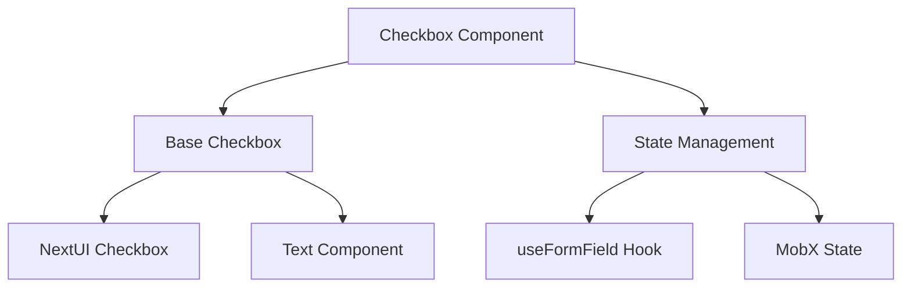
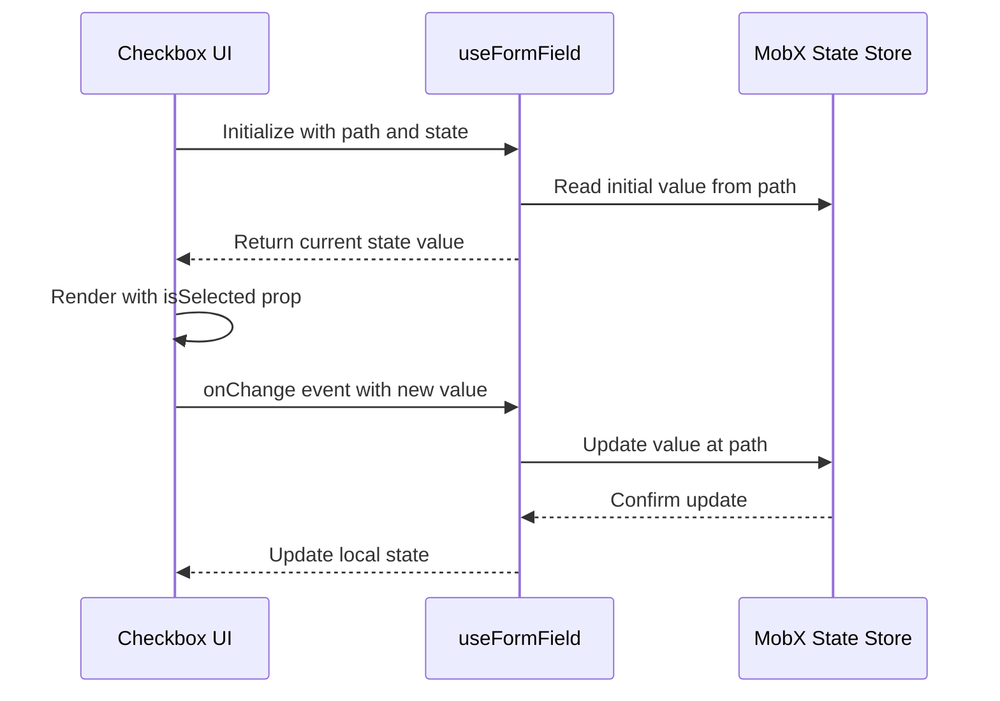
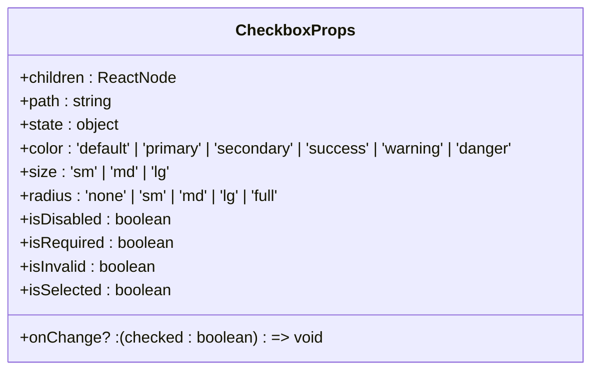
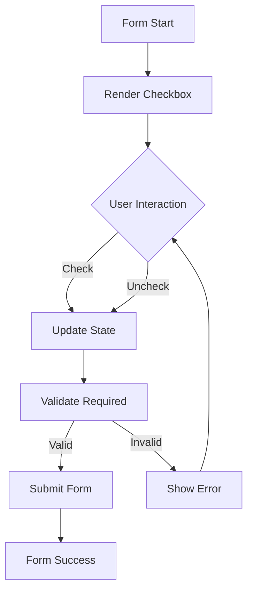

# Checkbox Component

<cite>
**Referenced Files in This Document**   
- [Checkbox.tsx](file://packages/ui/src/components/inputs/Checkbox/Checkbox.tsx)
- [index.tsx](file://packages/ui/src/components/inputs/Checkbox/index.tsx)
- [Checkbox.stories.tsx](file://packages/ui/src/components/inputs/Checkbox/Checkbox.stories.tsx)
- [useFormField.ts](file://packages/hooks/src/useFormField.ts)
</cite>

## Table of Contents
1. [Introduction](#introduction)
2. [Core Implementation](#core-implementation)
3. [State Management](#state-management)
4. [Accessibility Features](#accessibility-features)
5. [Props API](#props-api)
6. [Integration with Form Systems](#integration-with-form-systems)
7. [Usage Examples](#usage-examples)
8. [Styling and Customization](#styling-and-customization)
9. [Common Issues and Solutions](#common-issues-and-solutions)
10. [Troubleshooting Guide](#troubleshooting-guide)

## Introduction
The Checkbox component is a fundamental form control element in the UI library, designed to provide users with a binary selection mechanism. This document details the implementation, usage patterns, and integration capabilities of the Checkbox component, focusing on its role in form systems, accessibility features, and customization options.

The component is built as a wrapper around the NextUI Checkbox component, enhanced with MobX state management integration and additional accessibility features. It supports various states including checked, unchecked, and disabled, and provides comprehensive keyboard navigation and ARIA attribute support.

## Core Implementation

The Checkbox component is implemented as a two-layer architecture:

1. **Base Layer**: The pure UI component (`Checkbox.tsx`) that wraps the NextUI Checkbox
2. **State Layer**: The MobX-integrated component (`index.tsx`) that handles form state management

**Diagram sources**
- [Checkbox.tsx](file://packages/ui/src/components/inputs/Checkbox/Checkbox.tsx)
- [index.tsx](file://packages/ui/src/components/inputs/Checkbox/index.tsx)

**Section sources**
- [Checkbox.tsx](file://packages/ui/src/components/inputs/Checkbox/Checkbox.tsx#L1-L24)
- [index.tsx](file://packages/ui/src/components/inputs/Checkbox/index.tsx#L1-L39)

## State Management

The Checkbox component implements a controlled component pattern using MobX for state management. The component integrates with the `useFormField` hook to manage form state in a predictable way.

Key state management features:
- Automatic state synchronization with MobX stores
- Path-based state access using dot notation
- Default value handling with fallback mechanism
- Two-way data binding between UI and state

**Diagram sources**
- [index.tsx](file://packages/ui/src/components/inputs/Checkbox/index.tsx#L14-L36)
- [useFormField.ts](file://packages/hooks/src/useFormField.ts)

**Section sources**
- [index.tsx](file://packages/ui/src/components/inputs/Checkbox/index.tsx#L14-L36)
- [useFormField.ts](file://packages/hooks/src/useFormField.ts)

## Accessibility Features

The Checkbox component includes comprehensive accessibility features to ensure usability for all users, including those using assistive technologies.

### Keyboard Navigation
- Supports Tab navigation to focus the checkbox
- Space bar toggles the checkbox state
- Visual focus indicator for keyboard navigation
- Full keyboard operability without mouse

### ARIA Attributes
- `aria-checked`: Reflects the current checked state
- `aria-disabled`: Indicates disabled state
- `aria-required`: Marks required fields
- `aria-invalid`: Indicates validation errors
- Proper label association through implicit labeling

### Visual Feedback
- Clear visual distinction between checked and unchecked states
- Disabled state with reduced opacity
- Focus ring for keyboard navigation
- Consistent visual feedback across all states

**Section sources**
- [Checkbox.tsx](file://packages/ui/src/components/inputs/Checkbox/Checkbox.tsx#L1-L24)
- [Checkbox.stories.tsx](file://packages/ui/src/components/inputs/Checkbox/Checkbox.stories.tsx#L22-L193)

## Props API

The Checkbox component exposes a comprehensive API for customization and integration:

### Core Props
- `children`: Label text for the checkbox
- `path`: Dot notation path to state property
- `state`: MobX state object reference
- `onChange`: Callback function for state changes

### Visual Props
- `color`: Theme color (default, primary, secondary, success, warning, danger)
- `size`: Size variant (sm, md, lg)
- `radius`: Border radius (none, sm, md, lg, full)
- `isDisabled`: Disables interaction
- `isRequired`: Marks as required field
- `isInvalid`: Indicates validation error

### State Props
- `isSelected`: Controlled checked state (passed through from state management layer)
- `value`: Initial value for uncontrolled usage

**Diagram sources**
- [Checkbox.tsx](file://packages/ui/src/components/inputs/Checkbox/Checkbox.tsx#L8-L10)
- [index.tsx](file://packages/ui/src/components/inputs/Checkbox/index.tsx#L10-L12)

**Section sources**
- [Checkbox.tsx](file://packages/ui/src/components/inputs/Checkbox/Checkbox.tsx#L8-L10)
- [index.tsx](file://packages/ui/src/components/inputs/Checkbox/index.tsx#L10-L12)

## Integration with Form Systems

The Checkbox component is designed to integrate seamlessly with form systems and state management patterns.

### Form Validation
The component supports standard form validation patterns:
- Required field validation through `isRequired` prop
- Error state visualization with `isInvalid` prop
- Integration with form validation libraries
- Custom validation rules through state management

### Group Selection
For multiple checkboxes, the component supports:
- Independent state management for each checkbox
- Grouped validation through shared state objects
- Conditional rendering based on other form values
- Dynamic checkbox creation from data arrays

### Controlled Component Pattern
The component implements the controlled component pattern:
- State is managed externally in MobX stores
- Changes are propagated through the `onChange` callback
- Value is passed back through the `isSelected` prop
- Ensures single source of truth for form data

**Section sources**
- [index.tsx](file://packages/ui/src/components/inputs/Checkbox/index.tsx#L14-L36)
- [Checkbox.stories.tsx](file://packages/ui/src/components/inputs/Checkbox/Checkbox.stories.tsx#L74-L193)

## Usage Examples

### Form Validation

**Diagram sources**
- [Checkbox.stories.tsx](file://packages/ui/src/components/inputs/Checkbox/Checkbox.stories.tsx#L99-L106)

### Filter Interfaces
In filter interfaces, checkboxes are used to:
- Select multiple filter criteria
- Show current filter state
- Provide immediate visual feedback
- Support keyboard navigation for accessibility

### Settings Panels
In settings panels, checkboxes:
- Represent binary options (on/off)
- Persist user preferences
- Group related settings
- Provide clear visual indication of current state

**Section sources**
- [Checkbox.stories.tsx](file://packages/ui/src/components/inputs/Checkbox/Checkbox.stories.tsx#L74-L193)

## Styling and Customization

The Checkbox component supports various customization options:

### Color Themes
- Default: Neutral appearance
- Primary: Main action color
- Secondary: Secondary action color
- Success: Positive state
- Warning: Caution state
- Danger: Error or destructive action

### Size Variants
- Small (sm): Compact for dense interfaces
- Medium (md): Standard size
- Large (lg): Prominent for important options

### Custom Styling
The component can be customized through:
- CSS classes for additional styling
- Theme configuration for consistent appearance
- Inline styles for specific instances
- Tailwind CSS utility classes

**Section sources**
- [Checkbox.stories.tsx](file://packages/ui/src/components/inputs/Checkbox/Checkbox.stories.tsx#L117-L144)

## Common Issues and Solutions

### Label Association
Ensure proper label association by:
- Using the `children` prop for label text
- Maintaining proper DOM structure
- Testing with screen readers
- Verifying keyboard navigation

### Touch Target Sizing
Address touch target issues by:
- Ensuring minimum 44px touch target
- Using appropriate padding
- Testing on mobile devices
- Following WCAG guidelines

### Visual Feedback
Improve visual feedback through:
- Clear state indicators
- Consistent animation patterns
- Proper focus states
- High contrast for checked state

**Section sources**
- [Checkbox.tsx](file://packages/ui/src/components/inputs/Checkbox/Checkbox.tsx#L20-L22)
- [Checkbox.stories.tsx](file://packages/ui/src/components/inputs/Checkbox/Checkbox.stories.tsx#L74-L193)

## Troubleshooting Guide

### State Not Updating
If the checkbox state is not updating:
1. Verify the `path` prop points to a valid state property
2. Check that the `state` object is a valid MobX observable
3. Ensure the `useFormField` hook is properly initialized
4. Verify no errors in the console

### Accessibility Issues
For accessibility problems:
1. Check ARIA attributes are properly set
2. Verify keyboard navigation works
3. Test with screen readers
4. Ensure sufficient color contrast

### Styling Problems
When encountering styling issues:
1. Check for CSS conflicts
2. Verify theme configuration
3. Inspect element styles
4. Test in different browsers

**Section sources**
- [index.tsx](file://packages/ui/src/components/inputs/Checkbox/index.tsx#L14-L36)
- [Checkbox.tsx](file://packages/ui/src/components/inputs/Checkbox/Checkbox.tsx#L1-L24)