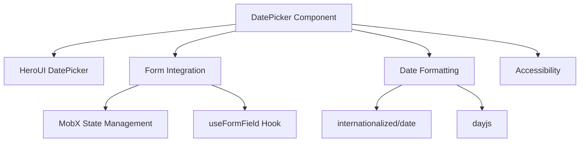
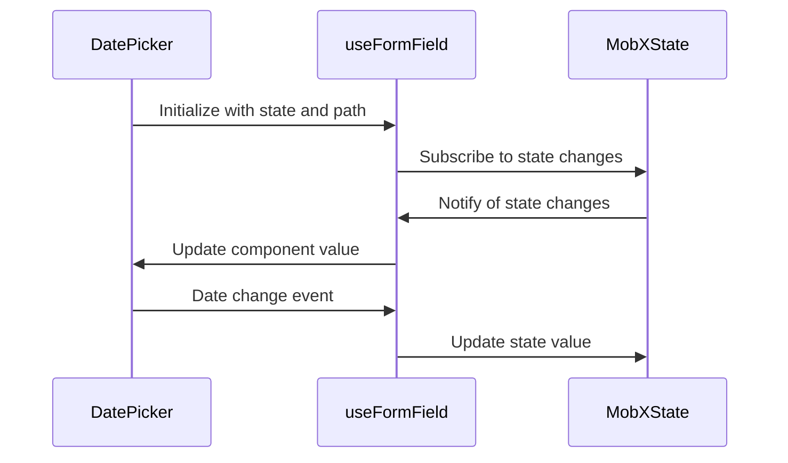
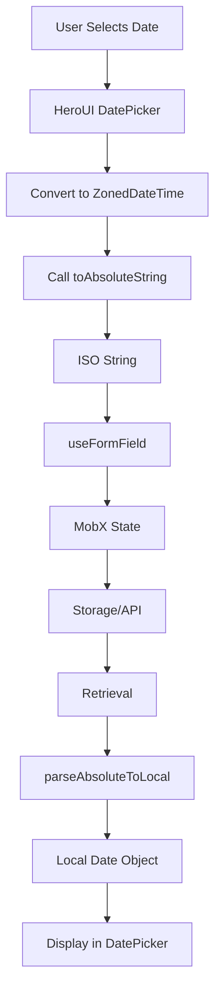
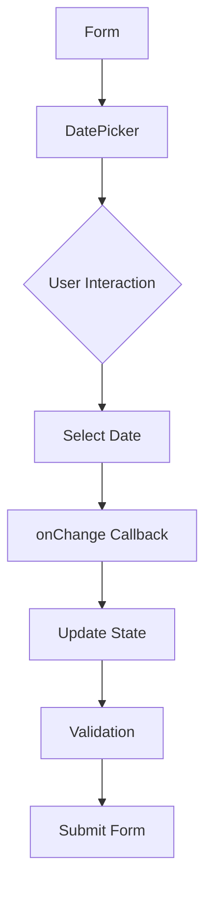
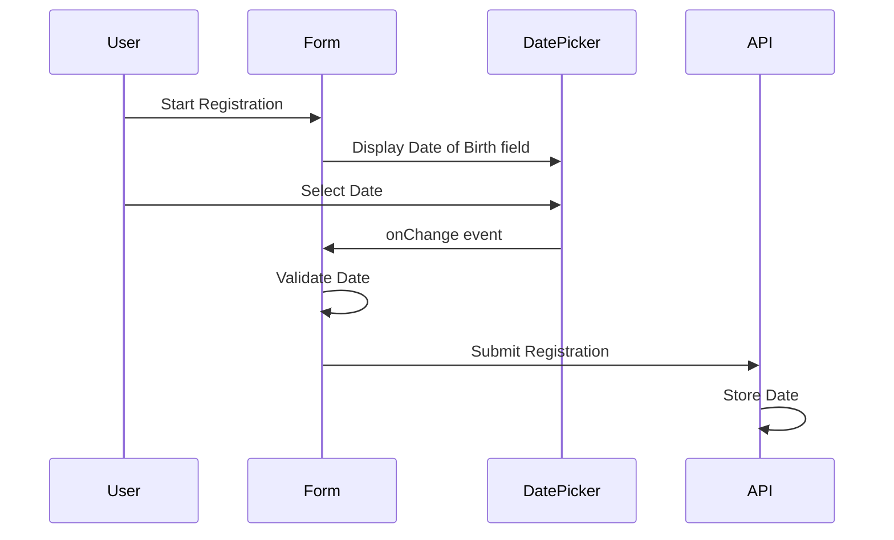

# DatePicker Component

<cite>
**Referenced Files in This Document**   
- [DatePicker.tsx](file://packages/ui/src/components/ui/inputs/DatePicker/DatePicker.tsx)
- [DatePicker.stories.tsx](file://packages/ui/src/components/ui/inputs/DatePicker/DatePicker.stories.tsx)
- [index.tsx](file://packages/ui/src/components/ui/inputs/DatePicker/index.tsx)
- [useFormField.ts](file://packages/hook/src/useFormField.ts)
- [type.ts](file://packages/type/src/index.ts)
- [Calendar.tsx](file://packages/ui/src/components/ui/inputs/Calendar/Calendar.tsx)
- [DateTime.ts](file://packages/toolkit/src/DateTime.ts)
</cite>

## Table of Contents
1. [Introduction](#introduction)
2. [Core Implementation](#core-implementation)
3. [Props API](#props-api)
4. [Form Integration](#form-integration)
5. [Date Handling and Formatting](#date-handling-and-formatting)
6. [Accessibility Features](#accessibility-features)
7. [Usage Examples](#usage-examples)
8. [Validation and Error Handling](#validation-and-error-handling)
9. [Mobile Considerations](#mobile-considerations)
10. [Customization Options](#customization-options)
11. [Troubleshooting Guide](#troubleshooting-guide)

## Introduction
The DatePicker component is a comprehensive date selection interface designed for use in form workflows requiring date input. Built on top of HeroUI's DatePicker with additional abstraction layers, this component provides a robust solution for date selection in registration, scheduling, and filtering scenarios. The component handles calendar display, date selection, and integrates seamlessly with form systems through MobX state management.

The DatePicker component follows a layered architecture, with the base implementation wrapping HeroUI's DatePicker while providing additional functionality for form integration and state management. It supports various date formats and provides accessibility features to ensure usability across different devices and user needs.

## Core Implementation

The DatePicker component is implemented as a wrapper around HeroUI's DatePicker, providing additional functionality for form integration and state management. The component uses the internationalized date library to handle date objects and time zones, ensuring consistent behavior across different locales.

The core implementation consists of two main files: the base DatePicker component and a MobX-integrated version. The base component handles the date selection logic and formatting, while the MobX-integrated version provides seamless integration with MobX state management.

**Diagram sources**
- [DatePicker.tsx](file://packages/ui/src/components/ui/inputs/DatePicker/DatePicker.tsx)
- [index.tsx](file://packages/ui/src/components/ui/inputs/DatePicker/index.tsx)

**Section sources**
- [DatePicker.tsx](file://packages/ui/src/components/ui/inputs/DatePicker/DatePicker.tsx)
- [index.tsx](file://packages/ui/src/components/ui/inputs/DatePicker/index.tsx)

## Props API

The DatePicker component exposes a comprehensive API for customization and integration. The props are divided into two categories: base props inherited from HeroUI and additional props for form integration.

### Base Props
The base props are inherited from HeroUI's DatePicker component with modifications to handle date formatting and event handling.

| Prop | Type | Description | Default |
|------|------|-------------|---------|
| value | CalendarDate \| CalendarDateTime \| ZonedDateTime | Selected date value | undefined |
| onChange | (value: string) => void | Callback function when date changes | undefined |
| label | string | Label for the date picker | - |
| isDisabled | boolean | Whether the date picker is disabled | false |
| isReadOnly | boolean | Whether the date picker is read-only | false |
| isRequired | boolean | Whether the date picker is required | false |
| variant | "flat" \| "bordered" \| "faded" \| "underlined" | Visual variant of the date picker | "bordered" |
| size | "sm" \| "md" \| "lg" | Size of the date picker | "md" |
| color | "default" \| "primary" \| "secondary" \| "success" \| "warning" \| "danger" | Color theme of the date picker | "default" |
| radius | "none" \| "sm" \| "md" \| "lg" \| "full" | Border radius of the date picker | "md" |

### Form Integration Props
The MobX-integrated version of the DatePicker component adds additional props for form integration.

| Prop | Type | Description | Default |
|------|------|-------------|---------|
| state | T | MobX state object | - |
| path | Paths<T, 4> | Path to the date value in the state object | - |

**Section sources**
- [DatePicker.tsx](file://packages/ui/src/components/ui/inputs/DatePicker/DatePicker.tsx)
- [DatePicker.stories.tsx](file://packages/ui/src/components/ui/inputs/DatePicker/DatePicker.stories.tsx)

## Form Integration

The DatePicker component provides seamless integration with form systems through MobX state management. The component uses the useFormField hook to connect with MobX state objects, allowing for automatic synchronization between the component state and the application state.

The integration pattern follows the MobxProps interface, which requires a state object and a path to the date value within that state. This allows the component to automatically update the state when the date changes and update the component when the state changes.

**Diagram sources**
- [index.tsx](file://packages/ui/src/components/ui/inputs/DatePicker/index.tsx)
- [useFormField.ts](file://packages/hook/src/useFormField.ts)
- [type.ts](file://packages/type/src/index.ts)

**Section sources**
- [index.tsx](file://packages/ui/src/components/ui/inputs/DatePicker/index.tsx)
- [useFormField.ts](file://packages/hook/src/useFormField.ts)

## Date Handling and Formatting

The DatePicker component uses the internationalized/date library to handle date objects and time zones. The component converts dates to ISO strings for storage and transmission, ensuring consistent behavior across different locales and time zones.

The component automatically handles timezone conversion by using the parseAbsoluteToLocal function to convert ISO strings to local date objects. This ensures that dates are displayed correctly regardless of the user's timezone.

The component also integrates with dayjs for additional date formatting and manipulation capabilities. This allows for flexible date formatting in different contexts, such as displaying dates in tables or other UI components.

**Diagram sources**
- [DatePicker.tsx](file://packages/ui/src/components/ui/inputs/DatePicker/DatePicker.tsx)
- [index.tsx](file://packages/ui/src/components/ui/inputs/DatePicker/index.tsx)
- [DateTime.ts](file://packages/toolkit/src/DateTime.ts)

**Section sources**
- [DatePicker.tsx](file://packages/ui/src/components/ui/inputs/DatePicker/DatePicker.tsx)
- [DateTime.ts](file://packages/toolkit/src/DateTime.ts)

## Accessibility Features

The DatePicker component includes several accessibility features to ensure usability for all users. The component follows WAI-ARIA guidelines for date pickers, providing proper keyboard navigation and screen reader support.

The component supports keyboard navigation through the calendar, allowing users to navigate between dates using arrow keys. The component also provides proper focus management, ensuring that keyboard users can easily interact with the date picker.

The component uses semantic HTML elements and ARIA attributes to provide context to screen readers. This includes proper labeling of the date picker and calendar elements, as well as announcing changes to the selected date.

## Usage Examples

### Basic Usage
The basic usage of the DatePicker component involves providing a label and handling the onChange event.

### Form Workflow Integration
The DatePicker component can be integrated into form workflows for registration, scheduling, or filtering.

**Diagram sources**
- [DatePicker.stories.tsx](file://packages/ui/src/components/ui/inputs/DatePicker/DatePicker.stories.tsx)

**Section sources**
- [DatePicker.stories.tsx](file://packages/ui/src/components/ui/inputs/DatePicker/DatePicker.stories.tsx)

## Validation and Error Handling

The DatePicker component includes built-in validation and error handling mechanisms. The component validates date values before updating the state, ensuring that only valid dates are stored.

The component handles parsing errors by catching exceptions and logging them to the console. This prevents the application from crashing if an invalid date string is provided.

The component also supports integration with form validation libraries through the useFormField hook. This allows for custom validation rules to be applied to the date value, such as minimum and maximum date constraints.

## Mobile Considerations

The DatePicker component is designed to work well on mobile devices. The component uses responsive design principles to adapt to different screen sizes.

On mobile devices, the component may use the native date picker when available, providing a familiar interface for mobile users. The component also ensures that the calendar is easily navigable on touch devices, with appropriately sized touch targets.

## Customization Options

The DatePicker component provides several customization options through its props API. The component supports different visual variants, sizes, colors, and border radii to match different design systems.

The component also supports custom styling through the className prop, allowing for additional CSS classes to be applied to the component.

## Troubleshooting Guide

### Common Issues

#### Date Not Updating in State
If the date is not updating in the state, ensure that the path prop is correct and points to a valid location in the state object.

#### Invalid Date Format
If you encounter invalid date format errors, ensure that the date values are in ISO format (YYYY-MM-DDTHH:MM:SS.sssZ).

#### Timezone Issues
If dates are displayed in the wrong timezone, ensure that the parseAbsoluteToLocal function is being used correctly to convert ISO strings to local date objects.

#### Keyboard Navigation Not Working
If keyboard navigation is not working, ensure that the component has focus and that the browser supports the necessary ARIA attributes.

**Section sources**
- [DatePicker.tsx](file://packages/ui/src/components/ui/inputs/DatePicker/DatePicker.tsx)
- [index.tsx](file://packages/ui/src/components/ui/inputs/DatePicker/index.tsx)
- [useFormField.ts](file://packages/hook/src/useFormField.ts)