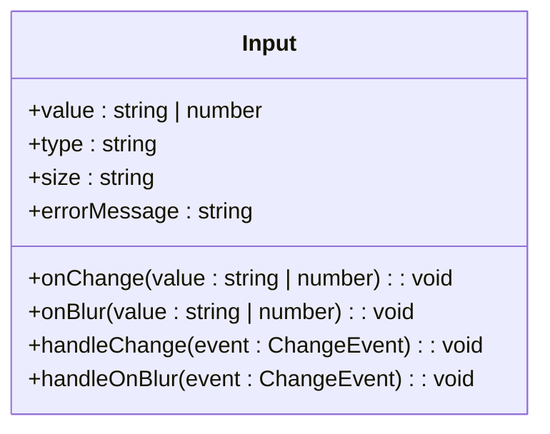
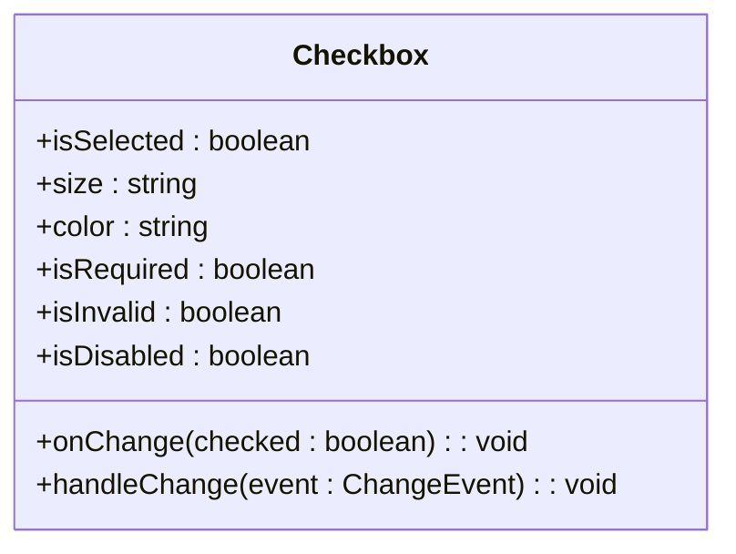
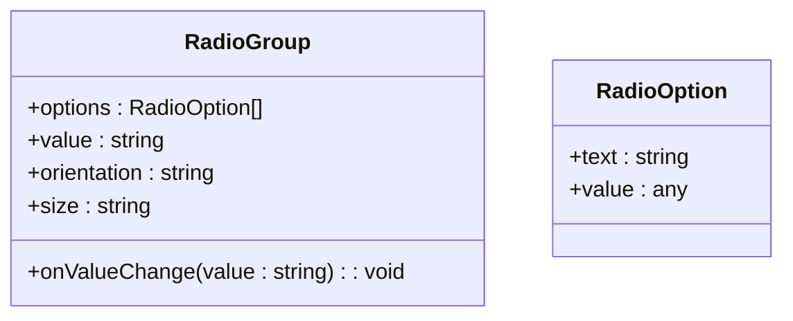
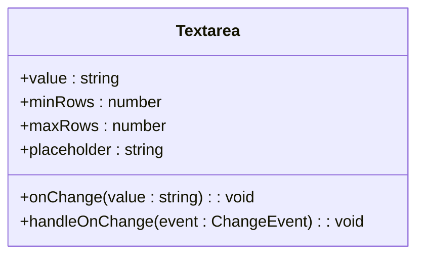
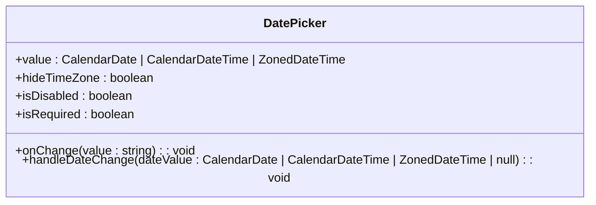
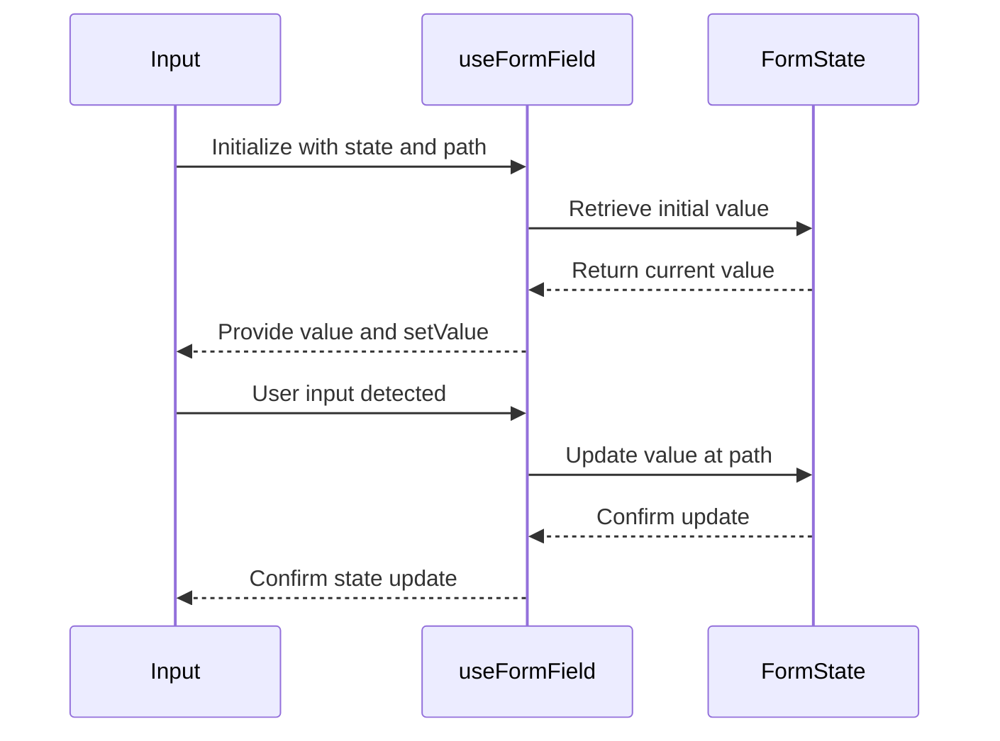
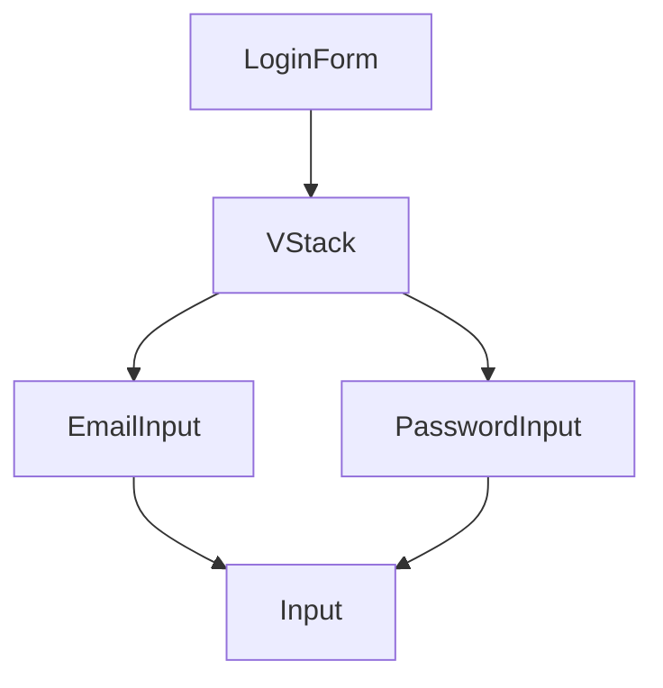
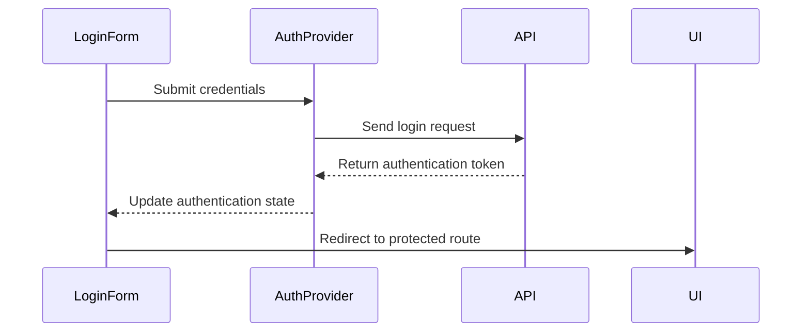

# Form Components

<cite>
**Referenced Files in This Document**   
- [LoginForm.tsx](file://packages/ui/src/components/form/LoginForm/LoginForm.tsx)
- [Input.tsx](file://packages/ui/src/components/inputs/Input/Input.tsx)
- [Checkbox.tsx](file://packages/ui/src/components/inputs/Checkbox/Checkbox.tsx)
- [RadioGroup.tsx](file://packages/ui/src/components/inputs/RadioGroup/RadioGroup.tsx)
- [Textarea.tsx](file://packages/ui/src/components/inputs/Textarea/Textarea.tsx)
- [DatePicker.tsx](file://packages/ui/src/components/inputs/DatePicker/DatePicker.tsx)
- [index.tsx](file://packages/ui/src/components/inputs/Input/index.tsx)
- [index.tsx](file://packages/ui/src/components/inputs/Checkbox/index.tsx)
- [index.tsx](file://packages/ui/src/components/inputs/RadioGroup/index.tsx)
- [index.tsx](file://packages/ui/src/components/inputs/Textarea/index.tsx)
- [index.tsx](file://packages/ui/src/components/inputs/DatePicker/index.tsx)
- [useFormField.ts](file://packages/hooks/src/useFormField.ts)
- [AuthProvider.tsx](file://packages/shared-frontend/src/provider/AuthProvider/index.tsx)
</cite>

## Table of Contents
1. [Introduction](#introduction)
2. [Core Components](#core-components)
3. [Form State Management](#form-state-management)
4. [Validation and Error Handling](#validation-and-error-handling)
5. [Accessibility Features](#accessibility-features)
6. [Responsive Behavior](#responsive-behavior)
7. [Form Composition Patterns](#form-composition-patterns)
8. [Authentication Integration](#authentication-integration)
9. [Common Issues and Solutions](#common-issues-and-solutions)
10. [Conclusion](#conclusion)

## Introduction
The form components in the shared-frontend library provide a comprehensive suite of UI elements for building robust and accessible forms. These components are designed to work seamlessly with React applications, offering consistent styling, validation, and state management patterns. The library includes fundamental form elements such as Input, Checkbox, RadioGroup, Textarea, and DatePicker, as well as composite components like LoginForm that demonstrate best practices for form composition.

**Section sources**
- [LoginForm.tsx](file://packages/ui/src/components/form/LoginForm/LoginForm.tsx)

## Core Components

### Input Component
The Input component serves as a controlled text input field with support for various input types including text, email, password, and number. It wraps the underlying HeroUI Input component while providing enhanced functionality for form integration. The component handles value changes and blur events, converting string values to numbers when appropriate for numeric inputs.

**Diagram sources**
- [Input.tsx](file://packages/ui/src/components/inputs/Input/Input.tsx)

**Section sources**
- [Input.tsx](file://packages/ui/src/components/inputs/Input/Input.tsx)
- [index.tsx](file://packages/ui/src/components/inputs/Input/index.tsx)

### Checkbox Component
The Checkbox component provides a boolean input element with support for various visual states including checked, unchecked, disabled, required, and invalid. It integrates with the form state management system through the useFormField hook, automatically synchronizing its state with the parent form's data model. The component supports different sizes and color themes for consistent styling across the application.

**Diagram sources**
- [Checkbox.tsx](file://packages/ui/src/components/inputs/Checkbox/Checkbox.tsx)

**Section sources**
- [Checkbox.tsx](file://packages/ui/src/components/inputs/Checkbox/Checkbox.tsx)
- [index.tsx](file://packages/ui/src/components/inputs/Checkbox/index.tsx)

### RadioGroup Component
The RadioGroup component implements a group of mutually exclusive options, allowing users to select one option from a list. It accepts an array of RadioOption objects, each containing a text label and value. The component renders individual Radio components for each option and manages the selection state, ensuring only one option can be selected at a time.

**Diagram sources**
- [RadioGroup.tsx](file://packages/ui/src/components/inputs/RadioGroup/RadioGroup.tsx)

**Section sources**
- [RadioGroup.tsx](file://packages/ui/src/components/inputs/RadioGroup/RadioGroup.tsx)
- [index.tsx](file://packages/ui/src/components/inputs/RadioGroup/index.tsx)

### Textarea Component
The Textarea component provides a multi-line text input field with support for dynamic value binding and change event handling. It extends the base HeroUI Textarea component with additional props for controlled input behavior, making it easy to integrate into form systems. The component handles text input events and propagates changes to the parent component through the onChange callback.

**Diagram sources**
- [Textarea.tsx](file://packages/ui/src/components/inputs/Textarea/Textarea.tsx)

**Section sources**
- [Textarea.tsx](file://packages/ui/src/components/inputs/Textarea/Textarea.tsx)
- [index.tsx](file://packages/ui/src/components/inputs/Textarea/index.tsx)

### DatePicker Component
The DatePicker component provides a date selection interface with support for various date formats and time zones. It integrates with the @internationalized/date library to handle date parsing and formatting. The component converts selected dates to ISO string format for consistent data handling across the application. It includes features like hiding the time zone display and handling null values gracefully.

**Diagram sources**
- [DatePicker.tsx](file://packages/ui/src/components/inputs/DatePicker/DatePicker.tsx)

**Section sources**
- [DatePicker.tsx](file://packages/ui/src/components/inputs/DatePicker/DatePicker.tsx)
- [index.tsx](file://packages/ui/src/components/inputs/DatePicker/index.tsx)

## Form State Management

### useFormField Hook
The form components leverage the useFormField hook from the shared-hooks package to manage form state. This custom hook provides a standardized interface for connecting form inputs to a shared state object. It handles value retrieval, update propagation, and synchronization between the UI and the underlying data model. The hook accepts a configuration object with state and path properties, enabling it to access and modify specific fields within a nested state structure.

**Diagram sources**
- [useFormField.ts](file://packages/hooks/src/useFormField.ts)

**Section sources**
- [useFormField.ts](file://packages/hooks/src/useFormField.ts)

### State Synchronization Pattern
The form components follow a consistent pattern for state synchronization. Each component accepts a state object and a path string that identifies the specific field within the state. The useFormField hook uses these parameters to create a two-way binding between the input element and the state property. This approach enables centralized state management while maintaining component reusability across different forms and contexts.

## Validation and Error Handling

### Built-in Validation
The form components include built-in validation capabilities through the errorMessage prop. When validation fails, the component displays the error message below the input field and applies visual indicators (such as red borders) to highlight the invalid state. The Input component automatically handles type-specific validation for email and number inputs, ensuring data integrity at the point of entry.

### Custom Validation Integration
While the components provide basic validation feedback, they are designed to work with external validation libraries or custom validation logic. The isInvalid prop allows parent components to control the validation state, making it easy to integrate with form validation frameworks or custom business rules. This separation of concerns enables flexible validation strategies while maintaining consistent UI presentation.

**Section sources**
- [Input.tsx](file://packages/ui/src/components/inputs/Input/Input.tsx)
- [Checkbox.tsx](file://packages/ui/src/components/inputs/Checkbox/Checkbox.tsx)

## Accessibility Features

### Screen Reader Support
All form components include appropriate ARIA attributes to ensure accessibility for screen reader users. Input fields have associated labels, checkboxes and radio buttons have proper role attributes, and error messages are announced to assistive technologies. The components follow WAI-ARIA best practices for interactive elements, providing a seamless experience for users with disabilities.

### Keyboard Navigation
The form components support standard keyboard navigation patterns. Users can tab between form fields, use arrow keys to navigate radio groups, and toggle checkboxes with the space bar. The components maintain proper focus states and ensure that all functionality is available through keyboard input alone, meeting WCAG 2.1 accessibility requirements.

**Section sources**
- [Input.tsx](file://packages/ui/src/components/inputs/Input/Input.tsx)
- [Checkbox.tsx](file://packages/ui/src/components/inputs/Checkbox/Checkbox.tsx)
- [RadioGroup.tsx](file://packages/ui/src/components/inputs/RadioGroup/RadioGroup.tsx)

## Responsive Behavior

### Mobile Optimization
The form components are designed with responsive behavior in mind, adapting their layout and interaction patterns for different screen sizes. On mobile devices, the components may adjust their size, spacing, and touch targets to accommodate smaller screens and touch-based interaction. The DatePicker component, for example, displays a mobile-friendly calendar interface when viewed on handheld devices.

### Adaptive Styling
The components use CSS classes and responsive design techniques to ensure consistent appearance across devices. They support different size variants (small, medium, large) that can be selected based on the context and screen size. The layout system, including components like VStack, helps organize form elements in a way that adapts to available space.

**Section sources**
- [Input.tsx](file://packages/ui/src/components/inputs/Input/Input.tsx)
- [DatePicker.tsx](file://packages/ui/src/components/inputs/DatePicker/DatePicker.tsx)

## Form Composition Patterns

### LoginForm Example
The LoginForm component demonstrates a practical example of form composition using the individual input components. It combines two Input fields (for email and password) within a VStack layout container, creating a cohesive login interface. This pattern shows how to group related form elements and maintain consistent styling and spacing.

**Diagram sources**
- [LoginForm.tsx](file://packages/ui/src/components/form/LoginForm/LoginForm.tsx)

**Section sources**
- [LoginForm.tsx](file://packages/ui/src/components/form/LoginForm/LoginForm.tsx)

### Reusable Form Templates
The component library encourages the creation of reusable form templates by combining basic input components with layout containers and validation logic. This approach promotes consistency across different forms in the application while reducing code duplication. Developers can create specialized form components for common use cases (registration, profile editing, settings) by composing the basic elements in different configurations.

## Authentication Integration

### AuthProvider Connection
The form components integrate with the AuthProvider to manage authentication state. The LoginForm, for example, would typically be used within an authentication flow where the form data is submitted to the AuthProvider for validation and session creation. The state object passed to form components can be linked to the authentication store, allowing real-time updates to the login state.

**Diagram sources**
- [LoginForm.tsx](file://packages/ui/src/components/form/LoginForm/LoginForm.tsx)
- [AuthProvider.tsx](file://packages/shared-frontend/src/provider/AuthProvider/index.tsx)

**Section sources**
- [LoginForm.tsx](file://packages/ui/src/components/form/LoginForm/LoginForm.tsx)
- [AuthProvider.tsx](file://packages/shared-frontend/src/provider/AuthProvider/index.tsx)

### State Management Flow
The authentication flow follows a predictable state management pattern. When a user submits the login form, the credentials are sent to the authentication service. Upon successful authentication, the AuthProvider updates the global authentication state, which triggers UI updates across the application. This centralized approach ensures consistent authentication state and enables features like automatic login persistence and session management.

## Common Issues and Solutions

### Input Validation Challenges
One common issue is ensuring consistent validation across different input types. The solution implemented in this library is to handle basic type validation at the component level (e.g., email format, number parsing) while delegating complex business logic validation to the parent form or service layer. This separation of concerns makes the components more reusable while maintaining flexibility for specific use cases.

### State Synchronization Problems
When multiple components reference the same state path, race conditions can occur. The useFormField hook addresses this by providing a consistent interface for state updates and ensuring that all components referencing the same path receive the latest value. Additionally, the MobX observer pattern helps prevent unnecessary re-renders and maintains performance even with complex state dependencies.

### Accessibility Compliance
Ensuring full accessibility compliance requires attention to detail in markup and interaction design. The components address this by including proper ARIA attributes, supporting keyboard navigation, and providing visual feedback for different states (focus, error, disabled). Regular accessibility audits and testing with assistive technologies help identify and resolve potential issues.

**Section sources**
- [Input.tsx](file://packages/ui/src/components/inputs/Input/Input.tsx)
- [Checkbox.tsx](file://packages/ui/src/components/inputs/Checkbox/Checkbox.tsx)
- [useFormField.ts](file://packages/hooks/src/useFormField.ts)

## Conclusion
The form components in the shared-frontend library provide a robust foundation for building accessible, responsive, and maintainable forms. By following consistent patterns for state management, validation, and accessibility, these components enable developers to create high-quality user interfaces with minimal effort. The integration with the AuthProvider and useFormField hook demonstrates a cohesive approach to form handling that scales well across different parts of the application. As the library evolves, these components will continue to serve as the building blocks for effective user interaction and data collection.