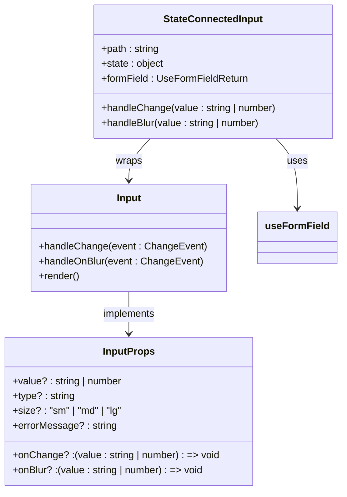
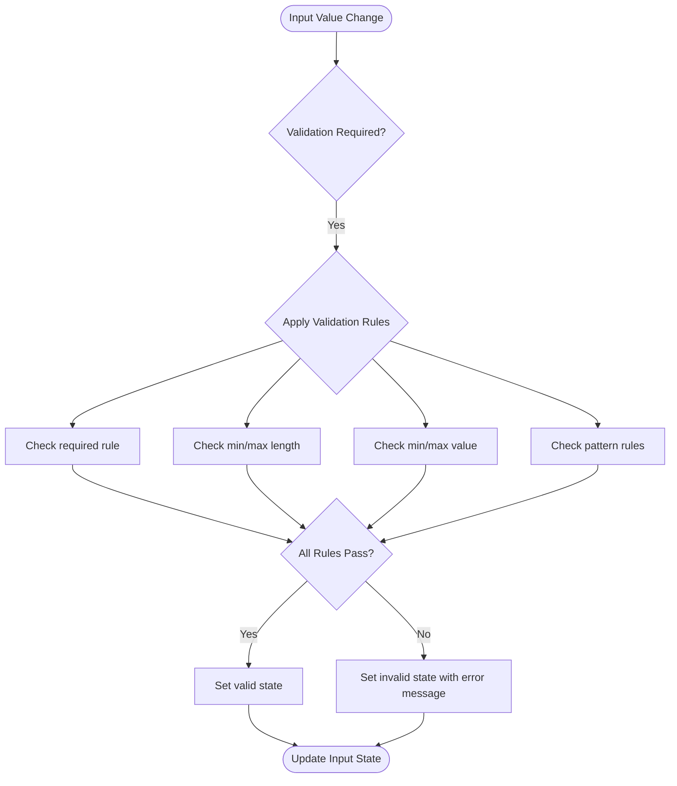
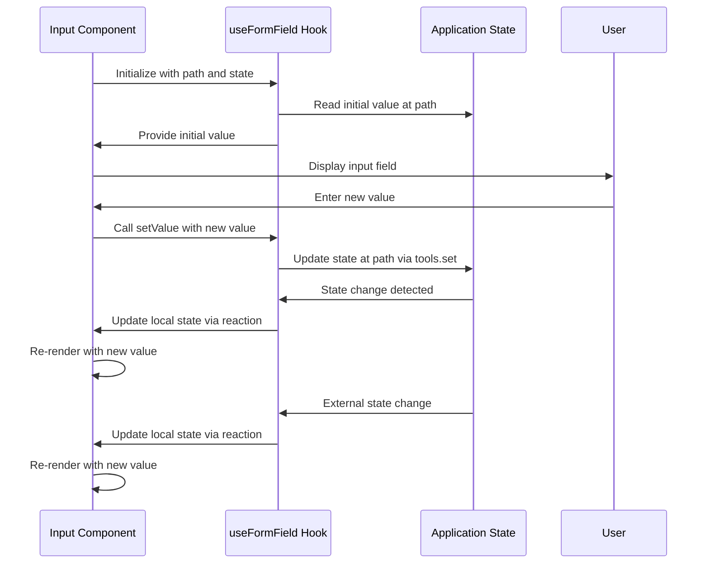
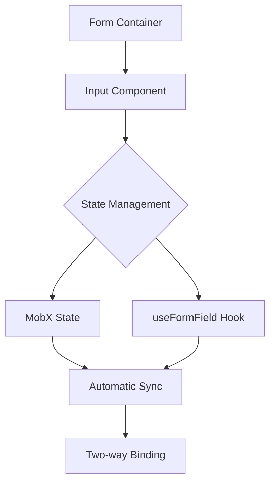
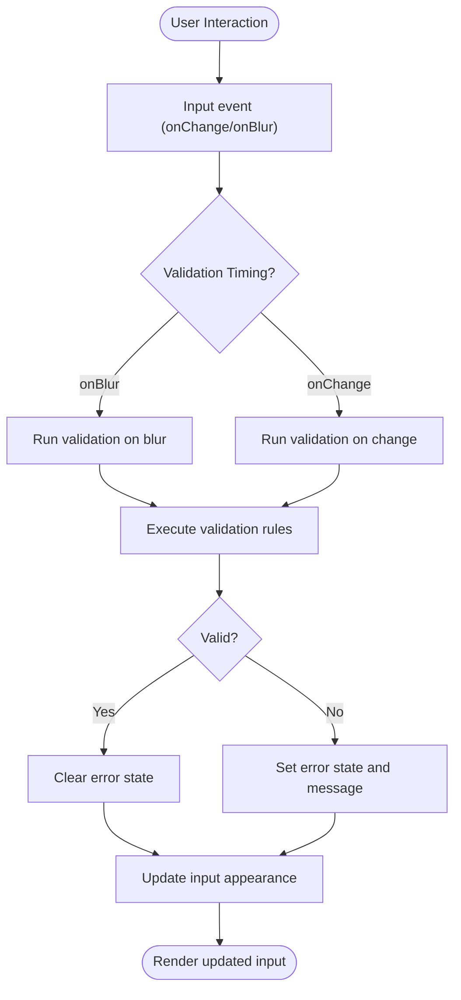

# Input Component

<cite>
**Referenced Files in This Document**   
- [Input.tsx](file://packages/ui/src/components/inputs/Input/Input.tsx)
- [index.tsx](file://packages/ui/src/components/inputs/Input/index.tsx)
- [useFormField.ts](file://packages/hooks/src/useFormField.ts)
- [Form.ts](file://packages/toolkit/src/Form.ts)
</cite>

## Table of Contents
1. [Introduction](#introduction)
2. [Core Implementation](#core-implementation)
3. [Supported Input Types](#supported-input-types)
4. [Validation Patterns](#validation-patterns)
5. [Accessibility Features](#accessibility-features)
6. [Form Integration](#form-integration)
7. [Controlled vs Uncontrolled States](#controlled-vs-uncontrolled-states)
8. [Error State Handling](#error-state-handling)
9. [Styling Customization](#styling-customization)
10. [Mobile and Browser Compatibility](#mobile-and-browser-compatibility)
11. [Usage Examples](#usage-examples)

## Introduction
The Input component in the shared-frontend library provides a flexible and accessible text input solution for web applications. Built as a wrapper around the HeroUI Input component, it offers enhanced functionality for form integration, validation, and state management. The component supports various input types and implements proper accessibility standards to ensure usability across different devices and assistive technologies.

## Core Implementation

The Input component is implemented as a two-layer architecture:

1. **Base Input Layer**: Direct wrapper of HeroUI's Input component with enhanced type handling
2. **State-Connected Layer**: MobX-integrated component that connects to form state management

The implementation handles special cases for number inputs by automatically converting string values to numbers when the input type is set to "number". This ensures type consistency in form state management.

**Diagram sources**
- [Input.tsx](file://packages/ui/src/components/inputs/Input/Input.tsx)
- [index.tsx](file://packages/ui/src/components/inputs/Input/index.tsx)

**Section sources**
- [Input.tsx](file://packages/ui/src/components/inputs/Input/Input.tsx#L7-L53)
- [index.tsx](file://packages/ui/src/components/inputs/Input/index.tsx#L7-L37)

## Supported Input Types
The Input component supports multiple input types through the standard HTML `type` attribute:

- **text**: Standard text input
- **email**: Email address input with built-in validation
- **password**: Password input with masked characters
- **number**: Numeric input with automatic type conversion
- **tel**: Telephone number input
- **url**: URL input
- **search**: Search field

The component automatically handles type-specific behaviors, such as converting string values to numbers for the "number" input type, ensuring consistent data types in the application state.

**Section sources**
- [Input.tsx](file://packages/ui/src/components/inputs/Input/Input.tsx#L19-L20)

## Validation Patterns
The Input component integrates with the validation system provided by the toolkit package. Validation rules can be applied through the form state management system using the `useFormField` hook.

Supported validation patterns include:
- Required field validation
- Minimum and maximum length validation
- Minimum and maximum value validation (for numbers)
- Regular expression pattern matching

Validation is performed through the `validateSingleField` and `validateFields` functions in the Form utility, which support configurable validation timing (onBlur, onChange, onFocus).

**Diagram sources**
- [Input.tsx](file://packages/ui/src/components/inputs/Input/Input.tsx)
- [Form.ts](file://packages/toolkit/src/Form.ts)

**Section sources**
- [Form.ts](file://packages/toolkit/src/Form.ts#L1-L96)

## Accessibility Features
The Input component implements comprehensive accessibility features to ensure usability for all users:

- **Proper labeling**: Integrated with label elements for screen reader support
- **ARIA attributes**: Automatic management of ARIA states including `aria-invalid` for error states
- **Keyboard navigation**: Full keyboard accessibility with proper tab indexing
- **Error messaging**: Accessible error messages that are announced by screen readers
- **Focus management**: Visual focus indicators and proper focus handling

The component ensures that all interactive elements are accessible via keyboard and that screen readers can properly announce the input state, including any validation errors.

**Section sources**
- [Input.tsx](file://packages/ui/src/components/inputs/Input/Input.tsx#L18-L19)

## Form Integration
The Input component seamlessly integrates with form libraries through the `useFormField` hook, which provides bidirectional data binding between the input and application state.

Key integration features:
- **Path-based state binding**: Connects input values to specific paths in the state object
- **Automatic state synchronization**: Updates state when input values change and vice versa
- **MobX reactivity**: Uses MobX reactions to maintain synchronization between input and state
- **Single and multi-path support**: Handles both simple and complex state structures

The integration uses MobX's `reaction` function to create bidirectional data flow, ensuring that changes in either the input or the state are reflected in the other.

**Diagram sources**
- [index.tsx](file://packages/ui/src/components/inputs/Input/index.tsx)
- [useFormField.ts](file://packages/hooks/src/useFormField.ts)

**Section sources**
- [index.tsx](file://packages/ui/src/components/inputs/Input/index.tsx#L11-L34)
- [useFormField.ts](file://packages/hooks/src/useFormField.ts#L62-L168)

## Controlled vs Uncontrolled States
The Input component supports both controlled and uncontrolled usage patterns:

**Controlled Mode**: When used with the state-connected version (default export), the component is fully controlled by the application state through MobX observables. The input value is always synchronized with the state object.

**Uncontrolled Mode**: The base Input component (re-exported as PureInputProps) can be used in a controlled manner by directly managing the value and onChange props without state integration.

The state-connected version uses MobX's `useLocalObservable` to create a local state that is synchronized with the application state, providing optimal performance while maintaining reactivity.

**Section sources**
- [index.tsx](file://packages/ui/src/components/inputs/Input/index.tsx#L11-L34)
- [Input.tsx](file://packages/ui/src/components/inputs/Input/Input.tsx#L14-L53)

## Error State Handling
The Input component provides comprehensive error state handling through:

- **Visual indicators**: Styling changes to indicate invalid state
- **Error messaging**: Display of error messages below the input field
- **ARIA integration**: Proper ARIA attributes for screen readers
- **Validation timing**: Configurable validation triggers (onBlur, onChange, onFocus)

Error states are managed through the `isInvalid` prop and `errorMessage` prop, with default spacing preserved for error messages to prevent layout shifts when errors appear.

**Section sources**
- [Input.tsx](file://packages/ui/src/components/inputs/Input/Input.tsx#L18-L19)

## Styling Customization
The Input component supports styling customization through:

- **Size variants**: Small, medium, and large sizes via the `size` prop
- **Theming**: Integration with the HeroUI theming system
- **CSS variables**: Support for custom styling via CSS variables
- **Class merging**: Ability to add custom classes while preserving base styling

The component uses the HeroUI Input component as its base, inheriting its styling system and customization options.

**Section sources**
- [Input.tsx](file://packages/ui/src/components/inputs/Input/Input.tsx#L20-L21)

## Mobile and Browser Compatibility
The Input component addresses mobile and cross-browser compatibility concerns:

- **Mobile keyboard behavior**: Appropriate keyboard types are shown based on input type (email, tel, number, etc.)
- **Autocomplete attributes**: Support for autocomplete to improve user experience
- **Cross-browser consistency**: Ensures consistent behavior across modern browsers
- **Touch interface optimization**: Proper sizing for touch targets

The component leverages the underlying HeroUI Input component's optimizations for mobile devices and ensures proper input behavior across different platforms.

**Section sources**
- [Input.tsx](file://packages/ui/src/components/inputs/Input/Input.tsx#L19-L20)

## Usage Examples

### Basic Usage
The Input component can be used in forms with state management:

### Integration with Form Validation
The component works with the validation system to provide real-time feedback:

**Diagram sources**
- [Form.ts](file://packages/toolkit/src/Form.ts)
- [index.tsx](file://packages/ui/src/components/inputs/Input/index.tsx)

**Section sources**
- [Form.ts](file://packages/toolkit/src/Form.ts#L13-L69)
- [index.tsx](file://packages/ui/src/components/inputs/Input/index.tsx#L18-L24)