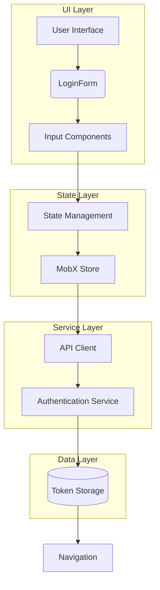
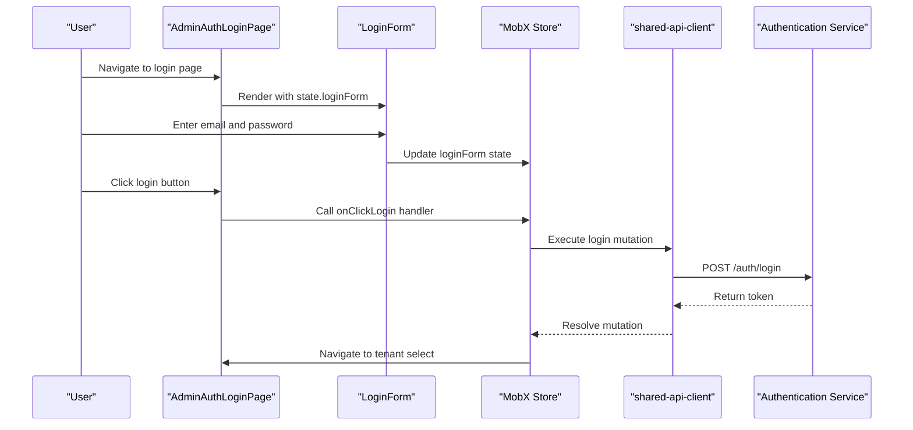

# LoginForm Component

<cite>
**Referenced Files in This Document**   
- [LoginForm.tsx](file://packages/ui/src/components/form/LoginForm/LoginForm.tsx)
- [Input.tsx](file://packages/ui/src/components/inputs/Input/Input.tsx)
- [AdminAuthLoginPage.tsx](file://packages/ui/src/components/page/AdminAuthLoginPage.tsx)
- [useAdminLoginRoute.ts](file://apps/admin/src/hooks/useAdminLoginRoute.ts)
- [login.tsx](file://apps/admin/src/routes/admin/auth/login.tsx)
- [shared-frontend](file://packages/shared-frontend)
- [shared-api-client](file://packages/shared-api-client)
</cite>

## Table of Contents
1. [Introduction](#introduction)
2. [Core Components](#core-components)
3. [Architecture Overview](#architecture-overview)
4. [Detailed Component Analysis](#detailed-component-analysis)
5. [Authentication Flow Integration](#authentication-flow-integration)
6. [Form State Management](#form-state-management)
7. [Error Handling and Validation](#error-handling-and-validation)
8. [Responsive Design and Accessibility](#responsive-design-and-accessibility)
9. [Theming and Styling](#theming-and-styling)
10. [Integration with SNSButtons](#integration-with-snsbuttons)
11. [Troubleshooting Guide](#troubleshooting-guide)

## Introduction
The LoginForm component is a reusable form component within the shared UI library that provides a standardized interface for user authentication. It is designed to be integrated into various applications within the monorepo, particularly in administrative and user-facing interfaces. The component follows a consistent design pattern using the VStack layout and Input components to create a clean, accessible login interface with email and password fields.

**Section sources**
- [LoginForm.tsx](file://packages/ui/src/components/form/LoginForm/LoginForm.tsx)

## Core Components
The LoginForm component is built using several core components from the shared UI library:
- **Input**: A wrapper around the HeroUI Input component that provides enhanced type handling and event management
- **VStack**: A layout component that arranges child elements in a vertical stack with configurable spacing
- **LoginForm**: The main component that combines Input fields for email and password within a VStack container

The component accepts a state object containing email and password values, allowing for external state management through MobX observables or other state management patterns.

**Section sources**
- [LoginForm.tsx](file://packages/ui/src/components/form/LoginForm/LoginForm.tsx)
- [Input.tsx](file://packages/ui/src/components/inputs/Input/Input.tsx)

## Architecture Overview
The LoginForm component is part of a larger authentication architecture that includes route handling, state management, and API integration. It is typically used within an authentication layout that provides responsive design for both mobile and desktop views.



**Diagram sources**
- [LoginForm.tsx](file://packages/ui/src/components/form/LoginForm/LoginForm.tsx)
- [useAdminLoginRoute.ts](file://apps/admin/src/hooks/useAdminLoginRoute.ts)

## Detailed Component Analysis

### LoginForm Implementation
The LoginForm component is a functional React component that renders two Input components within a VStack container. It accepts a single prop: `state`, which is an object containing email and password properties.

```mermaid
classDiagram
class LoginForm {
+state : {email : string, password : string}
+render() : JSX.Element
}
class Input {
+path : string
+state : object
+variant : string
+type : string
+placeholder : string
+label : string
}
class VStack {
+fullWidth : boolean
+justifyContent : string
}
LoginForm --> Input : "uses"
LoginForm --> VStack : "uses"
```

**Diagram sources**
- [LoginForm.tsx](file://packages/ui/src/components/form/LoginForm/LoginForm.tsx)
- [Input.tsx](file://packages/ui/src/components/inputs/Input/Input.tsx)

**Section sources**
- [LoginForm.tsx](file://packages/ui/src/components/form/LoginForm/LoginForm.tsx)

### Input Component Analysis
The Input component serves as a wrapper around the HeroUI Input component, providing additional functionality for type handling and event management. It accepts a value prop and onChange/onBlur callbacks, converting input values appropriately based on the input type.

**Section sources**
- [Input.tsx](file://packages/ui/src/components/inputs/Input/Input.tsx)

## Authentication Flow Integration
The LoginForm component is integrated into the authentication flow through the AdminAuthLoginPage component, which combines the form with additional UI elements like the Logo and Button components. The authentication flow follows a structured pattern using React Query for API calls and MobX for state management.



**Diagram sources**
- [AdminAuthLoginPage.tsx](file://packages/ui/src/components/page/AdminAuthLoginPage.tsx)
- [useAdminLoginRoute.ts](file://apps/admin/src/hooks/useAdminLoginRoute.ts)
- [login.tsx](file://apps/admin/src/routes/admin/auth/login.tsx)

**Section sources**
- [AdminAuthLoginPage.tsx](file://packages/ui/src/components/page/AdminAuthLoginPage.tsx)
- [useAdminLoginRoute.ts](file://apps/admin/src/hooks/useAdminLoginRoute.ts)

## Form State Management
The LoginForm component relies on external state management rather than maintaining its own internal state. This approach allows for better integration with application-level state management systems like MobX. The state is passed down from higher-level components and updated through handler functions.

The useAdminAuthLoginRoute hook demonstrates this pattern by creating an observable state object that contains the loginForm data. This state is then passed to the LoginForm component and updated through the onClickLogin handler.

**Section sources**
- [useAdminLoginRoute.ts](file://apps/admin/src/hooks/useAdminLoginRoute.ts)
- [login.tsx](file://apps/admin/src/routes/admin/auth/login.tsx)

## Error Handling and Validation
The authentication system implements error handling through React Query's mutation error handling and Axios error interception. When a login attempt fails, the error is caught in the onClickLogin handler and processed to extract the error message from the response.

The system uses isAxiosError to type-check the error before accessing the response data, ensuring type safety in error handling. While the LoginForm component itself doesn't handle validation, the Input components provide basic type validation through their HTML input types (email and password).

**Section sources**
- [login.tsx](file://apps/admin/src/routes/admin/auth/login.tsx)
- [useAdminLoginRoute.ts](file://apps/admin/src/hooks/useAdminLoginRoute.ts)

## Responsive Design and Accessibility
The LoginForm component is designed to be responsive and accessible. It is typically used within the AuthLayout component, which provides responsive behavior for different screen sizes. On mobile devices, the form is displayed in a single column, while on desktop devices, it appears alongside promotional content in a two-column layout.

The component uses semantic HTML elements and ARIA attributes through the underlying HeroUI components, ensuring accessibility for screen readers and keyboard navigation. The Input components provide appropriate labels and placeholders to guide users through the login process.

**Section sources**
- [AuthLayout.tsx](file://packages/ui/src/components/layout/Auth/AuthLayout.tsx)
- [LoginForm.tsx](file://packages/ui/src/components/form/LoginForm/LoginForm.tsx)

## Theming and Styling
The LoginForm component leverages the theming capabilities of the shared UI library through the use of variants and CSS classes. The Input components use the "flat" variant, which provides a minimal, clean appearance that fits well within the authentication context.

Styling is handled through a combination of Tailwind CSS classes and component-specific styles. The VStack component provides layout spacing, while the Input components handle their own visual presentation based on the specified variant and type.

**Section sources**
- [LoginForm.tsx](file://packages/ui/src/components/form/LoginForm/LoginForm.tsx)
- [AuthLayout.tsx](file://packages/ui/src/components/layout/Auth/AuthLayout.tsx)

## Integration with SNSButtons
While the current implementation doesn't show direct integration with SNSButtons, the architecture allows for easy extension to include social login options. The AdminAuthLoginPage structure could be modified to include SNSButtons below the LoginForm, providing alternative authentication methods.

The state management pattern used in the authentication flow would support additional login methods by adding corresponding handler functions to the useHandlers hook and exposing them to the UI components.

**Section sources**
- [AdminAuthLoginPage.tsx](file://packages/ui/src/components/page/AdminAuthLoginPage.tsx)
- [useAdminLoginRoute.ts](file://apps/admin/src/hooks/useAdminLoginRoute.ts)

## Troubleshooting Guide
Common issues with the LoginForm component typically relate to state management and API integration:

1. **State not updating**: Ensure the state object is properly observable with MobX and that the LoginForm receives the updated state through props.
2. **Form submission failures**: Check that the onClickLogin handler is properly connected to the login button's onPress event.
3. **API errors not displayed**: Verify that error boundaries are properly set up and that the isAxiosError check is correctly implemented.
4. **Responsive layout issues**: Confirm that the AuthLayout is properly wrapping the LoginForm and that the appropriate breakpoints are configured.

The component's dependency on external state management means that issues often originate from the state management layer rather than the component itself.

**Section sources**
- [login.tsx](file://apps/admin/src/routes/admin/auth/login.tsx)
- [useAdminLoginRoute.ts](file://apps/admin/src/hooks/useAdminLoginRoute.ts)