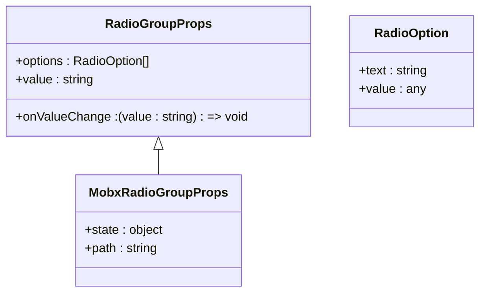
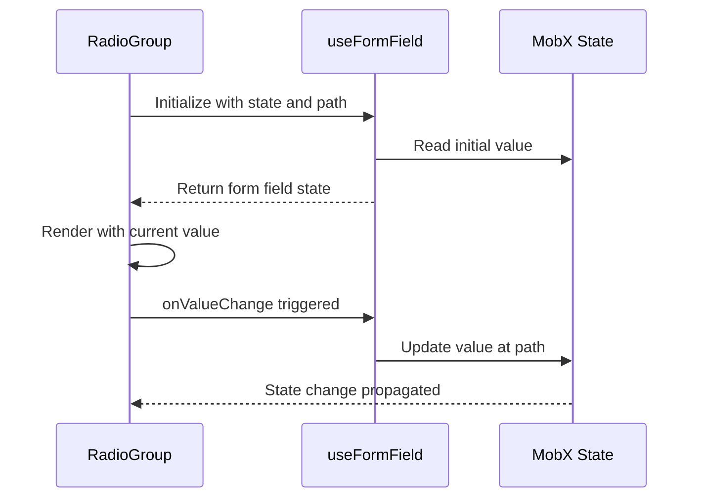
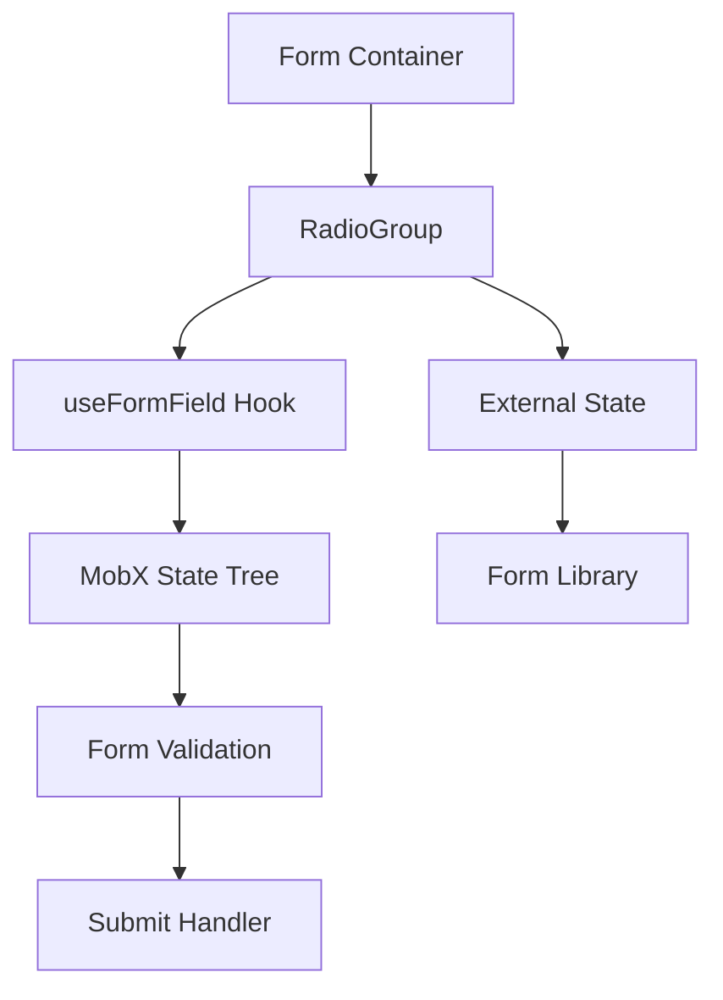
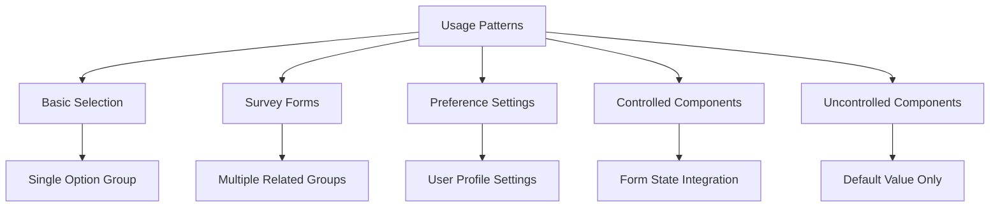

# RadioGroup Component

<cite>
**Referenced Files in This Document**   
- [RadioGroup.tsx](file://packages/ui/src/components/ui/inputs/RadioGroup/RadioGroup.tsx)
- [index.tsx](file://packages/ui/src/components/ui/inputs/RadioGroup/index.tsx)
- [RadioGroup.stories.tsx](file://packages/ui/src/components/ui/inputs/RadioGroup/RadioGroup.stories.tsx)
</cite>

## Table of Contents
1. [Introduction](#introduction)
2. [Core Implementation](#core-implementation)
3. [Props API](#props-api)
4. [State Management](#state-management)
5. [Accessibility and Keyboard Navigation](#accessibility-and-keyboard-navigation)
6. [Layout Options](#layout-options)
7. [Form Integration](#form-integration)
8. [Usage Examples](#usage-examples)
9. [Common Issues and Solutions](#common-issues-and-solutions)
10. [Conclusion](#conclusion)

## Introduction
The RadioGroup component in the shared-frontend library provides a flexible and accessible way to implement single-selection controls. Built as a wrapper around the @heroui/react RadioGroup component, it offers enhanced functionality for form integration, state management, and custom styling. This document details the implementation, usage patterns, and best practices for working with the RadioGroup component in various contexts including survey forms and preference selection interfaces.

**Section sources**
- [RadioGroup.tsx](file://packages/ui/src/components/ui/inputs/RadioGroup/RadioGroup.tsx#L1-L46)
- [index.tsx](file://packages/ui/src/components/ui/inputs/RadioGroup/index.tsx#L1-L42)

## Core Implementation
The RadioGroup component is implemented as a wrapper component that enhances the base @heroui/react RadioGroup with additional functionality. The core implementation consists of two layers: a base component (RadioGroup.tsx) that handles the fundamental radio button group behavior, and a MobX-integrated wrapper (index.tsx) that provides seamless state management integration.

The base component accepts an array of options with text and value properties, rendering them as individual Radio components within the group. It maintains the single selection behavior by ensuring only one radio button can be selected at a time, leveraging the underlying @heroui/react implementation for the core radio group logic.

```mermaid
flowchart TD
A[RadioGroup Component] --> B[Base RadioGroup]
A --> C[Options Array]
A --> D[Value Binding]
A --> E[Event Handling]
B --> F[@heroui/react RadioGroup]
C --> G[Radio Components]
G --> H[Individual Radio Buttons]
D --> I[Controlled/Uncontrolled State]
E --> J[onValueChange Callback]
```

**Diagram sources**
- [RadioGroup.tsx](file://packages/ui/src/components/ui/inputs/RadioGroup/RadioGroup.tsx#L1-L46)

**Section sources**
- [RadioGroup.tsx](file://packages/ui/src/components/ui/inputs/RadioGroup/RadioGroup.tsx#L1-L46)

## Props API
The RadioGroup component exposes a comprehensive API through its props interface, allowing for flexible configuration and customization. The component extends the base NextUIRadioGroupProps while omitting certain properties that are handled internally.

Key props include:
- `options`: Array of RadioOption objects containing text and value properties
- `value`: Current selected value (for controlled components)
- `onValueChange`: Callback function triggered when selection changes
- Additional props from NextUIRadioGroupProps for styling and behavior customization

The MobX-integrated version adds additional props for state management integration, including the state object and path for automatic value binding.



**Diagram sources**
- [RadioGroup.tsx](file://packages/ui/src/components/ui/inputs/RadioGroup/RadioGroup.tsx#L7-L17)
- [index.tsx](file://packages/ui/src/components/ui/inputs/RadioGroup/index.tsx#L10-L12)

**Section sources**
- [RadioGroup.tsx](file://packages/ui/src/components/ui/inputs/RadioGroup/RadioGroup.tsx#L7-L17)
- [index.tsx](file://packages/ui/src/components/ui/inputs/RadioGroup/index.tsx#L10-L12)

## State Management
The RadioGroup component supports both controlled and uncontrolled state patterns. The base implementation allows for external state management through the value and onValueChange props, enabling integration with various state management solutions.

The MobX-integrated version provides automatic state synchronization through the useFormField hook, which connects the component to a MobX state tree. This implementation automatically handles value binding and updates, reducing boilerplate code for form state management.



**Diagram sources**
- [index.tsx](file://packages/ui/src/components/ui/inputs/RadioGroup/index.tsx#L18-L26)

**Section sources**
- [index.tsx](file://packages/ui/src/components/ui/inputs/RadioGroup/index.tsx#L18-L26)

## Accessibility and Keyboard Navigation
The RadioGroup component inherits accessibility features from the @heroui/react implementation, ensuring compliance with WCAG standards. The component properly manages ARIA attributes, including role, aria-label, and aria-checked, to provide a fully accessible experience for screen readers and assistive technologies.

Keyboard navigation follows standard web conventions:
- Arrow keys (up/down or left/right) navigate between radio options
- Space bar selects the focused radio button
- The group receives focus as a single unit, with internal navigation handled within the group

The component ensures proper label association through the use of htmlFor and id attributes, and maintains focus management to provide a seamless keyboard navigation experience.

**Section sources**
- [RadioGroup.tsx](file://packages/ui/src/components/ui/inputs/RadioGroup/RadioGroup.tsx#L37-L43)

## Layout Options
The RadioGroup component supports flexible layout configurations through the underlying @heroui/react implementation. While the base component doesn't explicitly define layout props, it inherits layout capabilities from the parent library.

Common layout patterns include:
- Vertical layout (default): Radio options stacked vertically
- Horizontal layout: Radio options arranged in a row
- Grid layout: Radio options arranged in a grid pattern

Layout can be controlled through CSS classes and styling props passed to the component. The component's flexibility allows for responsive designs that adapt to different screen sizes and form requirements.

**Section sources**
- [RadioGroup.tsx](file://packages/ui/src/components/ui/inputs/RadioGroup/RadioGroup.tsx#L37-L43)

## Form Integration
The RadioGroup component is designed for seamless integration with form systems, particularly when using the MobX-integrated version. The component works with the useFormField hook to automatically bind to form state, validate input, and handle value changes.

For integration with form validation libraries, the component can be wrapped with validation providers or use standard HTML form attributes. The onValueChange callback allows for custom validation logic to be implemented, while the value prop enables controlled component patterns that work with most form libraries.

The component supports both standalone usage and integration within larger form systems, making it suitable for complex forms with multiple input types.



**Diagram sources**
- [index.tsx](file://packages/ui/src/components/ui/inputs/RadioGroup/index.tsx#L22-L26)

**Section sources**
- [index.tsx](file://packages/ui/src/components/ui/inputs/RadioGroup/index.tsx#L22-L26)

## Usage Examples
The RadioGroup component can be used in various contexts, from simple preference selection to complex survey forms. Common usage patterns include:

### Basic Usage
The component can be used with minimal configuration by providing options and handling value changes.

### Survey Forms
For survey applications, the component supports multiple radio groups with different options and validation requirements.

### Preference Selection
The component works well for user preference interfaces, allowing selection of themes, notification settings, or other user-configurable options.

### Controlled vs Uncontrolled
The component supports both controlled patterns (with explicit value and onChange) and uncontrolled patterns (with default values).



**Diagram sources**
- [RadioGroup.stories.tsx](file://packages/ui/src/components/ui/inputs/RadioGroup/RadioGroup.stories.tsx#L18-L22)
- [RadioGroup.stories.tsx](file://packages/ui/src/components/ui/inputs/RadioGroup/RadioGroup.stories.tsx#L24-L32)

**Section sources**
- [RadioGroup.stories.tsx](file://packages/ui/src/components/ui/inputs/RadioGroup/RadioGroup.stories.tsx#L18-L45)

## Common Issues and Solutions
When working with the RadioGroup component, several common issues may arise:

### Label Association
Ensure proper label association by providing clear text for each option and considering accessibility requirements.

### Focus Management
The component handles focus internally, but custom focus requirements may need additional handling through ref forwarding.

### Mutual Exclusivity
The component ensures mutual exclusivity by design, but issues may occur when multiple groups share the same name attribute.

### Value Binding
When using controlled components, ensure the value prop is properly synchronized with the component state to prevent selection issues.

### Performance
For large option sets, consider virtualization or pagination to maintain performance.

Solutions include proper state management, using the MobX integration for complex forms, and following accessibility best practices.

**Section sources**
- [RadioGroup.tsx](file://packages/ui/src/components/ui/inputs/RadioGroup/RadioGroup.tsx#L37-L43)
- [index.tsx](file://packages/ui/src/components/ui/inputs/RadioGroup/index.tsx#L22-L26)

## Conclusion
The RadioGroup component in the shared-frontend library provides a robust solution for implementing single-selection controls. With its flexible API, accessibility features, and seamless form integration, it serves as a reliable building block for various user interfaces. The component's two-layer architecture separates concerns between presentation and state management, allowing for both simple usage and complex integration scenarios. By following the documented patterns and best practices, developers can effectively implement radio groups in survey forms, preference selection interfaces, and other applications requiring single-choice selection.