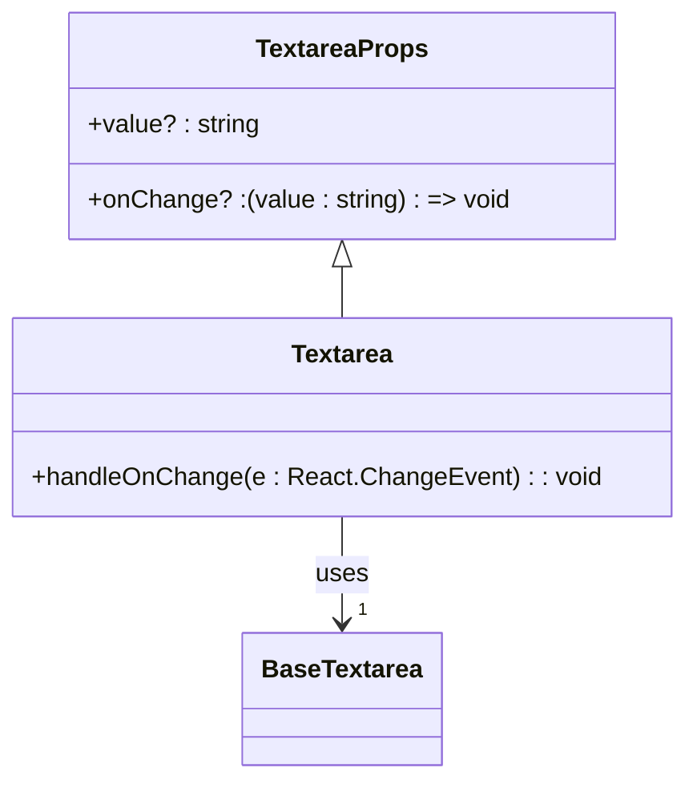
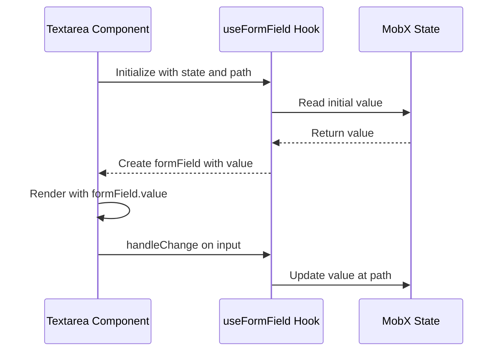
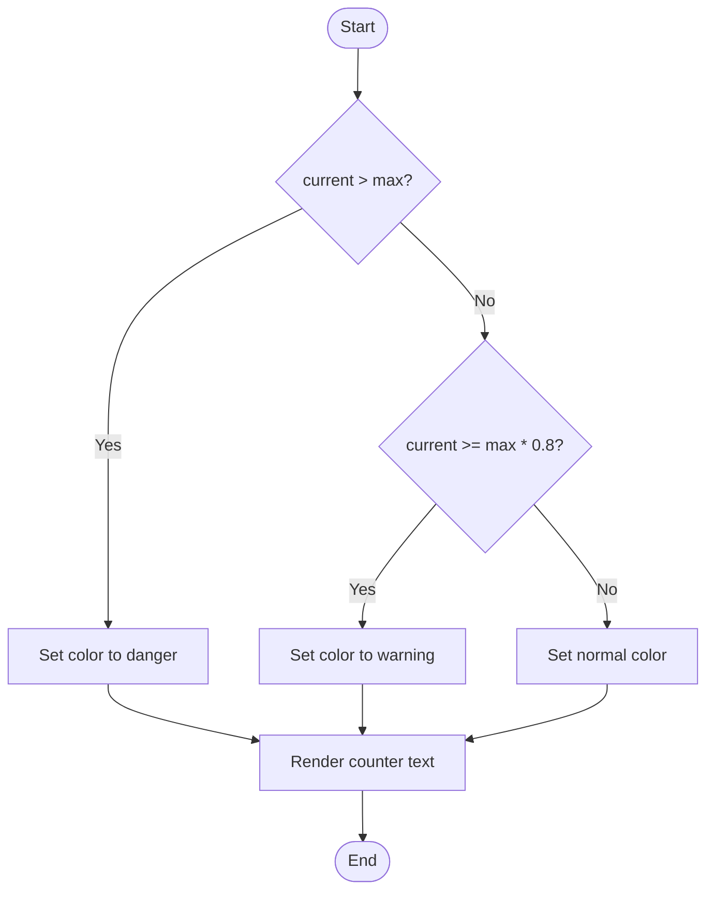
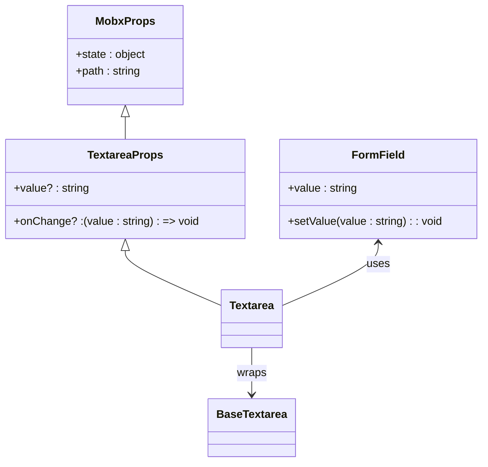

# Textarea Component

<cite>
**Referenced Files in This Document**   
- [Textarea.tsx](file://packages/ui/src/components/ui/inputs/Textarea/Textarea.tsx)
- [index.tsx](file://packages/ui/src/components/ui/inputs/Textarea/index.tsx)
- [Textarea.stories.tsx](file://packages/ui/src/components/ui/inputs/Textarea/Textarea.stories.tsx)
- [CharacterCounter.tsx](file://packages/ui/src/components/ui/inputs/CharacterCounter/CharacterCounter.tsx)
</cite>

## Table of Contents
1. [Introduction](#introduction)
2. [Core Implementation](#core-implementation)
3. [Controlled and Uncontrolled States](#controlled-and-uncontrolled-states)
4. [Character Counting Feature](#character-counting-feature)
5. [Accessibility Features](#accessibility-features)
6. [Form Integration](#form-integration)
7. [Props API Reference](#props-api-reference)
8. [Event Handling](#event-handling)
9. [Styling and Customization](#styling-and-customization)
10. [Usage Examples](#usage-examples)
11. [Common Issues and Solutions](#common-issues-and-solutions)
12. [Conclusion](#conclusion)

## Introduction

The Textarea component in the shared-frontend library provides a flexible and accessible multi-line text input solution for various use cases including comment forms, feedback collection, and content creation interfaces. The component is designed with both controlled and uncontrolled state patterns, supports character counting, and integrates seamlessly with form systems. Built on top of the Heroui React library, it extends the base Textarea functionality with additional features tailored for the application ecosystem.

**Section sources**
- [Textarea.tsx](file://packages/ui/src/components/ui/inputs/Textarea/Textarea.tsx#L1-L20)
- [index.tsx](file://packages/ui/src/components/ui/inputs/Textarea/index.tsx#L1-L38)

## Core Implementation

The Textarea component is implemented as a wrapper around the base Textarea from the Heroui React library, providing enhanced functionality while maintaining compatibility with the underlying component's API. The implementation consists of two main files: the base Textarea component and a MobX-integrated version that supports state management through the MobxProps interface.

The core implementation handles value propagation and change events, ensuring that the component can be used in both controlled and uncontrolled modes. It properly types the props by extending the base TextAreaProps while omitting the value and onChange properties to provide type-safe overrides.



**Diagram sources**
- [Textarea.tsx](file://packages/ui/src/components/ui/inputs/Textarea/Textarea.tsx#L5-L19)

**Section sources**
- [Textarea.tsx](file://packages/ui/src/components/ui/inputs/Textarea/Textarea.tsx#L1-L20)

## Controlled and Uncontrolled States

The Textarea component supports both controlled and uncontrolled state patterns, providing flexibility for different use cases. The base implementation in Textarea.tsx follows the controlled pattern, requiring the consumer to manage the state externally.

For MobX-based state management, the component provides an observer-wrapped version in the index.tsx file that integrates with the useFormField hook. This version accepts a state object and path parameter to automatically bind the textarea value to a specific property in the state tree, implementing the uncontrolled pattern with automatic state synchronization.

The MobX integration uses the tools.get utility to retrieve the initial value from the state object at the specified path, then creates a form field instance that handles value updates through the setValue method. This approach simplifies state management in complex forms while maintaining reactivity.



**Diagram sources**
- [index.tsx](file://packages/ui/src/components/ui/inputs/Textarea/index.tsx#L14-L34)

**Section sources**
- [index.tsx](file://packages/ui/src/components/ui/inputs/Textarea/index.tsx#L14-L34)

## Character Counting Feature

The library includes a CharacterCounter component that can be used alongside the Textarea to provide visual feedback on text length. This component displays the current character count against a maximum limit and provides visual indicators when approaching or exceeding the limit.

The CharacterCounter changes its text color based on the current count relative to the maximum: normal for counts below 80% of the limit, warning for counts between 80% and 100%, and danger for counts exceeding the maximum. This provides immediate visual feedback to users about their text length.

The component is designed to be flexible with optional showWarning and className props, allowing consumers to customize its behavior and styling. It renders the count in a Text component with the "caption" variant, ensuring consistent typography across the application.



**Diagram sources**
- [CharacterCounter.tsx](file://packages/ui/src/components/ui/inputs/CharacterCounter/CharacterCounter.tsx#L1-L36)

**Section sources**
- [CharacterCounter.tsx](file://packages/ui/src/components/ui/inputs/CharacterCounter/CharacterCounter.tsx#L1-L36)

## Accessibility Features

The Textarea component inherits accessibility features from the Heroui React library while adding additional enhancements through its implementation. The component properly handles keyboard navigation and screen reader support through standard HTML textarea attributes that are passed through the rest props.

The implementation ensures proper event handling for accessibility by using the standard onChange event with the correct React.ChangeEvent type. The component maintains focus management and supports all standard keyboard interactions expected for a textarea element.

For users with assistive technologies, the component provides proper labeling through the label prop, which creates an associated label element that screen readers can identify. The character counter, when used, provides additional context about input constraints, helping users understand requirements before submitting their input.

**Section sources**
- [Textarea.tsx](file://packages/ui/src/components/ui/inputs/Textarea/Textarea.tsx#L1-L20)

## Form Integration

The Textarea component is designed for seamless integration with form systems, particularly those using MobX for state management. The MobX-integrated version in the index.tsx file provides direct binding to state objects through the state and path props, eliminating the need for manual event handling in many cases.

The component works with the useFormField hook to create a form field instance that manages its own state and provides validation capabilities. This integration allows for consistent form handling patterns across different input types and simplifies the implementation of complex forms with multiple fields.

For integration with other form libraries or custom form implementations, the base Textarea component provides a standard controlled interface with value and onChange props, making it compatible with most form management solutions.



**Diagram sources**
- [index.tsx](file://packages/ui/src/components/ui/inputs/Textarea/index.tsx#L10-L13)
- [Textarea.tsx](file://packages/ui/src/components/ui/inputs/Textarea/Textarea.tsx#L5-L9)

**Section sources**
- [index.tsx](file://packages/ui/src/components/ui/inputs/Textarea/index.tsx#L1-L38)

## Props API Reference

The Textarea component provides a comprehensive API that extends the base Heroui Textarea props while adding specific enhancements for the application ecosystem. The component accepts all standard textarea attributes such as placeholder, disabled, required, and maxLength, which are passed through to the underlying base component.

Key props include:
- **value**: Optional string value for controlled component usage
- **onChange**: Optional callback function that receives the current value on change events
- **state**: For MobX integration, the state object containing the value
- **path**: For MobX integration, the path to the value within the state object

The component also supports all standard HTML textarea attributes through the rest parameters, allowing for customization of behavior such as rows, cols, autoFocus, and spellCheck.

**Section sources**
- [Textarea.tsx](file://packages/ui/src/components/ui/inputs/Textarea/Textarea.tsx#L5-L9)
- [index.tsx](file://packages/ui/src/components/ui/inputs/Textarea/index.tsx#L10-L13)

## Event Handling

The Textarea component implements proper event handling for user interactions. The onChange event is the primary mechanism for tracking user input, with the component converting the standard React.ChangeEvent to a simple string value callback for easier consumption.

The event handling implementation ensures that the onChange callback is optional, with nullish coalescing (?.) preventing errors when no callback is provided. This makes the component more robust and prevents runtime errors in cases where change handling is not required.

For MobX-integrated usage, the component internally handles the onChange event by updating the form field value, which in turn updates the state object. This abstraction simplifies the API for consumers while maintaining reactivity and proper state management.

**Section sources**
- [Textarea.tsx](file://packages/ui/src/components/ui/inputs/Textarea/Textarea.tsx#L14-L16)

## Styling and Customization

The Textarea component inherits styling from the Heroui React library, ensuring consistency with other UI elements in the application. The component supports customization through the className prop, which is passed through to the base component.

For specific styling requirements, consumers can apply custom CSS classes to modify the appearance of the textarea. The component also supports all standard HTML attributes that affect presentation, such as rows and cols, allowing for control over the initial size and layout.

The character counter component provides additional styling options through the className prop, allowing consumers to add custom styles while preserving the component's built-in color indicators for different count states.

**Section sources**
- [Textarea.tsx](file://packages/ui/src/components/ui/inputs/Textarea/Textarea.tsx#L18)
- [CharacterCounter.tsx](file://packages/ui/src/components/ui/inputs/CharacterCounter/CharacterCounter.tsx#L14-L28)

## Usage Examples

### Comment Form Implementation

The Textarea component is ideal for comment forms, where users need to enter longer text inputs. When combined with the CharacterCounter, it provides immediate feedback on length requirements.

```mermaid
flowchart TD
A([Comment Form]) --> B[Textarea with label "Comment"]
B --> C[CharacterCounter with max 500]
C --> D{Count < 400?}
D --> |Yes| E[Normal text color]
D --> |No| F{Count < 500?}
F --> |Yes| G[Warning color]
F --> |No| H[Error color]
E --> I[Submit button]
G --> I
H --> I
```

**Diagram sources**
- [Textarea.stories.tsx](file://packages/ui/src/components/ui/inputs/Textarea/Textarea.stories.tsx#L18-L27)
- [CharacterCounter.tsx](file://packages/ui/src/components/ui/inputs/CharacterCounter/CharacterCounter.tsx#L16-L23)

### Feedback Collection

For feedback collection forms, the Textarea can be used with initial values and integrated with form validation systems. The MobX integration simplifies state management in complex forms with multiple fields.

### Content Creation Interface

In content creation interfaces, the Textarea can be used with custom styling to match the application's design language. The auto-resizing behavior (inherited from the base component) ensures that users can see all their content without excessive scrolling.

**Section sources**
- [Textarea.stories.tsx](file://packages/ui/src/components/ui/inputs/Textarea/Textarea.stories.tsx#L18-L37)

## Common Issues and Solutions

### Mobile Keyboard Behavior

On mobile devices, the textarea may cause layout shifts when the keyboard appears. This can be mitigated by ensuring proper viewport meta tags and using CSS to handle the visual viewport appropriately.

### Scroll Handling

Long content in the textarea may require scroll handling. The component inherits proper scroll behavior from the base implementation, but consumers should ensure adequate height is allocated for the expected content length.

### Cross-Browser Compatibility

The component maintains cross-browser compatibility by relying on standard HTML textarea elements and avoiding browser-specific features. The Heroui base component handles most cross-browser inconsistencies, ensuring consistent behavior across different environments.

### Form Validation Integration

When integrating with form validation systems, ensure that the value and onChange props are properly connected to the validation state. For MobX integration, the form field provides built-in validation capabilities that can be extended as needed.

**Section sources**
- [Textarea.tsx](file://packages/ui/src/components/ui/inputs/Textarea/Textarea.tsx)
- [index.tsx](file://packages/ui/src/components/ui/inputs/Textarea/index.tsx)

## Conclusion

The Textarea component in the shared-frontend library provides a robust solution for multi-line text input with support for both controlled and uncontrolled state patterns. Its integration with MobX state management, character counting capabilities, and accessibility features make it suitable for a wide range of use cases from simple comment forms to complex content creation interfaces.

The component's architecture, built on top of the Heroui React library, ensures consistency with other UI elements while providing the flexibility needed for various implementation scenarios. By following the documented patterns for state management, event handling, and styling, developers can effectively utilize the Textarea component in their applications.