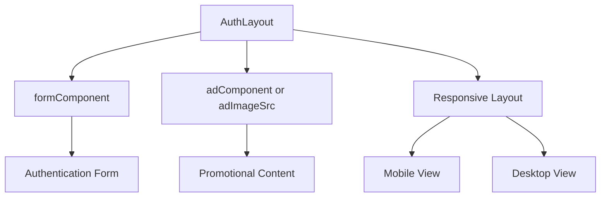
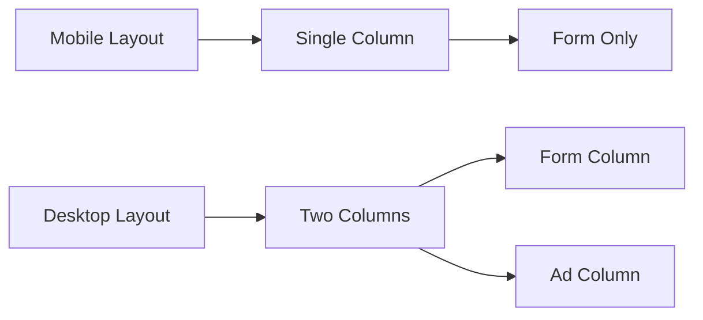

# Auth Layout

<cite>
**Referenced Files in This Document**   
- [AuthLayout.tsx](file://packages/ui/src/components/layout/Auth/AuthLayout.tsx)
- [AuthLayout.stories.tsx](file://packages/ui/src/components/layout/Auth/AuthLayout.stories.tsx)
- [index.ts](file://packages/ui/src/components/layout/index.ts)
- [auth.tsx](file://apps/admin/src/routes/admin/auth.tsx)
</cite>

## Table of Contents
1. [Introduction](#introduction)
2. [Core Components](#core-components)
3. [Props Interface](#props-interface)
4. [Layout Behavior](#layout-behavior)
5. [Responsive Design](#responsive-design)
6. [Usage Examples](#usage-examples)
7. [Styling and Branding](#styling-and-branding)
8. [Integration with AppProviders](#integration-with-appproviders)
9. [Common Issues and Solutions](#common-issues-and-solutions)

## Introduction
The AuthLayout component is a dedicated layout container designed for authentication flows such as login, registration, and password reset. It provides a consistent, responsive structure that adapts to different device sizes while maintaining a clean, focused user experience. The component is part of the shared UI library and is designed to work seamlessly with the AppProviders for theme and authentication state management.

**Section sources**
- [AuthLayout.tsx](file://packages/ui/src/components/layout/Auth/AuthLayout.tsx#L1-L48)

## Core Components
The AuthLayout component serves as a wrapper for authentication forms, providing a structured layout that separates the form content from optional advertising or promotional content. It is designed to be minimalistic, focusing user attention on the authentication task at hand.

The component is exported from the shared UI library's layout module and can be imported and used across different applications within the ecosystem. It leverages React's compositional pattern by accepting form components as props, allowing for flexible integration with various authentication forms like LoginForm, RegistrationForm, or PasswordResetForm.



**Diagram sources**
- [AuthLayout.tsx](file://packages/ui/src/components/layout/Auth/AuthLayout.tsx#L1-L48)

**Section sources**
- [AuthLayout.tsx](file://packages/ui/src/components/layout/Auth/AuthLayout.tsx#L1-L48)
- [index.ts](file://packages/ui/src/components/layout/index.ts#L1)

## Props Interface
The AuthLayout component accepts the following props to customize its behavior and appearance:

- **formComponent**: (ReactNode, required) The authentication form component to be displayed (e.g., LoginForm, RegistrationForm)
- **adComponent**: (ReactNode, optional) Custom promotional component to display alongside the form on desktop
- **adImageSrc**: (string, optional) URL of an image to display as promotional content when no adComponent is provided
- **adImageAlt**: (string, optional) Alt text for the promotional image, defaults to "Advertisement"

The component implements a fallback mechanism where if an adImageSrc is provided but no adComponent, it automatically creates a default image component with appropriate styling and accessibility attributes.

**Section sources**
- [AuthLayout.tsx](file://packages/ui/src/components/layout/Auth/AuthLayout.tsx#L3-L8)

## Layout Behavior
The AuthLayout implements a dual-layout strategy that adapts based on screen size:

On mobile devices (screen width < 768px), the layout displays only the form component in a full-width container with generous padding, creating a focused, distraction-free experience.

On desktop devices (screen width ≥ 768px), the layout splits into a two-column design:
- Left column (66% width): Contains the centered authentication form with maximum width constraints
- Right column (33% width): Displays promotional or advertising content

The layout uses flexbox with proper height constraints to ensure the content fills the viewport while maintaining scrollability when needed.



**Diagram sources**
- [AuthLayout.tsx](file://packages/ui/src/components/layout/Auth/AuthLayout.tsx#L30-L45)

**Section sources**
- [AuthLayout.tsx](file://packages/ui/src/components/layout/Auth/AuthLayout.tsx#L30-L45)

## Responsive Design
The AuthLayout component implements responsive design principles using Tailwind CSS breakpoints. The layout transitions from a single-column mobile view to a two-column desktop view at the md breakpoint (768px).

Key responsive features include:
- Mobile-first design approach
- Conditional rendering of layout components based on screen size
- Appropriate padding and spacing adjustments for different screen sizes
- Maximum width constraints to prevent content from becoming too wide on large screens
- Flexible height handling to accommodate various viewport sizes

The component ensures that authentication forms remain readable and usable across all device sizes, with proper touch targets on mobile and optimal reading line lengths on desktop.

**Section sources**
- [AuthLayout.tsx](file://packages/ui/src/components/layout/Auth/AuthLayout.tsx#L31-L45)

## Usage Examples
The AuthLayout component is used in various applications across the ecosystem. In the admin application, it serves as the container for authentication routes, wrapping login and registration forms.

Example usage in the admin application:
```tsx
<div className="flex min-h-screen items-center justify-center bg-gray-50">
  <div className="w-full max-w-md space-y-8">
    <Outlet />
  </div>
</div>
```

The component can be used with various authentication forms:
- Login flows with email/password inputs
- Registration forms with multiple fields
- Password reset and recovery flows
- Two-factor authentication screens

It can also be customized with different promotional content for various contexts, such as displaying product features, security tips, or company branding.

**Section sources**
- [auth.tsx](file://apps/admin/src/routes/admin/auth.tsx#L1-L15)
- [AuthLayout.stories.tsx](file://packages/ui/src/components/layout/Auth/AuthLayout.stories.tsx#L1-L48)

## Styling and Branding
The AuthLayout component uses utility-first CSS (Tailwind) for styling, providing a clean, modern appearance that can be easily customized. The styling approach includes:

- Centered content alignment on both axes
- Appropriate spacing and padding for touch-friendly interfaces
- Shadow effects and rounded corners for visual depth
- Responsive padding that adjusts based on screen size
- Maximum width constraints to maintain readability

The component supports branding customization through:
- Custom promotional content via the adComponent prop
- Image-based branding via the adImageSrc prop
- Theme integration through the AppProviders system
- CSS variable overrides for colors and typography

The default styling creates a professional, trustworthy appearance suitable for authentication interfaces, with ample whitespace to reduce cognitive load.

**Section sources**
- [AuthLayout.tsx](file://packages/ui/src/components/layout/Auth/AuthLayout.tsx#L18-L23)
- [AuthLayout.stories.tsx](file://packages/ui/src/components/layout/Auth/AuthLayout.stories.tsx#L22-L25)

## Integration with AppProviders
The AuthLayout component is designed to work in conjunction with the AppProviders system, which manages application-wide state including authentication state and theme preferences. While the AuthLayout itself doesn't directly handle authentication state, it serves as a container that respects the global theme and can respond to authentication context.

The component can be wrapped with authentication providers that:
- Check the user's authentication status
- Redirect authenticated users away from authentication routes
- Provide theme context for consistent styling
- Manage loading states during authentication processes

This integration ensures a cohesive user experience where the authentication layout respects the application's overall design system and state management patterns.

**Section sources**
- [AuthLayout.tsx](file://packages/ui/src/components/layout/Auth/AuthLayout.tsx#L1-L48)

## Common Issues and Solutions
When implementing the AuthLayout component, several common issues may arise:

**Form Alignment Issues**: Ensure the form component has appropriate width constraints. The AuthLayout provides a max-w-md container on desktop, but nested forms should avoid conflicting width styles.

**Mobile Responsiveness**: Test the layout on various mobile devices to ensure touch targets are appropriately sized and the form is fully visible without horizontal scrolling.

**Integration with Navigation Guards**: Implement proper route protection to prevent authenticated users from accessing authentication routes. This typically involves checking authentication state before rendering the AuthLayout.

**Content Overflow**: When using custom adComponent content, ensure it respects height constraints to prevent layout overflow, especially on smaller screens.

**Accessibility**: Ensure promotional content has appropriate alt text and that form elements are properly labeled and accessible via keyboard navigation.

The component's design anticipates these issues through its constrained layout approach and flexible prop interface, allowing developers to address these concerns through proper implementation patterns.

**Section sources**
- [AuthLayout.tsx](file://packages/ui/src/components/layout/Auth/AuthLayout.tsx#L30-L45)
- [auth.tsx](file://apps/admin/src/routes/admin/auth.tsx#L1-L15)