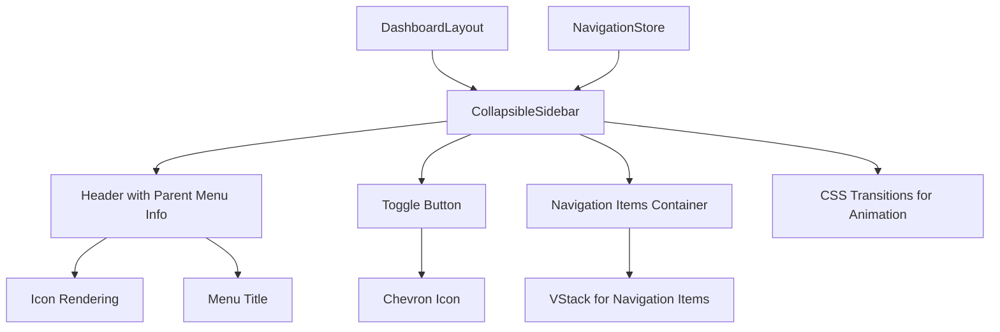
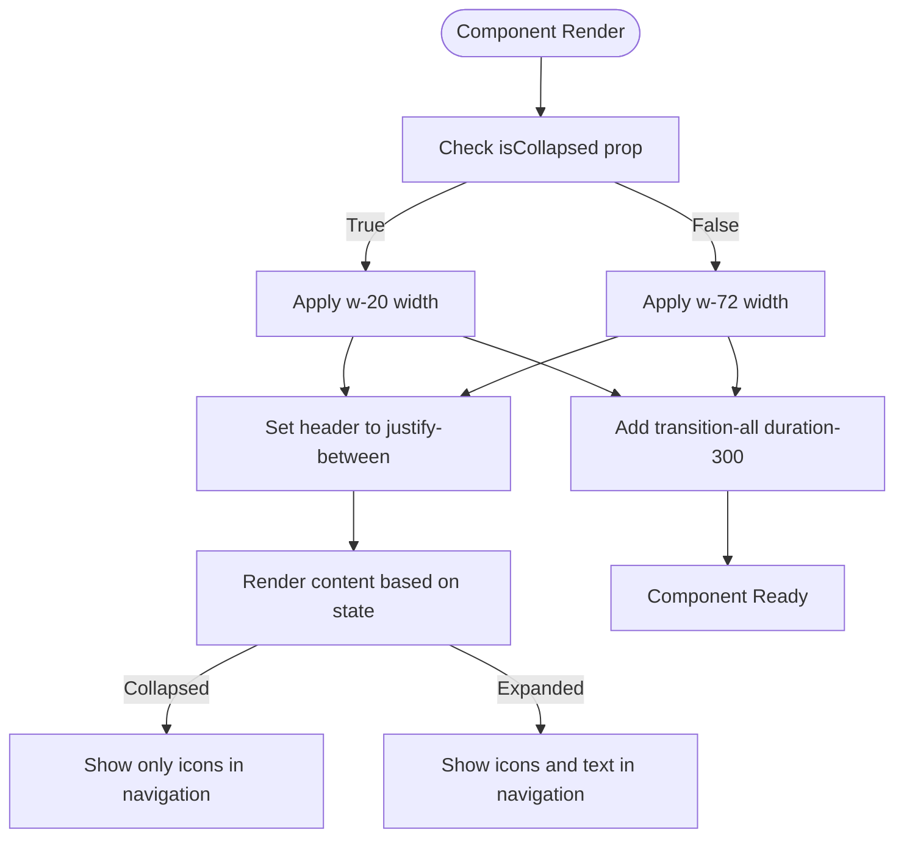
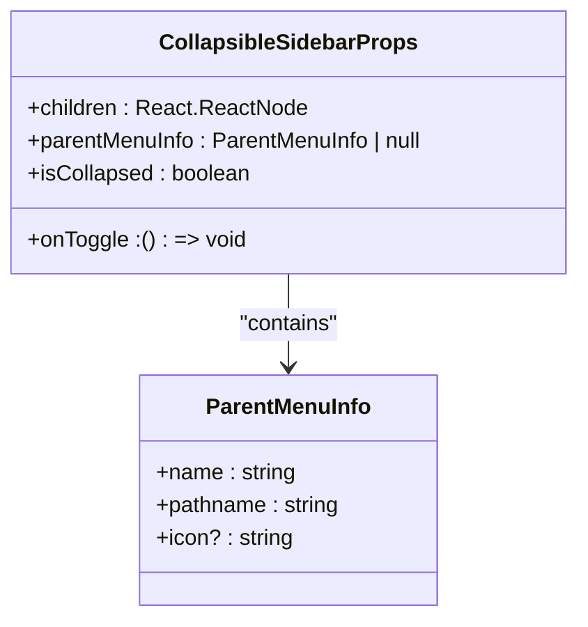
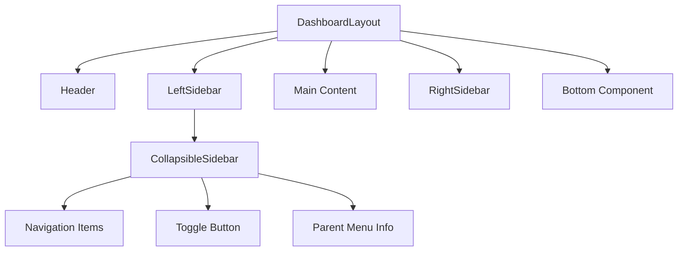
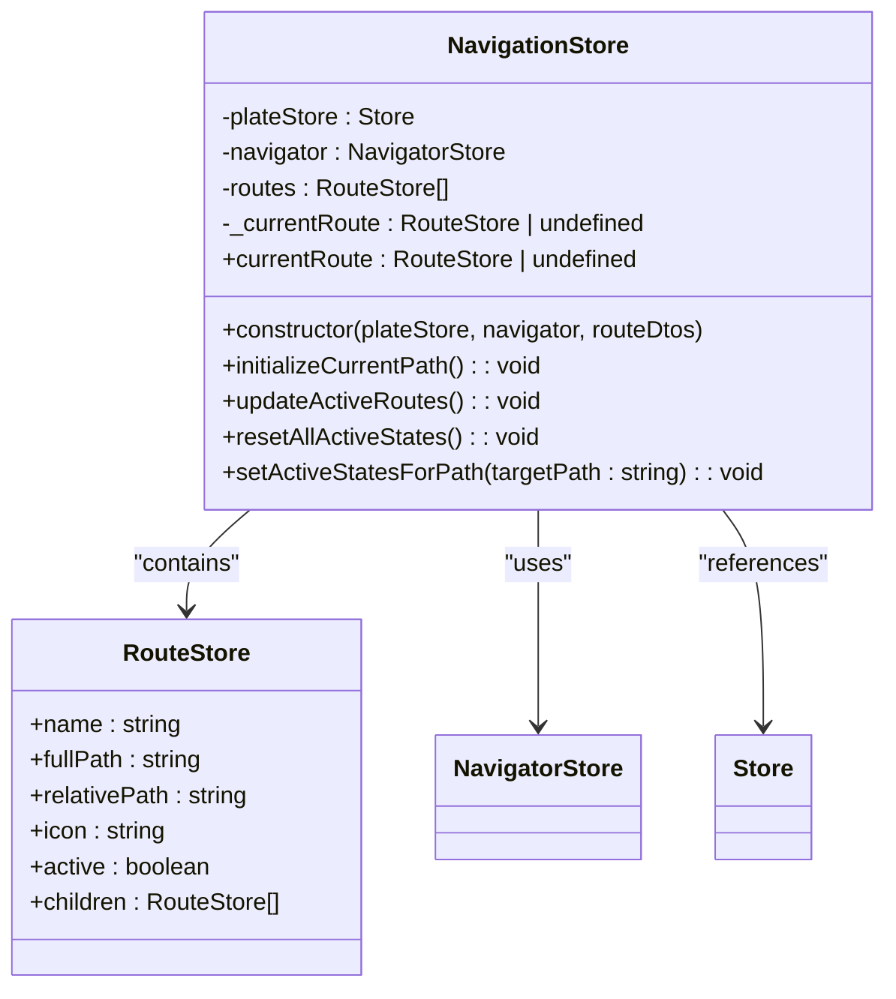

# Collapsible Sidebar

<cite>
**Referenced Files in This Document**   
- [CollapsibleSidebarLayout.tsx](file://packages/ui/src/components/layout/CollapsibleSidebar/CollapsibleSidebarLayout.tsx)
- [CollapsibleSidebarLayout.stories.tsx](file://packages/ui/src/components/layout/CollapsibleSidebar/CollapsibleSidebarLayout.stories.tsx)
- [navigationStore.ts](file://packages/store/src/stores/navigationStore.ts)
- [DashboardLayout.tsx](file://packages/ui/src/components/layout/Dashboard/DashboardLayout.tsx)
- [index.ts](file://packages/ui/src/components/layout/index.ts)
</cite>

## Table of Contents
1. [Introduction](#introduction)
2. [Core Components](#core-components)
3. [Architecture Overview](#architecture-overview)
4. [Detailed Component Analysis](#detailed-component-analysis)
5. [State Management and Navigation Integration](#state-management-and-navigation-integration)
6. [Responsive Behavior and Customization](#responsive-behavior-and-customization)
7. [Performance and Accessibility Considerations](#performance-and-accessibility-considerations)
8. [Troubleshooting Guide](#troubleshooting-guide)

## Introduction
The CollapsibleSidebarLayout component is a reusable UI element in the shared-frontend library designed to provide a responsive, animated sidebar navigation for applications. This documentation details its implementation, focusing on collapsible behavior, state management, animation implementation, and integration with the global navigation system. The component is used across various applications, particularly in the admin dashboard, to provide an intuitive navigation experience with support for responsive design and accessibility.

## Core Components

The CollapsibleSidebar component is a self-contained layout component that manages its own visual state (collapsed/expanded) through props. It provides a header section with parent menu information and a toggle button, along with a scrollable area for navigation items. The component leverages CSS transitions for smooth animations when collapsing and expanding. It integrates with the global navigation system through the navigation store, which manages route states and active navigation paths.

**Section sources**
- [CollapsibleSidebarLayout.tsx](file://packages/ui/src/components/layout/CollapsibleSidebar/CollapsibleSidebarLayout.tsx#L1-L82)
- [CollapsibleSidebarLayout.stories.tsx](file://packages/ui/src/components/layout/CollapsibleSidebar/CollapsibleSidebarLayout.stories.tsx#L1-L72)

## Architecture Overview

The CollapsibleSidebar component follows a modular architecture that separates concerns between layout, state management, and navigation logic. It is designed to be used within larger layout components like DashboardLayout, which coordinate multiple UI elements including headers, sidebars, and main content areas. The component receives its collapsed state and toggle handler as props, making it flexible for integration with various state management approaches.

**Diagram sources**
- [CollapsibleSidebarLayout.tsx](file://packages/ui/src/components/layout/CollapsibleSidebar/CollapsibleSidebarLayout.tsx#L1-L82)
- [DashboardLayout.tsx](file://packages/ui/src/components/layout/Dashboard/DashboardLayout.tsx#L1-L104)

## Detailed Component Analysis

### CollapsibleSidebar Implementation
The CollapsibleSidebar component implements a clean, responsive sidebar with smooth transitions between collapsed and expanded states. The component's width changes from 80px (w-20) when collapsed to 288px (w-72) when expanded, with a 300ms CSS transition applied to all properties for smooth animation.

#### Collapsible Behavior and Animation
The component uses Tailwind CSS classes to manage its visual state, with the width changing based on the `isCollapsed` prop. The transition is handled through the `transition-all duration-300` classes, which apply a smooth animation to all changing properties. When collapsed, the sidebar shows only icons and the toggle button, while in the expanded state, it displays full menu text alongside icons.

**Diagram sources**
- [CollapsibleSidebarLayout.tsx](file://packages/ui/src/components/layout/CollapsibleSidebar/CollapsibleSidebarLayout.tsx#L24-L26)

#### Props Interface
The component accepts a well-defined props interface that includes:
- `children`: React nodes representing navigation items
- `parentMenuInfo`: Optional object containing name, pathname, and icon for the parent menu
- `isCollapsed`: Boolean indicating the current collapsed state
- `onToggle`: Function handler for toggle button press events

The ParentMenuInfo interface defines the structure for parent menu information, including required name and pathname properties, with an optional icon string that references Lucide icon names.

**Diagram sources**
- [CollapsibleSidebarLayout.tsx](file://packages/ui/src/components/layout/CollapsibleSidebar/CollapsibleSidebarLayout.tsx#L12-L17)

### Integration with Admin Dashboard
The CollapsibleSidebar is designed to integrate with the DashboardLayout component, which provides a complete dashboard interface with header, sidebars, and content areas. In the admin dashboard, the sidebar would typically be used as the leftSidebar component, providing navigation to various administrative functions.

**Diagram sources**
- [DashboardLayout.tsx](file://packages/ui/src/components/layout/Dashboard/DashboardLayout.tsx#L49-L100)
- [CollapsibleSidebarLayout.tsx](file://packages/ui/src/components/layout/CollapsibleSidebar/CollapsibleSidebarLayout.tsx#L23-L82)

## State Management and Navigation Integration

### Global Navigation Store
The navigation system is managed by the NavigationStore class, which maintains the application's route state and handles active route tracking. The store uses MobX for reactive state management, automatically updating when the current route changes. It maintains a tree of RouteStore objects and updates active states based on the current path, supporting both exact matches and hierarchical path matching.

**Diagram sources**
- [navigationStore.ts](file://packages/store/src/stores/navigationStore.ts#L9-L114)

### Route State Management
The NavigationStore implements a sophisticated system for managing active route states. When the current route changes, it triggers an update that resets all active states and then sets active states for the current path and its ancestors. The system handles three types of matches:
1. Exact path matches
2. Child path matches (when the current path starts with a route's fullPath followed by a slash)
3. Descendant matches (when any child route is active)

This hierarchical approach ensures that parent menu items remain highlighted when navigating to child pages, providing clear visual feedback about the user's location within the application.

**Section sources**
- [navigationStore.ts](file://packages/store/src/stores/navigationStore.ts#L66-L112)

## Responsive Behavior and Customization

### Responsive Design
The CollapsibleSidebar component is designed to work within responsive layouts, though its responsiveness is primarily controlled by the parent DashboardLayout component. The sidebar's own responsiveness is limited to the collapsed/expanded state, which can be controlled programmatically based on screen size or user preference.

The component uses flexbox layout with `flex-1` on the navigation items container to ensure it fills the available vertical space while allowing scrolling when content exceeds the viewport height. The `overflow-y-auto` class enables scrolling for long navigation lists.

### Customization Options
The component offers several customization options through its props interface:
- **Visual customization**: The parent menu can be customized with different icons, titles, and paths
- **Behavior customization**: The collapsed state and toggle behavior are controlled by props, allowing integration with different state management patterns
- **Content customization**: The navigation items are passed as children, allowing complete control over the content and structure of the navigation menu

The component also supports accessibility features, including proper ARIA labels on the toggle button ("Expand sidebar" or "Collapse sidebar" depending on state) and semantic HTML structure for screen readers.

**Section sources**
- [CollapsibleSidebarLayout.tsx](file://packages/ui/src/components/layout/CollapsibleSidebar/CollapsibleSidebarLayout.tsx#L58-L60)
- [DashboardLayout.tsx](file://packages/ui/src/components/layout/Dashboard/DashboardLayout.tsx#L58-L64)

## Performance and Accessibility Considerations

### Performance with Large Navigation Trees
The CollapsibleSidebar component is optimized for performance with large navigation trees through several mechanisms:
- Virtualization is not implemented directly in the component, but the use of `overflow-y-auto` on a fixed container allows the browser to handle scrolling performance
- The component relies on React's reconciliation algorithm to minimize re-renders when the collapsed state changes
- The navigation items are passed as children, allowing parent components to implement their own optimization strategies like memoization or virtualization

For applications with very large navigation trees, it's recommended to implement virtualization at the parent component level or to use lazy loading of navigation sections.

### Accessibility Features
The component includes several accessibility features:
- The toggle button has an appropriate ARIA label that changes based on the current state
- The navigation items container uses semantic HTML with proper heading levels
- Keyboard navigation is supported through standard tab navigation
- Focus states are managed by the Button component from @heroui/react
- The component maintains proper document flow and doesn't disrupt screen reader navigation

### State Persistence
While the CollapsibleSidebar component itself doesn't handle state persistence, it's designed to work with external state management systems. The collapsed state can be persisted across page reloads by storing it in localStorage or another persistent storage mechanism and retrieving it on component initialization. This would typically be handled by a parent component or layout manager that wraps the CollapsibleSidebar.

**Section sources**
- [CollapsibleSidebarLayout.tsx](file://packages/ui/src/components/layout/CollapsibleSidebar/CollapsibleSidebarLayout.tsx#L58-L60)
- [navigationStore.ts](file://packages/store/src/stores/navigationStore.ts#L42-L50)

## Troubleshooting Guide

### Common Issues and Solutions
When integrating the CollapsibleSidebar component, several common issues may arise:

**Issue: Sidebar not collapsing/expanding**
- Verify that the `isCollapsed` prop is being updated correctly
- Check that the `onToggle` handler is properly connected to state management
- Ensure that the parent component is re-rendering when the collapsed state changes

**Issue: Navigation items not displaying correctly**
- Verify that children are being passed correctly to the component
- Check that the VStack component is properly imported and functioning
- Ensure that navigation items have appropriate styling for both collapsed and expanded states

**Issue: Accessibility problems**
- Verify that the ARIA label on the toggle button updates correctly
- Check that keyboard navigation works properly through the navigation items
- Ensure that screen readers can properly interpret the navigation structure

**Issue: Performance with large navigation sets**
- Consider implementing virtualization for large navigation trees
- Use React.memo for navigation item components to prevent unnecessary re-renders
- Implement lazy loading of navigation sections that are not immediately visible

**Section sources**
- [CollapsibleSidebarLayout.tsx](file://packages/ui/src/components/layout/CollapsibleSidebar/CollapsibleSidebarLayout.tsx#L1-L82)
- [navigationStore.ts](file://packages/store/src/stores/navigationStore.ts#L1-L114)