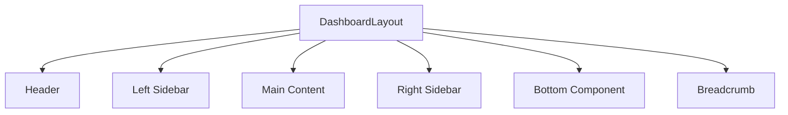
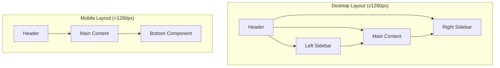
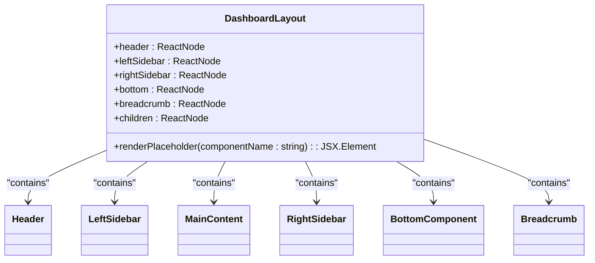
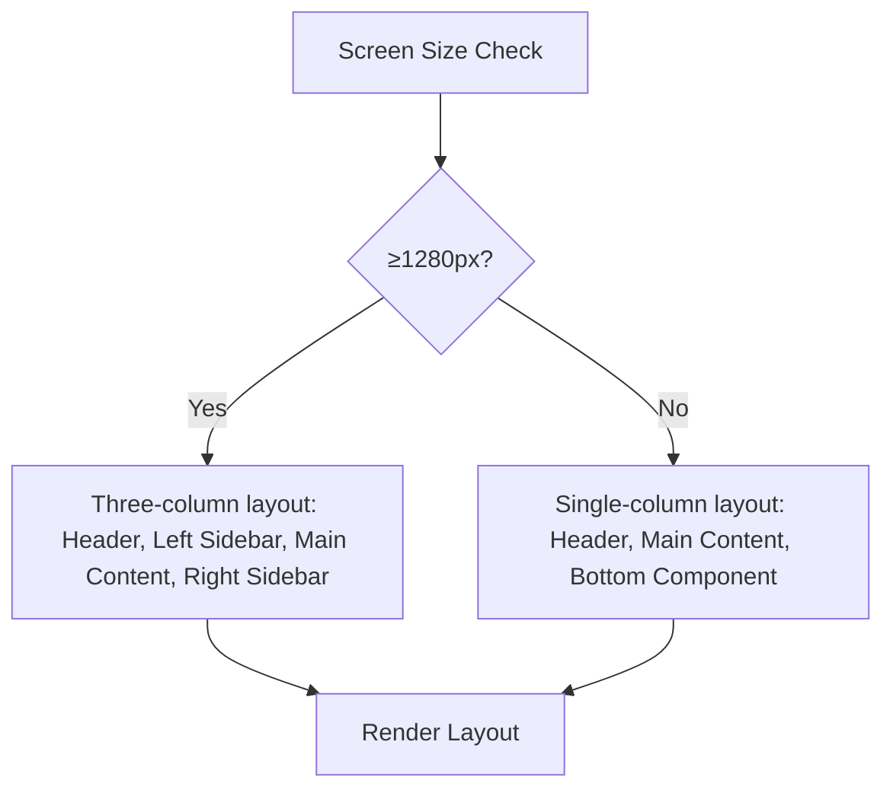
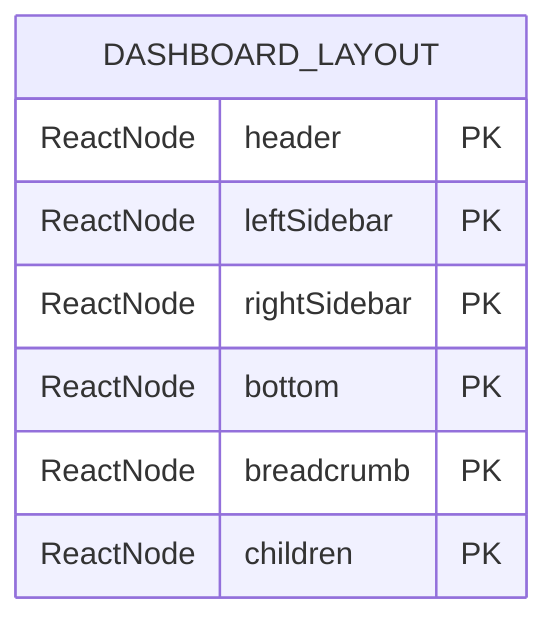

# Dashboard Layout

<cite>
**Referenced Files in This Document**   
- [DashboardLayout.tsx](file://packages/ui/src/components/layout/Dashboard/DashboardLayout.tsx)
- [DashboardLayout.stories.tsx](file://packages/ui/src/components/layout/Dashboard/DashboardLayout.stories.tsx)
- [README.md](file://packages/ui/src/components/layout/Dashboard/README.md)
- [index.ts](file://packages/ui/src/components/layout/index.ts)
</cite>

## Table of Contents
1. [Introduction](#introduction)
2. [Core Components](#core-components)
3. [Architecture Overview](#architecture-overview)
4. [Detailed Component Analysis](#detailed-component-analysis)
5. [Responsive Design Patterns](#responsive-design-patterns)
6. [Props Interface and Configuration](#props-interface-and-configuration)
7. [Integration with Admin Application](#integration-with-admin-application)
8. [Common Issues and Solutions](#common-issues-and-solutions)
9. [Accessibility Considerations](#accessibility-considerations)

## Introduction
The DashboardLayout component is a comprehensive layout solution designed for dashboard interfaces in the shared-frontend library. It provides a responsive structure that adapts to different screen sizes, offering a consistent user experience across desktop and mobile devices. The component serves as a container for dashboard content, managing the arrangement of header, sidebar, main content, and navigation elements.

**Section sources**
- [README.md](file://packages/ui/src/components/layout/Dashboard/README.md#L1-L14)

## Core Components
The DashboardLayout component is composed of several key structural elements that work together to create a cohesive dashboard interface. These include the header, left sidebar, right sidebar, main content area, and bottom navigation component. The component is designed to be flexible, allowing developers to include or exclude specific sections based on their application's requirements.

The implementation uses a combination of React components and Tailwind CSS for styling, with a focus on responsive design principles. The layout automatically adjusts based on screen size, providing an optimal viewing experience on both desktop and mobile devices.

**Diagram sources**
- [DashboardLayout.tsx](file://packages/ui/src/components/layout/Dashboard/DashboardLayout.tsx#L49-L99)
- [README.md](file://packages/ui/src/components/layout/Dashboard/README.md#L17-L43)

**Section sources**
- [DashboardLayout.tsx](file://packages/ui/src/components/layout/Dashboard/DashboardLayout.tsx#L1-L104)
- [README.md](file://packages/ui/src/components/layout/Dashboard/README.md#L1-L14)

## Architecture Overview
The DashboardLayout follows a responsive design architecture that adapts to different screen sizes. On desktop devices (≥1280px), it displays a three-column layout with header, left sidebar, main content, and right sidebar. On mobile devices (<1280px), it switches to a single-column layout with header, main content, and an optional bottom component.

The component uses a flexbox-based layout system with sticky positioning for the header, ensuring it remains visible during scrolling. The main content area is designed to be scrollable independently, while sidebars maintain their position. This architecture provides a modern dashboard experience with efficient space utilization.

**Diagram sources**
- [DashboardLayout.tsx](file://packages/ui/src/components/layout/Dashboard/DashboardLayout.tsx#L49-L99)
- [README.md](file://packages/ui/src/components/layout/Dashboard/README.md#L17-L43)

**Section sources**
- [DashboardLayout.tsx](file://packages/ui/src/components/layout/Dashboard/DashboardLayout.tsx#L49-L99)
- [README.md](file://packages/ui/src/components/layout/Dashboard/README.md#L7-L14)

## Detailed Component Analysis
The DashboardLayout component is implemented as a functional React component with TypeScript typing. It accepts several props that allow customization of its appearance and behavior. The component uses conditional rendering to display or hide specific sections based on the provided props.

### Component Structure
The component is structured with a main container that uses flexbox layout to arrange its child elements. The header is positioned at the top with sticky positioning, ensuring it remains visible during scrolling. The main content area takes up the remaining space and contains the primary dashboard content.

#### Header Component
The header component is rendered at the top of the layout and can be customized by passing a custom component. When no custom header is provided, a placeholder is displayed. The header receives children as props, which is important for mobile functionality as it allows the layout to pass a hamburger menu button on smaller screens.

#### Sidebar Components
The layout supports both left and right sidebars, which are conditionally rendered based on the presence of the corresponding props. The left sidebar is always visible, while the right sidebar is only displayed on larger screens (≥1280px). Both sidebars have scrollable content areas to accommodate longer navigation menus or content.

#### Main Content Area
The main content area is the central part of the dashboard layout, designed to display the primary application content. It includes padding and is wrapped in a card component for visual consistency. The content area is scrollable, allowing for long pages of content without affecting the position of the header and sidebars.

#### Bottom Component
The bottom component is specifically designed for mobile interfaces and is only visible on screens smaller than 1280px. It is typically used for mobile navigation tabs or action buttons and is fixed at the bottom of the screen.

**Diagram sources**
- [DashboardLayout.tsx](file://packages/ui/src/components/layout/Dashboard/DashboardLayout.tsx#L4-L11)
- [DashboardLayout.tsx](file://packages/ui/src/components/layout/Dashboard/DashboardLayout.tsx#L15-L103)

**Section sources**
- [DashboardLayout.tsx](file://packages/ui/src/components/layout/Dashboard/DashboardLayout.tsx#L1-L104)
- [README.md](file://packages/ui/src/components/layout/Dashboard/README.md#L46-L57)

## Responsive Design Patterns
The DashboardLayout implements responsive design patterns using Tailwind CSS breakpoints. The layout adapts to different screen sizes, providing an optimal user experience across devices.

On desktop screens (≥1280px), the layout displays a three-column structure with header, left sidebar, main content, and right sidebar. The right sidebar is specifically designed for additional content like quick stats, notifications, or contextual information.

On mobile screens (<1280px), the layout simplifies to a single-column structure with header, main content, and an optional bottom component. The right sidebar is hidden, and the bottom component becomes visible, providing mobile-friendly navigation.

The responsive behavior is implemented using Tailwind's responsive prefixes (e.g., xl:flex, xl:hidden) which control the visibility and layout of elements at different breakpoints. This approach ensures smooth transitions between different screen sizes without requiring JavaScript-based media queries.

**Diagram sources**
- [DashboardLayout.tsx](file://packages/ui/src/components/layout/Dashboard/DashboardLayout.tsx#L58-L90)
- [README.md](file://packages/ui/src/components/layout/Dashboard/README.md#L7-L14)

**Section sources**
- [DashboardLayout.tsx](file://packages/ui/src/components/layout/Dashboard/DashboardLayout.tsx#L58-L90)
- [README.md](file://packages/ui/src/components/layout/Dashboard/README.md#L7-L14)

## Props Interface and Configuration
The DashboardLayout component accepts several props that allow for extensive customization of its appearance and behavior. These props are defined in the DashboardLayoutProps interface, which specifies the types and requirements for each property.

The component supports the following props:
- `header`: An optional ReactNode for customizing the header content
- `leftSidebar`: An optional ReactNode for the left sidebar content
- `rightSidebar`: An optional ReactNode for the right sidebar content
- `bottom`: An optional ReactNode for mobile bottom navigation
- `breadcrumb`: An optional ReactNode for breadcrumb navigation
- `children`: The main content to display in the center area (required)

When no custom component is provided for header, left sidebar, or right sidebar, the layout renders placeholder components with descriptive text. This helps developers visualize the layout structure during development. The bottom component does not have a placeholder and is only rendered when explicitly provided.

**Diagram sources**
- [DashboardLayout.tsx](file://packages/ui/src/components/layout/Dashboard/DashboardLayout.tsx#L4-L11)
- [README.md](file://packages/ui/src/components/layout/Dashboard/README.md#L46-L57)

**Section sources**
- [DashboardLayout.tsx](file://packages/ui/src/components/layout/Dashboard/DashboardLayout.tsx#L4-L11)
- [README.md](file://packages/ui/src/components/layout/Dashboard/README.md#L46-L57)

## Integration with Admin Application
The DashboardLayout component is designed to integrate seamlessly with the admin application and other dashboard interfaces. It works with React Router for navigation state management, allowing for dynamic updates to the sidebar and breadcrumb components based on the current route.

In the admin application, the component is typically used as the main layout container, wrapping route-specific content. The sidebar items can be dynamically generated based on user permissions and the current application state. The header component can include user profile information, notifications, and other global controls.

The layout supports theme customization through CSS variables, allowing it to adapt to different branding requirements. It also integrates with the global authentication state, potentially hiding or showing certain components based on the user's login status and permissions.

**Section sources**
- [DashboardLayout.stories.tsx](file://packages/ui/src/components/layout/Dashboard/DashboardLayout.stories.tsx#L168-L220)
- [README.md](file://packages/ui/src/components/layout/Dashboard/README.md#L58-L276)

## Common Issues and Solutions
When using the DashboardLayout component, developers may encounter several common issues related to responsive behavior, state management, and performance.

### Sidebar State Persistence
One common issue is maintaining sidebar state (e.g., collapsed/expanded) across route changes. This can be addressed by using React context or a state management library like MobX to store the sidebar state globally. The component itself does not manage this state, leaving it to the application to handle persistence.

### Performance Optimization
For complex dashboards with heavy content, performance can be optimized by implementing lazy loading for sidebar content and using React.memo for expensive components. Virtualization techniques can also be applied to long lists in sidebars to improve rendering performance.

### Mobile Header Implementation
A common mistake when implementing custom headers is failing to render the children prop. On mobile devices, the DashboardLayout passes a hamburger menu button as children to the header component. Developers must ensure their custom header components render this children prop to maintain mobile functionality.

**Section sources**
- [README.md](file://packages/ui/src/components/layout/Dashboard/README.md#L278-L326)
- [DashboardLayout.tsx](file://packages/ui/src/components/layout/Dashboard/DashboardLayout.tsx#L19-L44)

## Accessibility Considerations
The DashboardLayout component includes several accessibility features to ensure it can be used by all users, including those with disabilities.

The layout uses semantic HTML elements and ARIA attributes to provide proper context for screen readers. The header, navigation, and main content areas are properly labeled, allowing screen reader users to navigate the interface efficiently.

Keyboard navigation is supported throughout the layout, with logical tab order and focus indicators. Interactive elements like buttons and links are designed to be easily accessible via keyboard navigation.

For users with visual impairments, the component supports high contrast modes and respects system preferences for reduced motion. The responsive design also ensures the layout remains usable on assistive technologies and alternative browsing methods.

**Section sources**
- [README.md](file://packages/ui/src/components/layout/Dashboard/README.md#L278-L326)
- [DashboardLayout.tsx](file://packages/ui/src/components/layout/Dashboard/DashboardLayout.tsx#L49-L99)