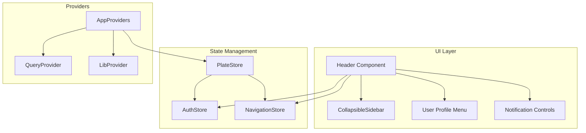
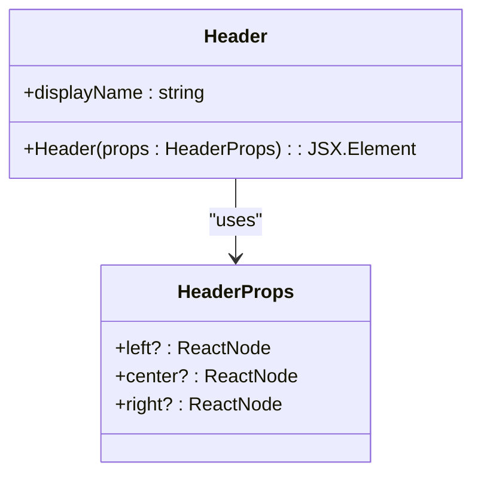
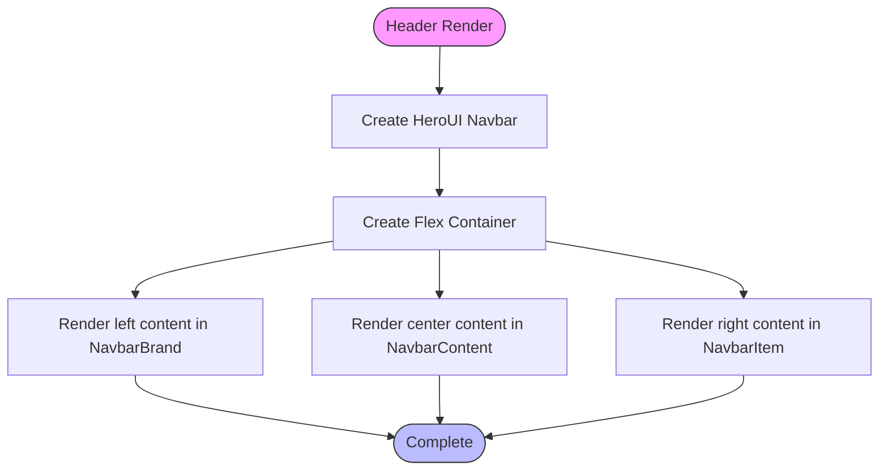
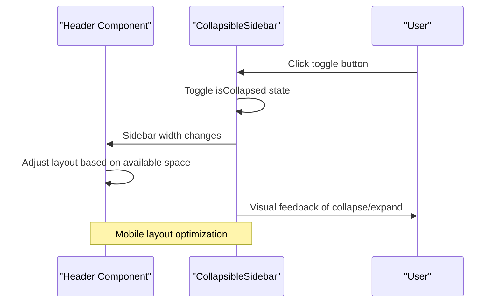
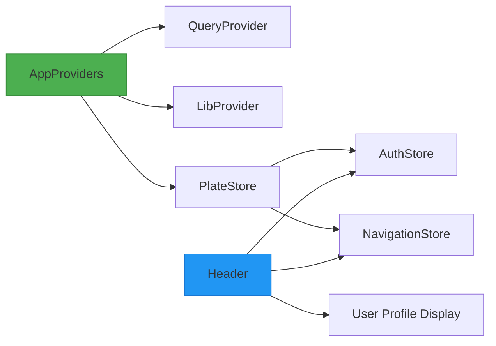
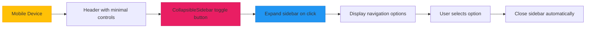
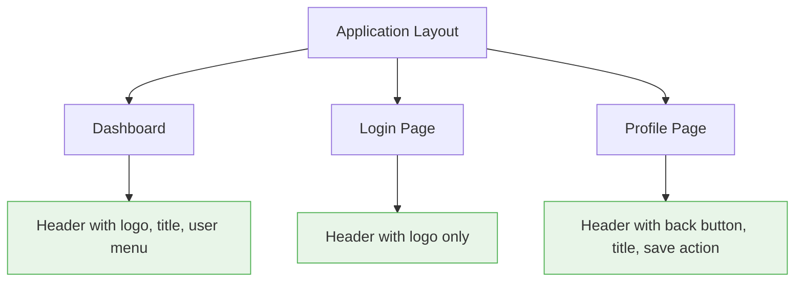

# Header

<cite>
**Referenced Files in This Document**   
- [Header.tsx](file://packages/ui/src/components/layout/Header/Header.tsx)
- [Header.stories.tsx](file://packages/ui/src/components/layout/Header/Header.stories.tsx)
- [CollapsibleSidebarLayout.tsx](file://packages/ui/src/components/layout/CollapsibleSidebar/CollapsibleSidebarLayout.tsx)
- [Providers.tsx](file://packages/providers/src/Providers.tsx)
- [store/index.ts](file://packages/store/index.ts)
- [store/README.md](file://packages/store/README.md)
</cite>

## Table of Contents
1. [Introduction](#introduction)
2. [Core Components](#core-components)
3. [Architecture Overview](#architecture-overview)
4. [Detailed Component Analysis](#detailed-component-analysis)
5. [Integration with AppProviders and Authentication](#integration-with-appproviders-and-authentication)
6. [Responsive Design and Mobile Behavior](#responsive-design-and-mobile-behavior)
7. [Customization and Usage Patterns](#customization-and-usage-patterns)
8. [Common Issues and Best Practices](#common-issues-and-best-practices)
9. [Conclusion](#conclusion)

## Introduction
The Header component in the shared-frontend library serves as a central navigation and user interface element across applications. It provides a consistent top-level UI structure that supports responsive layouts, user information display, navigation controls, and integration with sidebar components for mobile and desktop experiences. This document details the implementation, integration points, customization options, and usage patterns of the Header component within the broader application architecture.

## Core Components

The Header component is implemented as a flexible layout container that accepts left, center, and right content sections through its props interface. It leverages the HeroUI Navbar component to provide a responsive, accessible navigation bar with proper styling and layout management. The component is designed to work seamlessly with other UI elements such as the CollapsibleSidebar, user profile controls, and notification systems.

**Section sources**
- [Header.tsx](file://packages/ui/src/components/layout/Header/Header.tsx)
- [Header.stories.tsx](file://packages/ui/src/components/layout/Header/Header.stories.tsx)

## Architecture Overview

The Header component operates within a layered architecture that includes UI presentation, state management, and application providers. It integrates with global state through MobX stores and React Query, while relying on provider components to manage context and library configurations.

**Diagram sources**
- [Header.tsx](file://packages/ui/src/components/layout/Header/Header.tsx)
- [CollapsibleSidebarLayout.tsx](file://packages/ui/src/components/layout/CollapsibleSidebar/CollapsibleSidebarLayout.tsx)
- [Providers.tsx](file://packages/providers/src/Providers.tsx)
- [store/index.ts](file://packages/store/index.ts)

## Detailed Component Analysis

### Header Component Analysis

The Header component is implemented as a functional React component with a clear props interface that enables flexible content composition. It uses the HeroUI Navbar component as its base, providing a styled container with border, background blur effects, and proper height.

#### Props Interface

**Diagram sources**
- [Header.tsx](file://packages/ui/src/components/layout/Header/Header.tsx)

#### Layout Structure

**Diagram sources**
- [Header.tsx](file://packages/ui/src/components/layout/Header/Header.tsx)

### CollapsibleSidebar Integration

The Header component works in conjunction with the CollapsibleSidebar to provide a responsive layout experience, particularly on mobile devices where screen space is limited.

**Diagram sources**
- [Header.tsx](file://packages/ui/src/components/layout/Header/Header.tsx)
- [CollapsibleSidebarLayout.tsx](file://packages/ui/src/components/layout/CollapsibleSidebar/CollapsibleSidebarLayout.tsx)

## Integration with AppProviders and Authentication

The Header component integrates with the application's authentication and user state management system through the AppProviders and MobX stores. This enables dynamic rendering of user-specific content based on authentication status.

**Diagram sources**
- [Providers.tsx](file://packages/providers/src/Providers.tsx)
- [store/index.ts](file://packages/store/index.ts)
- [Header.tsx](file://packages/ui/src/components/layout/Header/Header.tsx)

**Section sources**
- [Providers.tsx](file://packages/providers/src/Providers.tsx)
- [store/README.md](file://packages/store/README.md)

## Responsive Design and Mobile Behavior

The Header component implements responsive design principles to adapt to different screen sizes and device types. It works in tandem with the CollapsibleSidebar to optimize the user experience on mobile devices.

### Responsive Breakpoints
The component automatically adjusts its layout based on available screen width, with specific behaviors for mobile, tablet, and desktop views.

### Mobile Navigation Pattern

**Diagram sources**
- [Header.tsx](file://packages/ui/src/components/layout/Header/Header.tsx)
- [CollapsibleSidebarLayout.tsx](file://packages/ui/src/components/layout/CollapsibleSidebar/CollapsibleSidebarLayout.tsx)

## Customization and Usage Patterns

The Header component supports various customization options through its props interface, allowing teams to adapt it to different branding requirements and functional needs.

### Props Customization
The component accepts three main props that define its content layout:
- `left`: Content to display on the left side (typically logo or main navigation)
- `center`: Content to display in the center (typically page title or breadcrumbs)
- `right`: Content to display on the right side (typically user profile, notifications, or action buttons)

### Usage Examples

**Diagram sources**
- [Header.stories.tsx](file://packages/ui/src/components/layout/Header/Header.stories.tsx)

## Common Issues and Best Practices

### Common Issues
- **Responsive Breakpoint Conflicts**: Ensure consistent breakpoint definitions across components
- **Mobile Navigation Accessibility**: Verify touch targets are appropriately sized
- **User Dropdown Behavior**: Manage focus and keyboard navigation properly
- **Notification Integration**: Handle real-time updates without causing re-render performance issues

### Best Practices
1. **Consistent Layout Structure**: Maintain predictable placement of navigation elements
2. **Progressive Enhancement**: Ensure core functionality works without JavaScript
3. **Accessibility Compliance**: Follow WCAG guidelines for keyboard navigation and screen readers
4. **Performance Optimization**: Minimize re-renders through proper state management
5. **Cross-Browser Testing**: Verify behavior across target browsers and devices

## Conclusion
The Header component in the shared-frontend library provides a robust, flexible solution for application navigation and user interface management. Its modular design, integration with state management systems, and responsive behavior make it suitable for a wide range of applications within the organization. By following the documented patterns and best practices, development teams can ensure consistent user experiences across different products while maintaining the flexibility to customize as needed.