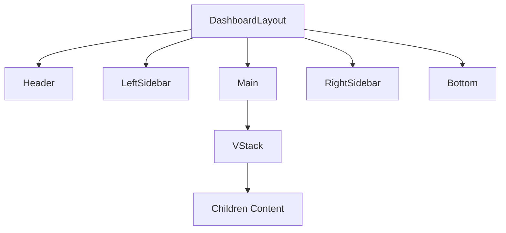
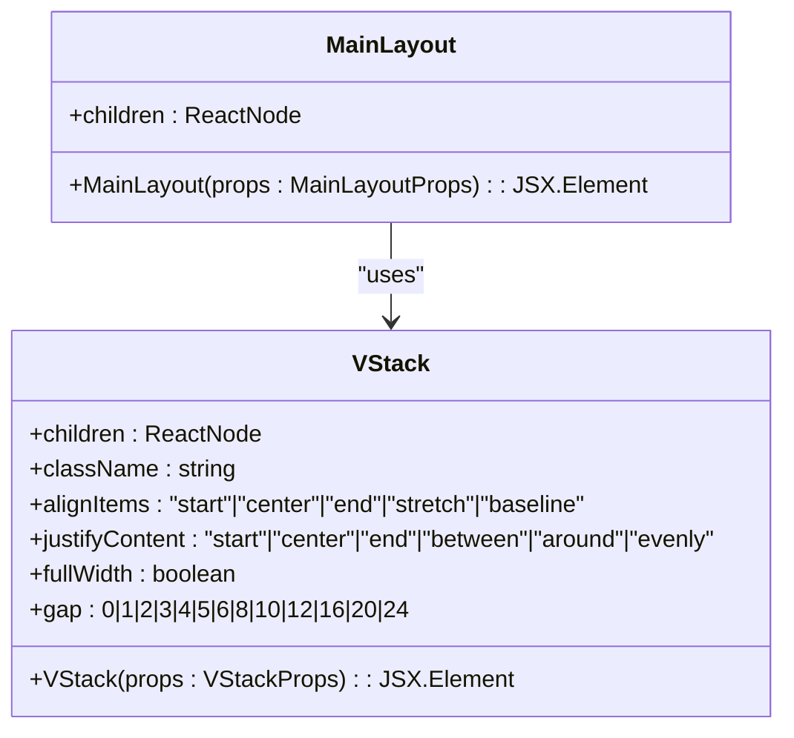
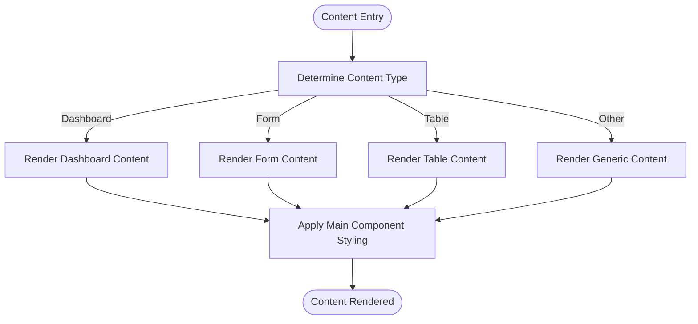

# Main Content Area

<cite>
**Referenced Files in This Document**   
- [Main.tsx](file://packages/ui/src/components/ui/layouts/Main/Main.tsx)
- [Main.stories.tsx](file://packages/ui/src/components/ui/layouts/Main/Main.stories.tsx)
- [DashboardLayout.tsx](file://packages/ui/src/components/ui/layouts/Dashboard/DashboardLayout.tsx)
- [VStack.tsx](file://packages/ui/src/components/ui/surfaces/VStack/VStack.tsx)
</cite>

## Table of Contents
1. [Introduction](#introduction)
2. [Core Components](#core-components)
3. [Architecture Overview](#architecture-overview)
4. [Detailed Component Analysis](#detailed-component-analysis)
5. [Usage Examples](#usage-examples)
6. [Styling and Layout](#styling-and-layout)
7. [Common Issues and Solutions](#common-issues-and-solutions)
8. [Conclusion](#conclusion)

## Introduction
The Main component in the shared-frontend library serves as a primary content container within various layout structures. It provides consistent styling, spacing, and responsive behavior for page-level content. This document details its implementation, integration with the DashboardLayout, and usage patterns across different content types.

## Core Components

The Main component is implemented as a simple yet effective wrapper that provides consistent styling and layout for content areas. It leverages the VStack component to create a vertically oriented container with standardized spacing and appearance.

**Section sources**
- [Main.tsx](file://packages/ui/src/components/ui/layouts/Main/Main.tsx)

## Architecture Overview

The Main component is designed to work within a larger layout system, particularly the DashboardLayout, which provides a comprehensive structure for admin interfaces. The component hierarchy shows how Main fits into the overall architecture.

**Diagram sources**
- [DashboardLayout.tsx](file://packages/ui/src/components/ui/layouts/Dashboard/DashboardLayout.tsx)
- [Main.tsx](file://packages/ui/src/components/ui/layouts/Main/Main.tsx)

## Detailed Component Analysis

### Main Component Analysis
The Main component acts as a standardized content container that ensures consistent appearance and spacing across different pages and views within the application. It serves as a wrapper for page-level components, providing a uniform look and feel.

#### Implementation Details
The Main component is implemented as a functional React component that accepts children as its primary prop. It uses the VStack component to create a flex-based vertical layout with predefined styling.

**Diagram sources**
- [Main.tsx](file://packages/ui/src/components/ui/layouts/Main/Main.tsx)
- [VStack.tsx](file://packages/ui/src/components/ui/surfaces/VStack/VStack.tsx)

**Section sources**
- [Main.tsx](file://packages/ui/src/components/ui/layouts/Main/Main.tsx)
- [VStack.tsx](file://packages/ui/src/components/ui/surfaces/VStack/VStack.tsx)

### Props Interface
The Main component accepts a simple props interface that focuses on content rendering:

- **children**: The primary prop that accepts any ReactNode, allowing for flexible content composition. This enables the component to render various content types including tables, forms, dashboards, and other page-level components.

The component does not expose additional props for customization, maintaining a focused API that emphasizes content rendering over configuration.

## Usage Examples

The Main component is designed to handle various content types within the application. The following examples demonstrate its versatility in different contexts.

### Dashboard Content
When displaying dashboard content, the Main component wraps statistical cards, charts, and summary information, providing consistent spacing and border styling.

### Form Content
For form-based interfaces, the Main component contains form fields, labels, and action buttons, ensuring proper alignment and padding.

### Table Content
When rendering tabular data, the Main component provides a container for tables with appropriate margins and rounded corners.

**Diagram sources**
- [Main.stories.tsx](file://packages/ui/src/components/ui/layouts/Main/Main.stories.tsx)

**Section sources**
- [Main.stories.tsx](file://packages/ui/src/components/ui/layouts/Main/Main.stories.tsx)

## Styling and Layout

### Responsive Sizing
The Main component adapts to available space within its parent container. When used within the DashboardLayout, it automatically adjusts its width based on the presence and state of sidebars.

### Content Overflow and Scrolling
The component handles content overflow through its parent layout components. In the DashboardLayout, scrolling behavior is managed by the main content area, allowing long content to be accessible while maintaining header and sidebar positioning.

### Spacing and Alignment
The Main component provides consistent spacing through:
- 1rem margin on all sides (m-4 class)
- Full width container (w-full class)
- Rounded corners (rounded-lg class)
- Border styling (border-1 class)

These styling choices create a card-like appearance that visually separates content from surrounding layout elements.

## Common Issues and Solutions

### Content Overflow
When content exceeds available space, ensure that parent containers have appropriate overflow properties. The DashboardLayout handles vertical scrolling at the main content level.

### Responsive Height Calculations
The Main component relies on its parent layout for height management. In the DashboardLayout, the main content area uses flex-1 to fill available vertical space.

### Integration with Loading States
When integrating with loading states, wrap loading indicators within the children prop to maintain consistent styling and positioning.

### Performance Optimization
For complex content rendering, consider implementing virtualization or pagination to maintain performance, as the Main component itself does not handle rendering optimization.

## Conclusion
The Main component serves as a fundamental building block in the shared-frontend library, providing a consistent container for page-level content. Its simple API and focused styling make it easy to use across different contexts while maintaining visual consistency throughout the application.