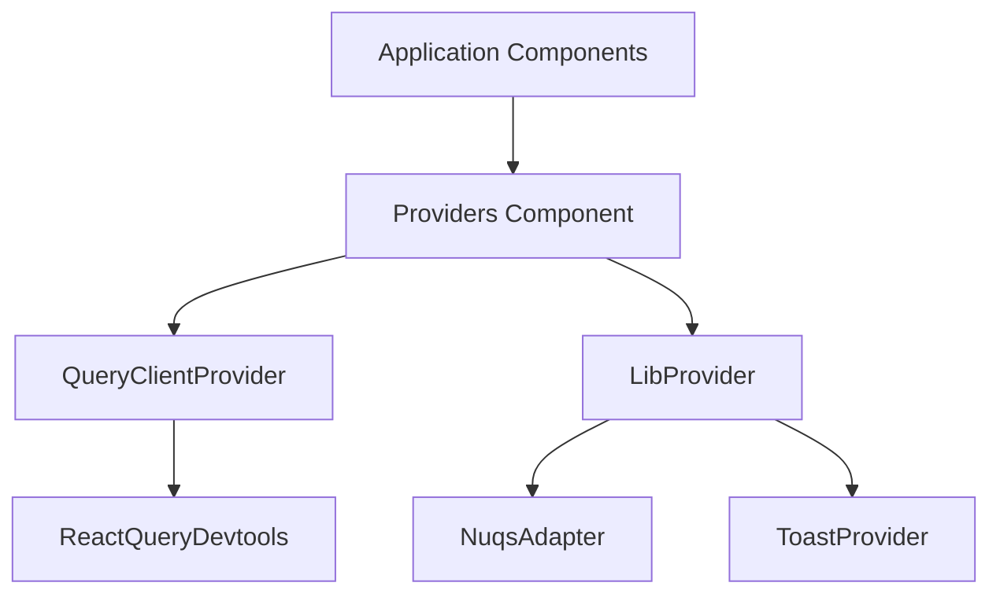
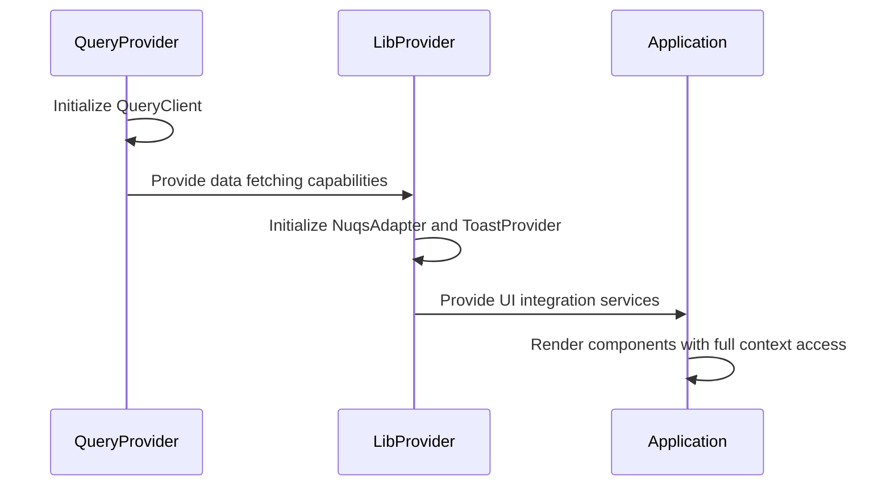
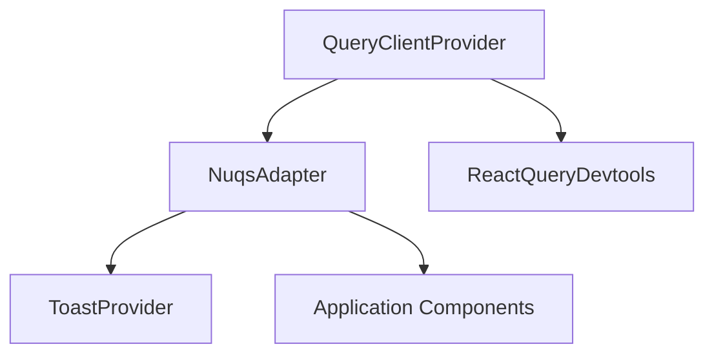

# AppProviders Composition

<cite>
**Referenced Files in This Document**   
- [Providers.tsx](file://packages/providers/src/Providers.tsx)
- [index.ts](file://packages/providers/index.ts)
- [README.md](file://packages/providers/README.md)
- [Providers.tsx](file://apps/admin/src/providers/Providers.tsx)
</cite>

## Table of Contents
1. [Introduction](#introduction)
2. [Provider Composition Pattern](#provider-composition-pattern)
3. [Initialization Sequence and Dependency Ordering](#initialization-sequence-and-dependency-ordering)
4. [Provider Tree Structure](#provider-tree-structure)
5. [Error Boundary Placement](#error-boundary-placement)
6. [Performance Considerations](#performance-considerations)
7. [Common Issues and Solutions](#common-issues-and-solutions)
8. [Best Practices](#best-practices)

## Introduction
The AppProviders component serves as the central orchestrator for global context providers in the application. It ensures that all necessary context providers are properly initialized and composed in the correct hierarchy to maintain consistent state management and library integrations across the application. This document details the composition pattern, initialization sequence, and best practices for using the AppProviders component.

**Section sources**
- [README.md](file://packages/providers/README.md#L1-L20)

## Provider Composition Pattern
The AppProviders component follows a composable pattern that wraps the application with multiple context providers in a specific hierarchy. The primary providers include QueryProvider for data fetching and caching, LibProvider for external library integrations, and other application-specific providers. This composition ensures that all components in the application have access to the necessary context and services.

The pattern implements a centralized provider composition approach where all providers are combined into a single component that wraps the entire application. This ensures consistent setup across all apps in the monorepo and eliminates configuration drift between different application instances.

**Diagram sources**
- [Providers.tsx](file://packages/providers/src/Providers.tsx#L22-L37)
- [README.md](file://packages/providers/README.md#L70-L82)

**Section sources**
- [Providers.tsx](file://packages/providers/src/Providers.tsx#L14-L21)
- [README.md](file://packages/providers/README.md#L22-L65)

## Initialization Sequence and Dependency Ordering
The initialization sequence of providers follows a strict dependency ordering to ensure proper context availability. The providers are initialized in the following order:

1. QueryProvider - Establishes the data layer for React Query
2. LibProvider - Provides UI library integrations and services
3. Application components - Access both data and UI contexts

This ordering is critical because the LibProvider may depend on query functionality for data-driven UI components, while application components depend on both data and UI contexts. The QueryProvider must be initialized first to ensure that data fetching capabilities are available when other providers and components initialize.

The dependency ordering follows the principle of "data layer before presentation layer," ensuring that data dependencies are resolved before UI components that consume that data are rendered.

**Diagram sources**
- [Providers.tsx](file://packages/providers/src/Providers.tsx#L27-L35)
- [README.md](file://packages/providers/README.md#L157-L165)

**Section sources**
- [Providers.tsx](file://packages/providers/src/Providers.tsx#L10-L12)
- [README.md](file://packages/providers/README.md#L132-L137)

## Provider Tree Structure
The provider tree structure implements a nested composition pattern where each provider wraps the next in the hierarchy. The root of the tree is the QueryClientProvider, which contains the NuqsAdapter, which in turn contains the ToastProvider and the application components.

This structure ensures that all child components have access to the contexts provided by their ancestor providers. The provider tree is designed to minimize re-renders by placing stable providers at the root and more dynamic providers closer to the application components.

The provider tree also includes development tools such as ReactQueryDevtools, which are conditionally rendered in development environments to provide debugging capabilities without impacting production performance.

**Diagram sources**
- [Providers.tsx](file://packages/providers/src/Providers.tsx#L27-L35)
- [README.md](file://packages/providers/README.md#L70-L82)

**Section sources**
- [Providers.tsx](file://packages/providers/src/Providers.tsx#L22-L37)
- [apps/admin/src/providers/Providers.tsx](file://apps/admin/src/providers/Providers.tsx#L22-L37)

## Error Boundary Placement
Error boundaries are strategically placed within the provider composition to isolate failures and prevent cascading errors. The primary error boundary is positioned at the root level, wrapping the entire provider tree to catch any errors that occur during provider initialization or context propagation.

Additional error boundaries may be implemented within specific providers to handle provider-specific errors. For example, the QueryProvider may include error handling for network failures, while the LibProvider may handle errors related to UI library integrations.

The error boundary placement follows the principle of "fail fast, fail locally," ensuring that errors are caught as close to their source as possible while maintaining application stability.

**Section sources**
- [Providers.tsx](file://packages/providers/src/Providers.tsx#L22-L37)

## Performance Considerations
When composing multiple context providers, several performance considerations must be addressed:

1. **Minimize Provider Nesting**: Excessive nesting can lead to performance degradation due to increased re-rendering. The current implementation balances functionality with performance by combining related providers.

2. **Optimize QueryClient Configuration**: The QueryClient is configured with optimal defaults including 5-minute cache time, immediate refetch on stale data, and window focus refetching to balance data freshness with performance.

3. **Conditional Development Tools**: Development tools like ReactQueryDevtools are included only in development builds to avoid production performance overhead.

4. **Efficient Context Updates**: The provider composition minimizes unnecessary context updates by using stable provider instances and optimized re-rendering patterns.

5. **Tree Shaking**: The modular provider design enables tree shaking, allowing applications to import only the providers they need.

**Section sources**
- [Providers.tsx](file://packages/providers/src/Providers.tsx#L10-L12)
- [README.md](file://packages/providers/README.md#L132-L137)

## Common Issues and Solutions
Several common issues arise when working with the AppProviders composition:

### Provider Ordering Dependencies
**Issue**: Incorrect provider ordering can lead to context unavailability.
**Solution**: Always maintain the correct order: QueryProvider → LibProvider → Application components.

### Hydration Timing Issues
**Issue**: Server-client hydration mismatches can occur with URL state management.
**Solution**: The NuqsAdapter handles hydration timing issues by synchronizing URL state during the hydration process.

### Context Unavailability Across Environments
**Issue**: Context providers may behave differently across development, staging, and production environments.
**Solution**: The provider composition uses environment-aware configuration to ensure consistent behavior across all environments.

### Type Compatibility Issues
**Issue**: React 19 type compatibility issues with certain providers.
**Solution**: Use `@ts-expect-error` comments to handle known type compatibility issues while maintaining type safety elsewhere.

**Section sources**
- [Providers.tsx](file://packages/providers/src/Providers.tsx#L28-L29)
- [Providers.tsx](file://packages/providers/src/Providers.tsx#L32-L33)
- [README.md](file://packages/providers/README.md#L152-L155)

## Best Practices
Follow these best practices when using the AppProviders component:

1. **Wrap at App Root**: Place the provider composition at the highest level of your application to ensure all components have access to the necessary contexts.

2. **Maintain Provider Order**: Always follow the recommended order: QueryProvider → LibProvider → Application components.

3. **Use Minimal Nesting**: Only include providers that are actually needed by your application to reduce complexity and improve performance.

4. **Implement Proper Error Handling**: Use error boundaries to isolate failures and maintain application stability.

5. **Test Provider Composition**: Create comprehensive tests to verify that the provider composition works correctly across different scenarios and environments.

6. **Document Provider Dependencies**: Clearly document any dependencies between providers to prevent ordering issues.

7. **Monitor Performance**: Regularly monitor the performance impact of the provider composition and optimize as needed.

**Section sources**
- [README.md](file://packages/providers/README.md#L152-L155)
- [Providers.tsx](file://packages/providers/src/Providers.tsx#L14-L21)