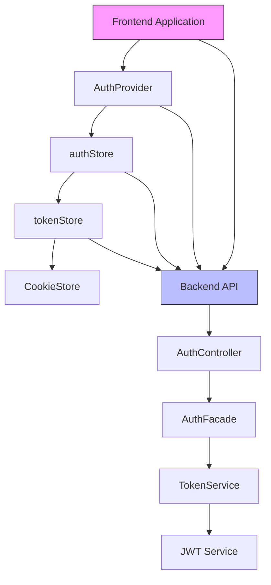
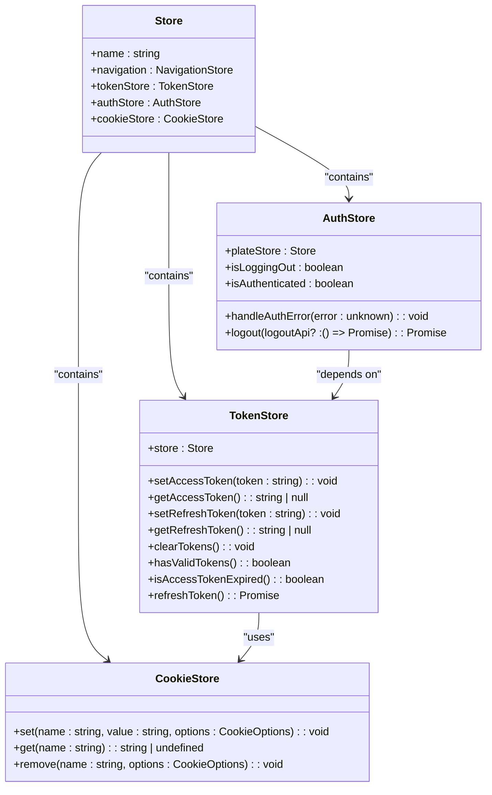
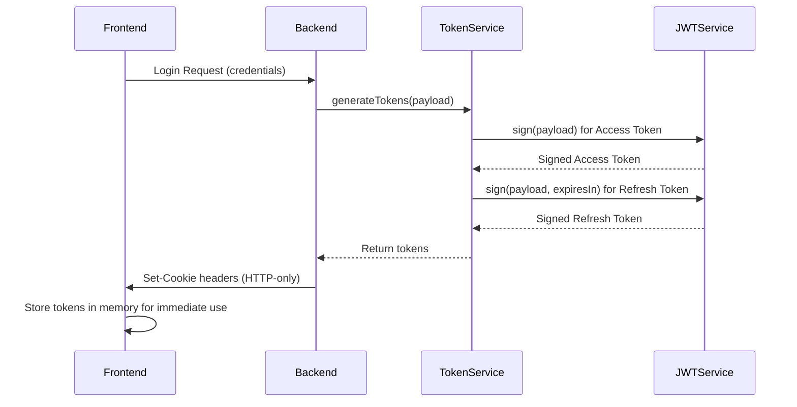
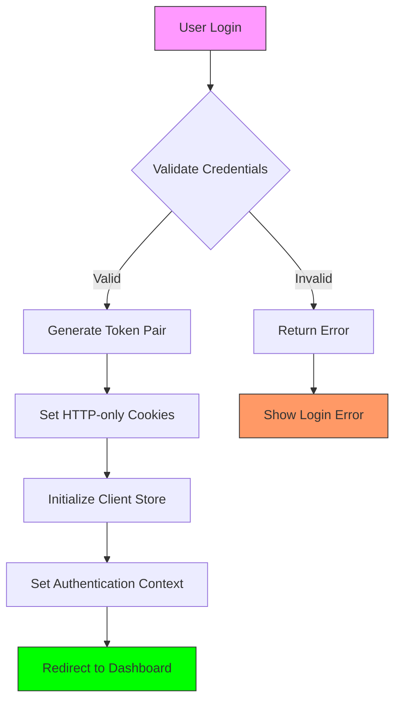
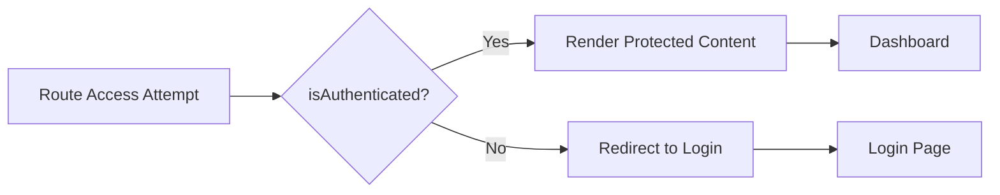
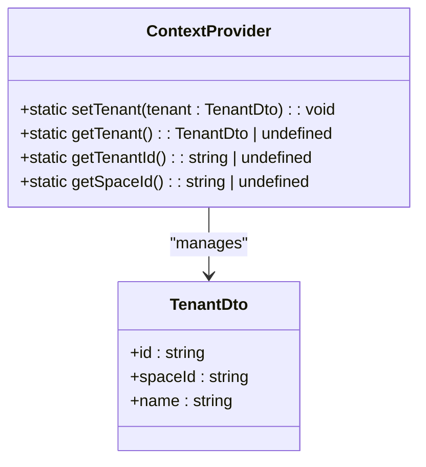

# Authentication Provider

<cite>
**Referenced Files in This Document**   
- [authStore.ts](file://packages/store/src/stores/authStore.ts)
- [tokenStore.ts](file://packages/store/src/stores/tokenStore.ts)
- [Store.ts](file://packages/store/src/stores/Store.ts)
- [token.service.ts](file://apps/server/src/shared/service/utils/token.service.ts)
- [auth.controller.ts](file://apps/server/src/shared/controller/domains/auth.controller.ts)
- [context.provider.ts](file://apps/server/src/shared/provider/context.provider.ts)
- [AuthProvider](file://packages/shared-frontend/src/provider/AuthProvider.tsx)
</cite>

## Table of Contents
1. [Introduction](#introduction)
2. [Authentication Architecture Overview](#authentication-architecture-overview)
3. [AuthProvider Component](#authprovider-component)
4. [MobX Store Integration](#mobx-store-integration)
5. [Token Management and Persistence](#token-management-and-persistence)
6. [User Session Handling](#user-session-handling)
7. [Protected Routes and Authentication Guards](#protected-routes-and-authentication-guards)
8. [Tenant Selection Flow](#tenant-selection-flow)
9. [Common Issues and Solutions](#common-issues-and-solutions)
10. [Conclusion](#conclusion)

## Introduction
The Authentication Provider system in the Cocrepo platform provides a comprehensive solution for managing user authentication, authorization, and session state across the application. This document details the implementation of the AuthProvider component and its integration with the MobX-based authStore, covering the authentication state management pattern, token persistence mechanism, and user session handling. The system is designed to securely manage user credentials, handle token refresh cycles, and provide authentication context to consuming components throughout the application.

## Authentication Architecture Overview

**Diagram sources**
- [authStore.ts](file://packages/store/src/stores/authStore.ts)
- [tokenStore.ts](file://packages/store/src/stores/tokenStore.ts)
- [auth.controller.ts](file://apps/server/src/shared/controller/domains/auth.controller.ts)

**Section sources**
- [authStore.ts](file://packages/store/src/stores/authStore.ts)
- [tokenStore.ts](file://packages/store/src/stores/tokenStore.ts)
- [auth.controller.ts](file://apps/server/src/shared/controller/domains/auth.controller.ts)

## AuthProvider Component

The AuthProvider component serves as the central authentication context provider for the application, wrapping the entire application or specific protected sections to expose authentication state and methods to all child components. It integrates with the MobX store system to provide reactive authentication state management.

The AuthProvider initializes the authentication context during application startup, checking for existing tokens in cookies and validating their validity. It exposes essential authentication methods including login, logout, and token refresh operations to consuming components through React context.

**Section sources**
- [AuthProvider](file://packages/shared-frontend/src/provider/AuthProvider.tsx)
- [authStore.ts](file://packages/store/src/stores/authStore.ts)

## MobX Store Integration

### Store Architecture
The authentication system leverages MobX for state management, with a hierarchical store structure that organizes authentication-related state and logic.

**Diagram sources**
- [Store.ts](file://packages/store/src/stores/Store.ts)
- [authStore.ts](file://packages/store/src/stores/authStore.ts)
- [tokenStore.ts](file://packages/store/src/stores/tokenStore.ts)
- [cookieStore.ts](file://packages/store/src/stores/cookieStore.ts)

### Authentication State Management Pattern
The authentication state management follows a reactive pattern using MobX observables. The authStore exposes computed properties like `isAuthenticated` that automatically update when underlying token state changes. This allows components to reactively respond to authentication state changes without manual subscription management.

The store initialization occurs at the application root, creating a single instance of the Store class that is provided to all components through React context. This ensures consistent authentication state across the entire application.

**Section sources**
- [Store.ts](file://packages/store/src/stores/Store.ts)
- [authStore.ts](file://packages/store/src/stores/authStore.ts)
- [tokenStore.ts](file://packages/store/src/stores/tokenStore.ts)

## Token Management and Persistence

### Token Persistence Mechanism
The system implements a secure token persistence mechanism using HTTP-only cookies for primary token storage, with additional client-side storage for specific use cases. Access tokens and refresh tokens are stored in cookies with secure attributes (Secure, SameSite=Strict) to prevent XSS attacks and CSRF vulnerabilities.

**Diagram sources**
- [token.service.ts](file://apps/server/src/shared/service/utils/token.service.ts)
- [auth.controller.ts](file://apps/server/src/shared/controller/domains/auth.controller.ts)

### Token Refresh Flow
The token refresh mechanism automatically renews expired access tokens using refresh tokens, providing a seamless user experience without requiring re-authentication. When an access token expires, the system uses the refresh token to obtain a new access token and refresh token pair.

The TokenService on the backend validates the refresh token and generates new tokens, while the frontend TokenStore manages the client-side token state update. This process occurs transparently to the user, maintaining application session continuity.

**Section sources**
- [token.service.ts](file://apps/server/src/shared/service/utils/token.service.ts)
- [tokenStore.ts](file://packages/store/src/stores/tokenStore.ts)
- [auth.controller.ts](file://apps/server/src/shared/controller/domains/auth.controller.ts)

## User Session Handling

### Session Initialization
User session handling begins with authentication, where valid credentials are exchanged for token pairs. The backend AuthController processes login requests, validates credentials through the AuthFacade, and returns tokens via secure HTTP-only cookies.

**Diagram sources**
- [auth.controller.ts](file://apps/server/src/shared/controller/domains/auth.controller.ts)
- [authStore.ts](file://packages/store/src/stores/authStore.ts)

### Session Termination
Session termination occurs through the logout process, which clears authentication state from both client and server. The logout method in authStore handles this process by first calling the backend logout API to clear HTTP-only cookies, then clearing client-side storage and redirecting to the login page.

The system handles logout gracefully, ensuring that even if the API call fails, the client-side state is cleared and the user is redirected to prevent access to protected resources.

**Section sources**
- [authStore.ts](file://packages/store/src/stores/authStore.ts)
- [auth.controller.ts](file://apps/server/src/shared/controller/domains/auth.controller.ts)

## Protected Routes and Authentication Guards

### Route Protection Pattern
The application implements protected routes using a combination of React Router and authentication state checking. The index route demonstrates this pattern by redirecting users based on their authentication status:

**Diagram sources**
- [index.tsx](file://apps/admin/src/routes/index.tsx)

### Authentication Error Handling
The system includes comprehensive authentication error handling through interceptors in the authStore. When API requests return 401 Unauthorized responses, the error handler automatically redirects users to the login page, ensuring consistent behavior across the application.

This centralized error handling prevents unauthorized access to protected resources and provides a consistent user experience when authentication state becomes invalid.

**Section sources**
- [authStore.ts](file://packages/store/src/stores/authStore.ts)

## Tenant Selection Flow

### Multi-Tenant Architecture
The authentication system supports a multi-tenant architecture, allowing users to belong to multiple tenants and switch between them. The ContextProvider on the backend manages tenant context, storing the current tenant information in the request context.

**Diagram sources**
- [context.provider.ts](file://apps/server/src/shared/provider/context.provider.ts)

### Tenant Context Management
Tenant context is established during authentication and can be modified through specific tenant selection flows. The system maintains tenant context across requests, ensuring that all operations are performed within the correct tenant scope.

The frontend components can access the current tenant information through the authentication context, enabling tenant-specific UI rendering and data access.

**Section sources**
- [context.provider.ts](file://apps/server/src/shared/provider/context.provider.ts)

## Common Issues and Solutions

### Race Conditions During Authentication
Race conditions during authentication are mitigated through proper state management and request sequencing. The authStore includes an `isLoggingOut` flag to prevent concurrent logout operations, ensuring that logout processes complete atomically.

For login operations, the system uses promise-based flows that prevent multiple concurrent authentication requests, maintaining consistent state throughout the authentication process.

### Token Expiration Handling
Token expiration is handled through a combination of proactive checking and reactive renewal. The TokenStore includes an `isAccessTokenExpired` method that parses the JWT payload to check expiration time, allowing components to anticipate token expiration.

When an access token expires, the system automatically attempts to refresh the token using the refresh token before failing authentication. This transparent renewal process minimizes disruption to the user experience.

### Cross-Tab Authentication State Synchronization
Cross-tab authentication state synchronization is achieved through storage events and cookie monitoring. When authentication state changes in one tab (e.g., logout), the change is propagated to other tabs through event listeners that respond to storage or cookie changes.

This ensures consistent authentication state across all instances of the application open in the user's browser, preventing access to protected resources in tabs that should be logged out.

**Section sources**
- [authStore.ts](file://packages/store/src/stores/authStore.ts)
- [tokenStore.ts](file://packages/store/src/stores/tokenStore.ts)

## Conclusion
The Authentication Provider system in the Cocrepo platform provides a robust, secure, and user-friendly authentication solution. By combining React context, MobX state management, and JWT-based token authentication, the system delivers a seamless user experience while maintaining high security standards.

Key strengths of the implementation include:
- Centralized authentication state management through MobX stores
- Secure token persistence using HTTP-only cookies
- Transparent token refresh mechanism for uninterrupted user sessions
- Comprehensive error handling and redirection logic
- Support for multi-tenant architectures
- Protection against common security vulnerabilities

The modular design allows for easy extension and customization while maintaining consistency across the application. The integration between frontend and backend components ensures reliable authentication flows and proper session management throughout the user journey.