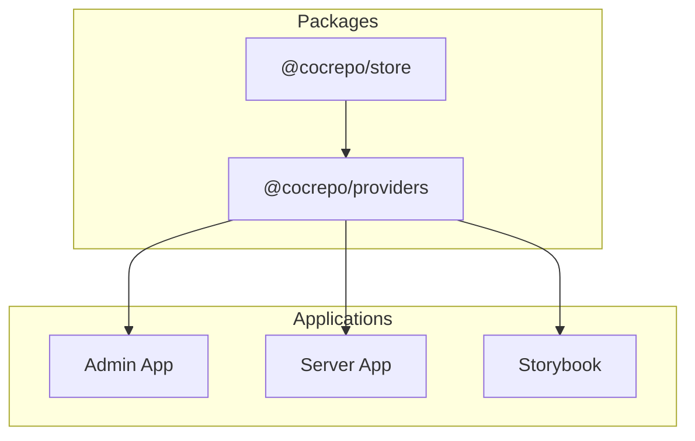
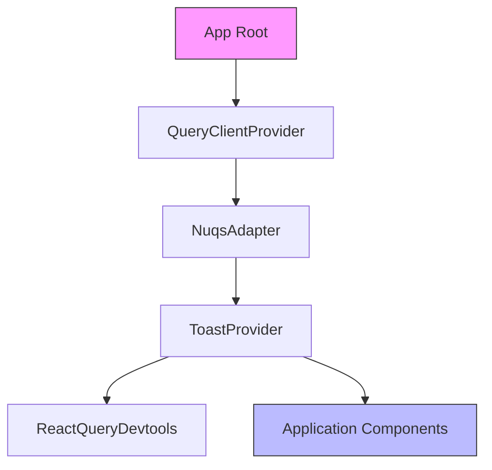
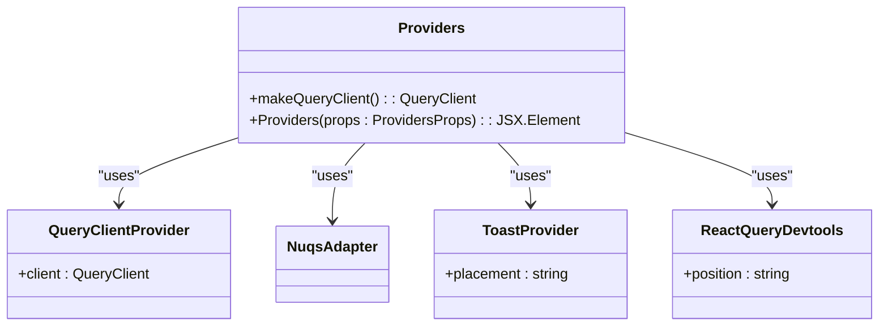
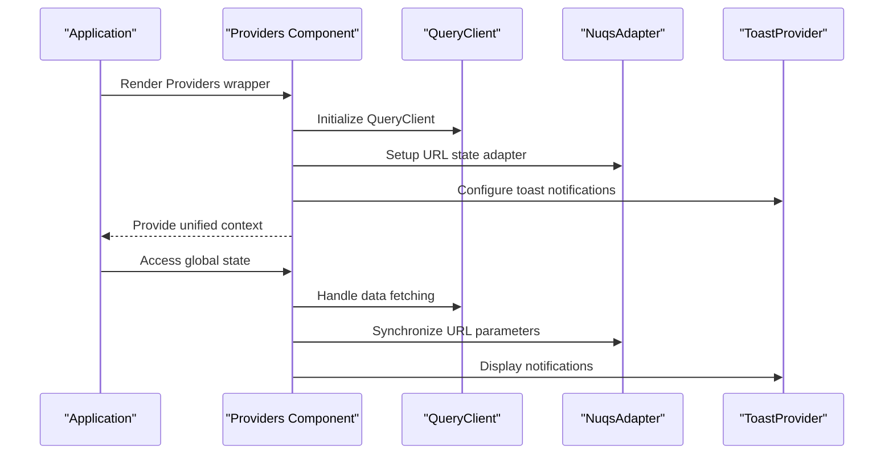
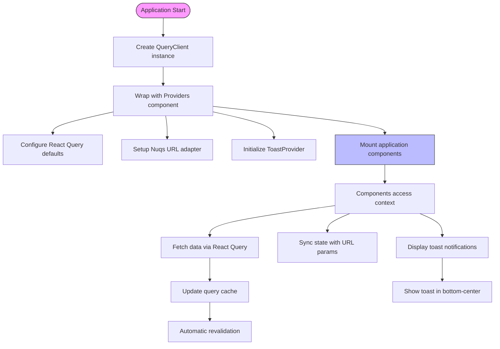
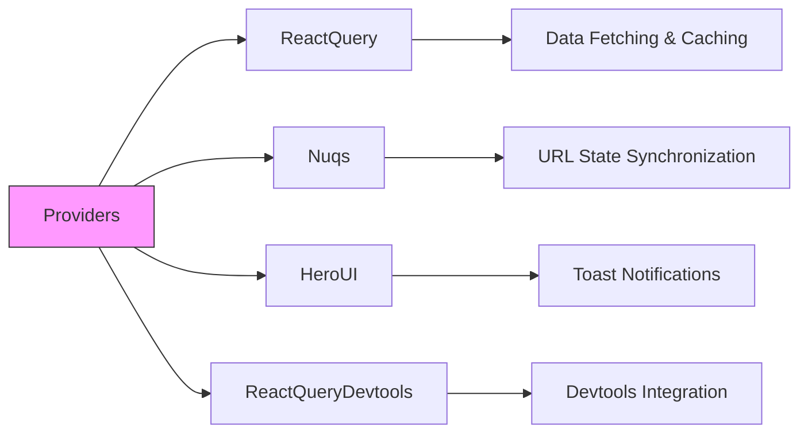

# Provider Components

<cite>
**Referenced Files in This Document**   
- [Providers.tsx](file://packages/providers/src/Providers.tsx)
- [index.ts](file://packages/providers/index.ts)
- [README.md](file://packages/providers/README.md)
- [Providers.tsx](file://apps/admin/src/providers/Providers.tsx)
- [index.ts](file://packages/store/index.ts)
- [index.ts](file://packages/store/src/providers/index.ts)
</cite>

## Table of Contents
1. [Introduction](#introduction)
2. [Project Structure](#project-structure)
3. [Core Components](#core-components)
4. [Architecture Overview](#architecture-overview)
5. [Detailed Component Analysis](#detailed-component-analysis)
6. [Dependency Analysis](#dependency-analysis)
7. [Performance Considerations](#performance-considerations)
8. [Troubleshooting Guide](#troubleshooting-guide)
9. [Conclusion](#conclusion)

## Introduction
This document provides a comprehensive analysis of the provider components within the application ecosystem, focusing on the centralized provider system that manages global state, data fetching, and UI library integrations. The documentation covers the implementation details of the provider architecture, context management patterns, and state distribution mechanisms that enable consistent application behavior across different environments including development, testing, and production.

## Project Structure
The provider components are organized within a dedicated packages structure that promotes reusability and consistency across applications. The core provider functionality is encapsulated in the `@cocrepo/providers` package, which serves as the single source of truth for application-level providers.

**Diagram sources**
- [Providers.tsx](file://packages/providers/src/Providers.tsx)
- [index.ts](file://packages/providers/index.ts)

**Section sources**
- [Providers.tsx](file://packages/providers/src/Providers.tsx)
- [README.md](file://packages/providers/README.md)

## Core Components
The provider system consists of several key components that work together to manage application state and configuration. The primary component is the `Providers` wrapper that composes multiple context providers into a single, reusable unit. This includes the QueryClientProvider for data management, NuqsAdapter for URL state synchronization, and ToastProvider for user notifications. The architecture follows a composable pattern that allows applications to include only the providers they need while maintaining consistency across the codebase.

**Section sources**
- [Providers.tsx](file://packages/providers/src/Providers.tsx)
- [README.md](file://packages/providers/README.md)

## Architecture Overview
The provider architecture implements a layered approach to state management and library integration. At its core, the system uses React Context to distribute configuration and state to all components in the application tree. The architecture is designed to minimize nesting while ensuring that all necessary providers are available at the appropriate levels of the component hierarchy.

**Diagram sources**
- [Providers.tsx](file://packages/providers/src/Providers.tsx)

## Detailed Component Analysis

### Provider Composition Pattern
The provider system implements a composition pattern that combines multiple providers into a single wrapper component. This approach reduces boilerplate code across applications and ensures consistent configuration.

#### Provider Implementation

**Diagram sources**
- [Providers.tsx](file://packages/providers/src/Providers.tsx)

#### Data Flow and Initialization Sequence

**Diagram sources**
- [Providers.tsx](file://packages/providers/src/Providers.tsx)

#### Context Management and State Distribution

**Diagram sources**
- [Providers.tsx](file://packages/providers/src/Providers.tsx)

**Section sources**
- [Providers.tsx](file://packages/providers/src/Providers.tsx)
- [README.md](file://packages/providers/README.md)

## Dependency Analysis
The provider components have well-defined dependencies that enable their functionality while maintaining separation of concerns. The architecture leverages external libraries for specific capabilities while providing a unified interface to consuming applications.

**Diagram sources**
- [Providers.tsx](file://packages/providers/src/Providers.tsx)
- [package.json](file://packages/providers/package.json)

**Section sources**
- [Providers.tsx](file://packages/providers/src/Providers.tsx)
- [README.md](file://packages/providers/README.md)

## Performance Considerations
The provider architecture is designed with performance in mind, implementing several optimization strategies to minimize overhead and ensure efficient state distribution. The React Query integration provides automatic caching and background refetching, reducing unnecessary network requests. The composable nature of the providers allows applications to include only the functionality they need, preventing unnecessary context updates. The centralized provider configuration ensures consistent performance characteristics across all applications in the ecosystem.

## Troubleshooting Guide
Common issues with the provider components typically relate to configuration, version compatibility, or improper usage patterns. The most frequent issues include type compatibility problems with React 19 (addressed with ts-expect-error comments), incorrect provider ordering, and missing provider wrappers in testing environments. The architecture includes devtools integration to facilitate debugging of data fetching operations and state changes. When troubleshooting provider-related issues, it's essential to verify that providers are properly composed and that the application is wrapped with the necessary context providers.

**Section sources**
- [Providers.tsx](file://packages/providers/src/Providers.tsx)
- [README.md](file://packages/providers/README.md)

## Conclusion
The provider component system provides a robust foundation for managing global state and library integrations across the application ecosystem. By centralizing provider configuration and composition, the architecture ensures consistency, reduces boilerplate code, and simplifies maintenance. The modular design allows for flexible usage patterns while maintaining a standardized approach to state management, data fetching, and UI library integration. This documentation provides a comprehensive understanding of the provider components, enabling effective usage and troubleshooting across all applications.