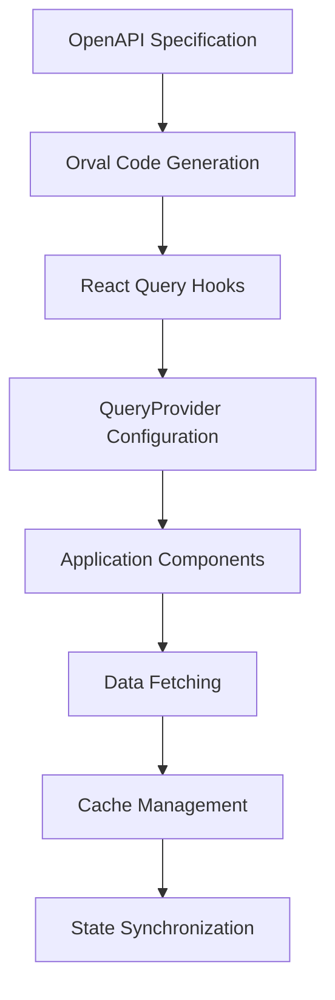
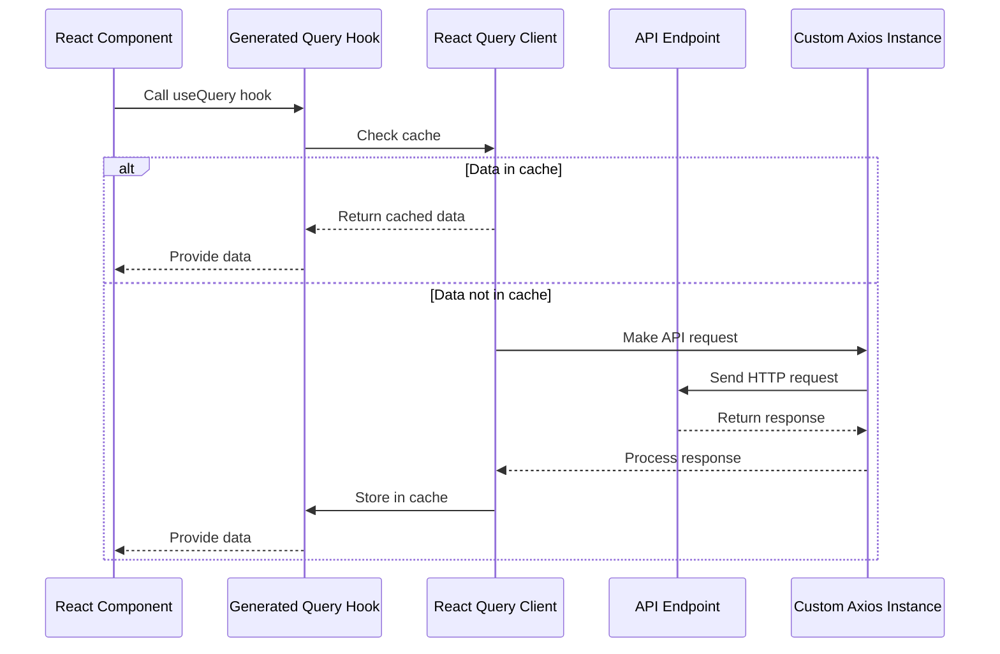
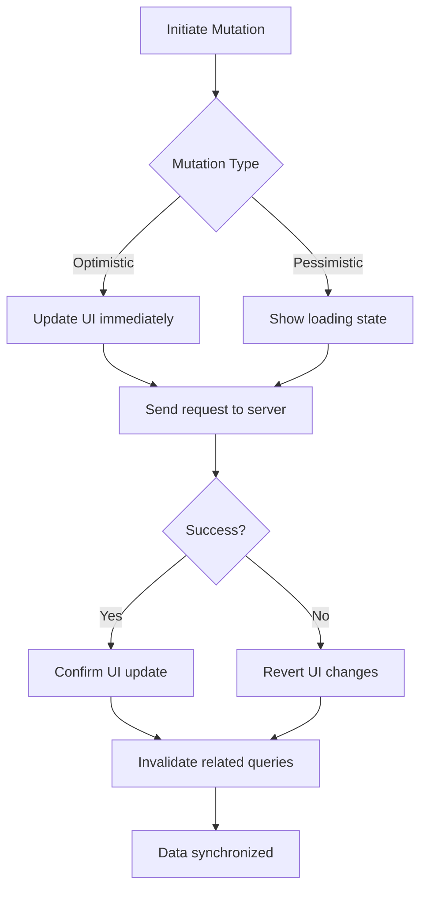

# Query Provider

<cite>
**Referenced Files in This Document**   
- [orval.config.js](file://packages/api-client/orval.config.js)
- [apis.ts](file://packages/api-client/src/apis.ts)
- [customAxios.ts](file://packages/api-client/src/libs/customAxios.ts)
</cite>

## Table of Contents
1. [Introduction](#introduction)
2. [Query Provider Configuration](#query-provider-configuration)
3. [API Client Integration](#api-client-integration)
4. [Query Configuration and Options](#query-configuration-and-options)
5. [Mutation Handling](#mutation-handling)
6. [Cache Management and Invalidation](#cache-management-and-invalidation)
7. [Error Handling Strategies](#error-handling-strategies)
8. [Mobile Optimization Considerations](#mobile-optimization-considerations)
9. [Best Practices and Common Patterns](#best-practices-and-common-patterns)

## Introduction
The QueryProvider component serves as the central configuration point for React Query in the application, enabling global API state management across all frontend applications. It establishes the foundation for data fetching, caching, synchronization, and background updates throughout the system. This documentation details the configuration, implementation patterns, and best practices for using the QueryProvider to manage API state effectively.

## Query Provider Configuration
The QueryProvider is configured through the React Query integration with Orval, which generates type-safe API hooks based on OpenAPI specifications. The configuration establishes default behaviors for all queries across the application, including caching, refetching, and error handling policies.

The React Query client is configured through Orval's code generation process, which automatically creates query hooks with predefined options. This approach ensures consistency across all API interactions while maintaining type safety and reducing boilerplate code.

**Diagram sources**
- [orval.config.js](file://packages/api-client/orval.config.js#L91-L124)

**Section sources**
- [orval.config.js](file://packages/api-client/orval.config.js#L91-L124)

## API Client Integration
The QueryProvider integrates with a generated API client that uses a custom Axios instance for HTTP communication. This integration enables centralized request handling, authentication, and error management across all API calls.

The API client is generated using Orval with specific configuration options that determine the types of hooks created and their behavior. The configuration specifies the use of React Query as the client, enabling all the benefits of React Query's caching and synchronization features.

**Diagram sources**
- [orval.config.js](file://packages/api-client/orval.config.js#L91-L124)
- [apis.ts](file://packages/api-client/src/apis.ts)

**Section sources**
- [orval.config.js](file://packages/api-client/orval.config.js#L91-L124)
- [apis.ts](file://packages/api-client/src/apis.ts)

## Query Configuration and Options
The QueryProvider establishes default options for all queries in the application, which can be overridden at the individual query level when needed. These options control caching behavior, refetching policies, and data synchronization.

The Orval configuration enables several types of query hooks:
- Standard `useQuery` hooks for regular data fetching
- `useSuspenseQuery` hooks for Suspense-compatible components
- `useSuspenseInfiniteQuery` hooks for infinite loading scenarios

Default query options include cache time settings, stale time configurations, and refetch behavior that balance data freshness with performance optimization.

**Section sources**
- [orval.config.js](file://packages/api-client/orval.config.js#L104-L116)
- [apis.ts](file://packages/api-client/src/apis.ts)

## Mutation Handling
The QueryProvider supports mutation operations through generated mutation hooks that handle create, update, and delete operations. These mutations are integrated with the query cache, enabling automatic cache invalidation and data synchronization after successful operations.

Mutation hooks follow a consistent pattern across all API endpoints, providing type safety and predictable behavior. The configuration ensures that mutations can update the cache optimistically or pessimistically based on the specific use case requirements.

**Diagram sources**
- [apis.ts](file://packages/api-client/src/apis.ts)

**Section sources**
- [apis.ts](file://packages/api-client/src/apis.ts)

## Cache Management and Invalidation
The QueryProvider implements a comprehensive cache management strategy that balances data freshness with performance. The cache stores query results with configurable time-to-live settings, reducing unnecessary network requests while ensuring data remains reasonably current.

Cache invalidation is handled through query keys that follow a consistent naming pattern based on the API endpoint and parameters. When data changes, specific queries can be invalidated to trigger automatic refetching and ensure the UI displays up-to-date information.

Common cache invalidation patterns include:
- Invalidating queries after successful mutations
- Refetching on window focus for critical data
- Background refetching at configurable intervals
- Manual invalidation for user-initiated refresh actions

**Section sources**
- [apis.ts](file://packages/api-client/src/apis.ts)

## Error Handling Strategies
The QueryProvider establishes a consistent error handling approach across all API interactions. Errors are captured at the query level and exposed through the query result object, allowing components to handle errors appropriately based on their context.

The error handling strategy includes:
- Network error detection and retry mechanisms
- HTTP status code interpretation
- User-friendly error message translation
- Automatic retry with exponential backoff
- Error boundary integration for critical failures

Error states are managed within the query lifecycle, providing components with clear indicators of loading, success, and error conditions.

**Section sources**
- [apis.ts](file://packages/api-client/src/apis.ts)
- [customAxios.ts](file://packages/api-client/src/libs/customAxios.ts)

## Mobile Optimization Considerations
The QueryProvider configuration includes optimizations for mobile environments where network conditions may be less reliable and battery life is a concern. These optimizations include:

- Reduced refetching frequency on mobile devices
- Efficient cache utilization to minimize data usage
- Background sync capabilities for offline scenarios
- Memory management to prevent leaks with long-lived queries
- Adaptive prefetching based on network quality

The configuration balances the need for fresh data with the constraints of mobile environments, ensuring a smooth user experience across different network conditions.

**Section sources**
- [orval.config.js](file://packages/api-client/orval.config.js)
- [apis.ts](file://packages/api-client/src/apis.ts)

## Best Practices and Common Patterns
When working with the QueryProvider, several best practices ensure optimal performance and maintainability:

1. **Consistent Query Key Structure**: Use predictable and hierarchical query keys that reflect the data structure
2. **Appropriate Cache Time Settings**: Configure cache times based on data volatility and business requirements
3. **Selective Refetching**: Only refetch data that has actually changed rather than entire datasets
4. **Error Boundaries**: Implement error boundaries for critical components that depend on API data
5. **Loading States**: Provide meaningful loading states to improve user experience
6. **Memory Management**: Clean up subscriptions and listeners to prevent memory leaks

Common patterns include:
- Using suspense mode for critical startup data
- Implementing infinite loading for large datasets
- Prefetching data for anticipated user actions
- Using placeholder data to improve perceived performance

**Section sources**
- [orval.config.js](file://packages/api-client/orval.config.js)
- [apis.ts](file://packages/api-client/src/apis.ts)