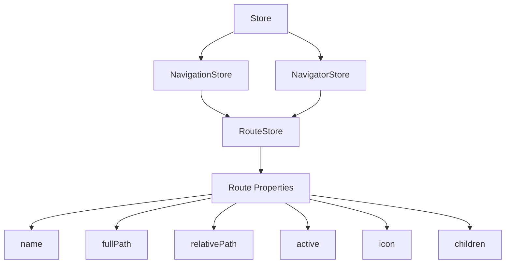
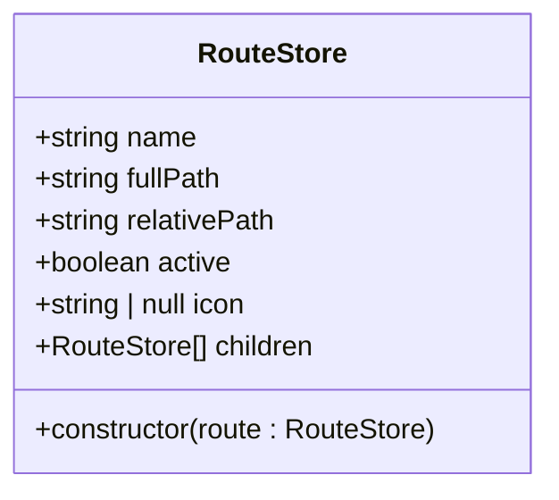
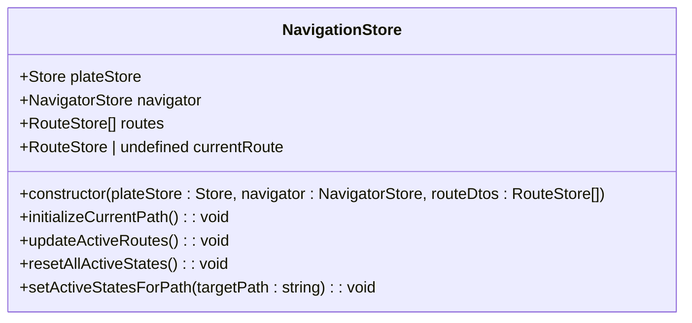
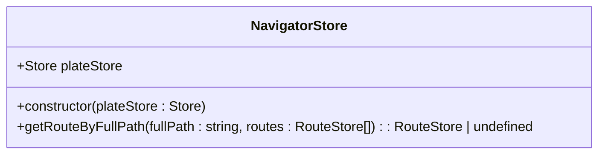

# Route Store

<cite>
**Referenced Files in This Document**   
- [routeStore.ts](file://packages/store/src/stores/routeStore.ts)
- [navigationStore.ts](file://packages/store/src/stores/navigationStore.ts)
- [navigatorStore.ts](file://packages/store/src/stores/navigatorStore.ts)
- [Store.ts](file://packages/store/src/stores/Store.ts)
- [App.tsx](file://apps/admin/src/App.tsx)
- [types.ts](file://packages/ui/src/components/ui/layouts/Navbar/types.ts)
- [routes.ts](file://apps/server/src/shared/vars/routes.ts)
</cite>

## Table of Contents
1. [Introduction](#introduction)
2. [Core Components](#core-components)
3. [Architecture Overview](#architecture-overview)
4. [Detailed Component Analysis](#detailed-component-analysis)
5. [Navigation State Management](#navigation-state-management)
6. [URL Parameter Handling](#url-parameter-handling)
7. [Navigation History Tracking](#navigation-history-tracking)
8. [Integration with React Navigation and React Router](#integration-with-react-navigation-and-react-router)
9. [Deep Linking Implementation](#deep-linking-implementation)
10. [Route Guarding](#route-guarding)
11. [Navigation State Persistence](#navigation-state-persistence)
12. [Common Issues and Solutions](#common-issues-and-solutions)
13. [Conclusion](#conclusion)

## Introduction
The routeStore MobX store provides a centralized solution for managing navigation state across the application. This documentation details the implementation of the routing state management system, focusing on how it handles URL parameters, tracks navigation history, and integrates with both React Navigation (for mobile) and React Router (for web) to provide a unified navigation API. The system is designed to address common navigation challenges such as race conditions, back button behavior, and maintaining state during authentication flows.

## Core Components
The navigation system consists of several interconnected components that work together to manage routing state. The core components include the RouteStore, NavigationStore, and NavigatorStore, each with specific responsibilities in the navigation architecture.

**Section sources**
- [routeStore.ts](file://packages/store/src/stores/routeStore.ts)
- [navigationStore.ts](file://packages/store/src/stores/navigationStore.ts)
- [navigatorStore.ts](file://packages/store/src/stores/navigatorStore.ts)

## Architecture Overview
The navigation architecture follows a hierarchical pattern where the RouteStore represents individual routes, the NavigationStore manages the current navigation state, and the NavigatorStore provides utility functions for route resolution. This separation of concerns allows for a clean and maintainable navigation system.

**Diagram sources**
- [routeStore.ts](file://packages/store/src/stores/routeStore.ts)
- [navigationStore.ts](file://packages/store/src/stores/navigationStore.ts)
- [navigatorStore.ts](file://packages/store/src/stores/navigatorStore.ts)

## Detailed Component Analysis

### RouteStore Analysis
The RouteStore class represents a single route in the application's navigation hierarchy. It contains properties that define the route's characteristics and behavior.

**Diagram sources**
- [routeStore.ts](file://packages/store/src/stores/routeStore.ts)

**Section sources**
- [routeStore.ts](file://packages/store/src/stores/routeStore.ts)

### NavigationStore Analysis
The NavigationStore manages the overall navigation state, including the current route and the collection of available routes. It handles route activation and maintains the navigation hierarchy.

**Diagram sources**
- [navigationStore.ts](file://packages/store/src/stores/navigationStore.ts)

**Section sources**
- [navigationStore.ts](file://packages/store/src/stores/navigationStore.ts)

### NavigatorStore Analysis
The NavigatorStore provides utility functions for route resolution and navigation operations. It acts as a helper class for finding routes by their path.

**Diagram sources**
- [navigatorStore.ts](file://packages/store/src/stores/navigatorStore.ts)

**Section sources**
- [navigatorStore.ts](file://packages/store/src/stores/navigatorStore.ts)

## Navigation State Management
The routeStore implements a comprehensive navigation state management system that tracks the current route and maintains the active state of routes in the navigation hierarchy. The NavigationStore class manages the current route through its `_currentRoute` property and updates the active states of all routes when the current route changes.

When a route change occurs, the system follows this process:
1. The current route is updated through the `currentRoute` setter
2. The `updateActiveRoutes()` method is called if the route has changed
3. All active states are reset through `resetAllActiveStates()`
4. Active states are re-established for the new route path through `setActiveStatesForPath()`

This ensures that the navigation UI accurately reflects the current location, with both exact matches and parent routes being marked as active when appropriate.

**Section sources**
- [navigationStore.ts](file://packages/store/src/stores/navigationStore.ts#L13-L113)

## URL Parameter Handling
The routeStore system handles URL parameters through its route definition structure. While the core RouteStore class doesn't directly manage parameters, the system is designed to work with parameterized routes through the fullPath and relativePath properties.

The integration with React Router (used in the admin application) allows for dynamic route parameters, as seen in the App.tsx file which uses @tanstack/react-router for route management. The routeTree generated file likely contains parameterized route definitions that are mapped to the RouteStore instances.

**Section sources**
- [routeStore.ts](file://packages/store/src/stores/routeStore.ts)
- [App.tsx](file://apps/admin/src/App.tsx)

## Navigation History Tracking
The navigation system tracks history through the currentRoute property and the routes collection. While explicit history stack management isn't implemented in the provided code, the system maintains the current navigation state which can be used to reconstruct navigation history.

The initializeCurrentPath method in NavigationStore demonstrates how the system initializes from the current URL, indicating that navigation state can be restored from the browser's location. This allows for proper handling of browser back/forward navigation and direct URL access.

**Section sources**
- [navigationStore.ts](file://packages/store/src/stores/navigationStore.ts#L42-L50)

## Integration with React Navigation and React Router
The routeStore system provides a unified navigation API that can integrate with both React Navigation (for mobile) and React Router (for web). In the web application (admin), React Router is used through @tanstack/react-router, as evidenced by the App.tsx file which sets up the router with the generated routeTree.

The RouteStore interface is designed to be compatible with both navigation systems, providing properties like fullPath and relativePath that can be mapped to the routing configuration of either library. The navigation state managed by the MobX stores can be synchronized with the router's state, allowing for a consistent navigation experience across platforms.

**Section sources**
- [App.tsx](file://apps/admin/src/App.tsx)
- [routeStore.ts](file://packages/store/src/stores/routeStore.ts)

## Deep Linking Implementation
Deep linking is supported through the route resolution system. The NavigatorStore's getRouteByFullPath method enables finding routes by their full path, which is essential for deep linking. When a deep link is accessed, the system can resolve the appropriate route and set it as the current route.

The initializeCurrentPath method in NavigationStore demonstrates how the system handles direct URL access by checking the window.location.pathname and finding the matching route. This ensures that deep links work correctly, both when the application is first loaded and when navigating within an already-running application.

**Section sources**
- [navigationStore.ts](file://packages/store/src/stores/navigationStore.ts#L42-L49)
- [navigatorStore.ts](file://packages/store/src/stores/navigatorStore.ts#L11-L29)

## Route Guarding
While explicit route guarding logic isn't visible in the provided code, the architecture supports route guarding through the NavigationStore and RouteStore classes. Route guards can be implemented by intercepting route changes in the currentRoute setter or by adding guard properties to the RouteStore class.

The active property in RouteStore can be used in conjunction with authentication state (managed by authStore) to conditionally activate routes based on user permissions. This pattern allows for declarative route guarding where routes are only made active if the user has the necessary permissions.

**Section sources**
- [navigationStore.ts](file://packages/store/src/stores/navigationStore.ts#L19-L24)
- [routeStore.ts](file://packages/store/src/stores/routeStore.ts)

## Navigation State Persistence
The navigation system is designed to persist state across sessions through the initializeCurrentPath method, which sets the current route based on the browser's location. This ensures that when a user returns to the application, they are directed to the appropriate route based on the URL.

Additionally, the use of MobX observables allows the navigation state to be easily persisted to localStorage or other storage mechanisms. The entire NavigationStore state could be serialized and restored, maintaining the user's navigation context between sessions.

**Section sources**
- [navigationStore.ts](file://packages/store/src/stores/navigationStore.ts#L42-L50)

## Common Issues and Solutions

### Navigation Race Conditions
Navigation race conditions can occur when multiple navigation operations happen simultaneously. The routeStore system mitigates this by using MobX's reactive system, which ensures that state updates are processed in a predictable order. The routeChanged check in the currentRoute setter prevents unnecessary updates when the route hasn't actually changed.

### Back Button Behavior on Mobile
The integration with React Navigation on mobile platforms handles the native back button behavior. The routeStore's state management ensures that the navigation UI remains synchronized with the actual navigation stack, providing a consistent experience when using the back button.

### Maintaining Navigation State During Authentication Flows
During authentication flows, the navigation state is preserved through the use of the currentRoute property. After authentication, the application can redirect to the previously attempted route. This is facilitated by the route resolution system, which can restore the navigation state based on the URL or stored state.

**Section sources**
- [navigationStore.ts](file://packages/store/src/stores/navigationStore.ts)
- [routeStore.ts](file://packages/store/src/stores/routeStore.ts)

## Conclusion
The routeStore MobX store provides a robust solution for managing navigation state across the application. By implementing a hierarchical structure with RouteStore, NavigationStore, and NavigatorStore, the system offers a comprehensive approach to navigation management that supports both web and mobile platforms. The integration with React Router and potential integration with React Navigation enables a unified navigation API, while the MobX-based state management ensures reactive updates and consistent state across the application. The architecture effectively addresses common navigation challenges and provides a solid foundation for complex navigation requirements.