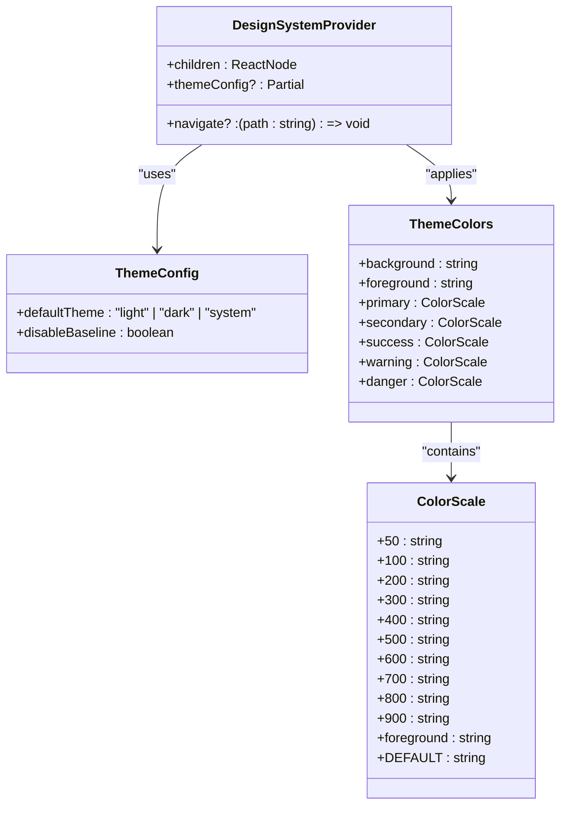
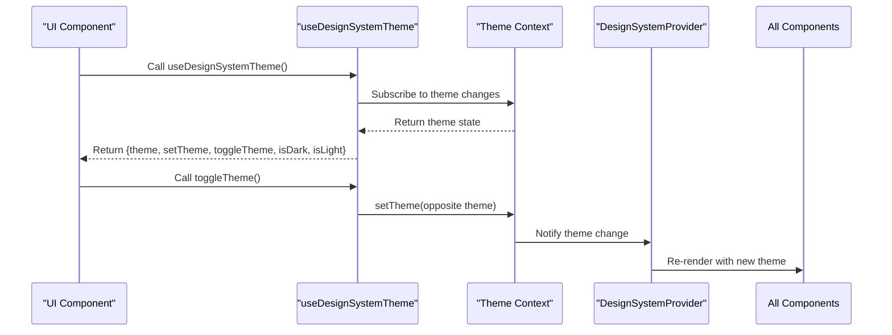
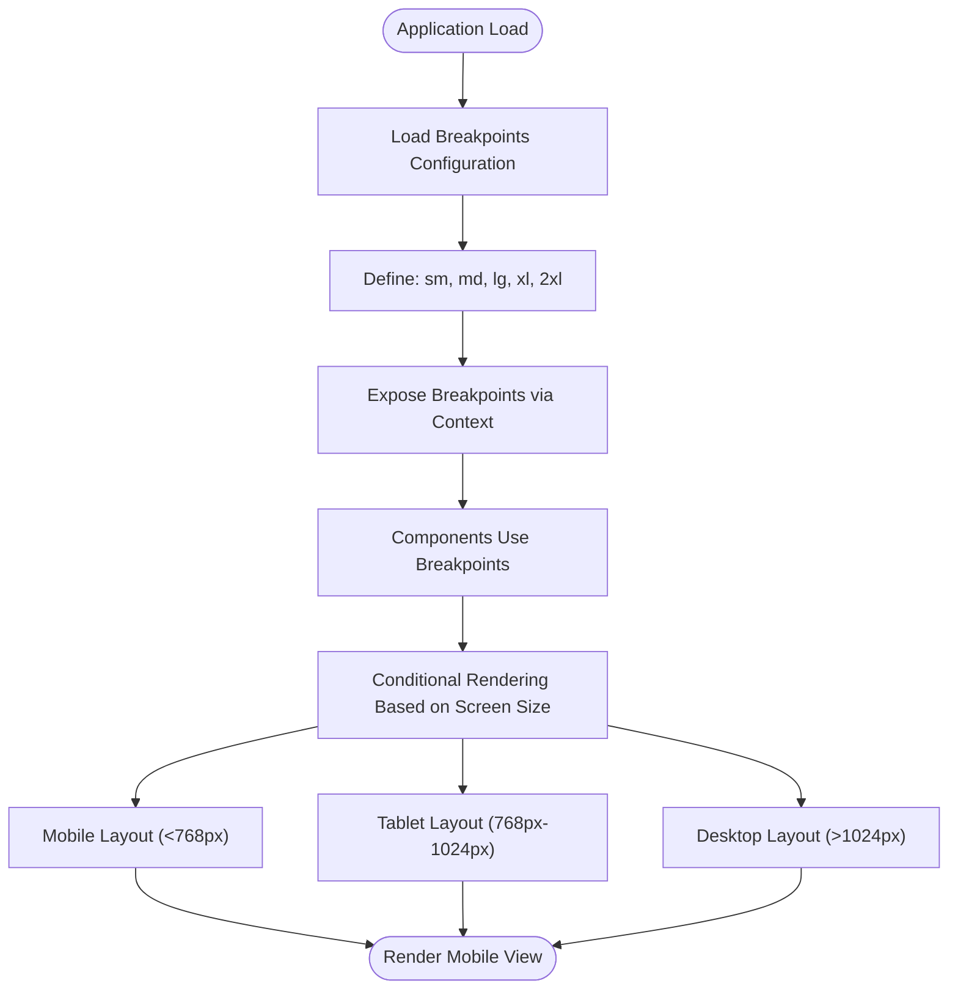
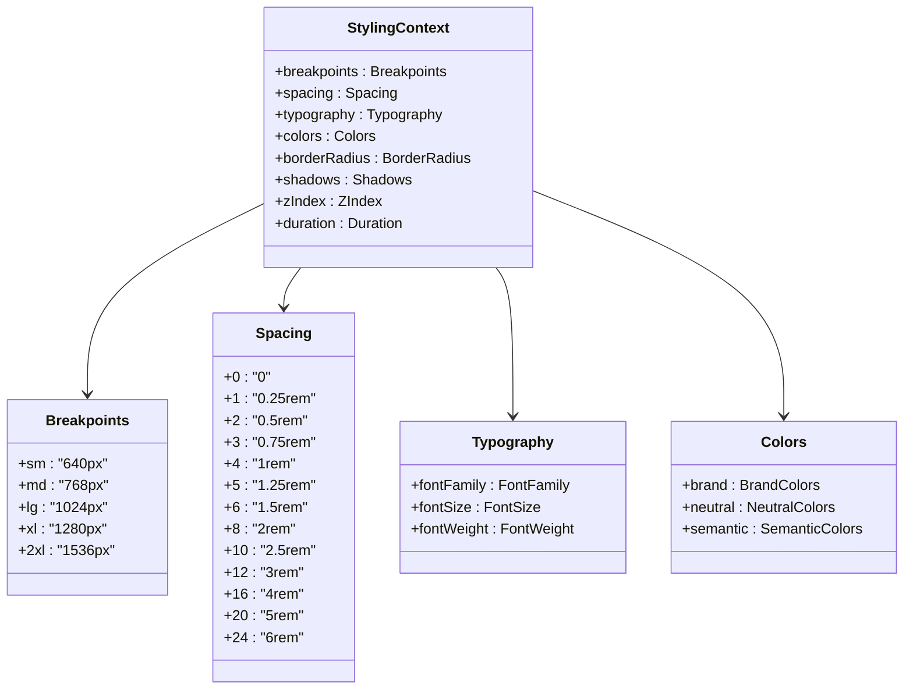
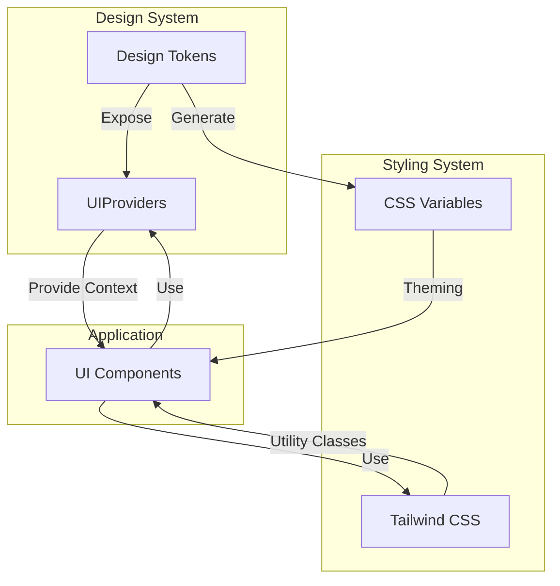
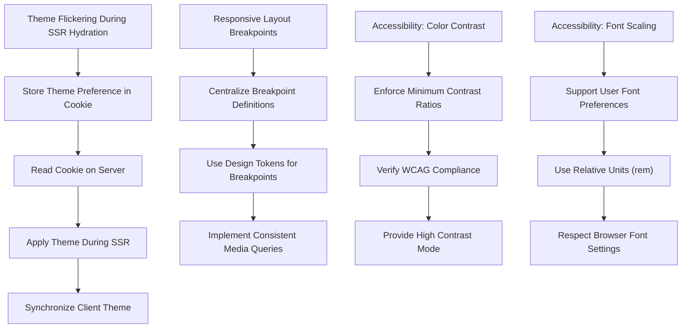

# UI Providers

<cite>
**Referenced Files in This Document**   
- [DesignSystemProvider.tsx](file://packages/design-system/src/provider/DesignSystemProvider.tsx)
- [heroui.config.ts](file://packages/design-system/src/theme/heroui.config.ts)
- [tokens.ts](file://packages/design-system/src/theme/tokens.ts)
- [Providers.tsx](file://packages/provider/src/Providers.tsx)
</cite>

## Table of Contents
1. [Introduction](#introduction)
2. [Theme Provider Implementation](#theme-provider-implementation)
3. [Dark Mode Toggle Functionality](#dark-mode-toggle-functionality)
4. [Responsive Design Configuration](#responsive-design-configuration)
5. [Styling Context Exposure](#styling-context-exposure)
6. [Integration with Tailwind CSS](#integration-with-tailwind-css)
7. [Common Issues and Solutions](#common-issues-and-solutions)
8. [Conclusion](#conclusion)

## Introduction
The UIProviders component is responsible for managing presentation-layer contexts across the application. It serves as a central hub for theme management, responsive design configuration, and styling context distribution. This documentation details the implementation of the theme provider, dark mode toggle functionality, responsive design breakpoints, and how styling context is exposed to components throughout the application.

**Section sources**
- [DesignSystemProvider.tsx](file://packages/design-system/src/provider/DesignSystemProvider.tsx)

## Theme Provider Implementation
The theme provider implementation is built on the HeroUI framework, providing a comprehensive theming system that supports both light and dark modes. The `DesignSystemProvider` component wraps the HeroUI Provider to manage theme settings centrally. It exposes theme configuration through the `heroUIThemeConfig` object, which defines color schemes for both light and dark themes.

The theme system is configured with semantic color definitions that include primary, secondary, success, warning, and danger colors. These colors are defined in the `lightThemeColors` and `darkThemeColors` constants, with the dark theme reusing non-primary colors from the light theme for consistency. The default theme configuration specifies "light" as the default theme with baseline styles enabled.

**Diagram sources**
- [DesignSystemProvider.tsx](file://packages/design-system/src/provider/DesignSystemProvider.tsx#L12-L23)
- [heroui.config.ts](file://packages/design-system/src/theme/heroui.config.ts#L156-L167)

**Section sources**
- [DesignSystemProvider.tsx](file://packages/design-system/src/provider/DesignSystemProvider.tsx)
- [heroui.config.ts](file://packages/design-system/src/theme/heroui.config.ts)

## Dark Mode Toggle Functionality
The dark mode toggle functionality is implemented through the `useDesignSystemTheme` hook, which provides methods for theme manipulation. This hook wraps the `useTheme` hook from HeroUI and exposes a `toggleTheme` function that switches between light and dark modes based on the current theme state.

The theme state is managed at the application level, ensuring consistent theme application across all components. When the theme is toggled, the change is propagated through the context system to all consuming components. The `isDark` and `isLight` boolean flags provide convenient ways to check the current theme state for conditional rendering or styling.

**Diagram sources**
- [DesignSystemProvider.tsx](file://packages/design-system/src/provider/DesignSystemProvider.tsx#L61-L70)

**Section sources**
- [DesignSystemProvider.tsx](file://packages/design-system/src/provider/DesignSystemProvider.tsx)

## Responsive Design Configuration
The responsive design configuration is managed through a comprehensive breakpoints system defined in the design tokens. The breakpoints are aligned with Tailwind CSS standards, providing a consistent responsive design approach across the application. The breakpoints include: sm (640px), md (768px), lg (1024px), xl (1280px), and 2xl (1536px).

These breakpoints are used to create responsive layouts that adapt to different screen sizes. The UI components can use these breakpoints to modify their behavior or appearance based on the current viewport size. The responsive design system is integrated with the styling context, allowing components to access breakpoint information and apply appropriate styles.

**Diagram sources**
- [tokens.ts](file://packages/design-system/src/theme/tokens.ts#L99-L105)

**Section sources**
- [tokens.ts](file://packages/design-system/src/theme/tokens.ts)

## Styling Context Exposure
The UIProviders component exposes a comprehensive styling context to all components in the application. This context includes breakpoints, spacing, typography, and color schemes, all centralized in the design tokens system. The styling context is made available through the provider hierarchy, ensuring that all components have access to consistent design values.

The spacing system follows the Tailwind CSS scale with values from 0 to 24, corresponding to rem units that translate to pixel values (e.g., spacing 4 = 1rem = 16px). The typography system includes font families, font sizes with corresponding line heights, and font weights. Color schemes are exposed through both semantic colors (background, foreground, divider) and brand colors (primary, secondary, success, warning, danger).

**Diagram sources**
- [tokens.ts](file://packages/design-system/src/theme/tokens.ts)

**Section sources**
- [tokens.ts](file://packages/design-system/src/theme/tokens.ts)

## Integration with Tailwind CSS
The UIProviders component integrates seamlessly with Tailwind CSS through the design tokens system. The spacing, breakpoints, and other design values are aligned with Tailwind CSS conventions, allowing for consistent styling across the application. The design tokens are structured to mirror Tailwind's configuration, making it easy to extend or customize the design system.

The integration enables developers to use Tailwind utility classes while maintaining access to the centralized design tokens for programmatic styling. This hybrid approach provides the flexibility of utility-first CSS with the consistency of a design system. Components can use Tailwind classes for layout and basic styling while accessing design tokens for dynamic styling based on theme or other context.

**Diagram sources**
- [tokens.ts](file://packages/design-system/src/theme/tokens.ts)
- [DesignSystemProvider.tsx](file://packages/design-system/src/provider/DesignSystemProvider.tsx)

**Section sources**
- [tokens.ts](file://packages/design-system/src/theme/tokens.ts)
- [DesignSystemProvider.tsx](file://packages/design-system/src/provider/DesignSystemProvider.tsx)

## Common Issues and Solutions
Several common issues arise when implementing UI providers, particularly around theme flickering during SSR hydration, responsive layout breakpoints, and accessibility considerations.

### Theme Flickering During SSR Hydration
Theme flickering occurs when the server-rendered content uses a different theme than the client's preferred theme. This is resolved by synchronizing the theme state between server and client through cookie-based theme persistence and inline theme detection scripts that prevent flash of incorrect theme (FOIT).

### Responsive Layout Breakpoints
Responsive layout issues can occur when breakpoints are not consistently applied across components. The solution is to centralize breakpoint definitions in the design tokens and use a consistent approach to responsive design throughout the application.

### Accessibility Considerations
Accessibility issues related to color contrast and font scaling are addressed by ensuring sufficient contrast ratios between text and background colors in both light and dark themes. The design system enforces minimum contrast ratios and provides scalable typography that respects user preferences for font size.

**Diagram sources**
- [DesignSystemProvider.tsx](file://packages/design-system/src/provider/DesignSystemProvider.tsx)
- [heroui.config.ts](file://packages/design-system/src/theme/heroui.config.ts)
- [tokens.ts](file://packages/design-system/src/theme/tokens.ts)

**Section sources**
- [DesignSystemProvider.tsx](file://packages/design-system/src/provider/DesignSystemProvider.tsx)
- [heroui.config.ts](file://packages/design-system/src/theme/heroui.config.ts)
- [tokens.ts](file://packages/design-system/src/theme/tokens.ts)

## Conclusion
The UIProviders component provides a robust foundation for managing presentation-layer contexts in the application. By centralizing theme management, responsive design configuration, and styling context, it ensures consistency and maintainability across all UI components. The integration with HeroUI and Tailwind CSS provides a powerful combination of utility-first styling with a structured design system. The implementation addresses common challenges such as theme flickering, responsive design, and accessibility, making it a comprehensive solution for modern web application styling.