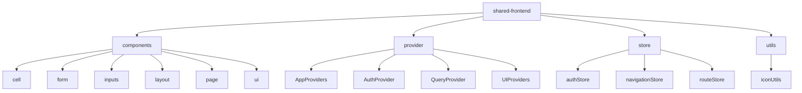
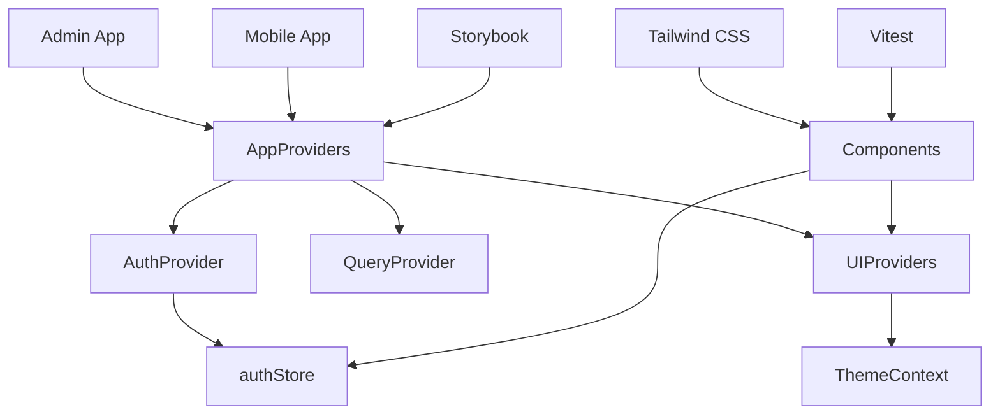
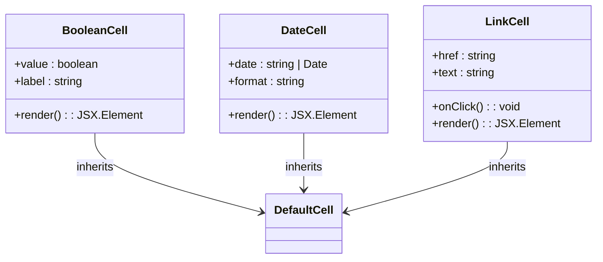
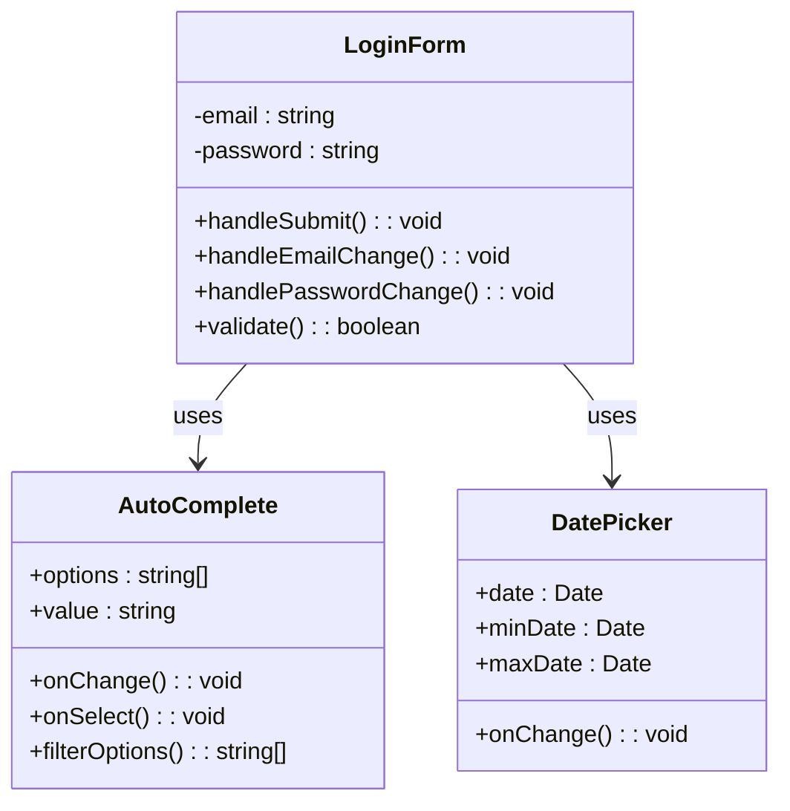
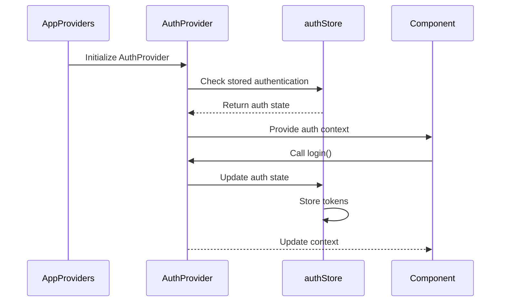
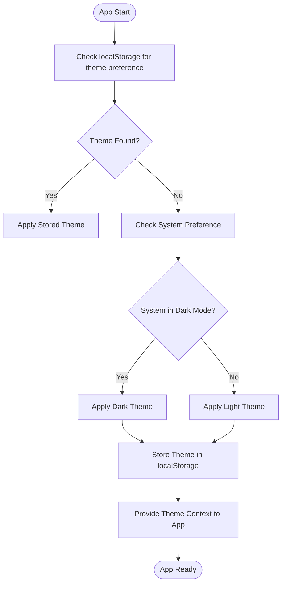
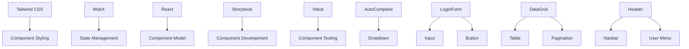

# Shared Frontend Components

<cite>
**Referenced Files in This Document**   
- [packages/ui/src/components/cell/BooleanCell/BooleanCell.tsx](file://packages/ui/src/components/cell/BooleanCell/BooleanCell.tsx)
- [packages/ui/src/components/form/LoginForm/LoginForm.tsx](file://packages/ui/src/components/form/LoginForm/LoginForm.tsx)
- [packages/ui/src/components/inputs/AutoComplete/AutoComplete.tsx](file://packages/ui/src/components/inputs/AutoComplete/AutoComplete.tsx)
- [packages/ui/src/components/layout/Header/Header.tsx](file://packages/ui/src/components/layout/Header/Header.tsx)
- [packages/ui/src/components/page/AdminAuthLoginPage.tsx](file://packages/ui/src/components/page/AdminAuthLoginPage.tsx)
- [packages/ui/src/components/ui/Button/Button.tsx](file://packages/ui/src/components/ui/Button/Button.tsx)
- [packages/ui/src/components/ui/DataGrid/DataGrid.tsx](file://packages/ui/src/components/ui/DataGrid/DataGrid.tsx)
- [packages/ui/src/provider/AppProviders.tsx](file://packages/ui/src/provider/AppProviders.tsx)
- [packages/ui/src/provider/AuthProvider.tsx](file://packages/ui/src/provider/AuthProvider.tsx)
- [packages/ui/src/store/authStore.ts](file://packages/ui/src/store/authStore.ts)
- [packages/ui/src/utils/iconUtils.tsx](file://packages/ui/src/utils/iconUtils.tsx)
- [packages/ui/package.json](file://packages/ui/package.json)
- [apps/admin/.storybook/main.ts](file://apps/admin/.storybook/main.ts)
- [apps/mobile/.rnstorybook/main.ts](file://apps/mobile/.rnstorybook/main.ts)
- [apps/admin/src/main.tsx](file://apps/admin/src/main.tsx)
- [apps/mobile/src/main.tsx](file://apps/mobile/src/main.tsx)
</cite>

## Table of Contents
1. [Introduction](#introduction)
2. [Project Structure](#project-structure)
3. [Core Components](#core-components)
4. [Architecture Overview](#architecture-overview)
5. [Detailed Component Analysis](#detailed-component-analysis)
6. [Dependency Analysis](#dependency-analysis)
7. [Performance Considerations](#performance-considerations)
8. [Troubleshooting Guide](#troubleshooting-guide)
9. [Conclusion](#conclusion)

## Introduction
The shared-frontend component library in prj-core provides a unified set of reusable UI components for both admin and mobile applications. This documentation details the architecture, design patterns, and implementation strategies used across the component library, including layout systems, form elements, data display components, and utility components. The library leverages modern React patterns with MobX for state management, Tailwind CSS for styling, and Storybook for component development and documentation.

## Project Structure

**Diagram sources**
- [packages/ui/src/components](file://packages/ui/src/components)
- [packages/ui/src/provider](file://packages/ui/src/provider)
- [packages/ui/src/store](file://packages/ui/src/store)
- [packages/ui/src/utils](file://packages/ui/src/utils)

**Section sources**
- [packages/ui/src](file://packages/ui/src)

## Core Components

The shared-frontend library organizes components into logical categories: cell components for data display in tables, form components for user input, input components for various data types, layout components for page structure, page components for complete views, and UI components for general interface elements. Each component is designed with reusability, accessibility, and theming in mind.

**Section sources**
- [packages/ui/src/components/cell](file://packages/ui/src/components/cell)
- [packages/ui/src/components/form](file://packages/ui/src/components/form)
- [packages/ui/src/components/inputs](file://packages/ui/src/components/inputs)
- [packages/ui/src/components/layout](file://packages/ui/src/components/layout)
- [packages/ui/src/components/page](file://packages/ui/src/components/page)
- [packages/ui/src/components/ui](file://packages/ui/src/components/ui)

## Architecture Overview

**Diagram sources**
- [packages/ui/src/provider/AppProviders.tsx](file://packages/ui/src/provider/AppProviders.tsx)
- [packages/ui/src/provider/AuthProvider.tsx](file://packages/ui/src/provider/AuthProvider.tsx)
- [packages/ui/src/store/authStore.ts](file://packages/ui/src/store/authStore.ts)

## Detailed Component Analysis

### Component Organization and Patterns

The component library follows a structured organization pattern with components grouped by functionality. Each component directory contains the component implementation, associated stories for Storybook, and an index file for exports. The library implements the compound component pattern for complex components and uses TypeScript for type safety.

#### Cell Components
Cell components are designed for data display within tables and grids. They include specialized components for boolean values, dates, numbers, and links, each with consistent styling and accessibility features.

**Diagram sources**
- [packages/ui/src/components/cell/BooleanCell/BooleanCell.tsx](file://packages/ui/src/components/cell/BooleanCell/BooleanCell.tsx)
- [packages/ui/src/components/cell/DateCell/DateCell.tsx](file://packages/ui/src/components/cell/DateCell/DateCell.tsx)
- [packages/ui/src/components/cell/LinkCell/LinkCell.tsx](file://packages/ui/src/components/cell/LinkCell/LinkCell.tsx)

#### Form and Input Components
Form components provide structured user input with validation and error handling. Input components offer a variety of input types including text, select, date pickers, and file uploaders, all styled consistently with the design system.

**Diagram sources**
- [packages/ui/src/components/form/LoginForm/LoginForm.tsx](file://packages/ui/src/components/form/LoginForm/LoginForm.tsx)
- [packages/ui/src/components/inputs/AutoComplete/AutoComplete.tsx](file://packages/ui/src/components/inputs/AutoComplete/AutoComplete.tsx)
- [packages/ui/src/components/inputs/DatePicker/DatePicker.tsx](file://packages/ui/src/components/inputs/DatePicker/DatePicker.tsx)

### Provider Pattern Implementation

The library implements a comprehensive provider pattern for global state management through AppProviders, AuthProvider, and other context providers. This pattern enables centralized state management while maintaining component isolation.

#### Authentication State Management
The AuthProvider component manages authentication state across the application, providing authentication context to all components through React's context API. It integrates with authStore for persistent state management.

**Diagram sources**
- [packages/ui/src/provider/AppProviders.tsx](file://packages/ui/src/provider/AppProviders.tsx)
- [packages/ui/src/provider/AuthProvider.tsx](file://packages/ui/src/provider/AuthProvider.tsx)
- [packages/ui/src/store/authStore.ts](file://packages/ui/src/store/authStore.ts)

#### Theme and UI State Management
The UIProviders component manages application theming, including dark mode support, and other UI-related states. It leverages @heroui/use-theme for theme switching and persistence.

**Diagram sources**
- [packages/ui/src/provider/UIProviders.tsx](file://packages/ui/src/provider/UIProviders.tsx)
- [packages/ui/src/utils/iconUtils.tsx](file://packages/ui/src/utils/iconUtils.tsx)

## Dependency Analysis

**Diagram sources**
- [packages/ui/package.json](file://packages/ui/package.json)
- [packages/ui/src/components](file://packages/ui/src/components)

**Section sources**
- [packages/ui/package.json](file://packages/ui/package.json)

## Performance Considerations

The component library implements several performance optimizations including code splitting through dynamic imports, memoization of components using React.memo, and efficient state updates through MobX. Components are designed to minimize re-renders and optimize rendering performance, especially for data-intensive components like DataGrid and Table.

## Troubleshooting Guide

Common issues with the shared-frontend components typically relate to theme context not being properly provided, authentication state not being initialized, or missing Tailwind CSS classes. Ensure that AppProviders wraps the application root and that the Tailwind CSS file is properly imported. For Storybook issues, verify that the Storybook configuration properly references the component library paths.

**Section sources**
- [apps/admin/.storybook/main.ts](file://apps/admin/.storybook/main.ts)
- [apps/mobile/.rnstorybook/main.ts](file://apps/mobile/.rnstorybook/main.ts)
- [packages/ui/src/provider/AppProviders.tsx](file://packages/ui/src/provider/AppProviders.tsx)

## Conclusion

The shared-frontend component library in prj-core provides a robust foundation for building consistent user interfaces across admin and mobile applications. By leveraging React, MobX, Tailwind CSS, and Storybook, the library offers a comprehensive solution for component development with strong support for theming, accessibility, and responsive design. The provider pattern implementation ensures consistent state management, while the organized component structure promotes reusability and maintainability.