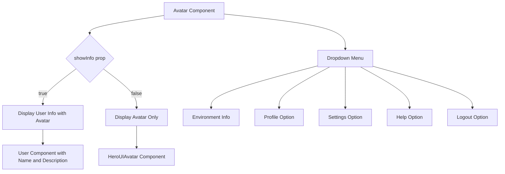
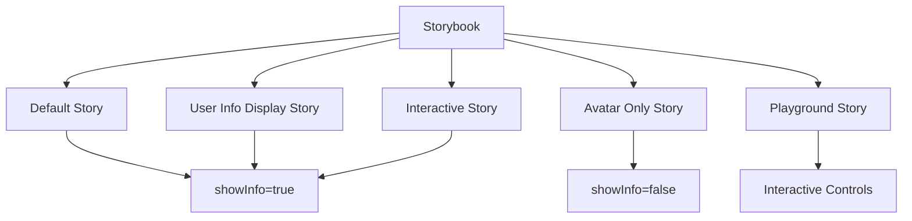

# Avatar

<cite>
**Referenced Files in This Document**   
- [Avatar.tsx](file://packages/ui/src/components/ui/Avatar/Avatar.tsx)
- [Avatar.stories.tsx](file://packages/ui/src/components/ui/Avatar/Avatar.stories.tsx)
</cite>

## Table of Contents
1. [Introduction](#introduction)
2. [Core Components](#core-components)
3. [Props and Configuration](#props-and-configuration)
4. [Styling and Layout](#styling-and-layout)
5. [Usage Examples](#usage-examples)
6. [Storybook Examples](#storybook-examples)
7. [Integration with User Context](#integration-with-user-context)
8. [Error Handling](#error-handling)
9. [Accessibility](#accessibility)
10. [Performance Considerations](#performance-considerations)
11. [Responsive Design](#responsive-design)
12. [Troubleshooting Guide](#troubleshooting-guide)

## Introduction
The Avatar component is a user interface element designed to represent users within the application. It displays user information and provides access to user-related actions through a dropdown menu. The component is implemented in the shared UI library and is used across various applications in the project ecosystem.

**Section sources**
- [Avatar.tsx](file://packages/ui/src/components/ui/Avatar/Avatar.tsx#L1-L218)

## Core Components
The Avatar component is built using several sub-components and integrates with external UI libraries. It wraps the HeroUI Avatar component and enhances it with additional functionality such as dropdown menus and environment indicators.

The component has two primary display modes: one showing full user information and another showing only the avatar image. The display mode is controlled by the `showInfo` prop.

**Diagram sources**
- [Avatar.tsx](file://packages/ui/src/components/ui/Avatar/Avatar.tsx#L10-L127)

**Section sources**
- [Avatar.tsx](file://packages/ui/src/components/ui/Avatar/Avatar.tsx#L1-L218)

## Props and Configuration
The Avatar component accepts the following props:

- `showInfo`: A boolean prop that determines whether to display full user information alongside the avatar or show only the avatar image. Defaults to true.
- `onMenuAction`: A callback function that is triggered when a menu item is selected. It receives the key of the selected menu item as a parameter.

The component uses these props to control its behavior and appearance, providing flexibility for different use cases.

**Section sources**
- [Avatar.tsx](file://packages/ui/src/components/ui/Avatar/Avatar.tsx#L5-L8)
- [Avatar.stories.tsx](file://packages/ui/src/components/ui/Avatar/Avatar.stories.tsx#L17-L25)

## Styling and Layout
The Avatar component uses Tailwind CSS for styling. It applies specific classes to control appearance and behavior:

- When `showInfo` is true, the component uses a Button with `h-auto`, `bg-transparent`, and `p-0` classes to create a seamless integration with the User component.
- When `showInfo` is false, the component uses an icon-only Button with `bg-transparent` class.
- Both states use `data-[hover=true]:bg-transparent` to maintain transparency on hover.
- The avatar itself has `cursor-pointer` to indicate interactivity.

The component is wrapped in a Dropdown that appears when the avatar is clicked, with placement set to "bottom-end" for proper positioning.

**Section sources**
- [Avatar.tsx](file://packages/ui/src/components/ui/Avatar/Avatar.tsx#L88-L90)
- [Avatar.tsx](file://packages/ui/src/components/ui/Avatar/Avatar.tsx#L113-L115)

## Usage Examples
The Avatar component can be used in various contexts:

### User Profiles
For user profile displays, the component can show the full user information including name and role, providing a rich representation of the user.

### Team Members
In team member listings, the component can be used with `showInfo=false` to display only avatars in a compact format, conserving space while maintaining visual identification.

### Notification Indicators
The component can be integrated with notification systems by adding status indicators to the avatar, showing user availability or activity status.

**Section sources**
- [Avatar.tsx](file://packages/ui/src/components/ui/Avatar/Avatar.tsx#L91-L99)

## Storybook Examples
The Avatar component is documented in Storybook with several examples:

- **Default**: Shows the avatar with user information displayed.
- **User Info Display**: Demonstrates the full user information view.
- **Avatar Only**: Shows the avatar without additional user information.
- **Interactive**: Demonstrates the dropdown functionality and menu interactions.
- **Playground**: Provides an interactive environment to test different configuration options.

These stories help developers understand the component's capabilities and test its behavior under different conditions.

**Diagram sources**
- [Avatar.stories.tsx](file://packages/ui/src/components/ui/Avatar/Avatar.stories.tsx#L32-L95)

**Section sources**
- [Avatar.stories.tsx](file://packages/ui/src/components/ui/Avatar/Avatar.stories.tsx#L1-L96)

## Integration with User Context
The Avatar component integrates with the global user context by displaying static user information ("슈퍼매니저" as name and "총괄" as description). It also incorporates environment information from the `@cocrepo/toolkit` package, displaying the current environment name and color-coded chip.

The component could be extended to pull user data from a global context provider, making it adaptable to different user states and authentication scenarios.

**Section sources**
- [Avatar.tsx](file://packages/ui/src/components/ui/Avatar/Avatar.tsx#L13-L21)
- [Avatar.tsx](file://packages/ui/src/components/ui/Avatar/Avatar.tsx#L92-L94)

## Error Handling
The Avatar component handles image loading through the underlying HeroUI Avatar component. While specific error handling for image loading is not implemented in this component, the HeroUI Avatar likely provides fallback mechanisms for failed image loads.

The component also handles menu actions safely by using optional chaining (`onMenuAction?.(key)`) to prevent errors when the callback is not provided.

**Section sources**
- [Avatar.tsx](file://packages/ui/src/components/ui/Avatar/Avatar.tsx#L76)
- [Avatar.tsx](file://packages/ui/src/components/ui/Avatar/Avatar.tsx#L118)

## Accessibility
The Avatar component includes several accessibility features:

- The button wrapper provides proper keyboard navigation and screen reader support.
- The cursor pointer indicates interactivity to visual users.
- The dropdown menu structure follows standard accessibility patterns.
- SVG icons include proper attributes for screen readers.

To further improve accessibility, aria-labels could be added to describe the purpose of the avatar and its associated actions.

**Section sources**
- [Avatar.tsx](file://packages/ui/src/components/ui/Avatar/Avatar.tsx#L87-L90)
- [Avatar.tsx](file://packages/ui/src/components/ui/Avatar/Avatar.tsx#L112-L115)

## Performance Considerations
When using multiple avatars in a single view, consider the following performance aspects:

- The component renders SVG icons for menu items, which are lightweight and performant.
- The use of memoization or React.memo could be considered if the component is rendered frequently with the same props.
- Image loading should be optimized, potentially using lazy loading for avatars that are not immediately visible.

The component's lightweight structure makes it suitable for rendering multiple instances without significant performance impact.

**Section sources**
- [Avatar.tsx](file://packages/ui/src/components/ui/Avatar/Avatar.tsx#L149-L203)

## Responsive Design
The Avatar component is designed to work across different screen sizes:

- On larger screens, it can display full user information when `showInfo=true`.
- On smaller screens, it can display only the avatar image when `showInfo=false`, conserving valuable screen space.
- The component uses relative units and flexible layouts to adapt to different viewport sizes.

The responsive behavior can be controlled through conditional logic in parent components that determine the `showInfo` prop value based on screen size.

**Section sources**
- [Avatar.tsx](file://packages/ui/src/components/ui/Avatar/Avatar.tsx#L79-L104)

## Troubleshooting Guide
Common issues and solutions for the Avatar component:

- **Avatar not displaying**: Verify that the image source path is correct and accessible.
- **Dropdown not working**: Ensure that the Dropdown component is properly imported and configured.
- **Environment information not updating**: Check that the `@cocrepo/toolkit` environment module is properly initialized.
- **Click events not registering**: Verify that there are no overlapping elements blocking the avatar.

When integrating the component, ensure all required dependencies are installed and properly configured in the project.

**Section sources**
- [Avatar.tsx](file://packages/ui/src/components/ui/Avatar/Avatar.tsx#L82-L85)
- [Avatar.tsx](file://packages/ui/src/components/ui/Avatar/Avatar.tsx#L107-L110)