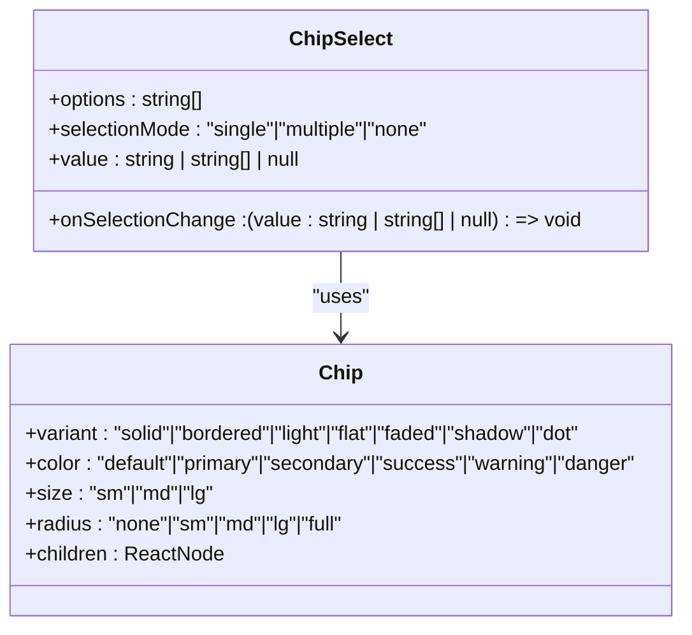
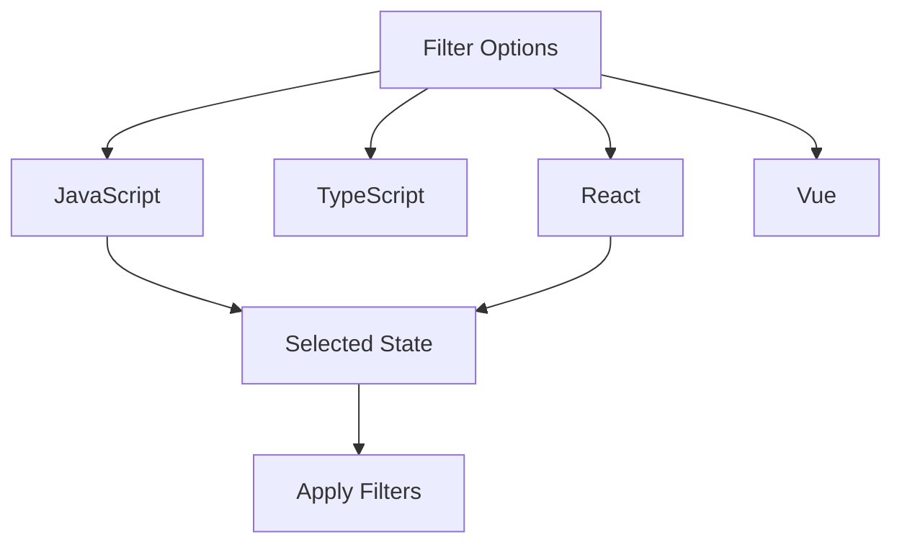
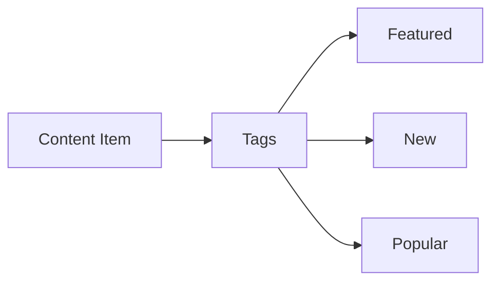
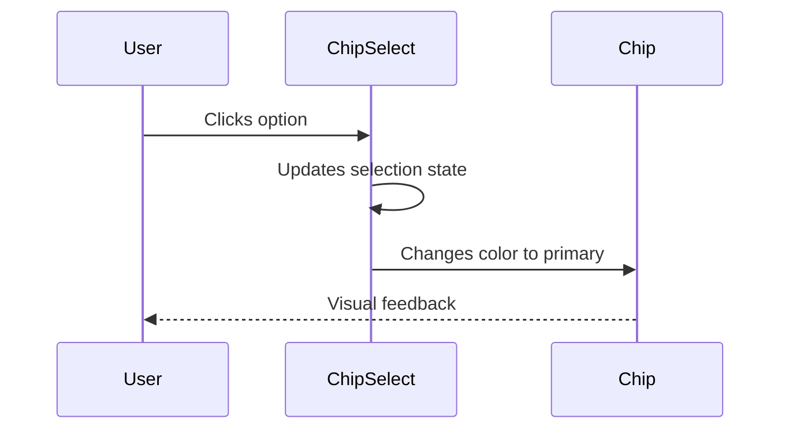
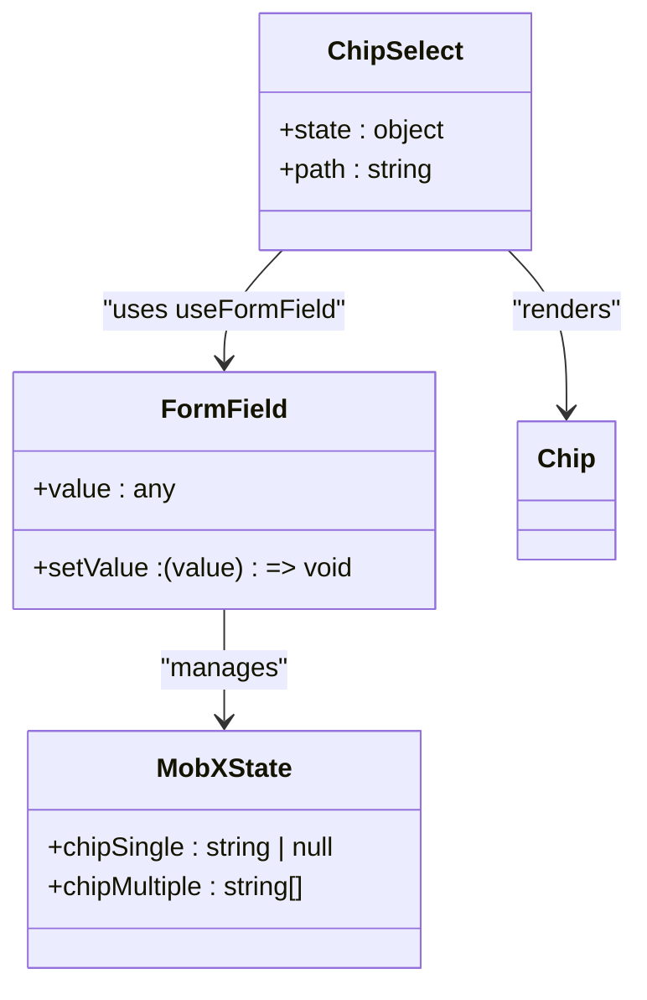

# Chip

<cite>
**Referenced Files in This Document**   
- [Chip.tsx](file://packages/ui/src/components/ui/Chip/Chip.tsx)
- [Chip.stories.tsx](file://packages/ui/src/components/ui/Chip/Chip.stories.tsx)
- [ChipSelect.tsx](file://packages/ui/src/components/inputs/ChipSelect/ChipSelect.tsx)
- [ChipSelect.stories.tsx](file://packages/ui/src/components/inputs/ChipSelect/ChipSelect.stories.tsx)
</cite>

## Table of Contents
1. [Introduction](#introduction)
2. [Core Components](#core-components)
3. [Implementation Details](#implementation-details)
4. [Styling with Tailwind CSS](#styling-with-tailwind-css)
5. [Usage Examples](#usage-examples)
6. [Storybook Examples](#storybook-examples)
7. [Form State Integration](#form-state-integration)
8. [Accessibility and Keyboard Navigation](#accessibility-and-keyboard-navigation)
9. [Common Issues and Best Practices](#common-issues-and-best-practices)

## Introduction
The Chip component is a versatile UI element used for displaying tags, filters, choices, and input selections within the application. It provides visual feedback for user interactions and supports various states, colors, and variants to accommodate different use cases such as filtering interfaces, tag displays, and selection controls. The component is built on top of the @heroui/react library and extended for consistent styling and behavior across the application.

**Section sources**
- [Chip.tsx](file://packages/ui/src/components/ui/Chip/Chip.tsx#L1-L7)
- [Chip.stories.tsx](file://packages/ui/src/components/ui/Chip/Chip.stories.tsx#L1-L187)

## Core Components

The Chip ecosystem consists of two main components: the base `Chip` component and the `ChipSelect` wrapper component that enables selection functionality. The base Chip serves as a styled container for text or icons, while ChipSelect provides interactive selection capabilities for filter and choice scenarios.

**Diagram sources**
- [Chip.tsx](file://packages/ui/src/components/ui/Chip/Chip.tsx#L1-L7)
- [ChipSelect.tsx](file://packages/ui/src/components/inputs/ChipSelect/ChipSelect.tsx#L1-L52)

**Section sources**
- [Chip.tsx](file://packages/ui/src/components/ui/Chip/Chip.tsx#L1-L7)
- [ChipSelect.tsx](file://packages/ui/src/components/inputs/ChipSelect/ChipSelect.tsx#L1-L52)

## Implementation Details

### Variants
The Chip component supports seven visual variants that determine its appearance:
- **solid**: Filled background with bold appearance
- **bordered**: Outline with transparent background
- **light**: Subtle filled background with low contrast
- **flat**: Flat design with solid color background
- **faded**: Lighter version of solid with reduced opacity
- **shadow**: Adds shadow effect for depth
- **dot**: Minimal circular indicator, often used for status

### Colors
The component supports six color themes:
- **default**: Neutral gray appearance
- **primary**: Main brand color
- **secondary**: Secondary brand color
- **success**: Green for positive states
- **warning**: Yellow/Orange for caution
- **danger**: Red for errors or destructive actions

### Interactive States
The Chip component supports hover and active states with appropriate visual feedback. When used within ChipSelect, it also manages selected states based on the selection mode (single, multiple, or none).

**Section sources**
- [Chip.tsx](file://packages/ui/src/components/ui/Chip/Chip.tsx#L1-L7)
- [Chip.stories.tsx](file://packages/ui/src/components/ui/Chip/Chip.stories.tsx#L17-L52)

## Styling with Tailwind CSS

The Chip component utilizes Tailwind CSS for styling, inheriting configurations from the @heroui/react library. The styling system provides consistent spacing, typography, and color application across variants and sizes.

### Size Options
- **sm**: Small size with reduced padding and font size
- **md**: Medium/default size with standard dimensions
- **lg**: Large size with increased padding and font scale

### Radius Options
The component supports five radius options from sharp corners to fully rounded:
- **none**: No border radius
- **sm**: Slight rounding
- **md**: Moderate rounding
- **lg**: Significant rounding
- **full**: Completely rounded (pill-shaped)

Interactive states are enhanced with smooth transitions for hover and active effects, ensuring a responsive feel. The default styling ensures adequate touch target sizing with minimum dimensions that meet accessibility guidelines.

**Section sources**
- [Chip.tsx](file://packages/ui/src/components/ui/Chip/Chip.tsx#L1-L7)
- [Chip.stories.tsx](file://packages/ui/src/components/ui/Chip/Chip.stories.tsx#L36-L47)

## Usage Examples

### Filtering Interface
Chips can be used as filter controls where users select from multiple options:

**Diagram sources**
- [ChipSelect.tsx](file://packages/ui/src/components/inputs/ChipSelect/ChipSelect.tsx#L6-L11)

### Tag Display
Chips serve as effective tag displays for categorizing content:

**Diagram sources**
- [Chip.tsx](file://packages/ui/src/components/ui/Chip/Chip.tsx#L3-L6)

### Selection Controls
For choice-based interactions, ChipSelect provides a clean interface:

**Diagram sources**
- [ChipSelect.tsx](file://packages/ui/src/components/inputs/ChipSelect/ChipSelect.tsx#L21-L37)

**Section sources**
- [ChipSelect.tsx](file://packages/ui/src/components/inputs/ChipSelect/ChipSelect.tsx#L6-L11)

## Storybook Examples

The component library includes comprehensive Storybook examples that demonstrate various configurations:

### Basic Variations
- Default chip with standard styling
- Primary, success, warning, and danger color variants
- Bordered variant for lighter visual weight
- Small and large size variations

### Interactive Configurations
- Playground story allowing parameter customization
- Multiple selection mode demonstration
- Single selection toggle behavior
- Disabled selection state

These stories serve as both documentation and testing environments, allowing developers to visualize component behavior under different configurations and ensuring consistency across the application.

**Section sources**
- [Chip.stories.tsx](file://packages/ui/src/components/ui/Chip/Chip.stories.tsx#L1-L187)
- [ChipSelect.stories.tsx](file://packages/ui/src/components/inputs/ChipSelect/ChipSelect.stories.tsx#L1-L62)

## Form State Integration

The Chip component integrates with form state management through the ChipSelect wrapper, which connects to MobX state management:

**Diagram sources**
- [ChipSelect.tsx](file://packages/ui/src/components/inputs/ChipSelect/ChipSelect.tsx#L27-L31)
- [ChipSelect.stories.tsx](file://packages/ui/src/components/inputs/ChipSelect/ChipSelect.stories.tsx#L5-L8)

The integration follows a pattern where ChipSelect accepts a state object and path to bind to specific properties in the MobX store. It uses the `useFormField` hook to create a controlled form field interface, enabling two-way data binding between the UI and application state.

Keyboard navigation is supported through standard interaction patterns, allowing users to navigate between chips using tab keys and activate selections with enter or space keys, ensuring accessibility for keyboard-only users.

**Section sources**
- [ChipSelect.tsx](file://packages/ui/src/components/inputs/ChipSelect/ChipSelect.tsx#L15-L42)
- [ChipSelect.stories.tsx](file://packages/ui/src/components/inputs/ChipSelect/ChipSelect.stories.tsx#L4-L8)

## Accessibility and Keyboard Navigation

The Chip component maintains accessibility compliance through proper semantic markup and keyboard support:

- Each chip is focusable and announces its state to screen readers
- Selected states are communicated through both visual and programmatic means
- Color contrast meets WCAG 2.1 AA standards for text readability
- Focus indicators are clearly visible for keyboard navigation

Keyboard navigation follows expected patterns:
- Tab key moves between interactive chips
- Enter or space key activates selection
- In multiple selection mode, users can select/deselect individual chips
- In single selection mode, selecting a new chip deselects the previous selection

The component ensures that all interactive elements have appropriate ARIA roles and properties to convey their purpose and state to assistive technologies.

**Section sources**
- [Chip.tsx](file://packages/ui/src/components/ui/Chip/Chip.tsx#L1-L7)
- [ChipSelect.tsx](file://packages/ui/src/components/inputs/ChipSelect/ChipSelect.tsx#L21-L37)

## Common Issues and Best Practices

### Touch Target Sizing
Ensure adequate touch target size (minimum 44x44px) by:
- Using appropriate padding in chip styling
- Adding invisible padding if necessary to meet accessibility requirements
- Testing on actual touch devices

### Performance with Large Sets
When rendering large sets of chips:
- Implement virtualization for very large lists
- Use React.memo for chip components to prevent unnecessary re-renders
- Consider pagination or filtering for extensive option sets

### Accessibility Compliance
Maintain accessibility by:
- Ensuring sufficient color contrast between text and background
- Providing visible focus indicators
- Using proper ARIA attributes for interactive states
- Testing with screen readers and keyboard-only navigation

### Best Practices
- Use consistent color semantics across the application
- Limit the number of simultaneously displayed chips for readability
- Provide clear visual feedback for interactive states
- Ensure text content is concise and readable at all size variants

**Section sources**
- [Chip.tsx](file://packages/ui/src/components/ui/Chip/Chip.tsx#L1-L7)
- [ChipSelect.tsx](file://packages/ui/src/components/inputs/ChipSelect/ChipSelect.tsx#L1-L52)