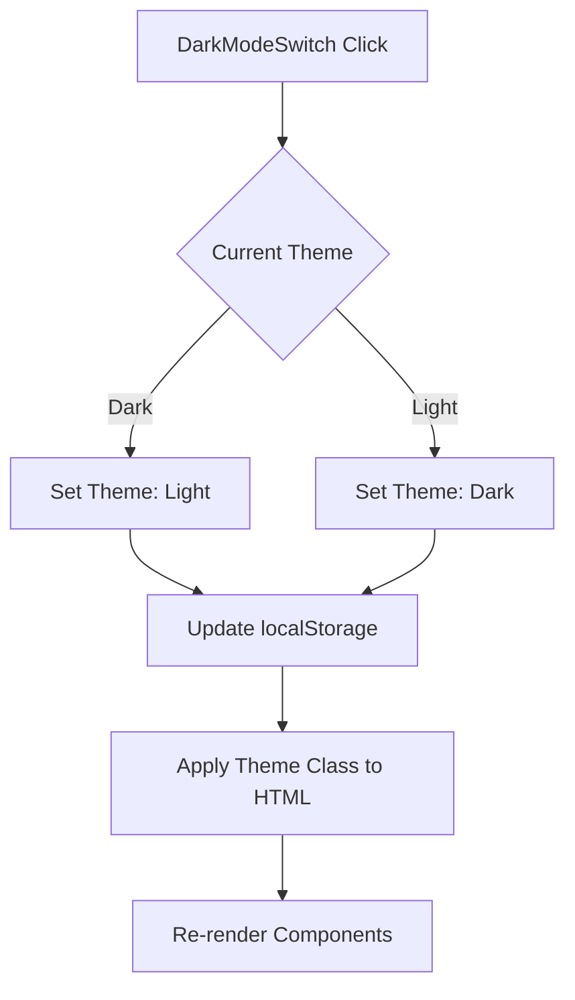
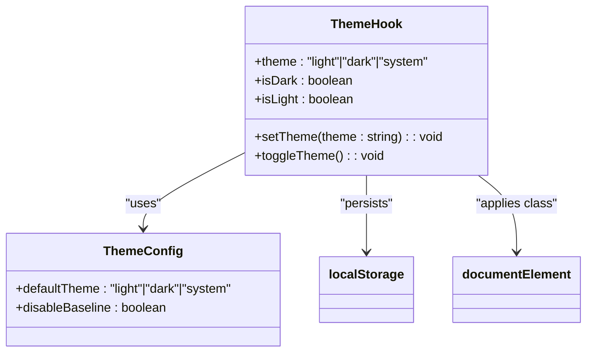
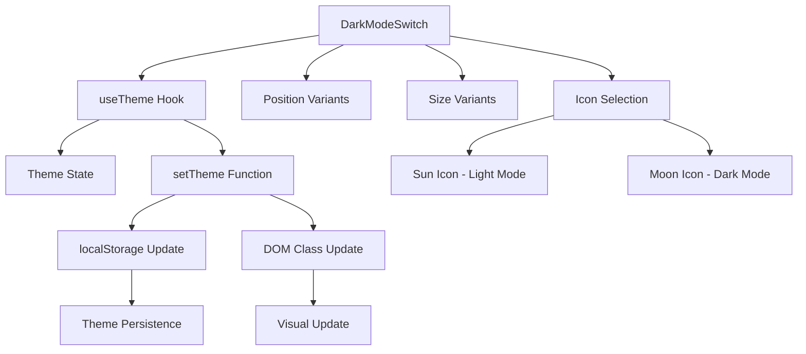
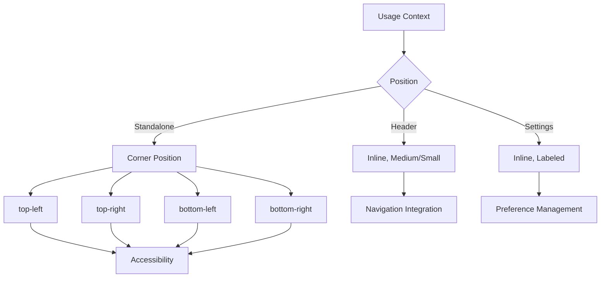
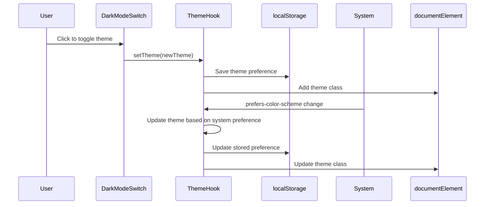
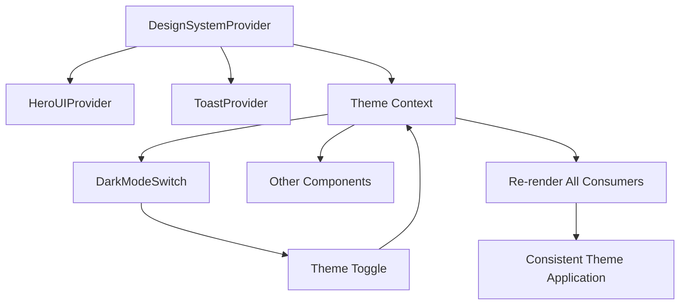

# DarkModeSwitch

<cite>
**Referenced Files in This Document**   
- [DarkModeSwitch.stories-R8bYGODm.js](file://apps/storybook/storybook-static/assets/DarkModeSwitch.stories-R8bYGODm.js)
- [DesignSystemProvider.tsx](file://packages/design-system/src/provider/DesignSystemProvider.tsx)
- [heroui.config.ts](file://packages/design-system/src/theme/heroui.config.ts)
</cite>

## Table of Contents
1. [Introduction](#introduction)
2. [Core Implementation](#core-implementation)
3. [Theme Management System](#theme-management-system)
4. [Component Architecture](#component-architecture)
5. [Usage Patterns](#usage-patterns)
6. [Accessibility Features](#accessibility-features)
7. [Persistence Mechanism](#persistence-mechanism)
8. [Integration with ThemeProvider](#integration-with-themeprovider)
9. [Common Issues and Solutions](#common-issues-and-solutions)
10. [Storybook Examples](#storybook-examples)

## Introduction

The DarkModeSwitch component is a UI control that enables users to toggle between light and dark themes within the application. It provides a seamless experience for theme switching with visual feedback and persistent user preferences. The component is designed to be flexible in placement, supporting positioning in any corner of the screen or inline within other components.

This documentation details the implementation of the DarkModeSwitch, including its integration with the global theme context, state management, and accessibility considerations. The component leverages localStorage for theme persistence and responds to system preferences when configured accordingly.

## Core Implementation

The DarkModeSwitch component is implemented as a React functional component that utilizes a custom theme hook for state management. It renders an icon-only button that displays either a sun icon (for dark mode) or a moon icon (for light mode) based on the current theme state.

The component accepts several props to customize its appearance and behavior:
- `position`: Controls the placement of the switch (top-left, top-right, bottom-left, bottom-right, inline)
- `size`: Determines the size of the icon (sm, md, lg)
- `className`: Allows additional CSS classes for custom styling

When clicked, the component toggles between light and dark themes by calling the `setTheme` function from the theme context, which triggers re-renders across all components that depend on theme state.

**Diagram sources**
- [DarkModeSwitch.stories-R8bYGODm.js](file://apps/storybook/storybook-static/assets/DarkModeSwitch.stories-R8bYGODm.js)
- [DesignSystemProvider.tsx](file://packages/design-system/src/provider/DesignSystemProvider.tsx)

**Section sources**
- [DarkModeSwitch.stories-R8bYGODm.js](file://apps/storybook/storybook-static/assets/DarkModeSwitch.stories-R8bYGODm.js#L31-L32)

## Theme Management System

The theme management system is built around a custom React hook that provides theme state and manipulation functions. The system supports three theme modes: light, dark, and system (which follows the user's operating system preference).

The theme state is stored in localStorage under the key "heroui-theme" and synchronized with the DOM by adding the appropriate theme class to the documentElement. This approach ensures that theme preferences persist across sessions and are applied immediately upon page load.

**Diagram sources**
- [DesignSystemProvider.tsx](file://packages/design-system/src/provider/DesignSystemProvider.tsx#L61-L70)
- [heroui.config.ts](file://packages/design-system/src/theme/heroui.config.ts#L156-L159)

**Section sources**
- [DesignSystemProvider.tsx](file://packages/design-system/src/provider/DesignSystemProvider.tsx#L61-L70)
- [heroui.config.ts](file://packages/design-system/src/theme/heroui.config.ts#L156-L167)

## Component Architecture

The DarkModeSwitch component is architected to be lightweight and efficient, with minimal re-renders. It uses the `useTheme` hook from the design system to access the current theme state and the function to update it.

The component's visual appearance is controlled through CSS classes that are conditionally applied based on the position and size props. The icon rendering is handled by a utility that selects either the sun or moon icon based on the current theme, with the icon size adjusted according to the size prop.

The component is wrapped with React.memo or similar optimization techniques to prevent unnecessary re-renders when parent components update but the theme state remains unchanged.

**Diagram sources**
- [DarkModeSwitch.stories-R8bYGODm.js](file://apps/storybook/storybook-static/assets/DarkModeSwitch.stories-R8bYGODm.js#L31-L32)
- [DesignSystemProvider.tsx](file://packages/design-system/src/provider/DesignSystemProvider.tsx#L61-L70)

**Section sources**
- [DarkModeSwitch.stories-R8bYGODm.js](file://apps/storybook/storybook-static/assets/DarkModeSwitch.stories-R8bYGODm.js#L31-L32)

## Usage Patterns

The DarkModeSwitch component can be used in various contexts within the application:

### Header Placement
When placed in a header or navigation bar, the component is typically rendered inline with a medium or small size to maintain visual balance with other navigation elements.

### Settings Panel
In settings or user preference panels, the component can be accompanied by a label and additional theme options, allowing users to make informed choices about their preferred theme.

### Standalone Control
As a standalone control, the component can be positioned in one of the four corners of the screen, providing easy access regardless of the user's current location within the application.

The component's flexibility in positioning makes it suitable for responsive designs, where the placement might change based on screen size or device orientation.

**Diagram sources**
- [DarkModeSwitch.stories-R8bYGODm.js](file://apps/storybook/storybook-static/assets/DarkModeSwitch.stories-R8bYGODm.js#L31-L32)
- [DesignSystemProvider.tsx](file://packages/design-system/src/provider/DesignSystemProvider.tsx#L61-L70)

**Section sources**
- [DarkModeSwitch.stories-R8bYGODm.js](file://apps/storybook/storybook-static/assets/DarkModeSwitch.stories-R8bYGODm.js#L31-L32)

## Accessibility Features

The DarkModeSwitch component includes several accessibility features to ensure it is usable by all users:

- **ARIA Labels**: The component has a dynamic aria-label that describes the action that will occur when the switch is activated, such as "Switch to light mode" or "Switch to dark mode".
- **Keyboard Navigation**: The component is fully operable via keyboard, allowing users to toggle the theme using the Enter or Space keys.
- **Focus Indicators**: Visual focus indicators are provided to show which element currently has keyboard focus.
- **Screen Reader Support**: The component's state and purpose are communicated effectively to screen readers through appropriate ARIA attributes.

These accessibility features ensure that users with various disabilities can effectively use the theme switching functionality.

**Section sources**
- [DarkModeSwitch.stories-R8bYGODm.js](file://apps/storybook/storybook-static/assets/DarkModeSwitch.stories-R8bYGODm.js#L31-L32)

## Persistence Mechanism

The theme preference is persisted using localStorage, ensuring that user choices are maintained across sessions. When the theme is changed, the new value is immediately saved to localStorage under the key "heroui-theme".

The persistence mechanism also handles system preference detection. When the theme is set to "system", the component listens for changes to the operating system's dark mode preference using the `prefers-color-scheme` media query. When a change is detected, the theme is automatically updated to match the system preference.

This approach provides a seamless experience where users can choose to follow their system settings or maintain a specific theme preference regardless of system settings.

**Diagram sources**
- [DarkModeSwitch.stories-R8bYGODm.js](file://apps/storybook/storybook-static/assets/DarkModeSwitch.stories-R8bYGODm.js#L1-L32)
- [DesignSystemProvider.tsx](file://packages/design-system/src/provider/DesignSystemProvider.tsx#L61-L70)

**Section sources**
- [DarkModeSwitch.stories-R8bYGODm.js](file://apps/storybook/storybook-static/assets/DarkModeSwitch.stories-R8bYGODm.js#L1-L32)

## Integration with ThemeProvider

The DarkModeSwitch component integrates with the DesignSystemProvider through the useTheme hook. The DesignSystemProvider wraps the HeroUIProvider and provides centralized theme management for the entire application.

When the theme is changed via the DarkModeSwitch, the ThemeProvider updates its context value, which triggers re-renders in all components that consume the theme context. This ensures that the entire application responds consistently to theme changes.

The ThemeProvider also initializes the theme state during application startup by reading from localStorage or detecting system preferences, preventing theme flickering during page load.

**Diagram sources**
- [DesignSystemProvider.tsx](file://packages/design-system/src/provider/DesignSystemProvider.tsx#L41-L51)
- [DarkModeSwitch.stories-R8bYGODm.js](file://apps/storybook/storybook-static/assets/DarkModeSwitch.stories-R8bYGODm.js#L31-L32)

**Section sources**
- [DesignSystemProvider.tsx](file://packages/design-system/src/provider/DesignSystemProvider.tsx#L41-L51)

## Common Issues and Solutions

### Flickering During Page Load
Theme flickering can occur when the default theme is applied during SSR or initial render, but then quickly changes to the user's preferred theme after JavaScript executes. This is solved by:
- Initializing the theme state before any components render
- Using a loading state or skeleton screen until the theme is determined
- Applying the theme class synchronously during the initial page load

### Browser Preference Detection
The component uses the `window.matchMedia('(prefers-color-scheme: dark)')` API to detect the user's system preference. This is implemented with proper event listeners to respond to changes in the system theme.

### Consistent Theme Application
To ensure consistent theme application across all components:
- The theme class is applied directly to the documentElement
- All styled components reference theme variables rather than hardcoded values
- The theme context is available at the highest level of the component tree

**Section sources**
- [DesignSystemProvider.tsx](file://packages/design-system/src/provider/DesignSystemProvider.tsx#L61-L70)
- [heroui.config.ts](file://packages/design-system/src/theme/heroui.config.ts#L172-L194)

## Storybook Examples

The DarkModeSwitch component is documented in Storybook with several examples demonstrating its various states and configurations:

### Default Configuration
Shows the component in its default state, positioned at the bottom-right corner of the screen with medium size.

### Inline Placement
Demonstrates how the component appears when used inline within other components, such as in headers or settings panels.

### Multiple Sizes
Displays the component in small, medium, and large sizes to illustrate the visual differences and appropriate use cases for each size.

### All Positions
Shows the component in all four corner positions simultaneously to demonstrate layout behavior and spacing.

### Custom Styling
Illustrates how additional CSS classes can be applied to customize the appearance of the component while maintaining its core functionality.

### Interactive Playground
Provides an interactive environment where developers can test different prop combinations and see the immediate results.

**Section sources**
- [DarkModeSwitch.stories-R8bYGODm.js](file://apps/storybook/storybook-static/assets/DarkModeSwitch.stories-R8bYGODm.js#L31-L108)