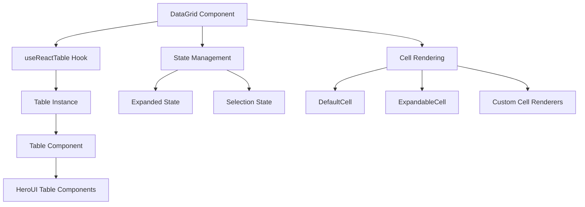
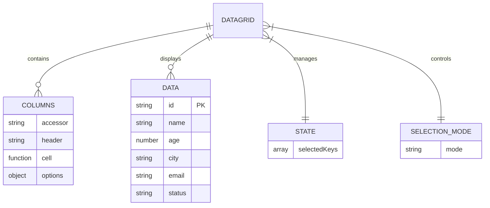
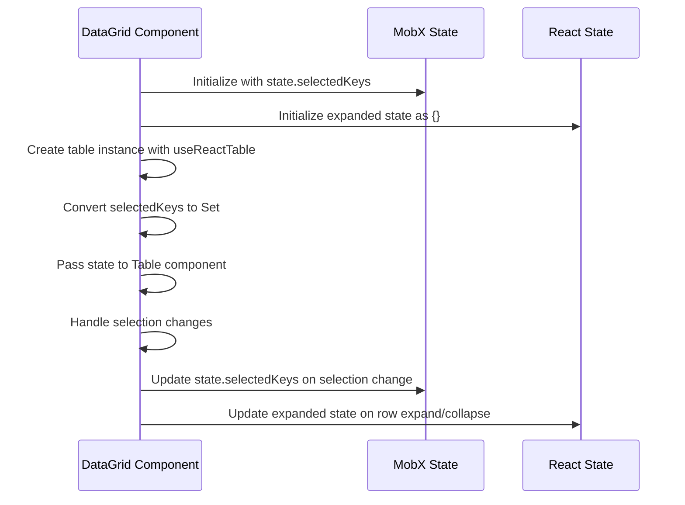
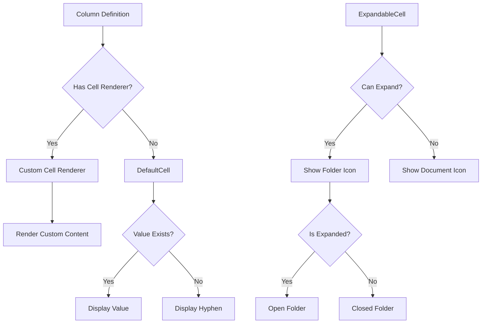

# DataGrid

<cite>
**Referenced Files in This Document**   
- [DataGrid.tsx](file://packages/ui/src/components/ui/data-display/DataGrid/DataGrid.tsx)
- [DataGrid.stories.tsx](file://packages/ui/src/components/ui/data-display/DataGrid/DataGrid.stories.tsx)
- [index.tsx](file://packages/ui/src/components/ui/data-display/DataGrid/index.tsx)
- [Table.tsx](file://packages/ui/src/components/ui/data-display/Table/Table.tsx)
- [DefaultCell.tsx](file://packages/ui/src/components/ui/data-display/cells/DefaultCell/DefaultCell.tsx)
- [ExpandableCell.tsx](file://packages/ui/src/components/ui/data-display/cells/ExpandableCell/ExpandableCell.tsx)
</cite>

## Table of Contents
1. [Introduction](#introduction)
2. [Core Implementation](#core-implementation)
3. [Props and Configuration](#props-and-configuration)
4. [State Management](#state-management)
5. [Cell Rendering](#cell-rendering)
6. [Storybook Examples](#storybook-examples)
7. [Integration with React Query and Global State](#integration-with-react-query-and-global-state)
8. [Performance Considerations](#performance-considerations)
9. [Accessibility and Responsive Design](#accessibility-and-responsive-design)
10. [Common Issues and Troubleshooting](#common-issues-and-troubleshooting)

## Introduction

The DataGrid component is a powerful data display component built on top of React Table and HeroUI, designed to present tabular data with support for selection, expansion, and various interactive features. It serves as a wrapper around the Table component, providing enhanced functionality for managing data presentation in a grid format. The component supports various selection modes, hierarchical data display through expandable rows, and customizable cell rendering.

**Section sources**
- [DataGrid.stories.tsx](file://packages/ui/src/components/ui/data-display/DataGrid/DataGrid.stories.tsx#L91-L99)

## Core Implementation

The DataGrid component is implemented as a wrapper around the Table component, leveraging React Table for core table functionality and HeroUI for UI components. The implementation consists of two main files: DataGrid.tsx which contains the core logic, and index.tsx which provides the observer wrapper for MobX integration.

The component uses React Table's useReactTable hook to create a table instance with core row model and expanded row model functionality. It manages expanded state internally using useState, and passes the table instance to the underlying Table component. The DataGrid supports hierarchical data through the getSubRows function which looks for a children property on each row.

**Diagram sources**
- [DataGrid.tsx](file://packages/ui/src/components/ui/data-display/DataGrid/DataGrid.tsx#L24-L57)
- [Table.tsx](file://packages/ui/src/components/ui/data-display/Table/Table.tsx#L18-L57)

**Section sources**
- [DataGrid.tsx](file://packages/ui/src/components/ui/data-display/DataGrid/DataGrid.tsx#L1-L57)
- [index.tsx](file://packages/ui/src/components/ui/data-display/DataGrid/index.tsx#L1-L48)

## Props and Configuration

The DataGrid component accepts several props for configuration, defined in the DataGridProps type. The primary props include:

- **data**: An array of objects with an id property that serves as the unique key for each row
- **columns**: An array of ColumnDef objects that define the table columns and their rendering behavior
- **state**: An object containing the selectedKeys array for managing row selection
- **selectionMode**: Controls the selection behavior with options for "none", "single", or "multiple" selection

The component also inherits additional props from TableProps through the Omit utility type, excluding the tableInstance prop which is managed internally.

**Diagram sources**
- [DataGrid.tsx](file://packages/ui/src/components/ui/data-display/DataGrid/DataGrid.tsx#L18-L22)
- [DataGrid.stories.tsx](file://packages/ui/src/components/ui/data-display/DataGrid/DataGrid.stories.tsx#L60-L89)

**Section sources**
- [DataGrid.tsx](file://packages/ui/src/components/ui/data-display/DataGrid/DataGrid.tsx#L18-L22)

## State Management

The DataGrid component implements state management through a combination of internal React state and external state passed via props. The component uses MobX for state management, with the index.tsx file providing an observer wrapper that manages selection state.

The state object passed to the DataGrid contains a selectedKeys property which is an array of keys representing the currently selected rows. The component converts this array to a Set for internal use with HeroUI's selection system. When selection changes, the onSelectionChange callback updates both the local observable state and the external state object.

The component also manages expanded state internally using React's useState hook, allowing for row expansion and collapse in hierarchical data structures.

**Diagram sources**
- [index.tsx](file://packages/ui/src/components/ui/data-display/DataGrid/index.tsx#L6-L46)
- [DataGrid.tsx](file://packages/ui/src/components/ui/data-display/DataGrid/DataGrid.tsx#L27-L31)

**Section sources**
- [index.tsx](file://packages/ui/src/components/ui/data-display/DataGrid/index.tsx#L6-L46)
- [DataGrid.tsx](file://packages/ui/src/components/ui/data-display/DataGrid/DataGrid.tsx#L27-L31)

## Cell Rendering

The DataGrid component supports various cell rendering options through the cells directory. The component uses React Table's cell rendering system, allowing for custom cell renderers to be defined in the column definitions.

The default cell rendering is handled by the DefaultCell component, which displays a hyphen (-) for null, undefined, or empty values, and converts other values to strings. For hierarchical data, the ExpandableCell component provides visual indicators for expandable rows with folder icons and connection lines.

Custom cell renderers can be defined in the column definitions using the cell property, as demonstrated in the DataGrid.stories.tsx file with the status column that renders active/inactive status with appropriate colors.

**Diagram sources**
- [DefaultCell.tsx](file://packages/ui/src/components/ui/data-display/cells/DefaultCell/DefaultCell.tsx#L1-L11)
- [ExpandableCell.tsx](file://packages/ui/src/components/ui/data-display/cells/ExpandableCell/ExpandableCell.tsx#L45-L120)
- [DataGrid.stories.tsx](file://packages/ui/src/components/ui/data-display/DataGrid/DataGrid.stories.tsx#L78-L87)

**Section sources**
- [DefaultCell.tsx](file://packages/ui/src/components/ui/data-display/cells/DefaultCell/DefaultCell.tsx#L1-L11)
- [ExpandableCell.tsx](file://packages/ui/src/components/ui/data-display/cells/ExpandableCell/ExpandableCell.tsx#L45-L120)

## Storybook Examples

The DataGrid component includes several Storybook examples that demonstrate different configurations and states. These examples are defined in the DataGrid.stories.tsx file and include:

- **Basic**: A simple DataGrid with sample data and no selection
- **Single Selection**: A DataGrid with single row selection enabled
- **Multiple Selection**: A DataGrid with multiple row selection enabled
- **Empty Data**: A DataGrid with no data to demonstrate the empty content state
- **Custom Empty Content**: A DataGrid with custom empty content message
- **Playground**: An interactive example for testing various DataGrid configurations

The stories use a DataGridWrapper component that creates a MobX observable state for managing selection, allowing the examples to demonstrate the component's behavior with different selection modes.

**Section sources**
- [DataGrid.stories.tsx](file://packages/ui/src/components/ui/data-display/DataGrid/DataGrid.stories.tsx#L144-L247)

## Integration with React Query and Global State

While the current implementation does not directly integrate with React Query, the DataGrid component is designed to work seamlessly with data fetching libraries and global state management. The component accepts data as a prop, making it easy to connect with React Query's useQuery hook or similar data fetching mechanisms.

For global state management, the component uses MobX through the observer pattern in the index.tsx file. The state object passed to the DataGrid can be connected to global state stores, allowing user preferences such as selected rows to be persisted across sessions.

To integrate with React Query, the data prop would be populated from the query result, and pagination, sorting, and filtering could be managed through query parameters that trigger refetching of data.

**Section sources**
- [index.tsx](file://packages/ui/src/components/ui/data-display/DataGrid/index.tsx#L1-L48)
- [DataGrid.stories.tsx](file://packages/ui/src/components/ui/data-display/DataGrid/DataGrid.stories.tsx#L126-L142)

## Performance Considerations

The DataGrid component leverages React Table's performance optimizations, including virtualized rendering for large datasets. However, the current implementation does not explicitly mention virtualization, so performance with very large datasets may depend on the underlying HeroUI Table component.

The component uses memoization through the MobX observer pattern, which helps prevent unnecessary re-renders when the component's props or state haven't changed. The use of React's useState for expanded state and MobX for selection state provides efficient state management.

For optimal performance with large datasets, consider implementing pagination or virtualized scrolling, and ensure that cell renderers are optimized to avoid expensive computations during rendering.

**Section sources**
- [DataGrid.tsx](file://packages/ui/src/components/ui/data-display/DataGrid/DataGrid.tsx#L27-L31)
- [index.tsx](file://packages/ui/src/components/ui/data-display/DataGrid/index.tsx#L6-L46)

## Accessibility and Responsive Design

The DataGrid component inherits accessibility features from the HeroUI Table component, including keyboard navigation support. The component supports selection through mouse and keyboard interactions, with visual indicators for selected rows.

For responsive design, the component relies on the underlying HeroUI components to handle different screen sizes. On mobile devices, the table may require horizontal scrolling for datasets with many columns, or could be adapted to a card-based layout for better mobile usability.

The ExpandableCell component includes visual indicators for expandable rows, with folder icons that clearly communicate the hierarchical structure of the data.

**Section sources**
- [DataGrid.tsx](file://packages/ui/src/components/ui/data-display/DataGrid/DataGrid.tsx#L49-L56)
- [ExpandableCell.tsx](file://packages/ui/src/components/ui/data-display/cells/ExpandableCell/ExpandableCell.tsx#L93-L115)

## Common Issues and Troubleshooting

Common issues with the DataGrid component include:

- **Selection not working**: Ensure that the state object is properly initialized and that the selectedKeys array is being updated correctly
- **Hierarchical data not displaying**: Verify that child rows are stored in a children property on parent rows
- **Custom cell renderers not working**: Check that the column definition correctly specifies the cell renderer function
- **Performance issues with large datasets**: Consider implementing pagination or virtualization, or optimizing cell renderers

When troubleshooting, verify that the data prop contains valid data with unique id properties, and that the columns prop is correctly configured with appropriate accessor functions and header definitions.

**Section sources**
- [DataGrid.tsx](file://packages/ui/src/components/ui/data-display/DataGrid/DataGrid.tsx#L24-L57)
- [DataGrid.stories.tsx](file://packages/ui/src/components/ui/data-display/DataGrid/DataGrid.stories.tsx#L144-L247)