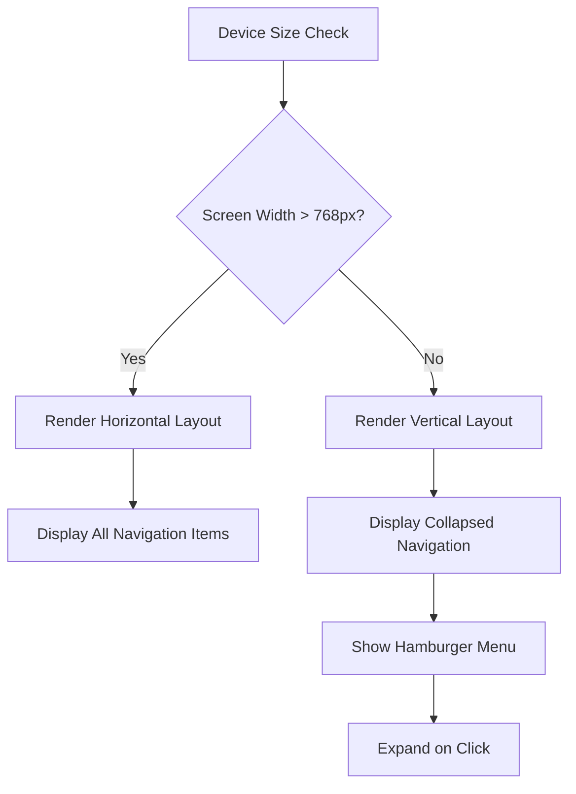
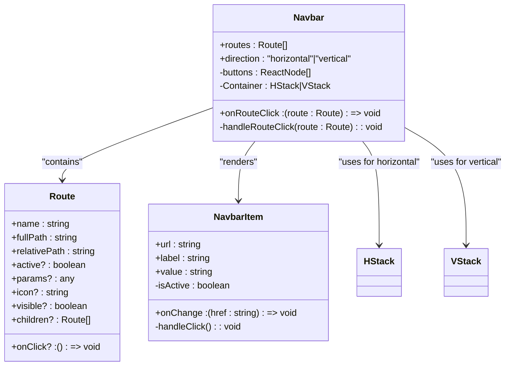
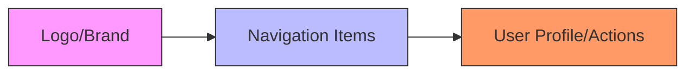
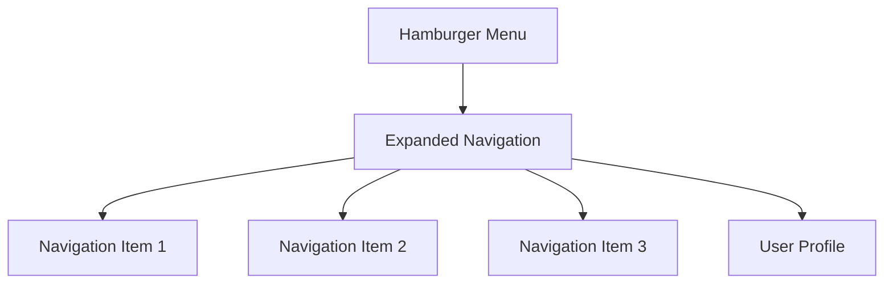
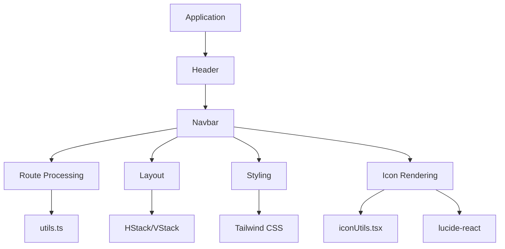

# Navbar

<cite>
**Referenced Files in This Document**   
- [Navbar.tsx](file://packages/ui/src/components/ui/layouts/Navbar/Navbar.tsx)
- [types.ts](file://packages/ui/src/components/ui/layouts/Navbar/types.ts)
- [utils.ts](file://packages/ui/src/components/ui/layouts/Navbar/utils.ts)
- [NavbarItem.tsx](file://packages/ui/src/components/ui/layouts/NavbarItem/NavbarItem.tsx)
- [HStack.tsx](file://packages/ui/src/components/ui/surfaces/HStack/HStack.tsx)
- [VStack.tsx](file://packages/ui/src/components/ui/surfaces/VStack/VStack.tsx)
- [Header.tsx](file://packages/ui/src/components/ui/layouts/Header/Header.tsx)
- [iconUtils.tsx](file://packages/ui/src/utils/iconUtils.tsx)
</cite>

## Table of Contents
1. [Introduction](#introduction)
2. [Core Components](#core-components)
3. [Props and Configuration](#props-and-configuration)
4. [Responsive Behavior](#responsive-behavior)
5. [Accessibility Features](#accessibility-features)
6. [Theming with Tailwind CSS](#theming-with-tailwind-css)
7. [Integration with Global User Context](#integration-with-global-user-context)
8. [Usage Examples](#usage-examples)
9. [Common Issues and Solutions](#common-issues-and-solutions)
10. [Architecture Overview](#architecture-overview)

## Introduction
The Navbar component in the shared-frontend library provides a flexible navigation interface for web applications. It supports both horizontal and vertical layouts, dynamic routing, and responsive design patterns. The component integrates with the application's routing system and user authentication state to display context-aware navigation items.

**Section sources**
- [Navbar.tsx](file://packages/ui/src/components/ui/layouts/Navbar/Navbar.tsx#L1-L51)
- [types.ts](file://packages/ui/src/components/ui/layouts/Navbar/types.ts#L1-L20)

## Core Components

The Navbar system consists of several interconnected components that work together to provide a complete navigation solution:

- **Navbar**: Main container component that renders navigation routes
- **NavbarItem**: Individual navigation item with click handling
- **Header**: Layout wrapper that positions the Navbar with branding and user controls
- **HStack/VStack**: Layout primitives for horizontal and vertical alignment

The Navbar component uses React's memoization to optimize rendering performance and leverages utility functions for route processing and display logic.

**Section sources**
- [Navbar.tsx](file://packages/ui/src/components/ui/layouts/Navbar/Navbar.tsx#L1-L51)
- [NavbarItem.tsx](file://packages/ui/src/components/ui/layouts/NavbarItem/NavbarItem.tsx#L1-L38)
- [HStack.tsx](file://packages/ui/src/components/ui/surfaces/HStack/HStack.tsx#L1-L83)
- [VStack.tsx](file://packages/ui/src/components/ui/surfaces/VStack/VStack.tsx#L1-L75)

## Props and Configuration

### Navbar Props
The Navbar component accepts the following props:

```typescript
interface NavbarProps {
  routes: Route[];
  direction?: "horizontal" | "vertical";
  onRouteClick?: (route: Route) => void;
}
```

- **routes**: Array of Route objects defining navigation items
- **direction**: Layout orientation (horizontal/vertical)
- **onRouteClick**: Callback function triggered when a route is clicked

### Route Interface
```typescript
interface Route {
  name: string;
  fullPath: string;
  relativePath: string;
  active?: boolean;
  params?: any;
  icon?: string;
  visible?: boolean;
  onClick?: () => void;
  children?: Route[];
}
```

The Route interface supports nested navigation structures through the children property, enabling dropdown menus and hierarchical navigation.

**Section sources**
- [types.ts](file://packages/ui/src/components/ui/layouts/Navbar/types.ts#L1-L20)
- [Navbar.tsx](file://packages/ui/src/components/ui/layouts/Navbar/Navbar.tsx#L5-L8)

## Responsive Behavior

The Navbar component adapts to different screen sizes through its direction prop and responsive container classes. When used within the Header component, it automatically adjusts its layout for mobile and desktop views.

The component uses flexbox-based layouts (HStack for horizontal, VStack for vertical) with configurable gap spacing and alignment properties. The responsive behavior is enhanced by the backdrop-blur and background/70 classes in the Header implementation, providing a modern glass-morphism effect on larger screens.



**Diagram sources**
- [Navbar.tsx](file://packages/ui/src/components/ui/layouts/Navbar/Navbar.tsx#L40-L46)
- [Header.tsx](file://packages/ui/src/components/ui/layouts/Header/Header.tsx#L14-L32)

## Accessibility Features

The Navbar implementation includes several accessibility features:

- **Keyboard Navigation**: Button components are focusable and operable via keyboard
- **Semantic HTML**: Uses appropriate ARIA roles and landmarks
- **Focus Management**: Visual focus indicators for keyboard users
- **Screen Reader Support**: Proper labeling and announcement of navigation items

Each NavbarItem is implemented as a Button with proper onPress handling, ensuring it's accessible to assistive technologies. The active state is visually indicated through color changes (primary color when active), providing clear visual feedback.

**Section sources**
- [Navbar.tsx](file://packages/ui/src/components/ui/layouts/Navbar/Navbar.tsx#L23-L35)
- [NavbarItem.tsx](file://packages/ui/src/components/ui/layouts/NavbarItem/NavbarItem.tsx#L27-L36)

## Theming with Tailwind CSS

The Navbar component leverages Tailwind CSS for styling and theming. Key styling features include:

- **Color Variants**: Uses the application's color palette (primary, default, foreground)
- **Responsive Classes**: Utilizes Tailwind's responsive prefixes
- **Flexbox Layout**: Implements modern layout techniques
- **Glass Morphism**: Applies backdrop blur and transparency effects

The component integrates with the application's design system through the @heroui/react library components, ensuring consistent styling across the application. Customization is achieved through className prop inheritance and Tailwind's utility-first approach.



**Diagram sources**
- [Navbar.tsx](file://packages/ui/src/components/ui/layouts/Navbar/Navbar.tsx#L1-L51)
- [types.ts](file://packages/ui/src/components/ui/layouts/Navbar/types.ts#L1-L20)
- [HStack.tsx](file://packages/ui/src/components/ui/surfaces/HStack/HStack.tsx#L1-L83)
- [VStack.tsx](file://packages/ui/src/components/ui/surfaces/VStack/VStack.tsx#L1-L75)

## Integration with Global User Context

The Navbar component integrates with the application's global state through several mechanisms:

- **Authentication State**: Routes can be conditionally rendered based on user authentication
- **User Profile**: User context can influence displayed navigation items
- **Dynamic Content**: Navigation structure can change based on user roles and permissions

While the core Navbar component doesn't directly access user context, it's designed to work with higher-level components like Header that can inject user-specific navigation items and handle authentication-dependent routing.

**Section sources**
- [Header.tsx](file://packages/ui/src/components/ui/layouts/Header/Header.tsx#L1-L37)
- [Navbar.tsx](file://packages/ui/src/components/ui/layouts/Navbar/Navbar.tsx#L1-L51)

## Usage Examples

### Desktop Layout


The desktop layout displays all navigation elements horizontally, with branding on the left, main navigation in the center, and user controls on the right.

### Mobile Layout


The mobile layout collapses navigation into a hamburger menu that expands when clicked, conserving screen space on smaller devices.

**Section sources**
- [Header.tsx](file://packages/ui/src/components/ui/layouts/Header/Header.tsx#L14-L32)
- [Navbar.tsx](file://packages/ui/src/components/ui/layouts/Navbar/Navbar.tsx#L40-L46)

## Common Issues and Solutions

### Responsive Layout Breaking
Issue: Navigation items overflow on small screens
Solution: Implement proper breakpoints and consider using a mobile-first approach with collapsible menus.

### Accessibility Compliance
Issue: Screen readers may not properly announce navigation items
Solution: Ensure all interactive elements have proper ARIA labels and roles, and test with multiple screen readers.

### Performance Optimization
For complex navigation structures:
- Use React.memo to prevent unnecessary re-renders
- Implement virtualization for very large navigation sets
- Optimize route processing with useMemo

The current implementation already uses memoization and useMemo for performance optimization, reducing unnecessary re-renders when routes or props haven't changed.

**Section sources**
- [Navbar.tsx](file://packages/ui/src/components/ui/layouts/Navbar/Navbar.tsx#L9-L48)
- [utils.ts](file://packages/ui/src/components/ui/layouts/Navbar/utils.ts#L1-L14)

## Architecture Overview

The Navbar component follows a modular architecture that separates concerns between layout, routing, and presentation:



This architecture enables reusability and maintainability by separating the navigation logic from its visual representation. The component composition pattern allows for flexible integration with different application layouts while maintaining consistent behavior.

**Diagram sources**
- [Navbar.tsx](file://packages/ui/src/components/ui/layouts/Navbar/Navbar.tsx#L1-L51)
- [Header.tsx](file://packages/ui/src/components/ui/layouts/Header/Header.tsx#L1-L37)
- [utils.ts](file://packages/ui/src/components/ui/layouts/Navbar/utils.ts#L1-L14)
- [iconUtils.tsx](file://packages/ui/src/utils/iconUtils.tsx#L1-L49)