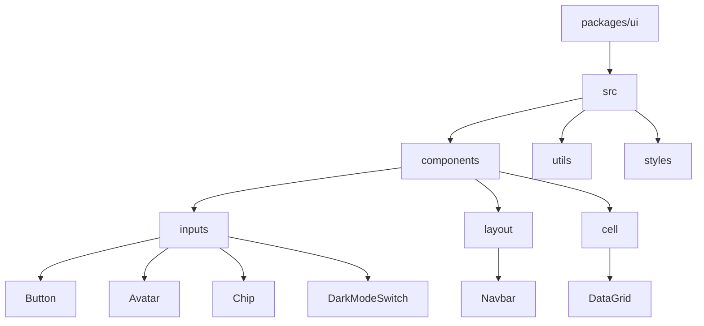
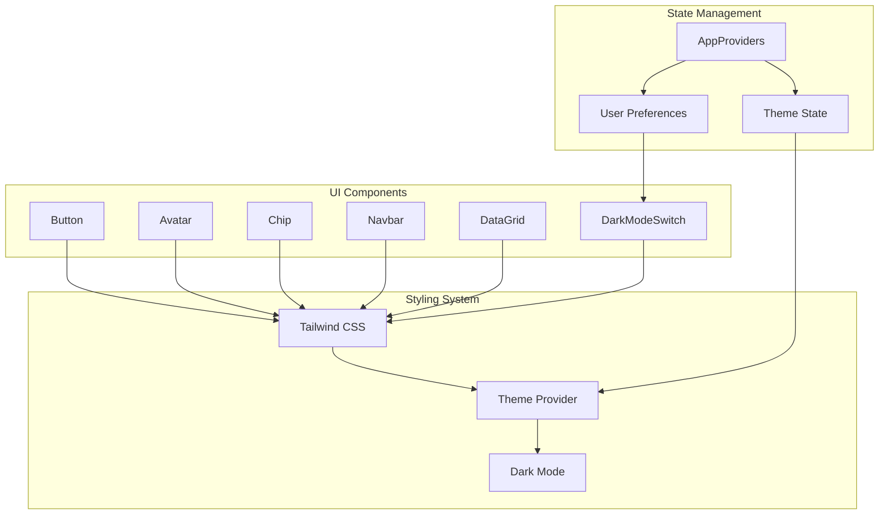
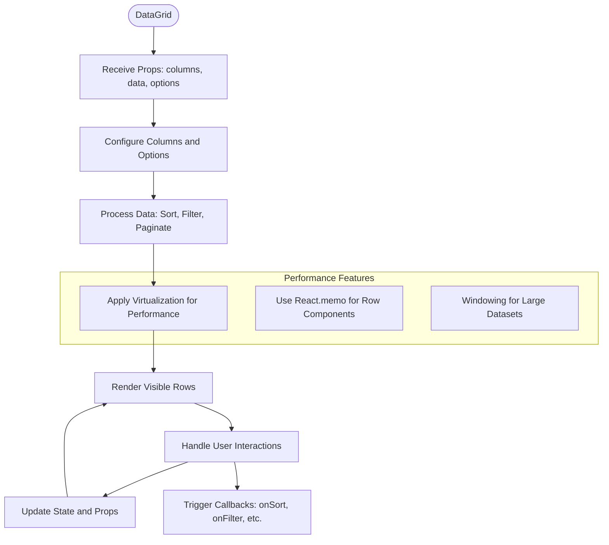
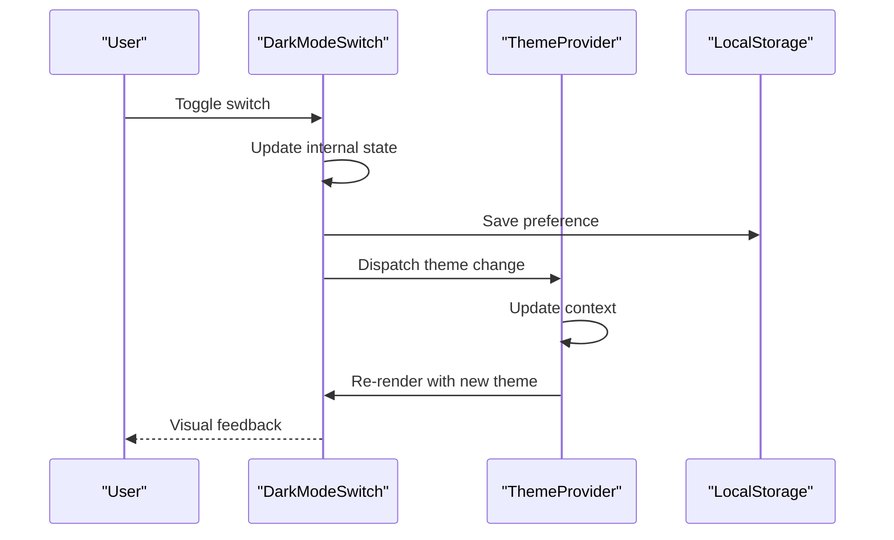
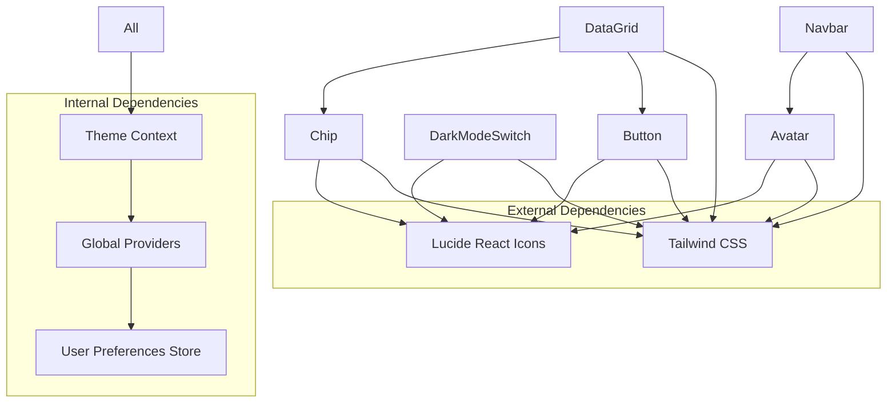

# UI Components

<cite>
**Referenced Files in This Document**   
- [Button.tsx](file://packages/ui/src/components/inputs/Button/Button.tsx)
- [Avatar.tsx](file://packages/ui/src/components/inputs/Avatar/Avatar.tsx)
- [Chip.tsx](file://packages/ui/src/components/inputs/Chip/Chip.tsx)
- [Navbar.tsx](file://packages/ui/src/components/layout/Navbar/Navbar.tsx)
- [DataGrid.tsx](file://packages/ui/src/components/cell/DataGrid/DataGrid.tsx)
- [DarkModeSwitch.tsx](file://packages/ui/src/components/inputs/DarkModeSwitch/DarkModeSwitch.tsx)
- [AppProviders.tsx](file://packages/providers/src/Providers.tsx)
- [tailwind.config.js](file://packages/ui/tailwind.config.js)
- [UIProviders.tsx](file://packages/ui/src/components/provider/UIProviders.tsx)
</cite>

## Table of Contents
1. [Introduction](#introduction)
2. [Project Structure](#project-structure)
3. [Core Components](#core-components)
4. [Architecture Overview](#architecture-overview)
5. [Detailed Component Analysis](#detailed-component-analysis)
6. [Dependency Analysis](#dependency-analysis)
7. [Performance Considerations](#performance-considerations)
8. [Troubleshooting Guide](#troubleshooting-guide)
9. [Conclusion](#conclusion)

## Introduction
This document provides comprehensive documentation for the UI components in the @cocrepo/ui library. The components are designed to create consistent, accessible, and responsive user interfaces across applications. The library leverages Tailwind CSS for styling, implements a robust theming system, and integrates with global state management through AppProviders. This documentation covers implementation details, design system integration, usage patterns, and best practices for core UI elements including Button, Avatar, Chip, Navbar, DataGrid, and DarkModeSwitch.

## Project Structure
The UI components are organized in a modular structure within the packages/ui directory. Components are categorized by type (inputs, layout, cell, etc.) with each component having its own directory containing the implementation file, stories for documentation, and index file for exports.



**Diagram sources**
- [package.json](file://packages/ui/package.json#L1-L100)

**Section sources**
- [package.json](file://packages/ui/package.json#L1-L100)

## Core Components
The @cocrepo/ui library provides a comprehensive set of reusable UI components designed for consistency and ease of use. These components follow a unified design system with consistent spacing, typography, and color schemes. Each component is built with accessibility in mind, supporting keyboard navigation, screen readers, and proper ARIA attributes. The components are responsive by default, adapting to different screen sizes and devices. They are also highly customizable through props, allowing developers to modify appearance and behavior to meet specific requirements.

**Section sources**
- [Button.tsx](file://packages/ui/src/components/inputs/Button/Button.tsx)
- [Avatar.tsx](file://packages/ui/src/components/inputs/Avatar/Avatar.tsx)
- [Chip.tsx](file://packages/ui/src/components/inputs/Chip/Chip.tsx)
- [Navbar.tsx](file://packages/ui/src/components/layout/Navbar/Navbar.tsx)
- [DataGrid.tsx](file://packages/ui/src/components/cell/DataGrid/DataGrid.tsx)
- [DarkModeSwitch.tsx](file://packages/ui/src/components/inputs/DarkModeSwitch/DarkModeSwitch.tsx)

## Architecture Overview
The UI component library follows a modular architecture with clear separation of concerns. Components are organized by functionality and type, with shared utilities and styling applied consistently across the library. The theming system is built on Tailwind CSS with custom configurations that define the design tokens for the entire system.



**Diagram sources**
- [tailwind.config.js](file://packages/ui/tailwind.config.js#L1-L50)
- [AppProviders.tsx](file://packages/providers/src/Providers.tsx#L1-L30)
- [UIProviders.tsx](file://packages/ui/src/components/provider/UIProviders.tsx#L1-L25)

## Detailed Component Analysis

### Button Component Analysis
The Button component is a versatile UI element that supports multiple variants, sizes, and states. It is designed to be accessible and responsive, with proper focus management and touch targets.

```mermaid
classDiagram
class Button {
+variant : 'primary' | 'secondary' | 'outline' | 'ghost'
+size : 'sm' | 'md' | 'lg'
+disabled : boolean
+loading : boolean
+fullWidth : boolean
+leftIcon : ReactNode
+rightIcon : ReactNode
+onClick : () => void
+children : ReactNode
+className : string
}
Button --> "1" "0..1" Icon : contains
Button --> "1" "0..1" Spinner : shows when loading
```

**Diagram sources**
- [Button.tsx](file://packages/ui/src/components/inputs/Button/Button.tsx#L1-L100)

**Section sources**
- [Button.tsx](file://packages/ui/src/components/inputs/Button/Button.tsx#L1-L150)

### Avatar Component Analysis
The Avatar component displays user profile images with fallback text or icons when images are not available. It supports different sizes and shapes, and can display status indicators.

```mermaid
classDiagram
class Avatar {
+src : string
+alt : string
+size : 'sm' | 'md' | 'lg' | 'xl'
+shape : 'circle' | 'square'
+status : 'online' | 'offline' | 'away'
+fallback : string
+onClick : () => void
}
Avatar --> "1" "0..1" Image : displays
Avatar --> "1" "0..1" FallbackText : shows when no image
Avatar --> "1" "0..1" StatusIndicator : shows status
```

**Diagram sources**
- [Avatar.tsx](file://packages/ui/src/components/inputs/Avatar/Avatar.tsx#L1-L80)

**Section sources**
- [Avatar.tsx](file://packages/ui/src/components/inputs/Avatar/Avatar.tsx#L1-L120)

### Chip Component Analysis
The Chip component is used for displaying small pieces of information, tags, or filters. It supports close buttons, icons, and different visual styles.

```mermaid
classDiagram
class Chip {
+label : string
+variant : 'default' | 'primary' | 'secondary'
+size : 'sm' | 'md'
+closable : boolean
+onClose : () => void
+icon : ReactNode
+onClick : () => void
+selected : boolean
}
Chip --> "1" "0..1" Icon : contains
Chip --> "1" "0..1" CloseButton : shows when closable
```

**Diagram sources**
- [Chip.tsx](file://packages/ui/src/components/inputs/Chip/Chip.tsx#L1-L70)

**Section sources**
- [Chip.tsx](file://packages/ui/src/components/inputs/Chip/Chip.tsx#L1-L100)

### Navbar Component Analysis
The Navbar component provides a responsive navigation bar that adapts to different screen sizes. It supports branding, navigation links, user profile, and mobile menu toggle.

```mermaid
classDiagram
class Navbar {
+logo : ReactNode
+links : Array<{label : string, href : string}>
+user : User
+showMobileMenu : boolean
+onToggleMobileMenu : () => void
+rightElements : ReactNode
}
Navbar --> "1" "1..*" NavLink : contains
Navbar --> "1" "0..1" UserProfile : contains
Navbar --> "1" "0..1" MobileMenu : shows when needed
UserProfile --> "1" "1" Avatar : contains
```

**Diagram sources**
- [Navbar.tsx](file://packages/ui/src/components/layout/Navbar/Navbar.tsx#L1-L120)

**Section sources**
- [Navbar.tsx](file://packages/ui/src/components/layout/Navbar/Navbar.tsx#L1-L150)

### DataGrid Component Analysis
The DataGrid component is designed for displaying tabular data with advanced features like sorting, filtering, pagination, and virtualization for performance.



**Diagram sources**
- [DataGrid.tsx](file://packages/ui/src/components/cell/DataGrid/DataGrid.tsx#L1-L200)

**Section sources**
- [DataGrid.tsx](file://packages/ui/src/components/cell/DataGrid/DataGrid.tsx#L1-L250)

### DarkModeSwitch Component Analysis
The DarkModeSwitch component allows users to toggle between light and dark themes. It integrates with the global theme state and persists user preferences.



**Diagram sources**
- [DarkModeSwitch.tsx](file://packages/ui/src/components/inputs/DarkModeSwitch/DarkModeSwitch.tsx#L1-L60)
- [AppProviders.tsx](file://packages/providers/src/Providers.tsx#L15-L40)

**Section sources**
- [DarkModeSwitch.tsx](file://packages/ui/src/components/inputs/DarkModeSwitch/DarkModeSwitch.tsx#L1-L100)
- [AppProviders.tsx](file://packages/providers/src/Providers.tsx#L1-L50)

## Dependency Analysis
The UI components have a well-defined dependency structure, with components depending on shared utilities and styling rather than directly on each other. This promotes reusability and reduces coupling.



**Diagram sources**
- [package.json](file://packages/ui/package.json#L40-L100)
- [AppProviders.tsx](file://packages/providers/src/Providers.tsx#L1-L30)

**Section sources**
- [package.json](file://packages/ui/package.json#L1-L100)
- [AppProviders.tsx](file://packages/providers/src/Providers.tsx#L1-L50)

## Performance Considerations
The UI components are optimized for performance, especially the DataGrid component which handles large datasets efficiently through virtualization and memoization. The library uses React's optimization techniques like memo, useCallback, and useMemo to prevent unnecessary re-renders. The theming system is designed to minimize style recalculations by using CSS variables that can be updated without re-rendering components.

**Section sources**
- [DataGrid.tsx](file://packages/ui/src/components/cell/DataGrid/DataGrid.tsx#L50-L200)
- [Button.tsx](file://packages/ui/src/components/inputs/Button/Button.tsx#L30-L60)

## Troubleshooting Guide
Common issues with the UI components include accessibility compliance, cross-browser compatibility, and performance issues with data-intensive components. For accessibility, ensure all interactive elements have proper ARIA attributes and keyboard navigation support. For cross-browser compatibility, test components across different browsers and use polyfills when necessary. For DataGrid performance issues, ensure virtualization is enabled and consider implementing server-side pagination for very large datasets.

**Section sources**
- [Button.tsx](file://packages/ui/src/components/inputs/Button/Button.tsx#L100-L150)
- [DataGrid.tsx](file://packages/ui/src/components/cell/DataGrid/DataGrid.tsx#L150-L250)

## Conclusion
The @cocrepo/ui library provides a comprehensive set of well-designed, accessible, and performant UI components. The components follow a consistent design system powered by Tailwind CSS and integrate seamlessly with global state management through AppProviders. The modular architecture promotes reusability and maintainability, while the focus on accessibility and responsiveness ensures a good user experience across devices and user needs. By following the documented usage patterns and best practices, developers can create consistent and high-quality user interfaces efficiently.