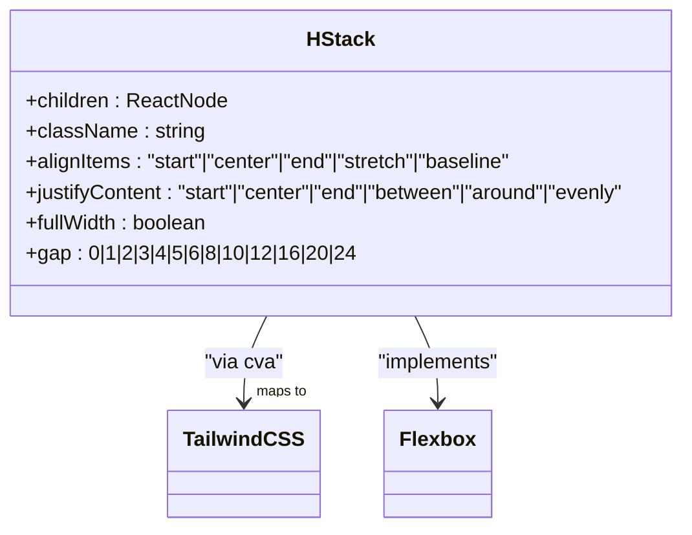
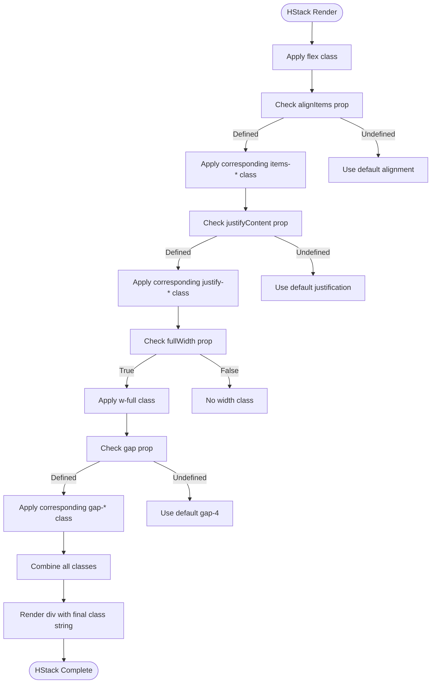
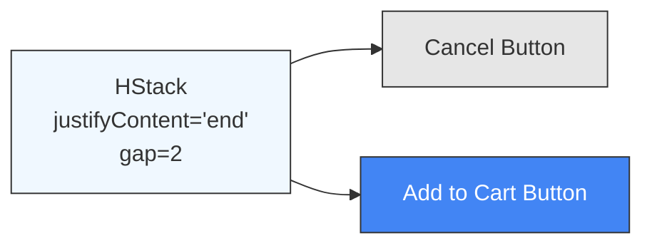
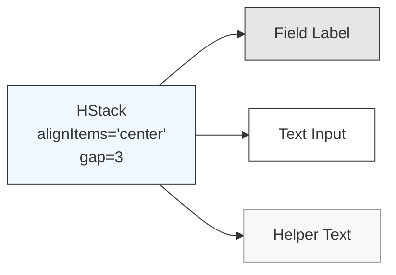
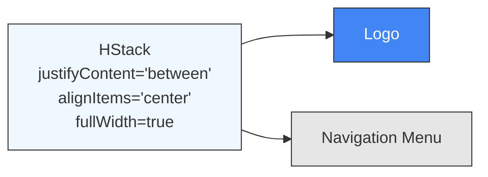
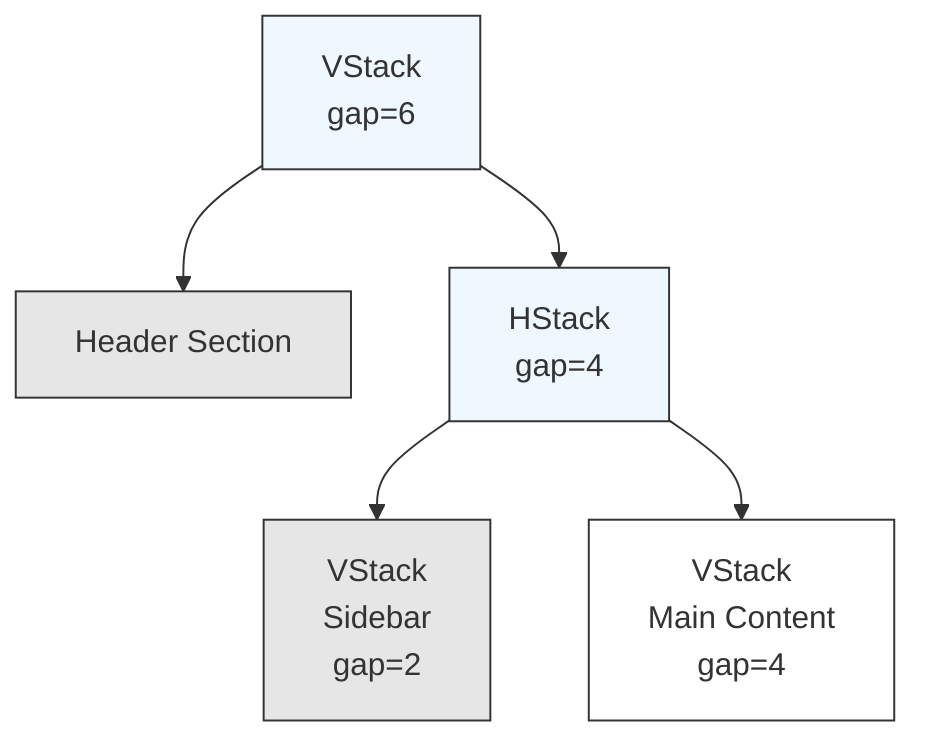
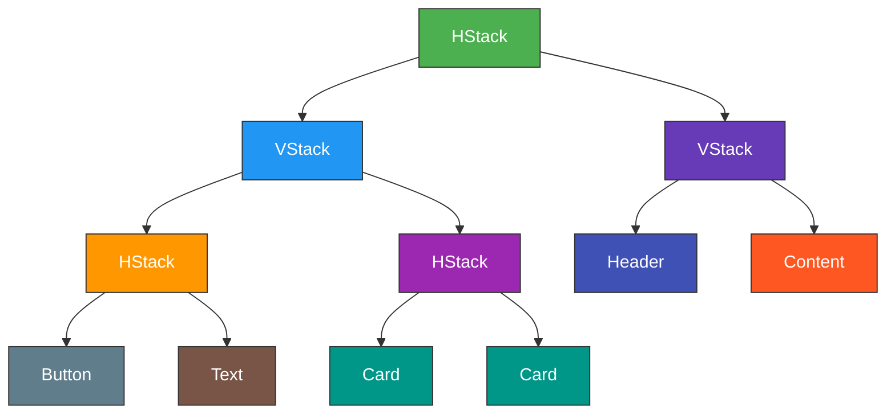

# HStack Component

<cite>
**Referenced Files in This Document**   
- [HStack.tsx](file://packages/ui/src/components/ui/surfaces/HStack/HStack.tsx)
- [HStack.stories.tsx](file://packages/ui/src/components/ui/surfaces/HStack/HStack.stories.tsx)
- [VStack.tsx](file://packages/ui/src/components/ui/surfaces/VStack/VStack.tsx)
- [DashboardLayout.stories.tsx](file://packages/ui/src/components/ui/layouts/Dashboard/DashboardLayout.stories.tsx)
- [FeeTable.tsx](file://packages/ui/src/components/ui/data-display/FeeTable/FeeTable.tsx)
- [WeekInput.tsx](file://packages/ui/src/components/ui/inputs/WeekInput/WeekInput.tsx)
</cite>

## Table of Contents
1. [Introduction](#introduction)
2. [Core Implementation](#core-implementation)
3. [Props and Configuration](#props-and-configuration)
4. [Usage Examples](#usage-examples)
5. [Integration with Other Layout Components](#integration-with-other-layout-components)
6. [Responsive Behavior and Common Issues](#responsive-behavior-and-common-issues)
7. [Best Practices](#best-practices)

## Introduction

The HStack component is a horizontal layout utility in the shared-frontend library that enables consistent and flexible arrangement of child elements in a row. Built on CSS Flexbox principles, HStack provides a declarative API for controlling alignment, spacing, and distribution of elements across the horizontal axis. It serves as a foundational building block for creating responsive UIs in applications that use the shared-frontend component library.

As part of a comprehensive layout system, HStack works in conjunction with VStack (vertical stack) and other layout components to enable developers to construct complex, responsive interfaces with minimal custom CSS. The component abstracts low-level flexbox properties into intuitive props, promoting consistency and reducing layout-related bugs.

**Section sources**
- [HStack.tsx](file://packages/ui/src/components/ui/surfaces/HStack/HStack.tsx#L3-L10)
- [HStack.stories.tsx](file://packages/ui/src/components/ui/surfaces/HStack/HStack.stories.tsx#L1-L15)

## Core Implementation

The HStack component is implemented using React and leverages the `class-variance-authority` (cva) library to manage conditional class names based on component props. At its core, HStack renders a `div` element with the `flex` class applied, establishing a flex container with a horizontal (row) direction by default.

The component uses a variant system to map high-level props to specific Tailwind CSS classes. This approach provides type safety and ensures consistent styling across the application. The implementation supports key flexbox properties including `align-items` (via the `alignItems` prop) and `justify-content` (via the `justifyContent` prop), translating them into their corresponding Tailwind utility classes.

**Diagram sources**
- [HStack.tsx](file://packages/ui/src/components/ui/surfaces/HStack/HStack.tsx#L3-L55)

**Section sources**
- [HStack.tsx](file://packages/ui/src/components/ui/surfaces/HStack/HStack.tsx#L12-L55)

## Props and Configuration

The HStack component exposes several props that control its layout behavior:

- **`alignItems`**: Controls vertical alignment of child elements. Accepts values: "start", "center", "end", "stretch", or "baseline", which map to `align-items` CSS property.
- **`justifyContent`**: Controls horizontal distribution of child elements. Accepts values: "start", "center", "end", "between", "around", or "evenly", which map to `justify-content` CSS property.
- **`gap`**: Defines spacing between child elements using predefined values (0, 1, 2, 3, 4, 5, 6, 8, 10, 12, 16, 20, 24) that correspond to pixel values.
- **`fullWidth`**: When true, applies `w-full` class to make the stack occupy the full width of its container.
- **`className`**: Allows additional CSS classes to be applied for custom styling.

The component has sensible defaults: `gap` defaults to 4 (16px spacing) and `fullWidth` defaults to false, ensuring consistent spacing across the application unless explicitly overridden.

**Diagram sources**
- [HStack.tsx](file://packages/ui/src/components/ui/surfaces/HStack/HStack.tsx#L14-L54)

**Section sources**
- [HStack.tsx](file://packages/ui/src/components/ui/surfaces/HStack/HStack.tsx#L3-L10)

## Usage Examples

### Button Groups
HStack is commonly used to create button groups with consistent spacing:

**Diagram sources**
- [HStack.stories.tsx](file://packages/ui/src/components/ui/surfaces/HStack/HStack.stories.tsx#L169-L187)

### Form Layouts
For form layouts, HStack can align labels and inputs horizontally:

**Diagram sources**
- [WeekInput.tsx](file://packages/ui/src/components/ui/inputs/WeekInput/WeekInput.tsx#L65-L79)

### Navigation Items
HStack is ideal for navigation layouts where items need to be distributed across the available space:

**Diagram sources**
- [DashboardLayout.stories.tsx](file://packages/ui/src/components/ui/layouts/Dashboard/DashboardLayout.stories.tsx#L25-L37)

### Complex UI Compositions
HStack can be nested with VStack to create complex grid-like layouts without using CSS grid:

**Diagram sources**
- [DashboardLayout.stories.tsx](file://packages/ui/src/components/ui/layouts/Dashboard/DashboardLayout.stories.tsx#L141-L165)

**Section sources**
- [HStack.stories.tsx](file://packages/ui/src/components/ui/surfaces/HStack/HStack.stories.tsx#L61-L212)
- [FeeTable.tsx](file://packages/ui/src/components/ui/data-display/FeeTable/FeeTable.tsx#L17-L44)
- [WeekInput.tsx](file://packages/ui/src/components/ui/inputs/WeekInput/WeekInput.tsx#L21-L82)

## Integration with Other Layout Components

HStack works seamlessly with VStack to create two-dimensional layouts. This combination allows developers to build complex responsive interfaces by nesting horizontal and vertical stacks.

The component system follows a consistent API pattern where both HStack and VStack share the same props (`alignItems`, `justifyContent`, `gap`, `fullWidth`), making it easy to switch between horizontal and vertical layouts without learning new APIs.

**Diagram sources**
- [DashboardLayout.stories.tsx](file://packages/ui/src/components/ui/layouts/Dashboard/DashboardLayout.stories.tsx#L22-L220)
- [FeeTable.tsx](file://packages/ui/src/components/ui/data-display/FeeTable/FeeTable.tsx#L17-L44)

**Section sources**
- [VStack.tsx](file://packages/ui/src/components/ui/surfaces/VStack/VStack.tsx#L3-L10)
- [DashboardLayout.stories.tsx](file://packages/ui/src/components/ui/layouts/Dashboard/DashboardLayout.stories.tsx#L22-L220)

## Responsive Behavior and Common Issues

### Text Overflow Handling
When child elements contain long text, overflow can be managed by applying appropriate CSS classes through the `className` prop. For example, adding `truncate` will clip overflowing text with an ellipsis.

### Wrapping Behavior
By default, HStack does not wrap child elements to the next line when space is limited. To enable wrapping, additional CSS classes must be applied via the `className` prop, such as `flex-wrap`.

### Alignment of Elements with Different Heights
The `alignItems` prop controls how elements of different heights are aligned vertically. Using "stretch" will make all children the same height as the tallest element, while "center" will vertically center them.

### Responsive Considerations
For mobile responsiveness, consider using conditional rendering or CSS media queries to switch from HStack to VStack on smaller screens when horizontal space is limited.

**Section sources**
- [HStack.tsx](file://packages/ui/src/components/ui/surfaces/HStack/HStack.tsx#L68-L82)
- [HStack.stories.tsx](file://packages/ui/src/components/ui/surfaces/HStack/HStack.stories.tsx#L80-L98)

## Best Practices

1. **Consistent Spacing**: Leverage the predefined `gap` values to maintain consistent spacing throughout the application.
2. **Nesting Stacks**: Combine HStack and VStack to create complex layouts without custom CSS.
3. **Accessibility**: Ensure that the visual order created by HStack matches the DOM order for screen reader users.
4. **Performance**: Avoid excessive nesting of HStack components, as each creates a new flex container.
5. **Responsive Design**: Plan for mobile layouts by considering how HStack content will appear on smaller screens.

The HStack component exemplifies the library's approach to layout: providing simple, composable primitives that can be combined to create sophisticated UIs while maintaining consistency and reducing CSS complexity.

**Section sources**
- [HStack.tsx](file://packages/ui/src/components/ui/surfaces/HStack/HStack.tsx#L57-L82)
- [HStack.stories.tsx](file://packages/ui/src/components/ui/surfaces/HStack/HStack.stories.tsx#L61-L212)