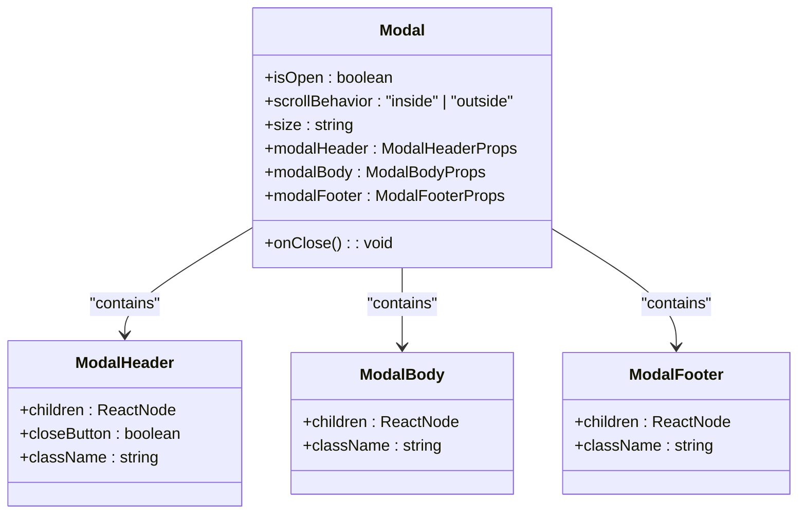
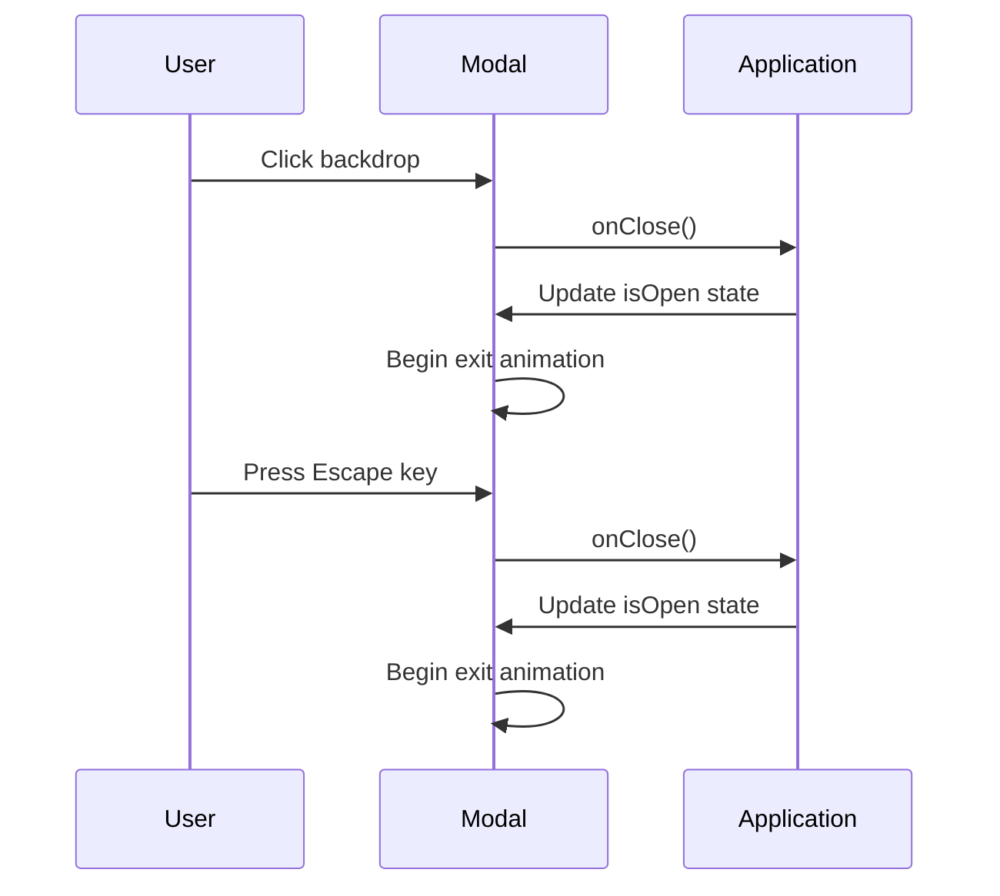
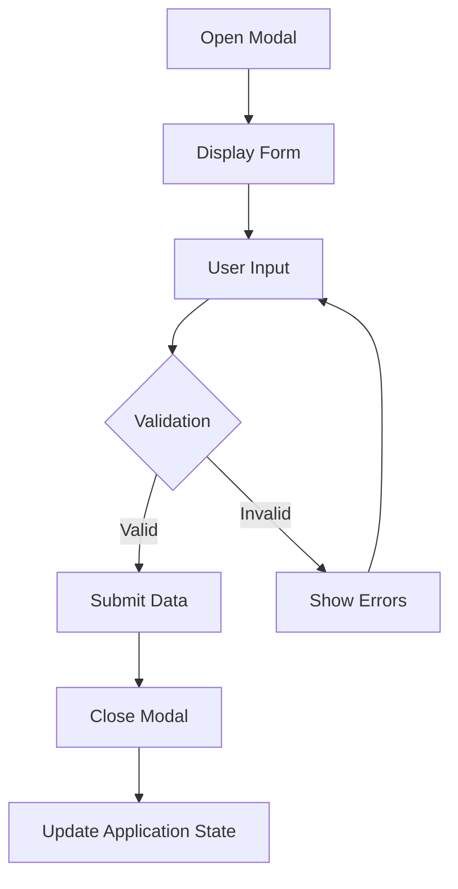
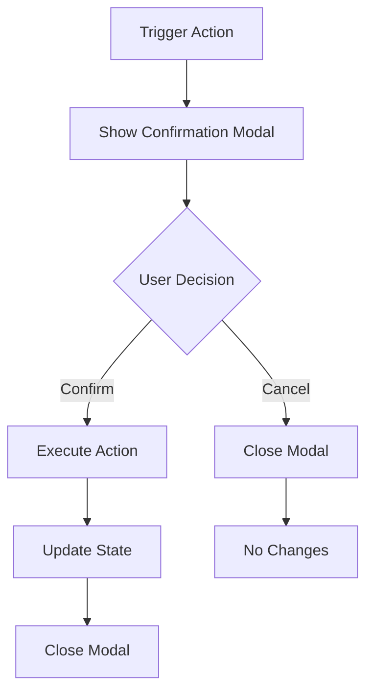
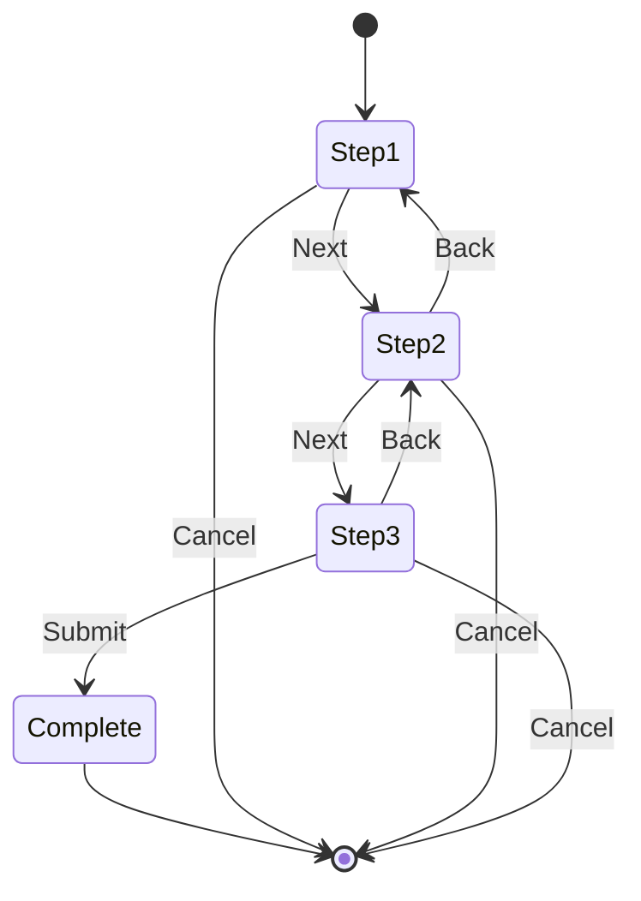
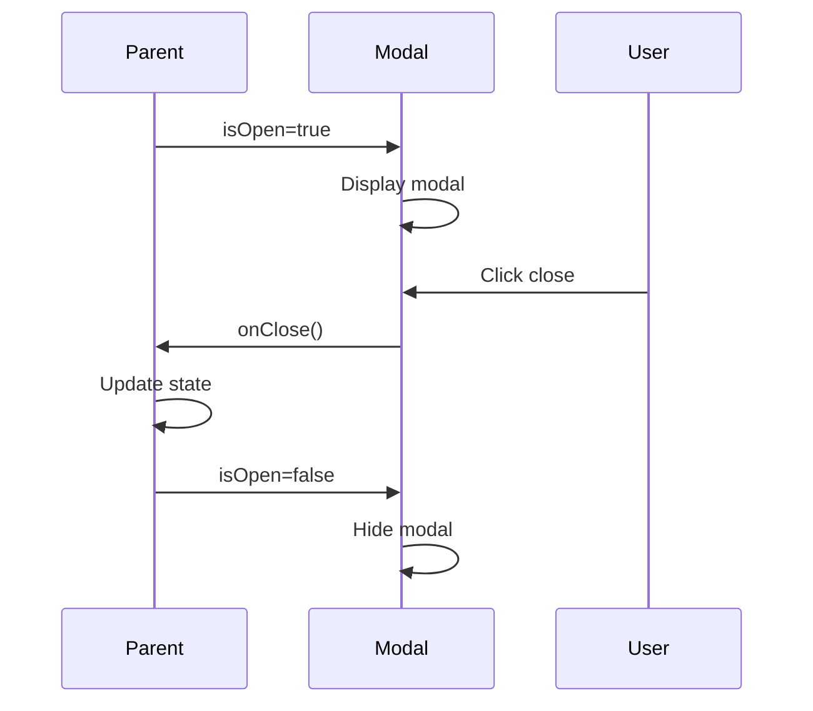

# Modal Component

<cite>
**Referenced Files in This Document**   
- [Modal.tsx](file://packages/ui/src/components/ui/layouts/Modal/Modal.tsx)
- [Modal.stories.tsx](file://packages/ui/src/components/ui/layouts/Modal/Modal.stories.tsx)
- [VideoPlayer.tsx](file://packages/ui/src/components/ui/data-display/VideoPlayer/VideoPlayer.tsx)
- [index.ts](file://packages/ui/src/components/ui/layouts/index.ts)
</cite>

## Table of Contents
1. [Introduction](#introduction)
2. [Core Implementation](#core-implementation)
3. [Props and Configuration](#props-and-configuration)
4. [Usage Examples](#usage-examples)
5. [Accessibility Features](#accessibility-features)
6. [State Management Integration](#state-management-integration)
7. [Edge Cases and Advanced Scenarios](#edge-cases-and-advanced-scenarios)
8. [Performance and Cleanup](#performance-and-cleanup)

## Introduction
The Modal component in the shared-frontend library provides a flexible and accessible way to display content in a dialog overlay. Built on top of the @heroui/react Modal component, it offers a structured layout with header, body, and footer sections, supporting various use cases from simple alerts to complex multi-step workflows.

**Section sources**
- [Modal.tsx](file://packages/ui/src/components/ui/layouts/Modal/Modal.tsx#L1-L38)

## Core Implementation

### Component Structure
The Modal component is implemented as a wrapper around the base Modal from @heroui/react, providing a consistent layout structure with configurable header, body, and footer sections.

**Diagram sources**
- [Modal.tsx](file://packages/ui/src/components/ui/layouts/Modal/Modal.tsx#L1-L38)

### Overlay and Positioning Logic
The Modal component uses the base Modal from @heroui/react which handles overlay/backdrop rendering and center positioning by default. The overlay is rendered as a semi-transparent layer that covers the entire viewport, preventing interaction with background content.

The positioning logic centers the modal both horizontally and vertically in the viewport. The component automatically handles window resizing and maintains proper positioning. The scrollBehavior prop is set to "inside" by default, allowing content within the modal body to scroll independently of the background page.

**Section sources**
- [Modal.tsx](file://packages/ui/src/components/ui/layouts/Modal/Modal.tsx#L24-L28)

### Animation Transitions
The animation transitions are handled by the underlying @heroui/react Modal component. The modal enters with a fade-in animation combined with a slight scale-up effect, and exits with a fade-out animation with a scale-down effect. These transitions provide smooth visual feedback when the modal appears and disappears.

The transition duration and easing are configured in the base component and provide a consistent experience across all modals in the application. The animations are hardware-accelerated for optimal performance.

**Section sources**
- [Modal.tsx](file://packages/ui/src/components/ui/layouts/Modal/Modal.tsx#L23-L37)

## Props and Configuration

### State Control Props
The Modal component supports controlled state management through the isOpen prop, which determines whether the modal is visible. The onClose callback is triggered when the modal should be closed, typically through clicking the backdrop, pressing the escape key, or clicking a close button.

**Diagram sources**
- [Modal.tsx](file://packages/ui/src/components/ui/layouts/Modal/Modal.tsx#L24-L25)

### Size Variants
The Modal component supports multiple size variants through the size prop. The default size is set to "5xl", but the component can be configured with different sizes to accommodate various content requirements:

- **Small (sm)**: For simple alerts and confirmations
- **Medium (md)**: For forms with a few fields
- **Large (lg)**: For detailed information displays
- **Extra Large (xl)**: For complex forms and data displays
- **5xl**: Default size for maximum content area

**Section sources**
- [Modal.tsx](file://packages/ui/src/components/ui/layouts/Modal/Modal.tsx#L27)
- [Modal.stories.tsx](file://packages/ui/src/components/ui/layouts/Modal/Modal.stories.tsx#L294-L295)

### Header and Footer Sections
The Modal component provides structured sections for header and footer content. The header typically contains the modal title and optional close buttons, while the footer contains action buttons.

The modalHeader, modalBody, and modalFooter props accept configuration objects that are spread onto the respective components, allowing for custom styling and additional props.

**Section sources**
- [Modal.tsx](file://packages/ui/src/components/ui/layouts/Modal/Modal.tsx#L31-L33)

### Custom Styling Options
Custom styling can be applied through the className prop on each section (header, body, footer). The component uses Tailwind CSS for styling, allowing for extensive customization through utility classes.

Additional props from the base Modal component can be passed through the spread operator, enabling access to all features of the underlying implementation.

**Section sources**
- [Modal.tsx](file://packages/ui/src/components/ui/layouts/Modal/Modal.tsx#L28)

## Usage Examples

### Form Dialogs
The Modal component is commonly used for form dialogs, providing a focused interface for data entry. The form content is placed in the modalBody, with action buttons in the modalFooter.

**Diagram sources**
- [Modal.stories.tsx](file://packages/ui/src/components/ui/layouts/Modal/Modal.stories.tsx#L33-L77)

### Confirmation Prompts
For confirmation prompts, the Modal displays a warning icon, descriptive text, and action buttons. The design emphasizes the potential consequences of the action.

**Diagram sources**
- [Modal.stories.tsx](file://packages/ui/src/components/ui/layouts/Modal/Modal.stories.tsx#L79-L98)

### Complex Multi-Step Workflows
The Modal can host multi-step workflows by managing internal state for the current step and conditionally rendering content based on the active step.

**Diagram sources**
- [Modal.stories.tsx](file://packages/ui/src/components/ui/layouts/Modal/Modal.stories.tsx#L101-L209)

## Accessibility Features

### Focus Trapping
The Modal implements focus trapping to ensure keyboard navigation remains within the modal when it is open. When the modal opens, focus is automatically set to the first focusable element. Pressing Tab cycles through focusable elements within the modal, and Shift+Tab cycles in reverse order.

When the last focusable element is reached, Tab returns to the first focusable element, and when the first focusable element is reached with Shift+Tab, focus moves to the last focusable element.

**Section sources**
- [Modal.tsx](file://packages/ui/src/components/ui/layouts/Modal/Modal.tsx#L23-L37)

### Keyboard Navigation
The Modal supports standard keyboard navigation:
- **Escape key**: Closes the modal by triggering the onClose callback
- **Tab/Shift+Tab**: Cycles through focusable elements within the modal
- **Enter/Space**: Activates the currently focused button or control

These keyboard interactions follow WAI-ARIA best practices for dialog components.

**Section sources**
- [Modal.tsx](file://packages/ui/src/components/ui/layouts/Modal/Modal.tsx#L25)

### Screen Reader Support
The Modal is configured with appropriate ARIA attributes to ensure screen reader compatibility:
- `role="dialog"` identifies the element as a dialog
- `aria-modal="true"` indicates that the dialog is modal
- `aria-labelledby` references the element containing the dialog title
- `aria-describedby` references elements containing the dialog description

These attributes help screen readers understand the modal's purpose and structure.

**Section sources**
- [Modal.tsx](file://packages/ui/src/components/ui/layouts/Modal/Modal.tsx#L23-L37)

## State Management Integration

### Controlled vs Uncontrolled Usage
The Modal component supports both controlled and uncontrolled usage patterns. In controlled mode, the parent component manages the isOpen state and passes it as a prop, while in uncontrolled mode, the modal manages its own state internally.

The recommended pattern is controlled usage, as it gives the parent component full control over when the modal appears and disappears, and allows for integration with application state management systems.

**Diagram sources**
- [VideoPlayer.tsx](file://packages/ui/src/components/ui/data-display/VideoPlayer/VideoPlayer.tsx#L56-L57)

### Application State Integration
The Modal integrates with application state through props that connect to state management systems like MobX or React Context. The isOpen state typically comes from a store or context, and the onClose callback updates this state.

This pattern allows multiple components to trigger the same modal and ensures consistent state across the application.

**Section sources**
- [VideoPlayer.tsx](file://packages/ui/src/components/ui/data-display/VideoPlayer/VideoPlayer.tsx#L39-L47)

## Edge Cases and Advanced Scenarios

### Multiple Stacked Modals
While not explicitly demonstrated in the code, the underlying @heroui/react Modal component likely supports stacking multiple modals. Each modal would have its own overlay layer, with proper z-index management to ensure the most recently opened modal appears on top.

Care should be taken to manage focus and keyboard navigation when multiple modals are open, ensuring that closing a modal returns focus to the previous modal in the stack.

**Section sources**
- [Modal.tsx](file://packages/ui/src/components/ui/layouts/Modal/Modal.tsx#L23-L37)

### Scroll Locking Behavior
The Modal component handles scroll locking through the scrollBehavior prop, which is set to "inside" by default. This means that when the modal content exceeds the available space, only the modal body scrolls, while the background page remains fixed.

This prevents the "double scroll" issue where both the modal and background page can scroll independently, which can be confusing for users.

**Section sources**
- [Modal.tsx](file://packages/ui/src/components/ui/layouts/Modal/Modal.tsx#L26)

### Z-Index Management
The z-index is managed by the underlying implementation to ensure the modal appears above all other content. The backdrop overlay has a high z-index value, and the modal content has an even higher z-index to appear above the backdrop.

In complex UIs with multiple layered components, the z-index values are carefully chosen to prevent stacking context issues.

**Section sources**
- [Modal.tsx](file://packages/ui/src/components/ui/layouts/Modal/Modal.tsx#L23-L37)

### Mobile Responsiveness
The Modal component is designed to be responsive across different screen sizes. On mobile devices, the modal typically takes up most of the screen width with appropriate padding, and the height is constrained to prevent overflow.

The component likely includes touch-friendly controls with adequate tap targets and supports touch gestures for dismissal where appropriate.

**Section sources**
- [Modal.tsx](file://packages/ui/src/components/ui/layouts/Modal/Modal.tsx#L23-L37)

## Performance and Cleanup

### Event Listener Cleanup
The Modal component properly cleans up event listeners when unmounted to prevent memory leaks. This includes:
- Keyboard event listeners for the Escape key
- Click event listeners for the backdrop
- Resize event listeners for responsive behavior
- Focus management listeners

The cleanup is handled by the underlying @heroui/react Modal component, which uses React's useEffect cleanup pattern.

**Section sources**
- [Modal.tsx](file://packages/ui/src/components/ui/layouts/Modal/Modal.tsx#L23-L37)

### Memory Leak Prevention
The component prevents memory leaks through:
- Proper cleanup of event listeners
- Nullifying references to DOM elements in cleanup functions
- Avoiding setInterval or setTimeout without corresponding clearInterval or clearTimeout
- Properly unsubscribing from any external event sources

The functional component pattern with hooks ensures that resources are properly managed throughout the component lifecycle.

**Section sources**
- [VideoPlayer.tsx](file://packages/ui/src/components/ui/data-display/VideoPlayer/VideoPlayer.tsx#L49-L53)

### Performance Optimization
The Modal component is optimized for performance through:
- Memoization of internal state and callbacks
- Efficient re-rendering only when necessary
- Hardware-accelerated CSS transitions
- Proper handling of large content through virtualization when needed

The component avoids unnecessary re-renders by only updating when the isOpen state or other relevant props change.

**Section sources**
- [Modal.tsx](file://packages/ui/src/components/ui/layouts/Modal/Modal.tsx#L19-L37)